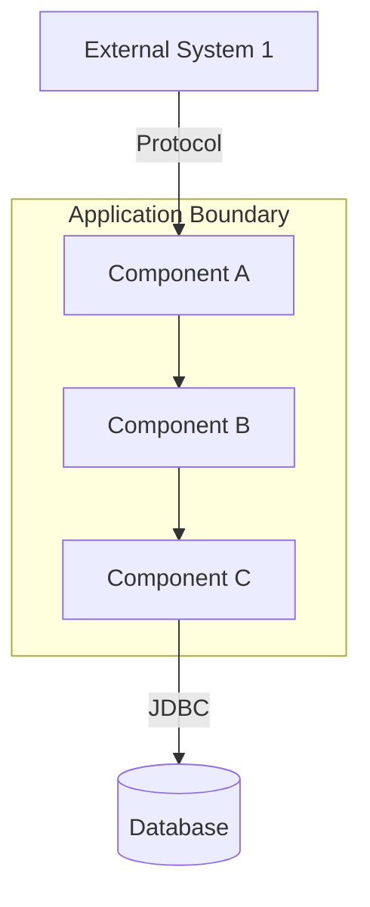

# Module 1: Architecture Analysis

**Output**: `findings/summary/architecture-diagram.md`
**Time estimate**: 15-25 minutes

## Objective

Identify all architectural components, map data flows, document external integrations, and produce a Mermaid diagram showing the system's structure.

## Steps

1. Review the file inventory and component groupings provided by the orchestrator
2. For each component, read key source files to understand:
   - What it does (purpose)
   - What technology/frameworks it uses
   - What it communicates with (other components, external systems, databases)
   - What attack surface it exposes (endpoints, file I/O, network calls)
3. Identify external system integrations (databases, APIs, SSO, messaging, file systems)
4. Generate a Mermaid diagram showing all relationships

## Required Output Format

```markdown
# System Architecture Diagram

**Analysis Date**: [date]
**Component**: [application name]

## Introduction

[1-2 paragraphs: what the system does, its purpose, high-level architecture pattern (e.g., MVC, SOA, microservices, monolith)]

## Technology Stack

| Layer | Technology |
|-------|-----------|
| Language | [e.g., Java 8] |
| Framework | [e.g., Struts 1.x, Spring] |
| Template Engine | [e.g., JSP] |
| Application Server | [e.g., WebLogic] |
| Database | [e.g., PostgreSQL 15, MySQL 8] |
| Build Tool | [e.g., Ant, Maven] |

## Components & Integrations

### Core Components

1. **[Component Name]** - [Description]
   - **Location**: [directory path]
   - **Key Files**: [main source files, count]
   - **Technologies**: [frameworks, libraries used]
   - **Security Surface**: [endpoints, inputs, outputs]

[Repeat for each component]

### External Integrations

1. **[System Name]** - [Integration type: SOAP, REST, JDBC, SFTP, etc.]
   - **Protocol**: [protocol and format]
   - **Direction**: [inbound / outbound / bidirectional]
   - **Authentication**: [how it authenticates]

## Architecture Diagram



## Component Detail

### [Component Name]

- **Purpose**: [what it does]
- **Source Files**: [count]
- **Key Classes/Files**: [list main files with paths]
- **Dependencies**: [what components/libraries it depends on]
- **Security Surface**: [what attack surface it exposes]
- **Data Flows**: [what data enters and leaves]

[Repeat for each component]

## Security-Relevant Architecture Observations

- [Observation 1: e.g., "No centralized input validation layer — each component validates independently"]
- [Observation 2: e.g., "All external integrations use unencrypted SOAP over HTTP"]
```
