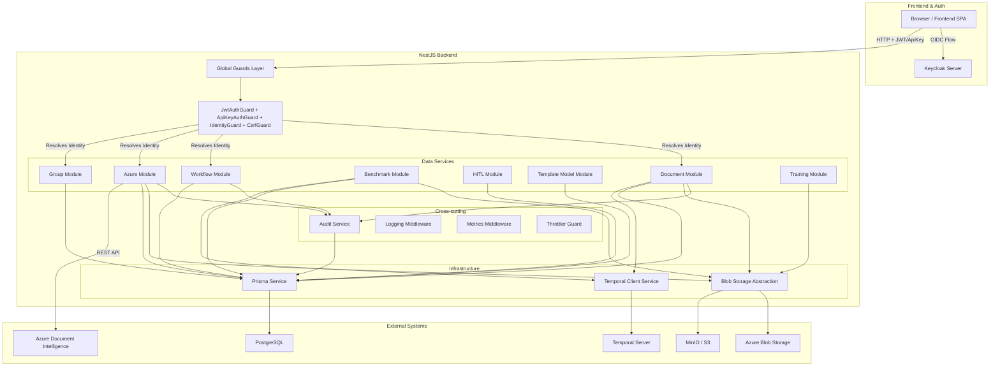

# System Architecture Diagram

**Analysis Date**: 2026-04-09
**Component**: ai-ocr-backend-services

## Introduction

The CITZ AI OCR Backend-Services is a sophisticated NestJS 11.x-based microservice designed to orchestrate document intelligence workflows through Temporal.io, Azure Document Intelligence, and a custom template-labeling system. The system implements a multi-tenant group-based authorization model, where documents and workflows are scoped to groups with role-based access control (ADMIN/EDITOR/MEMBER). The architecture emphasizes security through layered authentication guards (JWT + API-Key + CSRF), comprehensive audit logging, and strict separation of concerns across 20 distributed modules. External integrations include PostgreSQL persistence, OpenID Connect identity federation with Keycloak, Azure's document analysis and blob storage capabilities, optional AWS S3 support, and Temporal.io for long-running workflow orchestration.

## Technology Stack

| Layer | Technology | Version |
|-------|-----------|---------|
| Language | TypeScript | 5.9+ |
| Runtime | Node.js | >= 24.0.0 |
| Framework | NestJS | 11.x |
| Database | PostgreSQL | 13+ |
| ORM | Prisma | 7.2.0 |
| Authentication | Keycloak/OIDC (openid-client) | 6.8.2 |
| Authorization | Passport.js (JWT strategy) | 0.7.0 |
| Workflow Engine | Temporal.io | 1.10.0 |
| API Docs | @nestjs/swagger | 11.2.5 |
| HTTP Security | Helmet | 8.1.0 |
| Rate Limiting | @nestjs/throttler | 6.5.0 |
| Password Hashing | bcrypt | 6.0.0 |
| File Storage | Azure Blob / MinIO | 12.30.0 |
| OCR | Azure Document Intelligence | 1.1.0 |
| Metrics | prom-client | 15.1.3 |
| Validation | class-validator | 0.14.3 |

## Components & Integrations

### Core Components

1. **Authentication & Authorization** (`src/auth/`)
   - **Location**: `src/auth/` (17 files)
   - **Key Files**: auth.controller.ts, auth.service.ts, keycloak-jwt.strategy.ts, jwt-auth.guard.ts, api-key-auth.guard.ts, identity.guard.ts, csrf.guard.ts
   - **Technologies**: openid-client, passport-jwt, jwks-rsa, bcrypt, cookie-parser
   - **Security Surface**: Public endpoints (login, callback, refresh, logout); Bearer JWT + API key + CSRF guards; HttpOnly cookie storage; IP-based rate limiting on failed API key attempts

2. **Actor / API Key Management** (`src/actor/`)
   - **Location**: `src/actor/` (5 files)
   - **Key Files**: api-key.controller.ts, api-key.service.ts, api-key-db.service.ts, user-db.service.ts, user.service.ts
   - **Technologies**: bcrypt (key hashing), Prisma
   - **Security Surface**: API key CRUD (ADMIN only); keys returned once then hashed; brute-force rate limiting per IP

3. **Document Processing** (`src/document/`)
   - **Location**: `src/document/` (4 files)
   - **Key Files**: document.controller.ts, document.service.ts, document-db.service.ts
   - **Technologies**: BlobStorageInterface, Prisma, AuditService
   - **Security Surface**: CRUD endpoints; base64 file decoding; 50MB body limit; UUID-based blob keys; group-scoped access

4. **Azure Integration** (`src/azure/`)
   - **Location**: `src/azure/` (6 files)
   - **Key Files**: azure.service.ts, classifier.service.ts, classifier-db.service.ts, classifier-poller.service.ts
   - **Technologies**: @azure-rest/ai-document-intelligence, blob storage
   - **Security Surface**: Classifier CRUD; multipart uploads; external Azure DI API calls; async polling

5. **Blob Storage** (`src/blob-storage/`)
   - **Location**: `src/blob-storage/` (4 files)
   - **Key Files**: blob-storage.interface.ts, azure-blob-provider.service.ts, minio-blob-storage.service.ts
   - **Technologies**: @azure/storage-blob, MinIO SDK
   - **Security Surface**: UUID-based keys (no user-controllable paths); provider selection via env variable

6. **Benchmarking System** (`src/benchmark/`)
   - **Location**: `src/benchmark/` (22 files — largest component)
   - **Key Files**: benchmark-*.controller.ts, benchmark-*.service.ts, dataset.*, confusion-matrix.*, ground-truth-*
   - **Technologies**: HttpModule (axios), Temporal, BlobStorage
   - **Security Surface**: Project/run/dataset CRUD; async Temporal workflows; large data handling

7. **HITL Review** (`src/hitl/`)
   - **Location**: `src/hitl/` (7 files)
   - **Key Files**: hitl.controller.ts, hitl.service.ts, review-db.service.ts, analytics.service.ts
   - **Technologies**: Prisma, DocumentService
   - **Security Surface**: Review endpoints; correction submissions; immutable original OCR results

8. **Template Model / Labeling** (`src/template-model/`)
   - **Location**: `src/template-model/` (8 files)
   - **Key Files**: template-model.controller.ts, template-model.service.ts, suggestion.service.ts, format-suggestion.service.ts
   - **Technologies**: HttpModule, BlobStorage, Prisma
   - **Security Surface**: Template CRUD; labeling document uploads; suggestion API

9. **Workflow Engine** (`src/workflow/`)
   - **Location**: `src/workflow/` (9 files)
   - **Key Files**: workflow.controller.ts, workflow.service.ts, graph-schema-validator.ts, activity-registry.ts
   - **Technologies**: Prisma, ConfigHash, GraphSchemaValidator
   - **Security Surface**: Workflow CRUD; graph config validation; immutable versioning

10. **Training** (`src/training/`)
    - **Location**: `src/training/` (5 files)
    - **Key Files**: training.controller.ts, training.service.ts, training-db.service.ts, training-poller.service.ts
    - **Technologies**: BlobStorage, Azure DI API, PollerService
    - **Security Surface**: Training job management; multipart uploads; async Azure operations

11. **Upload** (`src/upload/`)
    - **Location**: `src/upload/` (2 files)
    - **Key Files**: upload.controller.ts
    - **Technologies**: DocumentService, QueueService, Temporal
    - **Security Surface**: File ingestion entry point; 50MB body limit; workflow triggering

12. **Group Management** (`src/group/`)
    - **Location**: `src/group/` (4 files)
    - **Key Files**: group.controller.ts, group.service.ts, group-db.service.ts
    - **Technologies**: Prisma, UserService
    - **Security Surface**: Multi-tenant management; membership requests; role assignment (MEMBER < EDITOR < ADMIN)

13. **Queue Service** (`src/queue/`)
    - **Location**: `src/queue/` (2 files)
    - **Key Files**: queue.service.ts
    - **Technologies**: In-memory queue, OcrService
    - **Security Surface**: Internal only (no HTTP endpoints); in-memory (lost on restart)

14. **OCR Service** (`src/ocr/`)
    - **Location**: `src/ocr/` (3 files)
    - **Key Files**: ocr.controller.ts, ocr.service.ts
    - **Technologies**: AzureService, DocumentModule, TemporalClientService
    - **Security Surface**: OCR result retrieval; async processing via Temporal

15. **Temporal Integration** (`src/temporal/`)
    - **Location**: `src/temporal/` (3 files)
    - **Key Files**: temporal-client.service.ts, workflow-constants.ts
    - **Technologies**: @temporalio/client
    - **Security Surface**: gRPC connection to Temporal server; no auth (private network assumed)

16. **Audit System** (`src/audit/`)
    - **Location**: `src/audit/` (4 files)
    - **Key Files**: audit.service.ts, audit-db.service.ts
    - **Technologies**: Prisma (append-only)
    - **Security Surface**: Immutable audit trail; non-blocking writes; request ID correlation

17. **Confusion Profile** (`src/confusion-profile/`)
    - **Location**: `src/confusion-profile/` (3 files)
    - **Key Files**: confusion-profile.controller.ts, confusion-profile.service.ts
    - **Technologies**: Prisma
    - **Security Surface**: Confusion matrix storage; group-scoped

18. **Bootstrap** (`src/bootstrap/`)
    - **Location**: `src/bootstrap/` (3 files)
    - **Key Files**: bootstrap.controller.ts, bootstrap.service.ts
    - **Technologies**: Prisma
    - **Security Surface**: Seed data initialization; admin-only; idempotent

19. **Infrastructure** (`src/logging/`, `src/metrics/`, `src/database/`, `src/utils/`)
    - **Location**: Multiple directories (10 files)
    - **Key Files**: app-logger.service.ts, logging.middleware.ts, request-logging.interceptor.ts, metrics.service.ts, prisma.service.ts, database-url.ts, env-loader.ts
    - **Technologies**: @ai-di/shared-logging, prom-client, Prisma, AsyncLocalStorage
    - **Security Surface**: Structured JSON logging; request ID correlation; Prometheus metrics endpoint; database connection management

20. **Application Root** (`src/main.ts`, `src/app.module.ts`)
    - **Location**: `src/` (2 files)
    - **Security Surface**: Helmet configuration; CORS setup; body parser limits; global validation pipe; Swagger docs

### External Integrations

| System | Protocol | Direction | Authentication | Purpose |
|--------|----------|-----------|----------------|---------|
| PostgreSQL | TCP/Native | Bidirectional | DATABASE_URL (user/pass) | Primary data store |
| Keycloak/SSO | HTTPS/OIDC | Inbound (browser redirects) | OAuth 2.0 Client Secret + PKCE | User authentication |
| Azure Document Intelligence | HTTPS REST | Outbound | API Key header | OCR classification, training |
| Azure Blob Storage | HTTPS REST / SAS URLs | Bidirectional | Connection String / SAS tokens | File storage |
| MinIO / S3 | HTTPS/S3 API | Bidirectional | Access Key + Secret Key | Alt blob storage (dev) |
| Temporal Server | gRPC | Outbound | None (private network) | Async workflow execution |

## Architecture Diagram

## Security-Relevant Architecture Observations

1. **Layered Authentication Guards (Defense in Depth)**: 4 APP_GUARD instances in sequence (JwtAuthGuard → ApiKeyAuthGuard → IdentityGuard → CsrfGuard). No single guard failure bypasses all auth.

2. **Multi-Tenant Isolation via Group Scoping**: Every resource tied to a group. Queries scoped via `identityCanAccessGroup()`. System admins bypass filters.

3. **OIDC + PKCE for Token Security**: Authorization Code flow with PKCE; nonce validation; RS256-only; tokens in HttpOnly cookies; refresh token rotation.

4. **API Key Rate Limiting Per IP**: Failed attempts tracked per source IP; configurable threshold triggers 429. Prevents brute-force key discovery.

5. **Temporal Workflow Isolation**: Activities execute in separate worker process. Communication is message-passing only. No direct database access from workflows.

6. **Immutable Audit Trail**: Append-only `audit_event` table. All document access, workflow execution, API key operations logged with request ID correlation.

7. **Blob Storage Key Safety**: All file keys generated as UUIDs internally. No user-controllable key paths (path traversal impossible).

8. **CSRF Protection Scoped to Cookie Auth**: Safe methods exempt; Bearer/API key requests exempt; only cookie-auth state-changing requests require X-CSRF-Token. csrf_token cookie is non-HttpOnly (XSS risk mitigated by Helmet CSP + X-Frame-Options).

9. **Role Hierarchy Enforcement**: MEMBER < EDITOR < ADMIN < system-admin. Checked via ROLE_ORDER lookup. Promotions require higher role approval.

10. **Secrets in Environment Variables**: DATABASE_URL, SSO_CLIENT_SECRET, AZURE_DOCUMENT_INTELLIGENCE_API_KEY — all loaded from env, not committed. API keys hashed with bcrypt.
