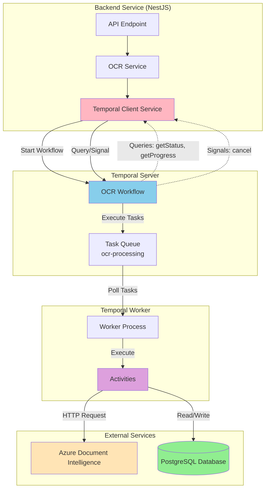
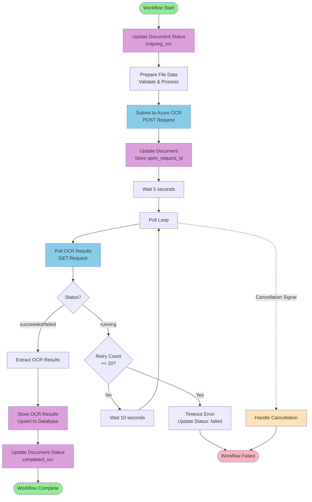

# Temporal OCR Workflow

A Temporal workflow implementation for Azure Document Intelligence OCR processing with full database integration, observability, and control features.

## Overview

This workflow processes documents through Azure Document Intelligence OCR with:
- File data preparation and validation
- Azure OCR submission with automatic retries
- Polling with retry logic (up to 20 retries, 10-second intervals)
- Structured result extraction and database storage
- Workflow queries for real-time status and progress
- Workflow signals for cancellation (graceful and immediate modes)
- Search attributes and memo for enhanced observability in Temporal UI
- Structured JSON logging throughout all activities

## Architecture



### Components

- **Workflow** (`src/workflow.ts`): Orchestrates the OCR process with deterministic logic, queries, and signals
- **Activities** (`src/activities.ts`): Handle non-deterministic operations (HTTP calls, file processing, database updates) with structured logging
- **Worker** (`src/worker.ts`): Executes workflows and activities
- **Client** (`src/client.ts`): Standalone client for triggering workflow executions
- **TemporalClientService** (`apps/backend-services/src/temporal/temporal-client.service.ts`): NestJS service for backend integration

## Prerequisites

- Node.js 18+ and npm
- Temporal server (local or remote)
- Azure Document Intelligence account with API key

## Setup

1. **Install dependencies:**
   ```bash
   npm install
   ```

2. **Generate Prisma client:**
   ```bash
   npx prisma generate --schema=../backend-services/prisma/schema.prisma
   ```
   > **Note**: The temporal app uses Prisma to interact with the database and shares the schema with backend-services. Ensure `DATABASE_URL` is set in your environment (can be added to `.env` file).

3. **Configure environment variables:**
   ```bash
   cp .env.example .env
   # Edit .env with your Azure credentials, Temporal connection details, and DATABASE_URL
   ```

4. **Start Temporal server and Web UI (if running locally):**
   ```bash
   docker-compose up -d
   ```

   This will start:
   - Temporal server on port `7233` (gRPC)
   - Temporal Web UI on port `8088` (http://localhost:8088)
   - PostgreSQL database on port `5432`
   - **Search attributes registration** (runs automatically on first startup)
   
   > **Note**: Search attributes are automatically registered when the Temporal server starts. The `register-search-attributes` service ensures all required search attributes are available before workflows can run.

5. **Build the project:**
   ```bash
   npm run build
   ```

6. **Start the worker:**
   ```bash
   npm start
   # Or for development with auto-reload:
   npm run dev
   ```

7. **Trigger a workflow (in a separate terminal):**
   ```bash
   npm run example
   ```

   This will start a sample OCR workflow that you can view in the Temporal Web UI.

## Usage

### Viewing Workflows in the Web UI

1. Make sure Temporal server and worker are running:
   ```bash
   # Terminal 1: Start Temporal server (if using docker-compose)
   docker-compose up -d

   # Terminal 2: Start the worker
   npm run dev
   ```

2. Open the Temporal Web UI: http://localhost:8088

3. **Important**: Workflows won't appear until you trigger them. The worker listens for executions but doesn't create workflows automatically.

### Starting a Workflow

Use the client to trigger a workflow execution:

```typescript
import { startOCRWorkflow } from './src/client';

const result = await startOCRWorkflow({
  documentId: 'document-uuid',  // Required: Document ID from database
  binaryData: 'base64-encoded-file-data',
  fileName: 'document.pdf',
  fileType: 'pdf',
  contentType: 'application/pdf'
});
```

Or from the NestJS backend service:

```typescript
const workflowId = await temporalClientService.startOCRWorkflow(
  documentId,
  {
    binaryData: fileData.binaryData,
    fileName: fileData.fileName,
    fileType: fileData.fileType,
    contentType: fileData.contentType
  }
);
```

### Quick Start Example

Run the example script to trigger a sample workflow:

```bash
npm run example
```

This will:
1. Start an OCR workflow with sample PDF data
2. Wait for the workflow to complete
3. Display the results
4. Show you the workflow ID to view in the Web UI

After running this, you should see the workflow appear in the Temporal Web UI at http://localhost:8088

### Workflow Input

```typescript
interface OCRWorkflowInput {
  documentId: string;        // Document ID from database (required)
  binaryData: string;        // Base64-encoded file data
  fileName?: string;         // Optional file name
  fileType?: 'pdf' | 'image'; // Optional file type
  contentType?: string;      // Optional content type
}
```

### Workflow Output

```typescript
interface OCRResult {
  success: boolean;
  status: string;
  apimRequestId: string;
  fileName: string;
  fileType: string;
  extractedText: string;
  pages: Page[];
  tables: Table[];
  paragraphs: Paragraph[];
  keyValuePairs: KeyValuePair[];
  sections: Section[];
  figures: Figure[];
  processedAt: string;
}
```

## Workflow Flow



### Workflow Steps

1. **Update Document Status**: Set document status to `ongoing_ocr` in database
2. **Prepare File Data**: Validates and processes binary data
3. **Submit to Azure OCR**: POST request to Azure Document Intelligence API with automatic retries
4. **Extract Request ID**: Extracts `apim-request-id` from response headers
5. **Update Document**: Store `apim_request_id` in document record
6. **Wait**: 5 seconds before first poll
7. **Poll Loop**:
   - Check for cancellation signals
   - Poll OCR results (with automatic retries)
   - If status is "running":
     - Increment retry count
     - If retry count >= 20, throw timeout error
     - Wait 10 seconds
     - Continue polling
   - Else: break loop
8. **Extract Results**: Parse and structure OCR response
9. **Store Results**: Upsert OCR results to database and update document status to `completed_ocr`
10. **Return Result**: Return structured OCR data

## Features

### Workflow Queries

Query the current state of a running workflow without modifying it:

- **`getStatus`**: Returns current step, status, APIM request ID, retry count, and error information
- **`getProgress`**: Returns progress percentage, retry count, current step, and APIM request ID

Example usage from backend service:
```typescript
const status = await temporalClientService.queryWorkflowStatus(workflowId);
const progress = await temporalClientService.queryWorkflowProgress(workflowId);
```

### Workflow Signals

Send asynchronous messages to running workflows:

- **`cancel`**: Cancels a running workflow
  - `mode: 'graceful'`: Allows current activity to complete before stopping
  - `mode: 'immediate'`: Stops immediately, throwing an error

Example usage from backend service:
```typescript
await temporalClientService.cancelWorkflow(workflowId, 'graceful');
await temporalClientService.cancelWorkflow(workflowId, 'immediate');
```

### Activity Retries

All activities have configured retry policies with exponential backoff:

- **`prepareFileData`**: 3 attempts, 1 minute timeout
- **`submitToAzureOCR`**: 3 attempts, 2 minute timeout
- **`pollOCRResults`**: 5 attempts, 30 second timeout (optimized for frequent polling)
- **`extractOCRResults`**: 3 attempts, 1 minute timeout
- **`updateDocumentStatus`**: 5 attempts, 30 second timeout
- **`upsertOcrResult`**: 5 attempts, 2 minute timeout

### Observability

- **Search Attributes**: Workflows are indexed by `DocumentId`, `FileName`, `FileType`, and `Status` for easy filtering in Temporal UI
- **Memo**: Workflow metadata stored for quick reference (documentId, fileName, fileType)
- **Structured Logging**: All activities log JSON-formatted events with:
  - Activity name
  - Event type (start, complete, error, warn, info)
  - Timestamps
  - Duration tracking
  - Contextual information

### Database Integration

The workflow integrates with PostgreSQL via Prisma:
- Updates document status throughout the workflow lifecycle
- Stores `apim_request_id` for traceability
- Upserts complete OCR results including extracted text, pages, tables, paragraphs, sections, figures, and key-value pairs

## Configuration

### Environment Variables

- `AZURE_DOCUMENT_INTELLIGENCE_ENDPOINT`: Azure endpoint URL
- `AZURE_DOCUMENT_INTELLIGENCE_API_KEY`: Azure API key
- `TEMPORAL_ADDRESS`: Temporal server address (default: `localhost:7233`)
- `TEMPORAL_NAMESPACE`: Temporal namespace (default: `default`)
- `TEMPORAL_TASK_QUEUE`: Task queue name (default: `ocr-processing`)
- `DATABASE_URL`: PostgreSQL database connection string (required for database update activities)

### Temporal Web UI

The Temporal Web UI is available at **http://localhost:8088** when running with docker-compose.

The Web UI allows you to:
- View workflow executions
- Monitor workflow status and history
- Inspect activity results
- Debug workflow issues
- View task queue status

### Retry Configuration

**Workflow-level polling:**
- **Max Retries**: 20
- **Wait Before First Poll**: 5 seconds
- **Wait Between Retries**: 10 seconds

**Activity-level retries:**
Each activity has its own retry configuration (see Features section above). Activity retries are automatic and use exponential backoff, separate from the workflow's manual polling retry logic.

## Development

```bash
# Type checking
npm run type-check

# Build
npm run build

# Development mode (auto-reload)
npm run dev
```

## Project Structure

```
temporal/
├── package.json
├── tsconfig.json
├── .env.example
├── README.md
├── docker-compose.yaml
└── src/
    ├── types.ts          # TypeScript interfaces
    ├── activities.ts     # Activity implementations
    ├── workflow.ts       # Workflow definition
    ├── worker.ts         # Worker setup
    └── client.ts         # Workflow client
```

## Error Handling

The workflow handles:
- **Submission failures**: Returns error if status code is not 202 (with automatic retries)
- **Timeout**: Returns error if max retries (20) exceeded during polling
- **API errors**: Propagates Azure API errors (with automatic retries per activity)
- **Cancellation**: Supports graceful and immediate cancellation modes
- **Database errors**: Updates document status to `failed` on any error, with error details stored in workflow state

## Integration with Backend Services

The workflow is integrated with the NestJS backend service through `TemporalClientService`:

```typescript
// Start a workflow
const workflowId = await temporalClientService.startOCRWorkflow(documentId, fileData);

// Query workflow status
const status = await temporalClientService.queryWorkflowStatus(workflowId);

// Query workflow progress
const progress = await temporalClientService.queryWorkflowProgress(workflowId);

// Cancel a workflow
await temporalClientService.cancelWorkflow(workflowId, 'graceful');
```

The workflow ID is stored in the document record (`workflow_id` field) for traceability.
