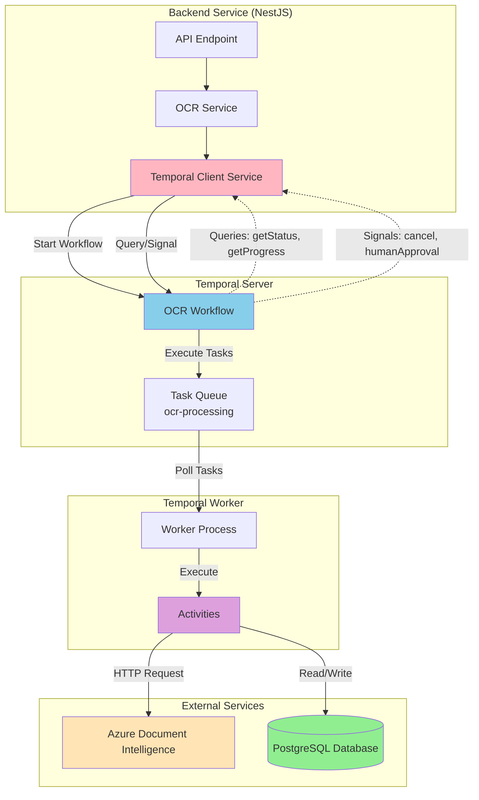
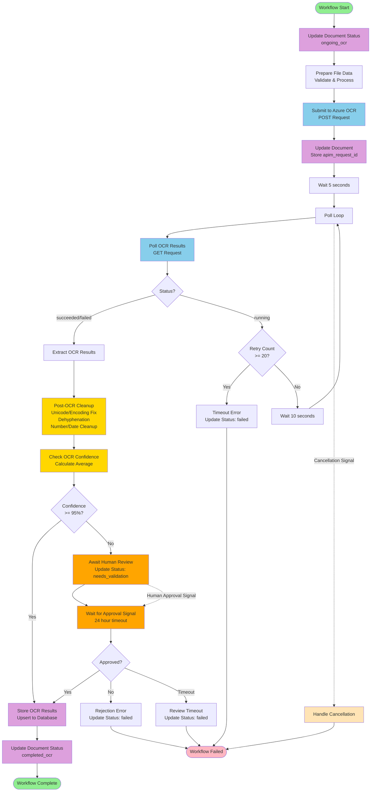

# Temporal OCR Workflow

A Temporal workflow implementation for Azure Document Intelligence OCR processing with full database integration, observability, and control features.

## Overview

This workflow processes documents through Azure Document Intelligence OCR with:
- File data preparation and validation
- Azure OCR submission with automatic retries
- Polling with retry logic (up to 20 retries, 10-second intervals)
- Structured result extraction and database storage
- Post-OCR text cleanup (unicode/encoding fixes, dehyphenation, number/date normalization)
- Human-in-the-loop review for low-confidence OCR results (configurable threshold)
- Workflow queries for real-time status and progress
- Workflow signals for cancellation (graceful and immediate modes) and human approval
- Search attributes and memo for enhanced observability in Temporal UI
- Structured JSON logging throughout all activities

## Architecture



### Components

- **Workflow** (`src/workflow.ts`): Orchestrates the OCR process with deterministic logic, queries, and signals
- **Activities** (`src/activities.ts`): Handle non-deterministic operations (HTTP calls, file processing, database updates) with structured logging
- **Worker** (`src/worker.ts`): Executes workflows and activities
- **Client** (`src/client.ts`): Standalone client for triggering workflow executions
- **TemporalClientService** (`apps/backend-services/src/temporal/temporal-client.service.ts`): NestJS service for backend integration

## Prerequisites

- Node.js 18+ and npm
- Temporal server (local or remote)
- Azure Document Intelligence account with API key

## Setup

1. **Install dependencies:**
   ```bash
   npm install
   ```

2. **Generate Prisma client:**
   ```bash
   npm run db:generate
   ```
   > **Note**: The temporal app uses Prisma to interact with the database and shares the schema with `backend-services` via `apps/shared/prisma/schema.prisma`. The Prisma client is generated locally in `src/generated/` for this app. Ensure `DATABASE_URL` is set in your environment (can be added to `.env` file).

3. **Configure environment variables:**
   ```bash
   cp .env.example .env
   # Edit .env with your Azure credentials, Temporal connection details, and DATABASE_URL
   ```

4. **Database Setup (Prisma)**

   This project uses Prisma with a shared schema located at `apps/shared/prisma/schema.prisma`. The Prisma client is generated locally in this app.

   **Generate Prisma Client:**
   ```bash
   npm run db:generate
   ```
   
   This will:
   - Read the shared schema from `apps/shared/prisma/schema.prisma`
   - Generate the Prisma client locally in `src/generated/`
   - The client is automatically generated before builds

   > **Note**: The schema is shared with `backend-services`. Migrations are stored in `apps/shared/prisma/migrations/` and should be run from the `backend-services` app using `npm run db:migrate`.

5. **Start Temporal server and Web UI (if running locally):**
   ```bash
   docker-compose up -d
   ```

   This will start:
   - Temporal server on port `7233` (gRPC)
   - Temporal Web UI on port `8088` (http://localhost:8088)
   - PostgreSQL database on port `5433`
   
   Search attributes (`DocumentId`, `FileName`, `FileType`, `Status`) are ensured by the **backend** when it connects to Temporal; no separate service is needed.

5. **Build the project:**
   ```bash
   npm run build
   ```

6. **Start the worker:**
   ```bash
   npm start
   # Or for development with auto-reload:
   npm run dev
   ```

7. **Trigger a workflow (in a separate terminal):**
   ```bash
   npm run example
   ```

   This will start a sample OCR workflow that you can view in the Temporal Web UI.

## Usage

### Viewing Workflows in the Web UI

1. Make sure Temporal server and worker are running:
   ```bash
   # Terminal 1: Start Temporal server (if using docker-compose)
   docker-compose up -d

   # Terminal 2: Start the worker
   npm run dev
   ```

2. Open the Temporal Web UI: http://localhost:8088

3. **Important**: Workflows won't appear until you trigger them. The worker listens for executions but doesn't create workflows automatically.

### Starting a Workflow

Workflows are started by the backend service via `TemporalClientService.startGraphWorkflow`,
which passes a `GraphWorkflowConfig` and initial context (`documentId`, `blobKey`, etc.)
to the `graphWorkflow` Temporal workflow.

### Workflow Input

The `graphWorkflow` input includes the graph definition, initial context, and runner metadata.
See `docs/DAG_WORKFLOW_ENGINE.md` for the full `GraphWorkflowInput` specification.

### Workflow Output

```typescript
interface OCRResult {
  success: boolean;
  status: string;
  apimRequestId: string;
  fileName: string;
  fileType: string;
  extractedText: string;
  pages: Page[];
  tables: Table[];
  paragraphs: Paragraph[];
  keyValuePairs: KeyValuePair[];
  sections: Section[];
  figures: Figure[];
  processedAt: string;
}
```

## Workflow Flow



### Workflow Steps

1. **Update Document Status**: Set document status to `ongoing_ocr` in database
2. **Prepare File Data**: Validates and processes binary data
3. **Submit to Azure OCR**: POST request to Azure Document Intelligence API with automatic retries
4. **Extract Request ID**: Extracts `apim-request-id` from response headers
5. **Update Document**: Store `apim_request_id` in document record
6. **Wait**: 5 seconds before first poll
7. **Poll Loop**:
   - Check for cancellation signals
   - Poll OCR results (with automatic retries)
   - If status is "running":
     - Increment retry count
     - If retry count >= 20, throw timeout error
     - Wait 10 seconds
     - Continue polling
   - Else: break loop
8. **Extract Results**: Parse and structure OCR response
9. **Post-OCR Cleanup**: Clean extracted text with:
   - Unicode/encoding normalization (NFC normalization, fix encoding artifacts)
   - Dehyphenation and line joining (remove hyphens at line breaks)
   - Number/date cleanup (normalize dates, times, decimals, currency)
10. **Check Confidence**: Calculate average confidence from words and key-value pairs
11. **Human Review** (if confidence < 95%):
    - Update document status to `needs_validation`
    - Set workflow status to `awaiting_review`
    - Wait for human approval signal (24-hour timeout)
    - If approved: continue to store results
    - If rejected or timeout: fail workflow
12. **Store Results**: Upsert OCR results to database and update document status to `completed_ocr`
13. **Return Result**: Return structured OCR data

## Features

### Workflow Queries

Query the current state of a running workflow without modifying it:

- **`getStatus`**: Returns current step, status, APIM request ID, retry count, error information, average confidence, and whether review is required
- **`getProgress`**: Returns progress percentage, retry count, current step, and APIM request ID

Example usage from backend service:
```typescript
const status = await temporalClientService.queryWorkflowStatus(workflowId);
// status includes: averageConfidence, requiresReview, currentStep, status, etc.

const progress = await temporalClientService.queryWorkflowProgress(workflowId);
```

### Workflow Signals

Send asynchronous messages to running workflows:

- **`cancel`**: Cancels a running workflow
  - `mode: 'graceful'`: Allows current activity to complete before stopping
  - `mode: 'immediate'`: Stops immediately, throwing an error

- **`humanApproval`**: Provides human review decision for low-confidence OCR results
  - `approved: boolean`: Whether the OCR results are approved
  - `reviewer?: string`: Optional reviewer identifier
  - `comments?: string`: Optional review comments

Example usage from backend service:
```typescript
// Cancel a workflow
await temporalClientService.cancelWorkflow(workflowId, 'graceful');
await temporalClientService.cancelWorkflow(workflowId, 'immediate');

// Send human approval signal
await temporalClientService.sendHumanApproval(workflowId, {
  approved: true,
  reviewer: 'user@example.com',
  comments: 'OCR results look good'
});
```

### Activity Retries

All activities have configured retry policies with exponential backoff:

- **`prepareFileData`**: 3 attempts, 1 minute timeout
- **`submitToAzureOCR`**: 3 attempts, 2 minute timeout
- **`pollOCRResults`**: 5 attempts, 30 second timeout (optimized for frequent polling)
- **`extractOCRResults`**: 3 attempts, 1 minute timeout
- **`postOcrCleanup`**: 3 attempts, 2 minute timeout
- **`checkOcrConfidence`**: 3 attempts, 30 second timeout
- **`updateDocumentStatus`**: 5 attempts, 30 second timeout
- **`upsertOcrResult`**: 5 attempts, 2 minute timeout

### Observability

- **Search Attributes**: Workflows are indexed by `DocumentId`, `FileName`, `FileType`, and `Status` for easy filtering in Temporal UI
- **Memo**: Workflow metadata stored for quick reference (documentId, fileName, fileType)
- **Structured Logging**: All activities log JSON-formatted events with:
  - Activity name
  - Event type (start, complete, error, warn, info)
  - Timestamps
  - Duration tracking
  - Contextual information

### Database Integration

The workflow integrates with PostgreSQL via Prisma:
- Updates document status throughout the workflow lifecycle
- Stores OCR results in the database
- Tracks workflow execution IDs

**Prisma Setup:**
- **Schema**: `apps/shared/prisma/schema.prisma` (shared with backend-services)
- **Generated client**: `src/generated/` (generated locally in this app)
- **Generate client**: `npm run db:generate` (runs automatically on build)
- **Database connection**: Configured via `DATABASE_URL` environment variable
- **Migrations**: Stored in `apps/shared/prisma/migrations/` (run from backend-services app)

> **Note**: The Prisma schema is shared between `backend-services` and `temporal` apps. Each app generates its own Prisma client locally to avoid path resolution issues. Migrations should be created and run from the `backend-services` app.

### Post-OCR Text Cleanup

The workflow includes comprehensive text cleanup after OCR extraction:

- **Unicode/Encoding Fixes**:
  - Normalizes Unicode characters (NFC normalization)
  - Removes zero-width characters and encoding artifacts
  - Fixes common encoding issues (non-breaking spaces, soft hyphens, etc.)
  - Normalizes quotation marks and dashes

- **Dehyphenation & Line Joining**:
  - Removes hyphens at line breaks
  - Joins words split across lines
  - Cleans up multiple consecutive spaces

- **Number/Date Cleanup**:
  - Normalizes date formats and separators
  - Normalizes time formats
  - Fixes decimal point issues
  - Normalizes currency formats

Cleanup is applied to all text fields: extracted text, words, lines, paragraphs, table cells, key-value pairs, sections, and figures.

### Human-in-the-Loop Review

The workflow automatically triggers human review when OCR confidence is below a threshold:

- **Confidence Calculation**: Average confidence is calculated from word-level and key-value pair confidence scores
- **Threshold**: Default 95% (0.95), configurable in `checkOcrConfidence` activity
- **Review Process**:
  - Document status is updated to `needs_validation`
  - Workflow status changes to `awaiting_review`
  - Workflow waits for `humanApproval` signal (24-hour timeout)
  - If approved: workflow continues to store results
  - If rejected or timeout: workflow fails with appropriate error
- **Signal Format**:**
  ```typescript
  {
    approved: boolean;
    reviewer?: string;
    comments?: string;
  }
  ```

### Database Integration

The workflow integrates with PostgreSQL via Prisma:
- Updates document status throughout the workflow lifecycle (`ongoing_ocr`, `needs_validation`, `completed_ocr`, `failed`)
- Stores `apim_request_id` for traceability
- Upserts complete OCR results including extracted text, pages, tables, paragraphs, sections, figures, and key-value pairs

**Prisma Setup:**
- **Schema**: `apps/shared/prisma/schema.prisma` (shared with backend-services)
- **Generated client**: `src/generated/` (generated locally in this app)
- **Generate client**: `npm run db:generate` (runs automatically on build)
- **Database connection**: Configured via `DATABASE_URL` environment variable

> **Note**: The Prisma schema is shared between `backend-services` and `temporal` apps. Each app generates its own Prisma client locally. See the [Setup](#setup) section for Prisma client generation instructions.

## Configuration

### Environment Variables

- `AZURE_DOCUMENT_INTELLIGENCE_ENDPOINT`: Azure endpoint URL
- `AZURE_DOCUMENT_INTELLIGENCE_API_KEY`: Azure API key
- `TEMPORAL_ADDRESS`: Temporal server address (default: `localhost:7233`)
- `TEMPORAL_NAMESPACE`: Temporal namespace (default: `default`)
- `TEMPORAL_TASK_QUEUE`: Task queue name (default: `ocr-processing`)
- `DATABASE_URL`: PostgreSQL database connection string (required for database update activities)

### Temporal Web UI

The Temporal Web UI is available at **http://localhost:8088** when running with docker-compose.

The Web UI allows you to:
- View workflow executions
- Monitor workflow status and history
- Inspect activity results
- Debug workflow issues
- View task queue status

### Retry Configuration

**Workflow-level polling:**
- **Max Retries**: 20
- **Wait Before First Poll**: 5 seconds
- **Wait Between Retries**: 10 seconds

**Activity-level retries:**
Each activity has its own retry configuration (see Features section above). Activity retries are automatic and use exponential backoff, separate from the workflow's manual polling retry logic.

## Development

```bash
# Type checking
npm run type-check

# Build
npm run build

# Development mode (auto-reload)
npm run dev
```

## Testing

Tests verify **durable execution** (determinism and replay safety) of the OCR workflow.

```bash
# Run all tests (replay + integration)
npm test
```

- **Replay test** (`workflow.replay.test.ts`): Replays a recorded workflow history through the current workflow code. Fails if the workflow is non-deterministic or incompatible with the saved history (e.g. after changing activity order or adding non-deterministic code).
- **Integration test** (`workflow.integration.test.ts`): Runs the workflow end-to-end with mocked activities and time-skipping (no real Temporal server or DB). Validates that the workflow completes and timers behave correctly.

**Regenerating the history fixture:** After changing the workflow's default path or steps (e.g. adding/removing activities or changing their order), regenerate the fixture so the replay test stays valid:

```bash
npm run test:generate-history
```

Then commit the updated `src/__fixtures__/ocr-workflow-history.json`.

## Project Structure

```
temporal/
├── package.json
├── tsconfig.json
├── .env.example
├── README.md
├── docker-compose.yaml
└── src/
    ├── types.ts                    # TypeScript interfaces
    ├── activities.ts               # Activity implementations
    ├── workflow.ts                 # Workflow definition
    ├── worker.ts                   # Worker setup
    ├── client.ts                   # Workflow client
    ├── __fixtures__/               # Workflow history for replay tests
    │   └── ocr-workflow-history.json
    ├── scripts/
    │   └── generate-history-fixture.ts  # Regenerate replay fixture
    ├── test/
    │   └── mock-activities.ts      # Mock activities for tests
    ├── workflow.replay.test.ts    # Replay (determinism) test
    └── workflow.integration.test.ts # Integration test with time-skipping
```

## Error Handling

The workflow handles:
- **Submission failures**: Returns error if status code is not 202 (with automatic retries)
- **Timeout**: Returns error if max retries (20) exceeded during polling
- **API errors**: Propagates Azure API errors (with automatic retries per activity)
- **Cancellation**: Supports graceful and immediate cancellation modes
- **Human review timeout**: Fails workflow if no approval received within 24 hours
- **Human rejection**: Fails workflow if reviewer rejects OCR results
- **Database errors**: Updates document status to `failed` on any error, with error details stored in workflow state
- **Cleanup errors**: Returns original result if cleanup fails (graceful degradation)

## Integration with Backend Services

The workflow is integrated with the NestJS backend service through `TemporalClientService`:

```typescript
// Start a workflow
const workflowId = await temporalClientService.startGraphWorkflow(
  documentId,
  workflowConfigId
);

// Query workflow status
const status = await temporalClientService.queryWorkflowStatus(workflowId);

// Query workflow progress
const progress = await temporalClientService.queryWorkflowProgress(workflowId);

// Cancel a workflow
await temporalClientService.cancelWorkflow(workflowId, 'graceful');

// Send human approval (when workflow is awaiting review)
await temporalClientService.sendHumanApproval(workflowId, {
  approved: true,
  reviewer: 'user@example.com',
  comments: 'OCR results verified and approved'
});
```

The workflow ID is stored in the document record (`workflow_id` field) for traceability.

### Workflow Status Values

The workflow can be in the following states:
- `preparing`: Initial setup and file preparation
- `submitting`: Submitting document to Azure OCR
- `polling`: Polling for OCR results
- `extracting`: Extracting and processing OCR results
- `awaiting_review`: Waiting for human approval (low confidence)
- `storing`: Storing results to database
- `completed`: Workflow completed successfully
- `failed`: Workflow failed (error, rejection, or timeout)
