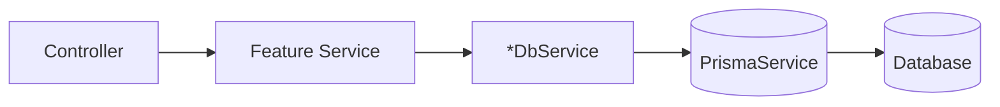

# Database services (backend-services)

Each feature module in `apps/backend-services/src/` owns its database access through a dedicated `*-db.service.ts`. There is no shared database facade — all modules inject `PrismaService` directly via the global `DatabaseModule`.

## Core Database Layer

`apps/backend-services/src/database/` contains only:

| File | Service | Responsibility |
|------|---------|----------------|
| `prisma.service.ts` | `PrismaService` | Owns the Prisma client (connection, config). Exposes `prisma: PrismaClient` and a `transaction<T>(fn)` helper for atomic operations. |

`DatabaseModule` is decorated with `@Global()`, so `PrismaService` is available for injection throughout the application without each module declaring an import.

## DB Services by Module

Each db service injects `PrismaService` and is a private provider scoped to its module. The public service for that module is what other modules inject.

### Document Module
`apps/backend-services/src/document/`

| File | Service | Responsibility |
|------|---------|----------------|
| `document-db.service.ts` | `DocumentDbService` | Document CRUD (`createDocument`, `findDocument`, `findAllDocuments`, `updateDocument`, `deleteDocument`), OcrResult upsert/fetch (`upsertOcrResult`, `findOcrResult`), field extraction updates |

Types are defined in `document/document-db.types.ts`. Callers outside the module inject `DocumentService`, which delegates to `DocumentDbService`.

### Labeling Module
`apps/backend-services/src/labeling/`

| File | Service | Responsibility |
|------|---------|----------------|
| `labeling-document-db.service.ts` | `LabelingDocumentDbService` | Labeling document CRUD: `createLabelingDocument`, `findLabelingDocument`, `updateLabelingDocument` |
| `labeling-project-db.service.ts` | `LabelingProjectDbService` | Labeling projects, field definitions, labeled documents, document labels |

`LabelingService` injects both and is the public interface for the module.

### HITL Module
`apps/backend-services/src/hitl/`

| File | Service | Responsibility |
|------|---------|----------------|
| `review-db.service.ts` | `ReviewDbService` | Review sessions, field corrections, review queue, review analytics |

`HitlService` injects `ReviewDbService` and also cross-injects `DocumentService` for document lookups.

### Group Module
`apps/backend-services/src/group/`

| File | Service | Responsibility |
|------|---------|----------------|
| `group-db.service.ts` | `GroupDbService` | Group CRUD, `UserGroup` membership, `GroupMembershipRequest` lifecycle |

`GroupDbService` methods:
- **Group CRUD**: `findGroup`, `findActiveGroup`, `findGroupByName`, `findActiveGroupByNameExcluding`, `findAllGroups`, `createGroup`, `updateGroupData`, `softDeleteGroup`
- **UserGroup**: `findUsersGroups`, `findUserAdminMemberships`, `findUserGroupsWithGroup`, `findUserGroupsInGroups`, `isUserInGroup`, `findUserGroupMembership`, `upsertUserGroup`, `deleteUserGroup`, `findGroupMembersWithUser`, `isUserSystemAdmin`
- **GroupMembershipRequest**: `findMembershipRequest`, `findPendingMembershipRequest`, `createMembershipRequest`, `updateMembershipRequest`, `approveRequestTransaction`, `findGroupMembershipRequests`, `findUserMembershipRequests`

`GroupService` is the public interface and does not reference Prisma directly.

### Training Module
`apps/backend-services/src/training/`

| File | Service | Responsibility |
|------|---------|----------------|
| `training-db.service.ts` | `TrainingDbService` | `TrainingJob` and `TrainedModel` operations: create, find, update, list active jobs |

`TrainingService` injects `TrainingDbService` for all persistence operations.

### Azure / Classifier Module
`apps/backend-services/src/azure/`

| File | Service | Responsibility |
|------|---------|----------------|
| `classifier-db.service.ts` | `ClassifierDbService` | `ClassifierModel` operations: create, update, find by name/group, list |

`ClassifierService` injects `ClassifierDbService`.

### Benchmark Module
`apps/backend-services/src/benchmark/`

| File | Service | Responsibility |
|------|---------|----------------|
| `benchmark-project-db.service.ts` | `BenchmarkProjectDbService` | Benchmark project CRUD with definition and run summaries |
| `benchmark-run-db.service.ts` | `BenchmarkRunDbService` | Benchmark run creation, status updates, result storage |
| `benchmark-definition-db.service.ts` | `BenchmarkDefinitionDbService` | Benchmark definition CRUD with dataset version, split, workflow joins |
| `dataset-db.service.ts` | `DatasetDbService` | Dataset, `DatasetVersion`, and `Split` management including freeze/delete |
| `audit-log-db.service.ts` | `AuditLogDbService` | `BenchmarkAuditLog` entries: create and paginated query |
| `ground-truth-job-db.service.ts` | `GroundTruthJobDbService` | `DatasetGroundTruthJob` lifecycle: create, status updates, batch queries with document/review joins |

Service wiring in the benchmark module:
- `BenchmarkProjectService` → `BenchmarkProjectDbService`
- `BenchmarkRunService` → `BenchmarkRunDbService`, `AuditLogDbService`
- `BenchmarkDefinitionService` → `BenchmarkDefinitionDbService`
- `DatasetService` → `DatasetDbService`, `AuditLogDbService`
- `AuditLogService` → `AuditLogDbService`
- `GroundTruthGenerationService` → `GroundTruthJobDbService`
- `HitlDatasetService` → `ReviewDbService` (cross-module, injected directly)

### ApiKey Module
`apps/backend-services/src/api-key/`

| File | Service | Responsibility |
|------|---------|----------------|
| `api-key-db.service.ts` | `ApiKeyDbService` | `ApiKey` CRUD: find by group/id/prefix, create, delete by group or id, update `last_used` |

`ApiKeyService` injects `ApiKeyDbService` and is the public interface for the module.

### Audit Module
`apps/backend-services/src/audit/`

| File | Service | Responsibility |
|------|---------|----------------|
| `audit-db.service.ts` | `AuditDbService` | `AuditEvent` creation: `createAuditEvent` |

`AuditService` injects `AuditDbService`, handles context enrichment (actor/request IDs), and is decorated `@Global()` so it is available throughout the application.

## Architecture Diagram



## Transaction Support

All db-service methods accept an optional `tx?: Prisma.TransactionClient` as their last parameter. When provided, the db-service uses the transaction client instead of `this.prisma`. This enables multi-step operations to participate in a single database transaction.

`PrismaService` exposes a `transaction<T>(fn)` helper that services use to define transaction boundaries:

```typescript
// In a service method
await this.prismaService.transaction(async (tx) => {
  await this.myDb.updateRecord(id, data, tx);
  await this.otherService.updateRelated(relatedId, tx);
});
```

Service methods that may be called as part of a cross-module transaction accept and pass `tx?` straight through without querying it directly. Controllers never initiate or receive transactions.

### Layer rules

| Layer | May call `prismaService.transaction()`? | May accept `tx?`? | May query via `tx` directly? |
|-------|----------------------------------------|-------------------|------------------------------|
| Controller | No | No | No |
| Service | Yes | Yes (pass-through only) | No |
| Db-service | Yes (single-module `$transaction` only) | Yes | Yes |

### When a transaction is required

Use a transaction when an operation performs **two or more writes that must stay consistent** (including cross-module writes such as updating a review session and a document in the same request). Single create/update/delete operations do not need a transaction. Read-only batch queries (e.g. count + page in one snapshot) may use `$transaction` but are not mutations.

**Anti-pattern:** sequential `await db.write(...)` calls in a service method without `tx` when failure mid-way would leave inconsistent state.

See [TRANSACTION_AND_AUDIT_AUDIT.md](./TRANSACTION_AND_AUDIT_AUDIT.md) for a full compliance review and known gaps.

## Audit coupling

Every user-initiated mutation (and every service-layer mutation transaction) must record an audit event. See [AUDIT.md](./AUDIT.md).

- **Same transaction:** pass `tx` to both db-service writes and `AuditService.recordEvent(..., tx)` / `AuditLogDbService.createAuditLog(..., tx)` when strict atomicity is required.
- **After commit:** call audit immediately after a successful non-transactional write or after `prismaService.transaction()` completes (best-effort; audit failure must not fail the main operation).

Db-services `audit-db.service.ts` and `audit-log-db.service.ts` already accept optional `tx`; service-layer audit helpers should expose and forward `tx` when added or updated.

## Indexes backing the documents list endpoint

`GET /api/documents` (`DocumentDbService.findAllDocuments`) filters by `group_id`, orders by `created_at DESC`, paginates with `limit`/`offset`, and supports an ILIKE search over `title` / `original_filename`. Three indexes on `documents` support this access pattern:

| Index | Definition | Purpose |
| --- | --- | --- |
| `documents_group_id_created_at_idx` | btree `(group_id, created_at DESC)` | Serves the default filter + sort from the index so Postgres does not sort the group's whole row set. Managed in `schema.prisma`. |
| `documents_title_trgm_idx` | GIN `(title gin_trgm_ops)` | Indexes the leading-wildcard `ILIKE '%term%'` search (a B-tree cannot). |
| `documents_original_filename_trgm_idx` | GIN `(original_filename gin_trgm_ops)` | Same, for the filename branch of the search `OR`. |

The two trigram indexes require the `pg_trgm` extension and cannot be expressed in `schema.prisma`, so they (and the extension) are managed by the raw SQL migration `20260626000000_add_documents_list_indexes`. As with the partial purge index, do not let `migrate dev` drop them.

Residual scaling notes: `count()` runs per request for the total, and deep `OFFSET` pagination scans-and-discards skipped rows — both acceptable for typical browsing but worth revisiting (approximate counts / cursor pagination) if a single group grows very large.

## Usage

- **Document operations**: inject `DocumentService` (backed by `DocumentDbService`).
- **Group operations**: inject `GroupService` (backed by `GroupDbService`).
- **Direct Prisma access** for simple use cases: inject `PrismaService` directly (globally available via `DatabaseModule`).
- All other modules have their own service as the public interface — inject the feature service, not the db service.

## Module

`DatabaseModule` (`@Global()`) provides and exports: `PrismaService` only.

Every other db service is a private provider within its own feature module. Feature modules do not need to import `DatabaseModule` explicitly because it is global.

# User Model

## Overview
The `User` model tracks users separately in its own table. This enables referencing users via foreign keys in other tables, such as `created_by`, `updated_by`, and `user_id`.

## Fields
- `id`: Unique identifier for the user (UUID).
- `email`: Unique email address for the user.
- `roles`: Array of roles assigned to the user.
- `last_login_at`: Timestamp of the user's last login.
- `created_at`: Timestamp when the user was created.
- `updated_at`: Timestamp when the user was last updated.

## Usage
- The `ApiKey` table references `User` via `user_id` foreign key.
- Other tables can reference `User` for audit fields (e.g., `created_by`, `updated_by`).
