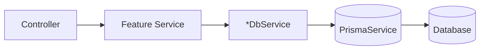

# Database services (backend-services)

Each feature module in `apps/backend-services/src/` owns its database access through a dedicated `*-db.service.ts`. There is no shared database facade — all modules inject `PrismaService` directly via the global `DatabaseModule`.

## Core Database Layer

`apps/backend-services/src/database/` contains only the module definition (`database.module.ts`) and one service:

| File | Service | Responsibility |
|------|---------|----------------|
| `prisma.service.ts` | `PrismaService` | Owns the Prisma client (connection, config). Exposes `prisma: PrismaClient` and a `transaction<T>(fn)` helper for atomic operations. |

`DatabaseModule` is decorated with `@Global()`, so `PrismaService` is available for injection throughout the application without each module declaring an import.

## DB Services by Module

Each db service injects `PrismaService` and is a private provider scoped to its module. The public service for that module is what other modules inject.

### Document Module
`apps/backend-services/src/document/`

| File | Service | Responsibility |
|------|---------|----------------|
| `document-db.service.ts` | `DocumentDbService` | Document CRUD (`createDocument`, `findDocument`, `findAllDocuments`, `updateDocument`, `deleteDocument`), status aggregation (`getDocumentStatusCounts`), OcrResult upsert/fetch (`upsertOcrResult`, `findOcrResult`) including extracted field storage |

Types are defined in `document/document-db.types.ts`. Callers outside the module inject `DocumentService`, which delegates to `DocumentDbService`.

### Template Model Module
`apps/backend-services/src/template-model/`

| File | Service | Responsibility |
|------|---------|----------------|
| `labeling-document-db.service.ts` | `LabelingDocumentDbService` | Labeling document CRUD: `createLabelingDocument`, `findLabelingDocument`, `updateLabelingDocument` |
| `template-model-db.service.ts` | `TemplateModelDbService` | Template models, field definitions, labeled documents, document labels |

`TemplateModelService` injects both and is the public interface for the module.

### HITL Module
`apps/backend-services/src/hitl/`

| File | Service | Responsibility |
|------|---------|----------------|
| `review-db.service.ts` | `ReviewDbService` | Review sessions, field corrections, review queue, document locks (acquire/release/heartbeat), review analytics |

`HitlService` injects `ReviewDbService` and also cross-injects `DocumentService` for document lookups.

### Group Module
`apps/backend-services/src/group/`

| File | Service | Responsibility |
|------|---------|----------------|
| `group-db.service.ts` | `GroupDbService` | Group CRUD, `UserGroup` membership, `GroupMembershipRequest` lifecycle |

`GroupDbService` methods:
- **Group CRUD**: `findGroup`, `findActiveGroup`, `findGroupByName`, `findActiveGroupByNameExcluding`, `findAllGroups`, `createGroup`, `updateGroupData`, `softDeleteGroup`
- **UserGroup**: `findUsersGroups`, `findUserAdminMemberships`, `findUserGroupsWithGroup`, `findUserGroupsInGroups`, `isUserInGroup`, `findUserGroupMembership`, `upsertUserGroup`, `updateUserGroupRole`, `deleteUserGroup`, `findGroupMembersWithUser`
- **GroupMembershipRequest**: `findMembershipRequest`, `findPendingMembershipRequest`, `deleteResolvedMembershipRequests`, `createMembershipRequest`, `updateMembershipRequest`, `cancelRequestTransaction`, `approveRequestTransaction`, `findGroupMembershipRequests`, `findUserMembershipRequests`

`GroupService` is the public interface and does not reference Prisma directly.

### Training Module
`apps/backend-services/src/training/`

| File | Service | Responsibility |
|------|---------|----------------|
| `training-db.service.ts` | `TrainingDbService` | `TrainingJob` and `TrainedModel` operations: create, find, update, list active jobs |

`TrainingService` injects `TrainingDbService` for all persistence operations.

### Azure / Classifier Module
`apps/backend-services/src/azure/`

| File | Service | Responsibility |
|------|---------|----------------|
| `classifier-db.service.ts` | `ClassifierDbService` | `ClassifierModel` operations: create, update, find by name/group, list |

`ClassifierService` injects `ClassifierDbService`.

### Benchmark Module
`apps/backend-services/src/benchmark/`

| File | Service | Responsibility |
|------|---------|----------------|
| `benchmark-project-db.service.ts` | `BenchmarkProjectDbService` | Benchmark project CRUD with definition and run summaries |
| `benchmark-run-db.service.ts` | `BenchmarkRunDbService` | Benchmark run creation, status updates, result storage |
| `benchmark-definition-db.service.ts` | `BenchmarkDefinitionDbService` | Benchmark definition CRUD with dataset version, split, workflow joins |
| `dataset-db.service.ts` | `DatasetDbService` | Dataset, `DatasetVersion`, and `Split` management including freeze/delete |
| `audit-log-db.service.ts` | `AuditLogDbService` | `BenchmarkAuditLog` entries: create and paginated query |
| `ground-truth-job-db.service.ts` | `GroundTruthJobDbService` | `DatasetGroundTruthJob` lifecycle: create, status updates, batch queries with document/review joins |

Service wiring in the benchmark module:
- `BenchmarkProjectService` → `BenchmarkProjectDbService`
- `BenchmarkRunService` → `BenchmarkRunDbService` (audit via `AuditLogService`)
- `BenchmarkDefinitionService` → `BenchmarkDefinitionDbService`
- `DatasetService` → `DatasetDbService`, `AuditLogDbService`, `GroundTruthJobDbService`
- `AuditLogService` → `AuditLogDbService`
- `GroundTruthGenerationService` → `GroundTruthJobDbService`, `ReviewDbService` (cross-module, injected directly)
- `HitlDatasetService` → `ReviewDbService` (cross-module, injected directly)

### Actor Module
`apps/backend-services/src/actor/` (persistence via `api-key-db.service.ts` and `user-db.service.ts`; auth via `apps/backend-services/src/auth/api-key-auth.guard.ts`)

| File | Service | Responsibility |
|------|---------|----------------|
| `api-key-db.service.ts` | `ApiKeyDbService` | `ApiKey` CRUD: find by group/id/prefix, create, update, delete by group or id, update `last_used` |
| `user-db.service.ts` | `UserDbService` | `User` operations: `upsertUser`, `findUser`, `isUserSystemAdmin` |

`ApiKeyService` and `UserService` (both in `actor/`) inject their respective db services and are the public interfaces exported by `ActorModule`.

### Tables Module
`apps/backend-services/src/tables/`

| File | Service | Responsibility |
|------|---------|----------------|
| `tables-db.service.ts` | `TablesDbService` | `ReferenceTable` and row management: table CRUD, column add/update/remove with backfill, lookup add/update/remove, row CRUD, duplicate/missing-column checks |

`TablesService` injects `TablesDbService` and is the public interface for the module.

### Audit Module
`apps/backend-services/src/audit/`

| File | Service | Responsibility |
|------|---------|----------------|
| `audit-db.service.ts` | `AuditDbService` | `AuditEvent` creation: `createAuditEvent` |

`AuditService` injects `AuditDbService` and handles context enrichment (actor/request IDs). `AuditModule` is decorated `@Global()` so `AuditService` is available throughout the application.

## Architecture Diagram



## Transaction Support

Most db-service methods accept an optional `tx?: Prisma.TransactionClient` as their last parameter. When provided, the db-service uses the transaction client instead of `this.prisma`. This enables multi-step operations to participate in a single database transaction. (Exception: `TablesDbService` defines its own transaction boundaries internally via `this.prisma.$transaction` and does not take a `tx` parameter.)

`PrismaService` exposes a `transaction<T>(fn)` helper that services use to define transaction boundaries:

```typescript
// In a service method
await this.prismaService.transaction(async (tx) => {
  await this.myDb.updateRecord(id, data, tx);
  await this.otherService.updateRelated(relatedId, tx);
});
```

Service methods that may be called as part of a cross-module transaction accept and pass `tx?` straight through without querying it directly. Controllers never initiate or receive transactions.

## Usage

- **Document operations**: inject `DocumentService` (backed by `DocumentDbService`).
- **Group operations**: inject `GroupService` (backed by `GroupDbService`).
- **Direct Prisma access** for simple use cases: inject `PrismaService` directly (globally available via `DatabaseModule`).
- All other modules have their own service as the public interface — inject the feature service, not the db service.

## Module

`DatabaseModule` (`@Global()`) provides and exports: `PrismaService` only.

Every other db service is a private provider within its own feature module. Feature modules do not need to import `DatabaseModule` explicitly because it is global.

# User Model

## Overview
The `User` model tracks users separately in its own table. Each `User` has a one-to-one `Actor` row; other tables reference the `Actor` (not the `User` directly) for provenance foreign keys such as `created_by`/`updated_by` relations.

## Fields
- `id`: Unique identifier for the user.
- `email`: Unique email address for the user.
- `last_login_at`: Timestamp of the user's last login.
- `created_at`: Timestamp when the user was created.
- `updated_at`: Timestamp when the user was last updated.
- `is_system_admin`: Whether the user is a system administrator.
- `actor_id`: Unique foreign key to the user's `Actor` row.

## Usage
- The `ApiKey` table references `User` via `generating_user_id` (the user who most recently generated/regenerated the key; recorded for audit purposes only, not used for authentication identity resolution).
- Both `User` and `ApiKey` link to an `Actor` row; audit/provenance fields on other tables (e.g., group created/updated by, classifier created/updated by) reference `Actor`.
