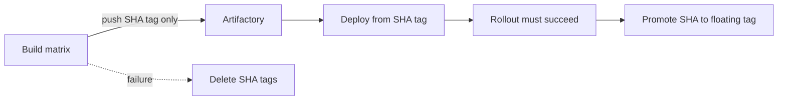

# Auto-Deploy on push to `develop` and `main`

## Overview

The `Deploy Instance` workflow automatically builds images and deploys them to the appropriate OpenShift instance whenever a commit lands on `develop` or `main`:

| Branch | Instance | Namespace | GH environment | Floating tag (live) | Staged tag (build/deploy) |
|---|---|---|---|---|---|
| `develop` | `bcgov-di-test` | `fd34fb-test` | `test` | `bcgov-di-test` | `bcgov-di-test-<sha12>` |
| `main` | `bcgov-di` | `fd34fb-prod` | `prod` | `bcgov-di` | `bcgov-di-<sha12>` |

This replaces the prior manual flow (local `scripts/oc-deploy.sh` + ad-hoc tag pushes via the now-retired `build-apps.yml`) for test and production deployments.

## What happens on a push

1. **Trigger**: `push` to `develop` or `main`.
2. **Metadata job** resolves instance name, floating tag, SHA tag, namespace, and GH environment.
3. **Build job** (parallel matrix): `backend-services`, `frontend`, `temporal`, `ches-adapter`. Each image is pushed **only** to the immutable SHA tag (`<floating>-<sha12>`). The floating tag is not updated during build.
4. **Deploy job**:
   - Verifies all four staged images exist in Artifactory at the SHA tag.
   - Generates a Kustomize overlay from `deployments/openshift/kustomize/overlays/instance-template` using the **SHA tag** (not the floating tag), substituting instance/namespace/cluster-domain/image tags plus SSO and app-config values.
   - `oc apply`s the rendered manifests.
   - Creates/updates the `<instance>-artifactory-pull` image-pull secret (and patches each deployment to use it), plus `<instance>-backend-services-secrets` and `<instance>-temporal-worker-secrets` from GitHub env secrets. For `develop` pushes the instance is `bcgov-di-test`, so e.g. `bcgov-di-test-artifactory-pull`.
   - Generates Prometheus alert rules (`npm run generate:alert-rules`), creates the `<instance>-ches-adapter-secrets` and `<instance>-plg-alertmanager-adapter-secret` secrets, then Helm-installs the per-instance PLG monitoring stack (Grafana/Loki/Prometheus/Alertmanager + CHES adapter). Gated by the workflow-level `DEPLOY_PLG` env (currently `"true"`); immutable Loki/Prometheus/Alertmanager StatefulSets are deleted (`--cascade=orphan`, PVCs preserved) before the Helm upgrade.
   - `oc rollout restart` on all app deployments and **fails the job** if any rollout times out (including when namespace resources are exhausted and the new pods cannot schedule); the backend's `migrate-db` init container runs `prisma migrate deploy` on fresh-pod start (no separate migrate step).
   - **Promotes** staged SHA tags to the floating tag via `docker buildx imagetools create` (only after rollouts succeed).
   - Runs `scripts/artifactory-cleanup.sh --delete` to rotate old SHA tags and reclaim orphan manifests (non-blocking).
5. **Cleanup on failure**: If the **build** fails, a follow-up job deletes the run's SHA tags and reclaims orphans via `scripts/artifactory-delete-run-tags.sh`. Deploy failures do **not** trigger tag cleanup — once `oc apply` has run the Deployments reference the SHA tag, so it must stay pullable for pod restarts.

## Staging model



**Why**: Pushing to the floating tag during build meant an OpenShift pod restart (or partial matrix success) could pull a mix of new and old images. Staging by SHA keeps the floating tag unchanged until deploy and rollout complete.

## Concurrency

The workflow uses a per-ref concurrency group with `cancel-in-progress: true`. If two commits land on the same branch in rapid succession, the older run is cancelled and the newer commit is deployed. Pushes to `develop` and `main` run independently.

## Image tagging strategy

| Target | Staged tag | Floating tag | Rollback | Rotation |
|---|---|---|---|---|
| Test (`develop`) | `bcgov-di-test-<sha12>` | `bcgov-di-test` | Re-deploy a previous commit | Keep 10 most recent SHA tags per image |
| Prod (`main`) | `bcgov-di-<sha12>` | `bcgov-di` | `oc set image .../<svc>=<registry>/<svc>:bcgov-di-<old-sha12>` | Keep 3 most recent SHA tags per image |
| Manual (`workflow_dispatch`) | `<branch-tag>-<sha12>` | `<branch-tag>` | Rebuild and redeploy | **Not rotated** — see below |

Rotation matches `<instance>-????????????`, and on `develop`/`main` the instance name and the floating
tag are the same string, so those SHA tags rotate. On `workflow_dispatch` they are not: the instance
name is capped at 20 characters and strips `.`/`_`, while the tag keeps them, so a branch such as
`feature/visual-workflow-builder` stages `feature-visual-workflow-builder-<sha12>` against a
`feature-visual-workf-????????????` glob that never matches, and those manifests accumulate.
Left as-is deliberately: the manual pathway is being retired under
[AI-1207](https://citz-do.atlassian.net/browse/AI-1207).

## Artifactory retries

To handle intermittent `Client.Timeout exceeded` errors against the registry, registry operations retry up to three times with a 15-second backoff:

- `docker login` in the build and promote steps (`scripts/lib/artifactory-login.sh`).
- The deploy job's staged-image existence check and the `docker buildx imagetools create` promotion, via a shared `with_retries` helper (`scripts/lib/retry.sh`). The existence check only accepts HTTP 200, so a transient timeout (`000`) or `5xx` is retried while a genuinely-missing image still fails after the attempts are exhausted.

All Artifactory REST/registry `curl` calls additionally use `--connect-timeout 30 --max-time 120`.

## Rollout failure handling

The deploy job uses `scripts/lib/wait-for-rollouts.sh`, which:

- Fails the workflow (not just a warning) when `oc rollout status` times out — including when the namespace lacks the resources to schedule the new pods, which surfaces as a rollout timeout rather than a silent success.
- Emits pod status, `FailedScheduling` events, and resource-quota details on failure.

Namespace capacity is not pre-checked before the restart: in a shared namespace a quota can be at its limit because of other instances, and a rollout-restart of already-sized deployments requests no new storage, so a pre-flight quota gate produced false blocks. Resource exhaustion is instead caught by the rollout-status timeout above. Right-sizing capacity (HPA tuning) is tracked separately.

## Pre-requisites

### GitHub environments

- `test` — populated by `scripts/gh-setup-test-env.sh` (see below). All shared secrets mirror `dev`, with `OPENSHIFT_*` overridden for `fd34fb-test`.
- `prod` — already configured with production OpenShift and Azure/SSO secrets. Secrets sourced from `deployments/openshift/config/prod.env` + the `fd34fb-prod` SA token.

Both environments should have:
- `OPENSHIFT_TOKEN` — service-account token for the matching namespace
- `OPENSHIFT_NAMESPACE` — literal namespace name (`fd34fb-test` or `fd34fb-prod`)
- `OPENSHIFT_SERVER` — cluster API URL (`https://api.silver.devops.gov.bc.ca:6443`)
- `ARTIFACTORY_URL`, `ARTIFACTORY_SA_USERNAME`, `ARTIFACTORY_SA_PASSWORD`
- Azure, SSO, and app-config secrets as referenced in the workflow

### OpenShift service account in `fd34fb-test`

One-time step: while logged in to the cluster with a personal account, run

```bash
./scripts/oc-setup-sa.sh --namespace fd34fb-test
```

The script creates a `deploy-sa` service account with a scoped Role/RoleBinding (`deploy-sa-role` / `deploy-sa-rolebinding`), mints a long-lived token (`oc create token --duration=87600h`), and writes it to `.oc-deploy/token-fd34fb-test` (also copied to the default `.oc-deploy/token`).

## Bootstrapping the test environment

Run once, locally, after minting the test SA token:

```bash
./scripts/gh-setup-test-env.sh
```

The script:

- Creates the GitHub `test` environment (no protection rules).
- `gh secret set -f deployments/openshift/config/dev.env --env test` to bulk-load the shared secrets without printing values.
- Extracts the `TOKEN=` value from `.oc-deploy/token-fd34fb-test` and pipes it into `gh secret set OPENSHIFT_TOKEN --env test`.
- Sets `OPENSHIFT_NAMESPACE` and `OPENSHIFT_SERVER` to their test values.

Secret values never touch stdout.

## `workflow_dispatch` path

The workflow supports manual dispatch from any branch with explicit inputs:

- `environment` (`dev|test`, default `dev`)
- `namespace` (optional OpenShift namespace override)
- `instance_name` (optional instance name override)

Manual-dispatch behavior:

- By default, instance and floating image tag are branch-derived (same as before).
- SHA tag is `<floating-tag>-<sha12>`.
- If `instance_name` is provided, it overrides the branch-derived instance name.
- The selected `environment` is used as the GitHub environment for both build and deploy jobs, so environment-specific secrets (including `test`) are honored.
- If `namespace` is not provided, deploy uses `OPENSHIFT_NAMESPACE` from the selected GitHub environment secrets.

## Local deploy parity

```bash
# Build staged images (pushes to <tag>-<sha12>, not floating tag)
./scripts/oc-build-push.sh --env dev --all --tag my-loadtest

# Deploy using the staged SHA tag
./scripts/oc-deploy-instance.sh --env dev --namespace fd34fb-test \
  --image-tag my-loadtest-<sha12> --instance loadtest-1 --confirm

# After successful deploy, promote to floating tag
./scripts/oc-build-push.sh --env dev --tag my-loadtest --promote
```
