# Workflow builder — the gallery

**A guided tour of the workflow builder, in 16 stops.** Each stop opens something
already built for you, tells you what to click, and shows you what you should be
looking at. About **45 minutes** end to end. Stops 1–8 are the core; if you only
have twenty minutes, stop there.

You need no setup, no terminal, and no database. If a button doesn't do what this
page says it will, that's a finding — write it down and keep going.

> **This is not the test plan.** [MANUAL_TEST_PLAN.md](./MANUAL_TEST_PLAN.md) is
> the exhaustive checklist: 150-odd checks including the awkward ones that need
> SQL, `curl` and environment flags. It exists to prove coverage. *This* page
> exists to show you the product. Each stop lists the plan IDs it covers, so
> finishing the gallery tells you what the plan can consider walked.

## Before you start

Open the app and sign in. Everything happens under **Workflows** in the left
nav unless a stop says otherwise.

The tour uses the workflows whose names begin **🎯 Demo —**. They are seeded for
exactly this purpose; you can edit them freely, and re-seeding restores them.

☁️ **Four stops need the engine running** — 8, 9, 10 and 14. They're marked with
a ☁️. If the **Try** button does nothing on stop 8, the engine isn't up: skip to
stop 11 and come back later. Everything else works with just the web app.

**A word on the words.** A *workflow* is a diagram of work to be done. Each box in
it is a *step*. Steps are joined by *wires*. Running a workflow once is a *run*.
That's the whole vocabulary.

---

# Part one — look around

## 1 · A workflow, end to end
**⏱ 3 min** · Open **Standard OCR Workflow**

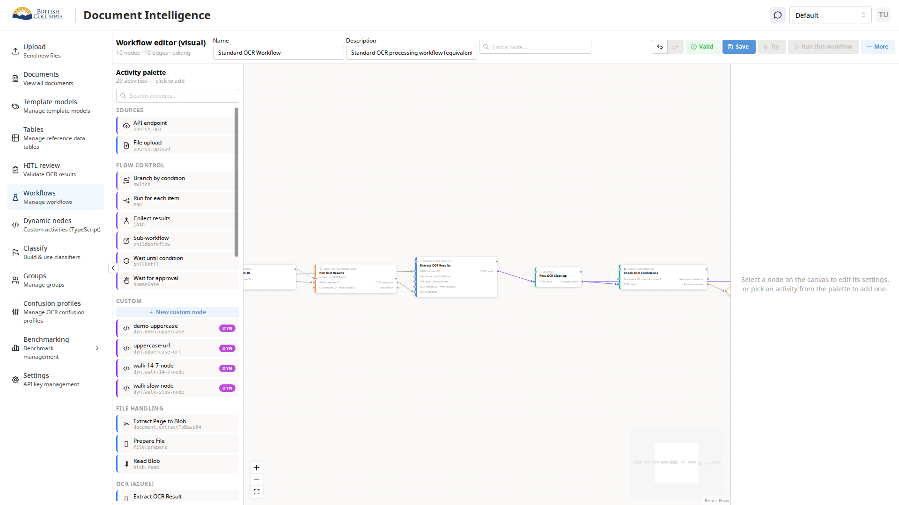

This is a real, working workflow: it takes a scanned document, sends it to Azure
for text recognition, waits for the answer, checks how confident the result is,
and either files it or sends it for human review.

**Look for**

- Steps read left to right. Each is a card with a title and a list of what it
  needs (left) and what it makes (right).
- The **ENTRY** tag marks where a run begins.
- The top bar tells you the size — *"10 nodes · 10 edges"* — and whether the
  workflow is **Valid**.

**Try this.** Drag on the empty canvas to pan; scroll to zoom. The **⛶** button at
the bottom-left is meant to refit everything on screen — see the known gaps at
the end, it currently doesn't manage it on a workflow this size.

*Covers 3.1, 3.2, 16.1*

---

## 2 · Reading a step
**⏱ 3 min** · Open **🎯 Demo — Node settings panel & canvas basics**

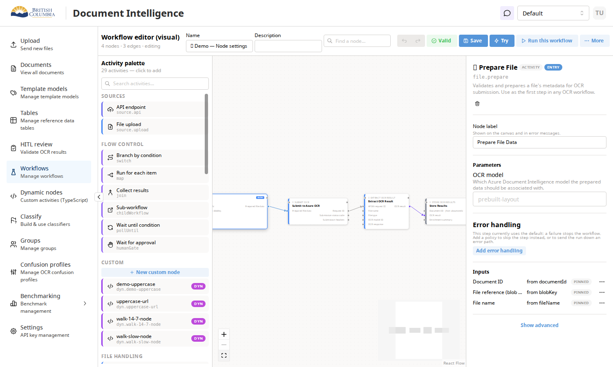

Click any step. A panel opens on the right — this is where a step is configured.

**Look for**

- **Node label** — what this step is called on the diagram. Yours to change.
- **Parameters** — the step's own settings. Any that must be filled in are
  marked with a `*`.
- **Inputs** — where each piece of information comes from, one row each. The tag
  on the right tells you who decided: **AUTO** (the builder worked it out),
  **PINNED** (someone chose it deliberately), or **Needs a source** (nothing feeds
  it yet).
- **Error handling** — what happens if this step fails. The default is *stop the
  workflow*.
- **Show advanced** at the bottom opens the raw wiring, if you want to see it.

**Something's off if** the panel is empty for a step that clearly has settings, or
if a required field shows no `*`.

*Covers 3.3, 3.4, 3.5, 3.6*

---

# Part two — build one

## 3 · Drop a step on the canvas
**⏱ 3 min** · **Workflows ▸ New workflow**

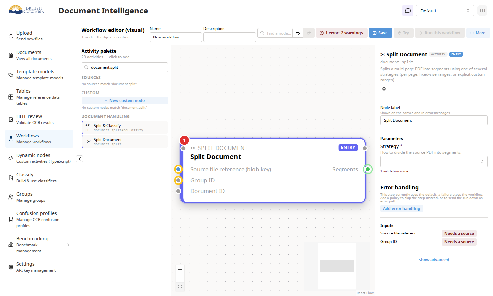

The left-hand **Activity palette** is the menu of everything a workflow can do,
grouped by what it's for — sources, flow control, custom code, document handling,
OCR.

**Do this**

1. Type `split` in the palette's search box.
2. Click **Split Document**. It lands on the canvas, already selected.

**Look for**

- The step arrives with its inputs and outputs already listed. You don't
  configure that — it comes with the step.
- Two of its inputs wear an **amber ring**, and the settings panel says
  **Needs a source** against each. Nothing feeds them yet.
- The top bar already reads **1 error · 2 warnings**. The builder started checking
  the moment the step existed; you don't have to ask.
- Because it's the first step, it's automatically the **ENTRY** point.

*Covers 3.1, 13.1, 8.14*

---

## 4 · Wiring: what fits what
**⏱ 4 min** · Open **🎯 Demo — Typed I/O**

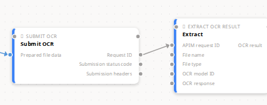

Every step says what it needs and what it makes, and the builder knows which
things fit together. Zoom in until you can read the labels.

**Look for**

- Coloured dots down each step's edges, one per input and output, each labelled —
  *Prepared file data*, *Request ID*, *Submission status code*.
- The colour is the **kind** of thing that travels the wire: segments of a
  document are green, a prepared file is blue, an unspecified value is grey.
- Hover a label: a sentence explains what that input or output is, and names its
  kind.

**Try this.** Everything in this demo is already wired, so nothing is amber here —
add a step from the palette and its unfed inputs will ring, exactly as at stop 3.
Now drag from an output dot on an existing step to one of those input dots. If the
two kinds fit, a wire appears and the ring clears. If they don't, no wire is
created and a note explains why — *"This input needs DocumentRef —
DocumentContent can't be used here."*

**Something's off if** a wire is created between two things the note says are
incompatible, or if an amber ring stays after you've connected something.

*Covers 7.1, 7.2, 7.3, 8.9, 8.10*

---

## 5 · When something's wrong
**⏱ 3 min** · Open **🎯 Demo — Validation surfacing**

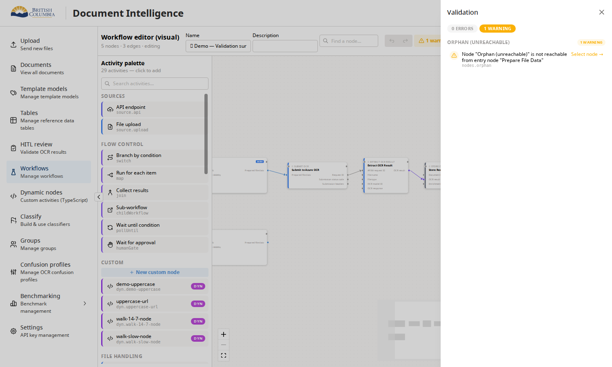

The builder checks your workflow continuously and tells you before you run it.

**Do this.** Click the **errors · warnings** chip in the top bar.

**Look for**

- The drawer separates **errors** (this can't run) from **warnings** (this can run,
  but look at it).
- Each entry names the step and says what's wrong in a sentence — here, a step
  that nothing leads to.
- **Select node →** jumps you to it.

**Worth knowing.** Warnings never block you. Errors don't block *saving* either —
you can save a half-built workflow and come back. They do block *running* it, and
the Run button will tell you so.

*Covers 5.4, 3.9, 3.10*

---

# Part three — branch and loop

## 6 · Choosing a path
**⏱ 4 min** · Open **🎯 Demo — Switch/error edges**

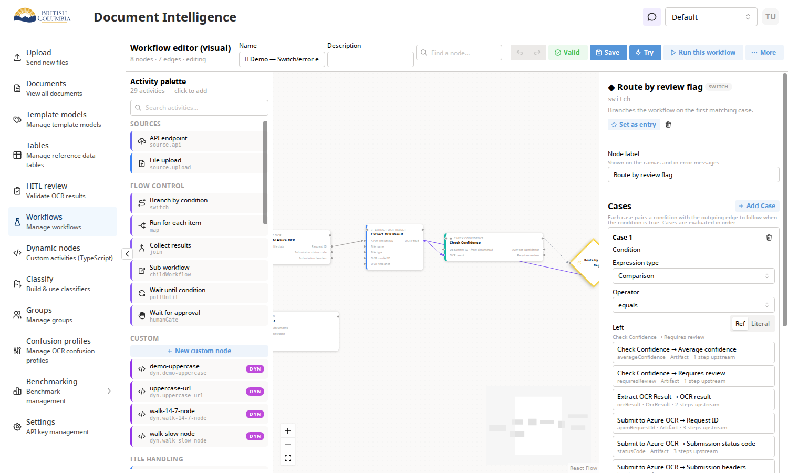

A **Branch by condition** step sends the run down one path or another. Click the
diamond-shaped step to open its cases.

**Look for**

- **Cases are evaluated in order** — the first one that matches wins. Each case
  pairs a condition with the wire to follow when it's true.
- A condition has an **Expression type** (compare two things, or combine several
  with and/or), an **Operator**, and a left and right side.
- Each side is either **Literal** — a fixed number or piece of text you type — or
  **Ref**, pointing at something an earlier step produced.
- In **Ref** mode you get a list of earlier steps, not a box to type a variable
  name: *"Check Confidence → Requires review"*, with what kind of value it is and
  how many steps back it came from.

**Try this.** Toggle a value between **Ref** and **Literal** and watch the field
change shape. Then look at the canvas: the branch has one outgoing wire per case,
so you can see the shape of the decision on the diagram, not just in the panel.

*Covers 4.1–4.7, 5.1, 5.2, 5.3*

---

## 7 · Doing it for every page
**⏱ 4 min** · Build this yourself — **Workflows ▸ New workflow**

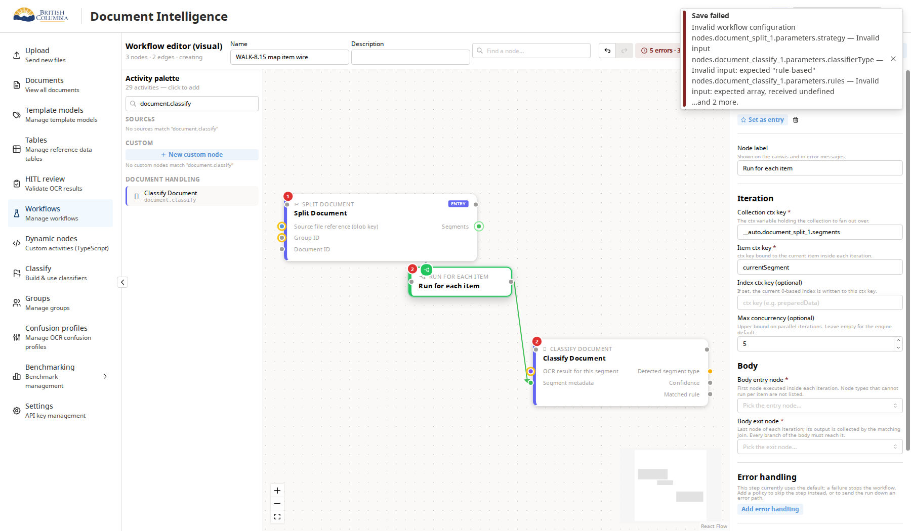

Some work has to happen once per page, per segment, per row. **Run for each item**
is the loop.

**Do this**

1. Add **Split Document**, then **Run for each item**, then **Classify Document**.
2. Wire the first to the second, and the second to the third.
3. Click the loop step. Under **Iteration**, type `currentSegment` into
   **Item ctx key** and accept the *Create variable* prompt.

**Look for**

- **Collection ctx key** filled itself in — the builder found the nearest thing
  that produces a list and used it.
- A **green wire** now runs from the loop to the third step: that's the current
  item being handed to the body of the loop. Hover it and it says it was
  connected automatically.
- Give the loop a moment; the wire appears as soon as the item has a name.

**Something's off if** no green wire appears *after* you've named the item —
before you name it, no wire is correct, because there's nothing to hand over yet.

*Covers 8.7, part of 8.15*

---

# Part four — run it

## 8 · Try it, and watch ☁️
**⏱ 5 min** · Open **Standard OCR Workflow**

> **This stop needs the engine running.** If **Try** is greyed out, hover it — it
> will say why. If nothing happens at all, the engine isn't up: skip to stop 11.

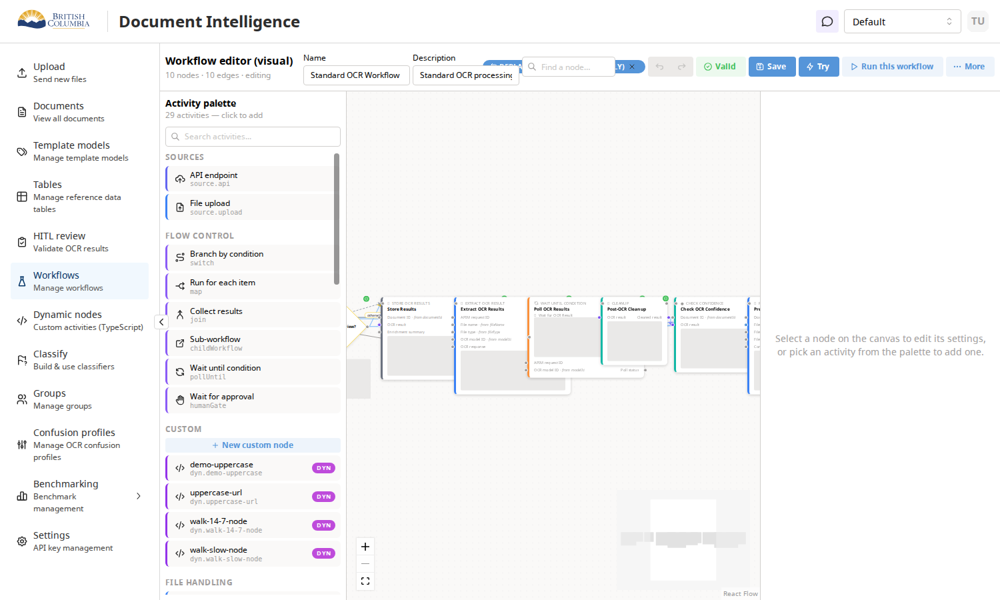

**Do this.** Click **More ▸ Run history**, then **Replay** on the most recent row.

**Look for**

- Every step that ran wears its result on a slim one-line band under the step's
  name — the kind it produced and the first line of the value. On a live run
  you'd watch these turn from grey to blue to green as it goes, and the cards
  never move: the band is there before you run anything, saying *"Not run yet"*.
- The wires the run actually travelled are drawn in blue. A branch it didn't take
  stays in its resting colour — you can see the path it chose.
- A banner across the top of the canvas says **Replay mode — you are looking at
  v1, the graph this run used**, that the canvas is read-only, and offers
  **Leave replay**. You're looking at history, not the live diagram.

**Try this.** Click **Try** on a workflow you've edited but not saved. It refuses,
and says why: *"Save your changes first — a run always executes the saved graph,
not the canvas."* That's deliberate — a run should never execute a diagram you
aren't looking at.

*Covers 9.3, 9.4, 9.4a, 9.7, 9.9, 9.12*

---

## 9 · Reading the results ☁️
**⏱ 4 min** · Same workflow, still in replay

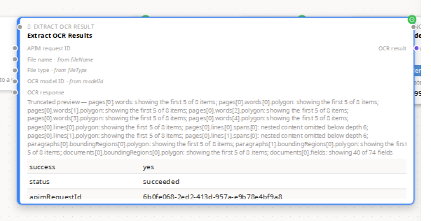

Each step keeps what it produced. The card shows you a one-line taste of it;
**click that line** and the full, scrollable result opens beside the step.

> *The two screenshots above were taken before 2026-08-08, when the full result
> pane still sat inside the card. It now opens in a panel on click — everything
> described below is the same, one click further in.*

**Look for**

- A table of the actual values — for the OCR step that's `success`, `status`, the
  request id, the recognised text. **Not** a storage path: the point is to see
  what came out, not where it was filed. The one-line version on the card follows
  the same rule: it summarises the text, not the file it was stored in.
- When a result is too big to show whole, a dimmed line says exactly what was
  trimmed — *"showing the first 5 of 8 items"*, *"showing 40 of 74 fields"*. It
  never quietly shortens something.
- A step with more than one output gets a row of small chips above the opened
  result, one per output; click between them, and the line on the card follows
  your choice.
- A step that produces nothing to look at — a branch, a loop, a wait — shows
  nothing at all, not even the line, and that's correct.

**Something's off if** a step shows a blank card with no explanation. Every state
has words: waiting, running, never reached, failed, not stored. A blank card is a
bug. So is a card that changes size when you press run — the line is a fixed
height precisely so the diagram holds still.

*Covers 9.5, 9.5a, 9.5b, 9.5c*

---

## 10 · What ran, and when ☁️
**⏱ 3 min** · **More ▸ Run history**

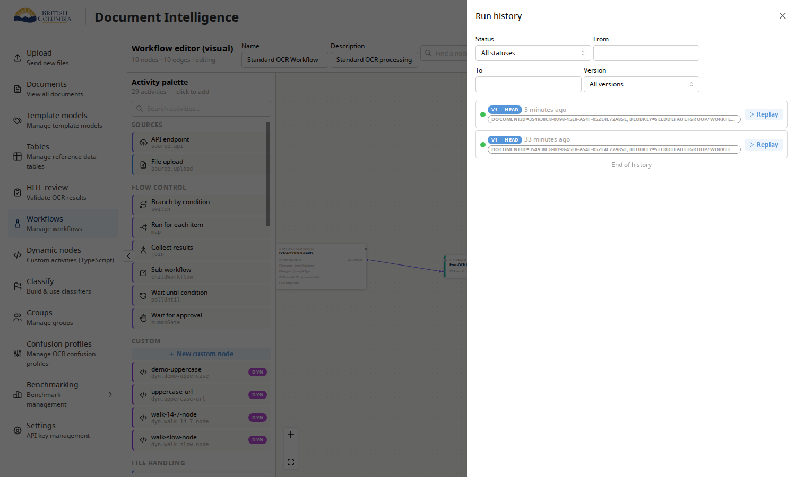

**Look for**

- One row per run: status dot, which version ran, how long ago, and a summary of
  what it was given.
- Filters across the top — by status, by date, by version.
- **Replay** on any row puts that run back on the canvas.

**Try this.** Replay an old run, then click the result line on a step whose stored
result has since been cleaned up. The line reads *"Preview expired"*, and behind
it is a red note — *"Preview unavailable — cache evicted"* — with a button to run
it again. Results are kept for 14 days. You will only ever see this on a run that
has finished; on a live run a step that has just gone green says *"Output
pending"* instead, because nothing has expired — the result is simply still on
its way.

*Covers 9.8, 9.9, 9.10, 9.10a*

---

# Part five — ship it

## 11 · Versions
**⏱ 3 min** · Open **🎯 Demo — Versioning**

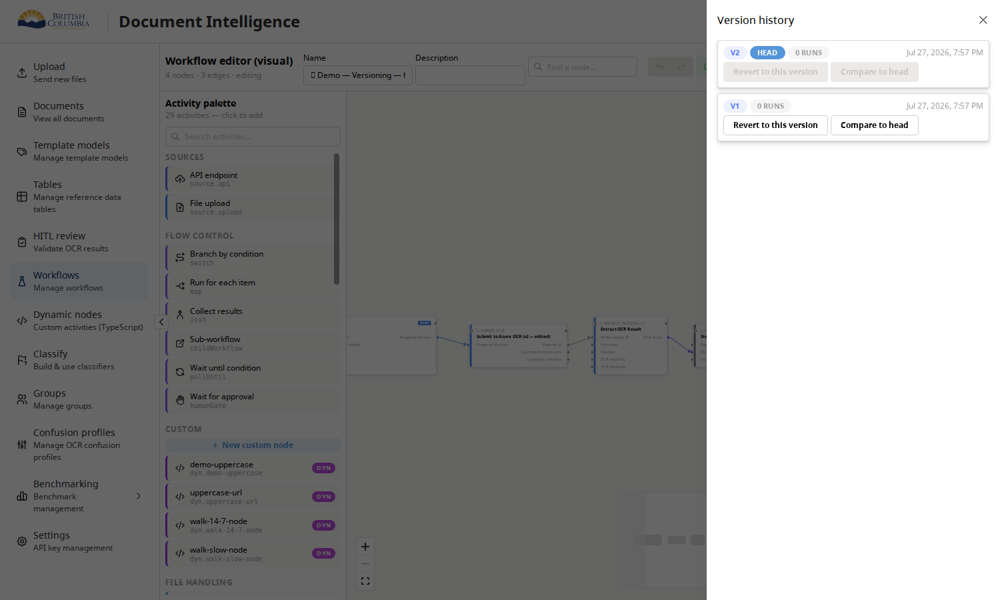

Every save makes a version. Nothing is overwritten.

**Do this.** Click **More ▸ History**.

**Look for**

- Newest first, with the current one marked **HEAD**, and how many runs used each.
- **Compare to head** shows the two side by side.
- **Revert to this version** brings an old one back — as a *new* version, so the
  history stays honest.

*Covers 12.1, 12.2, 12.3*

---

## 12 · Turn it into an API
**⏱ 3 min** · Open **🎯 Demo — Workflow-as-API**

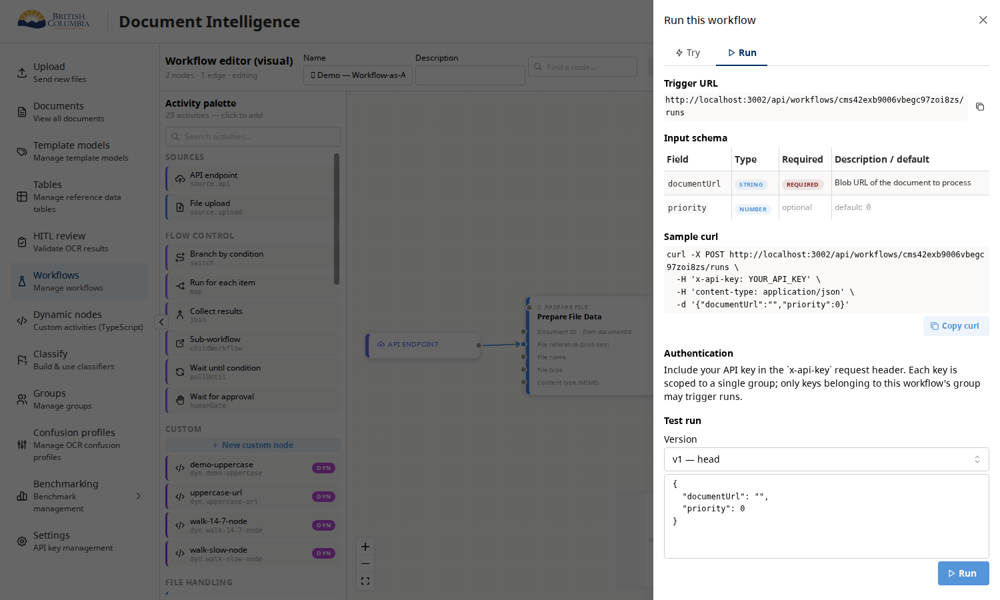

Any workflow can be triggered by another system.

**Do this.** Click **Run this workflow**, then the **Run** tab.

**Look for**

- The **Trigger URL** to call.
- The **Input schema** — every field the workflow expects, its type, whether it's
  required, and what it's for. This is derived from the diagram; nobody writes it
  by hand.
- A ready-made **Sample curl**, and a **Test run** box where you can fill the
  fields and fire one off from here.

*Covers 11.1, 11.2, 11.3, 11.4*

---

## 13 · Let people upload files
**⏱ 3 min** · Open **🎯 Demo — Document sources**

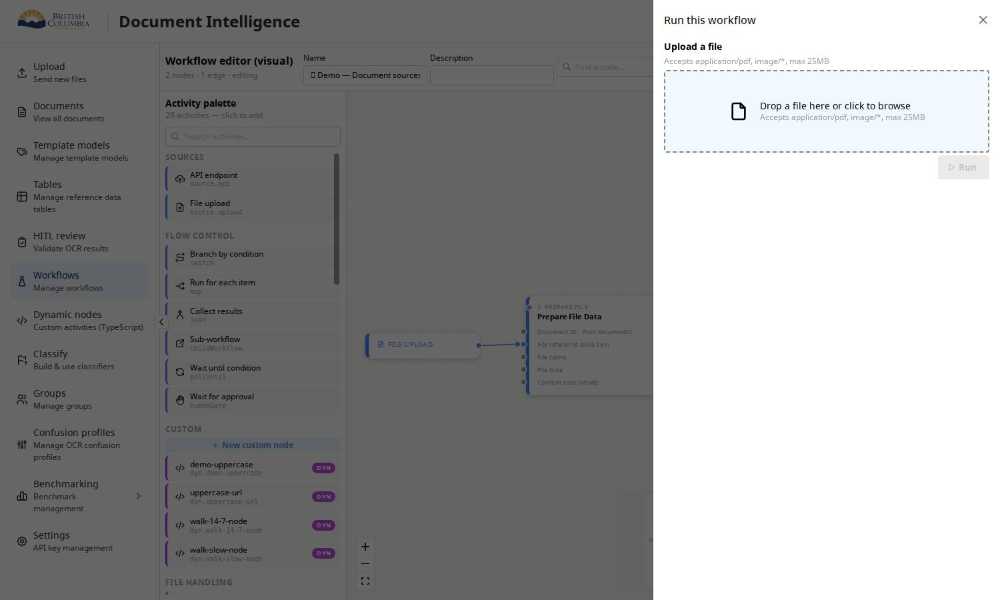

A workflow can start from a file instead of an API call.

**Do this.** Click **Run this workflow**.

**Look for**

- A drop zone stating what it accepts and the size limit — both come from the
  upload step's settings, so changing them changes this.
- Dropping a file uploads it *and* starts a run in one go.

*Covers 13.1, 13.3, 13.4*

---

# Part six — go further

## 14 · Write your own step ☁️
**⏱ 5 min** · Left nav ▸ **Dynamic nodes** ▸ **demo-uppercase**

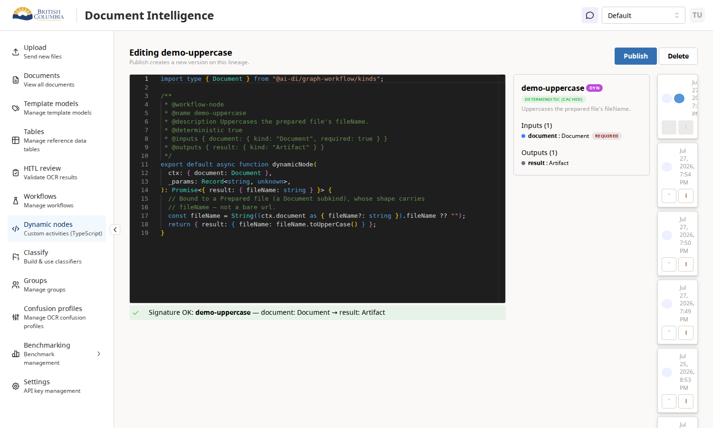

When no built-in step does what you need, you write one in TypeScript.

**Look for**

- The code editor, with the comment block at the top declaring the step's name,
  its inputs and its outputs.
- The panel on the right updates **as you type**, showing the step the way the
  palette will show it. A green tick means the declaration is understood; red
  lines point at the exact line and column that isn't.
- **Publish** makes a new version, and the step appears in every workflow's
  palette immediately — no restart.
- Down the right-hand edge, every previous version, each restorable.

**Something's off if** the editor sits on *"Loading…"* for more than a few
seconds. It should either open or tell you it failed and disable Publish; it
should never leave you able to publish code you can't see.

*Covers 14.1–14.7*

---

## 15 · When a step goes missing
**⏱ 2 min** · Open **🎯 Demo — Deleted custom node**

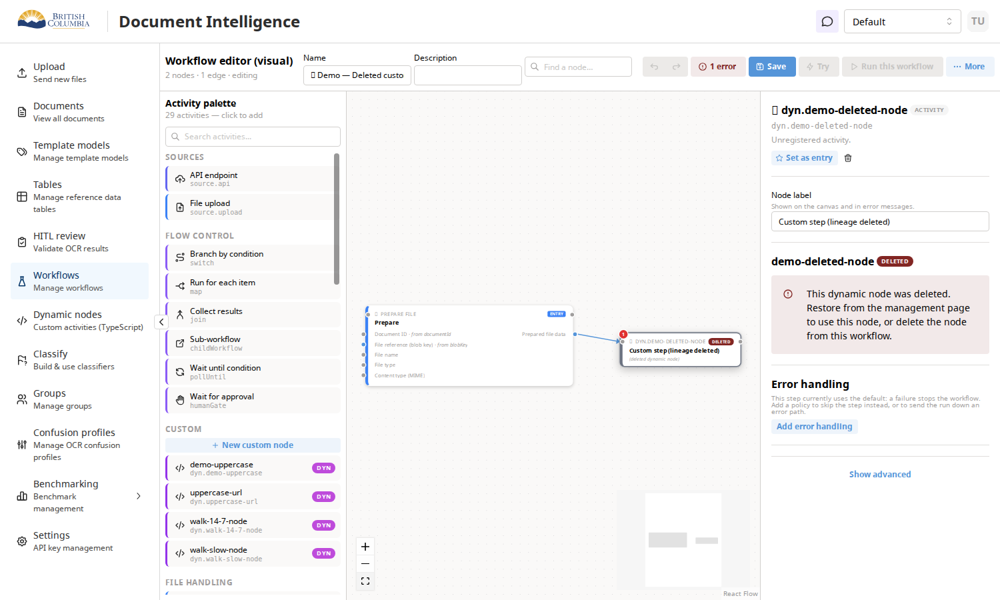

Custom steps can be deleted while workflows still refer to them. This is what
that looks like.

**Look for**

- A red **DELETED** badge on the step and *"Custom step (lineage deleted)"* where
  its name should be.
- **1 error** in the top bar.
- Selecting it explains the situation and what to do: *"This dynamic node was
  deleted. Restore from the management page to use this node, or delete the node
  from this workflow."*
- **Try** and **Run** are both disabled, and say why.

This is the shape the whole product aims for: when something is broken, say so on
the diagram, in words, next to the thing that's broken — and don't offer a button
that can't work.

*Covers 14.8*

---

## 16 · Ask the assistant to build it
**⏱ 4 min** · Open **🎯 Demo — Agent: Invoice OCR Pipeline**

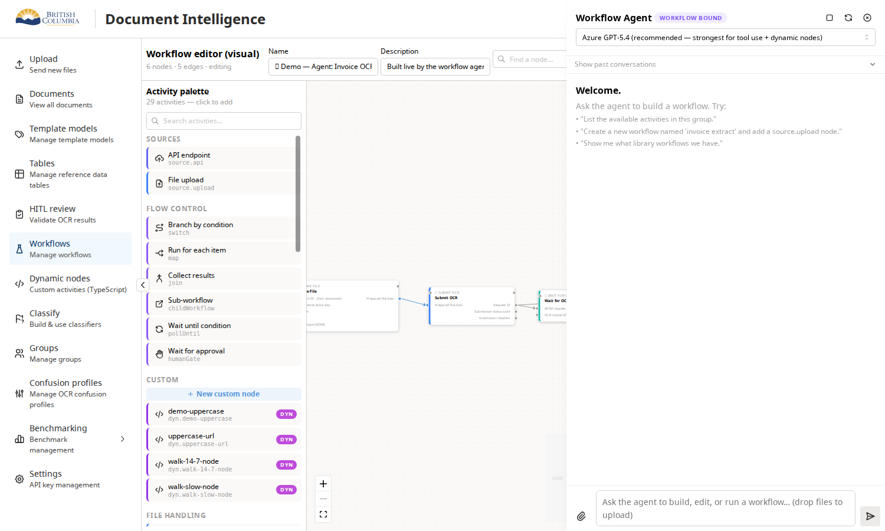

**Do this.** Open the chat drawer from the speech-bubble icon in the header.

**Look for**

- **Workflow bound** in the header — the assistant is working on *this* workflow,
  and edits land on the canvas beside you.
- Example prompts to start from.
- A model picker, and past conversations.

**Try this.** Ask it something plain, like *"add a step that stores the results."*
Watch the canvas as it works.

*Covers 15.1, 15.2, 15.3*

---

# You're done

If you noted anything that didn't match, that's the useful output. Two things
worth separating when you write it up:

- **"This did something different from what the page said."** That's a bug, and
  the page is the specification.
- **"This did what the page said, but I didn't understand why."** That's a design
  finding, and it's the more valuable of the two. The gallery describes what the
  product *does*; it can't tell you whether that was the right thing to do.

Known gaps, so you don't re-report them:

- There's no seeded demo for loops yet, which is why stop 7 asks you to build one.
- ***Fit view* doesn't reliably fit.** On the larger workflows the **⛶** button
  leaves most of the diagram off-screen — 3 of 10 steps on Standard OCR, even
  after Auto-arrange and pressing it twice. Pan and zoom by hand for now
  (logged as D-19).
