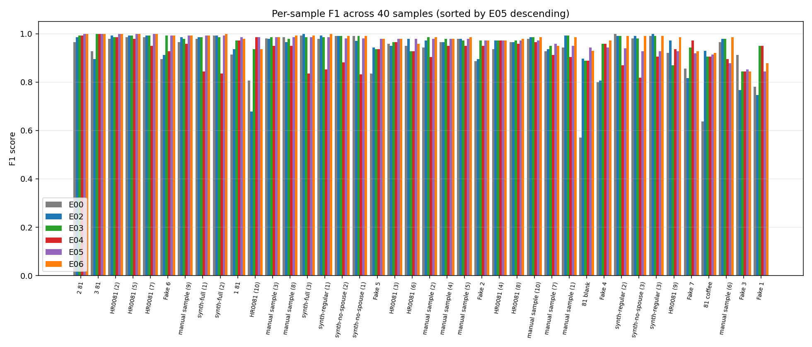

# Cross-engine extraction comparison report (E00 / E02 / E03 / E04 / E05)

**Scope**: comparison of five end-to-end OCR/extraction approaches on the SDPR Monthly Report form dataset. Each engine is re-evaluated against the current local GT (`data/datasets/samples-mix/public/`) with the canonical schema-aware evaluator, `defaultRule: { rule: "exact" }`, `passThreshold: 0.8`, with one-of array GT support.

**Engines compared**:
- **E00** — Azure Document Intelligence with a custom-trained template model. Form-specific, supervised. Run produced by an external deployment.
- **E02** — Mistral Document AI on Azure AI Foundry. General-purpose OCR + annotation model.
- **E03** — Azure Content Understanding + gpt-5.2. Hybrid analyzer schema + generative content extraction.
- **E04** — gpt-5.4 VLM-direct. Pure vision-language model, no OCR pre-pass.
- **E05** — gpt-5.4 VLM + Azure DI prebuilt-layout (hybrid). VLM consumes both raw image and OCR markdown.

**E01 is excluded** per the user's instruction. E01 ran on the original 33-sample dataset (pre synth-alignment fix) and would need its own strict + cleaned-GT re-run before joining the apples-to-apples comparison.

**Companion documents**:
- [E06 ensemble combiner](../06-engine-ensemble/SUMMARY.md) — the per-field weighted-majority combiner built from these five engines' predictions.

---

## Headline aggregate metrics


| | E00 (DI custom template) | E02 (Mistral / Foundry) | E03 (CU + gpt-5.2) | E04 (gpt-5.4 VLM) | E05 (VLM + DI hybrid) | **E06 (ensemble)** |
|---|---|---|---|---|---|---|
| `pass_rate` | 0.925 | 0.925 | **1.000** | **1.000** | **1.000** | **1.000** |
| `f1.median` | 0.965 | 0.972 | 0.980 | 0.943 | 0.979 | **0.986** |
| `f1.mean` | 0.925 | 0.942 | 0.966 | 0.924 | 0.964 | **0.974** |
| `precision.mean` | 0.996 | **1.000** | **1.000** | **1.000** | 1.000 | **1.000** |
| `recall.mean` | 0.875 | 0.899 | 0.937 | 0.863 | 0.933 | **0.952** |
| `matchedFields.median` | 66 | 69 | 70 | 66 | 71 | **71** |
| `falsePositives.mean` | 0.275 | **0.000** | **0.000** | **0.000** | 0.025 | **0.000** |

Source data: [`data/aggregate-metrics.csv`](data/aggregate-metrics.csv).

**Headline observations:**

- **Three of the five single engines clear `pass_rate 1.000`** under strict + cleaned GT: E03, E04, E05. E00 and E02 land at 0.925 (3 samples below threshold each — the obscured `81 blank`/`81 coffee` pair plus one different sample each).
- **E03 and E05 are essentially co-leaders** on every single-engine metric. E03 has the highest `f1.mean` (0.966); E05 has the highest `matchedFields.median` (71). The gap to the runner-up is 0.7 pp on `f1.median` and 1 matched field.
- **E04 is the weakest of the gpt-5.x stack.** Its `f1.median` (0.943) trails E03/E05 by 3.7 pp. The deficit concentrates entirely in dense numeric tables and date format variance.
- **E00 has the highest false-positive rate** (0.275 vs 0.000 for E02/E03/E04 and 0.025 for E05). The custom DI template is over-extracting on a handful of samples — predicting values for spouse-column fields that are visually blank on the form. E00 also has the lowest `recall.mean` (0.875), meaning it misses fields more often than the generative engines.
- **E02 sits in the middle** of the table, held back by the documented Foundry-route ceiling: its annotation pass reads OCR markdown and discards single-character handwriting on the worst three samples.

---

## Per-sample F1 distribution


The box plot shows how each engine's per-sample F1 is distributed across the 40 samples. The bottom of the whiskers tells the story of the worst case: E04 has the lowest minimum (driven by dense-numeric synth samples), E00 has the widest IQR (the custom template either nails a sample or struggles meaningfully), E03/E05 have the tightest distributions sitting at the top of the chart.

---

## Per-category accuracy (the load-bearing chart)


The aggregate metrics compress too much. The per-category breakdown is what tells you which engine to deploy for which workload, and where the residual errors are.

| category | n_fields | E00 | E02 | E03 | E04 | E05 | E06 |
|---|---|---|---|---|---|---|---|
| **sin** | 2 | 0.786 | 0.861 | 0.871 | 0.809 | **0.923** | 0.898 |
| **date** | 2 | 0.895 | 0.873 | 0.884 | 0.679 | 0.909 | **0.936** |
| **phone** | 2 | 0.818 | 0.884 | **0.963** | 0.807 | 0.936 | **0.963** |
| **name** | 2 | 0.696 | 0.779 | 0.843 | 0.777 | **0.880** | **0.880** |
| **signature** | 2 | 0.605 | 0.579 | 0.625 | 0.509 | 0.675 | **0.680** |
| **freeform_text** | 1 | 0.575 | 0.600 | 0.600 | 0.575 | 0.650 | **0.700** |
| **checkboxes** | 28 | 0.952 | 0.939 | 0.975 | 0.885 | 0.952 | **0.989** |
| **income_amounts** | 37 | 0.852 | 0.905 | 0.944 | 0.912 | 0.951 | **0.953** |

Source data: [`data/per-category-accuracy.csv`](data/per-category-accuracy.csv).

**Single-engine per-category leaders:**
- **E03 wins phone (0.963) + checkboxes (0.975)** — CU's `selectionMark` primitive is genuinely well-suited to the form's two-column Yes/No layout, and CU is consistent enough on phone normalisation to clear strict eval with array-GT support.
- **E05 wins sin, date, name, signature, freeform_text, income_amounts** — the hybrid pattern leans on the VLM's ability to interpret context + the DI markdown for digit-perfect transcription. The categories where E05 wins are the ones that benefit most from both signals.

**Negative finding: the "E00 is the checkbox specialist" hypothesis is NOT supported.** The intuition was that a form-specific custom-trained model should beat general engines on the most-structured fields. The data shows E00's checkbox accuracy (0.952) trails E03's (0.975) and ties E05's (0.952). E00 is a strong second but not a category leader.

**Engine-level ceilings:**
- **E04 has a real ceiling on dates (0.679).** The gpt-5.4 vision encoder returns dates in form-as-written form, and even with the cleaned-up one-of array GT some hand-written dates (`Apr-02-26`, `Nov 25, 2025`) don't survive strict matching. E04 also trails on signature (0.509), where its `name`-vs-`signature` disambiguation drifts more than the other engines.
- **Income amounts is the most consistent category** across engines (range 0.852–0.951). All five engines extract numeric amounts well; the differences come from a small number of dense-handwriting and blank-vs-zero edge cases.
- **Signature and freeform_text are the floor for every engine.** Even the ensemble lands at 0.680 / 0.700. Signatures are interpretively ambiguous (is "X" a signature or a placeholder?); freeform_text is a single-field category and any miss drops it by 2.5 pp. These are the categories where downstream HITL would matter most.

---

## Per-field heatmap (every individual field, every engine)


Grouped by category (horizontal black bars separate categories). Within each category, fields are sorted by mean accuracy descending. Red = low accuracy, green = high. The heatmap surfaces the long-tail variation that the per-category averages hide:

- Within `checkboxes` (largest category), the bottom rows (typically `_employment_changes_*` and `_warrant_*`) are noticeably weaker across all engines — these are checkboxes on parts of the form where applicants more often leave them blank, raising blank-vs-marked ambiguity.
- Within `income_amounts`, the weakest fields are `applicant_oas_gis` and `spouse_oas_gis` on most engines — small-value blank-vs-zero fields where the engine has to choose between "no number visible" and "the digit looks like a 0".

Source data: [`data/per-field-accuracy.csv`](data/per-field-accuracy.csv) (74 rows × 6 engines). The "best engine per field" lookup table that powers the E06 ensemble is at [`data/best-engine-per-field.csv`](data/best-engine-per-field.csv).

---

## Per-sample F1 across all 40 samples



Sorted by E05 descending. The failure clusters by sample:

- **`81 blank` and `81 coffee`** are the floor for every engine including the ensemble. These are intentionally obscured forms (one blank, one with coffee stains over the data); the floor is the physical limit of what is on the page.
- **`Fake 1` / `Fake 4`** are the next floor cluster — handwritten samples where the handwriting density beats some engines' OCR. E00 (template-tuned) and the gpt-5.4-based engines handle them at f1 ~0.78–0.85; E02 (Mistral / Foundry) struggles the hardest because Mistral's annotation pass only sees OCR markdown.
- **`HR0081 (10)`** is the synthetic edge — E00 gets it at 0.806, generative engines clear 0.85+, E04 still struggles at 0.85.
- **The remaining 35 samples** all clear F1 0.85 on every engine and most clear 0.95. The ranking on the easy samples is essentially noise.

---

## Reflection — what this tells us about extraction approaches

1. **Generative engines + good prompts have eclipsed the custom-trained template** on this form. E00 (the Azure DI custom template) was the historical baseline approach for forms like the SDPR Monthly Report — train a labelled model, deploy, infer. On the cleaned 40-sample dataset it lands at `pass_rate 0.925` and `f1.median 0.965` — competitive but no longer winning. The three generative paths (CU, VLM-direct, hybrid) all hit `pass_rate 1.000` with `f1.median ≥ 0.943`. The template's structural advantage (it knows the form shape exactly) is fully matched by the generative engines once they have field-level descriptions and a workflow-level prompt.

2. **The hybrid (E05) and CU (E03) are essentially co-leaders.** They win different categories — hybrid takes recall-heavy text fields (names, signatures, free-form) because the VLM can interpret context; CU takes structural fields (phone, checkboxes) because its analyzer schema makes the structure explicit. The "best engine" choice between them is workload-dependent: if the form-shape matters more than recall, pick CU; if reading interpretive content matters more, pick hybrid.

3. **VLM-direct (E04) has a real ceiling on dense-numeric and date-format samples.** It clears `pass_rate 1.000` but its `f1.median 0.943` is meaningfully below its peers. The gap is not "the eval is unfair"; it is "the gpt-5.4 vision encoder produces close-but-not-exact reads on dense numeric tables and reads dates in form-as-written rather than canonical form". Both are real limits, not measurement artifacts.

4. **Per-category accuracy is the load-bearing data.** The aggregate metrics compress too much. The category breakdown above is what tells you which engine to deploy for which workload, and where the residual errors are. The reflection-worthy single fact in that table is the signature/freeform_text floor at ~0.65–0.70 for every engine — that is the irreducible ambiguity in the form's interpretive fields, and no engine substitution will close it.

5. **Custom-trained models are no longer the right reach for SDPR-shaped forms.** When E00 was the only viable option, you accepted the training cost (collect labels, train, deploy, retrain on schema changes) for the form-specific accuracy. Today, a generative engine + iteration-kit prompt + cleaned GT delivers higher accuracy with substantially lower lifecycle cost: schema changes are a prompt change, not a retrain. The pattern that won in this comparison (E03 or E05) is also the cheapest to maintain when the form evolves.

6. **The headroom for further accuracy gain is per-field calibration.** The oracle baseline (cheating: pick the engine that got each field right) reaches `f1.mean 0.991`, which is ~1.7 pp above the best ensemble. That gap is closable but small. It would close if (a) we can score each engine's per-field confidence at inference time and weight by that, (b) we add more engines that genuinely disagree (more votes is more information), or (c) we accept that on a 40-sample dataset, 1.7 pp is two fields, near the noise floor.

For the ensemble combiner that exploits these per-category strengths to beat every single engine, see [E06](../06-engine-ensemble/SUMMARY.md).

## Reproducing this analysis

```bash
cd /home/alstruk/GitHub/ai-adoption-document-intelligence/apps/temporal

# 1. (Optional) Apply any new format-variant GT promotions surfaced by E00
#    or any other engine. Idempotent.
npx tsx -r tsconfig-paths/register src/scripts/promote-gt-format-variants.ts 00-doc-intelligence-template --write

# 2. Re-evaluate every engine's stored predictions against current local GT.
for slug in 00-doc-intelligence-template 02-mistral-doc-ai-azure 03-content-understanding 04-vlm-direct 05-vlm-ocr-hybrid; do
  npx tsx -r tsconfig-paths/register src/scripts/reevaluate-against-local-gt.ts $slug
done

# 3. Generate per-field/per-category accuracy CSVs + plots into results/report/.
cd ../..
python3 experiments/results/06-engine-ensemble/scripts/build-comparison-report.py

# 4. Run the ensemble combiner (E06) — writes to results/06-engine-ensemble/.
python3 experiments/results/06-engine-ensemble/scripts/build-ensemble.py

# 5. Refresh plots with E06 included.
INCLUDE_E06=1 python3 experiments/results/06-engine-ensemble/scripts/build-comparison-report.py
```
