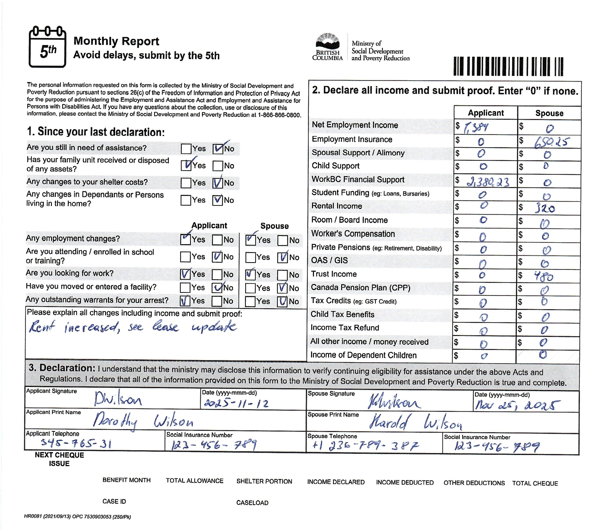
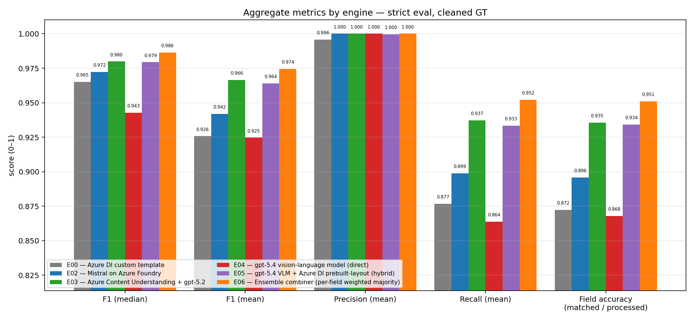
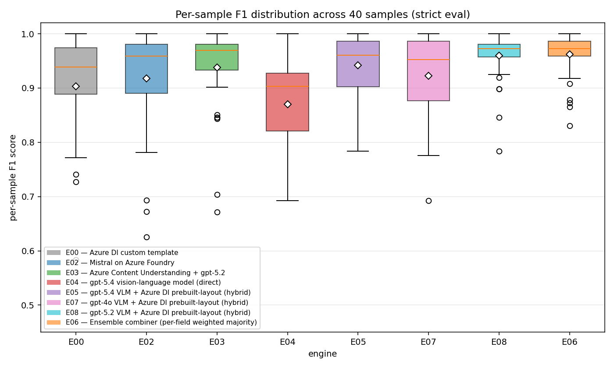
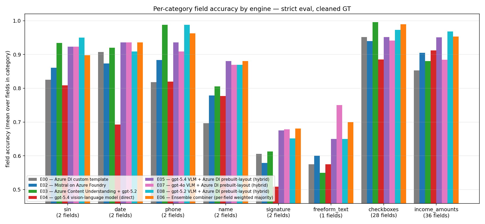
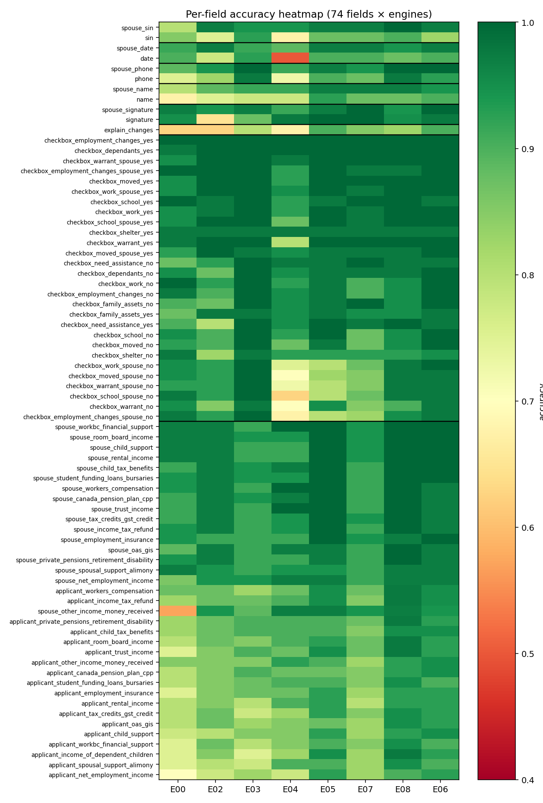
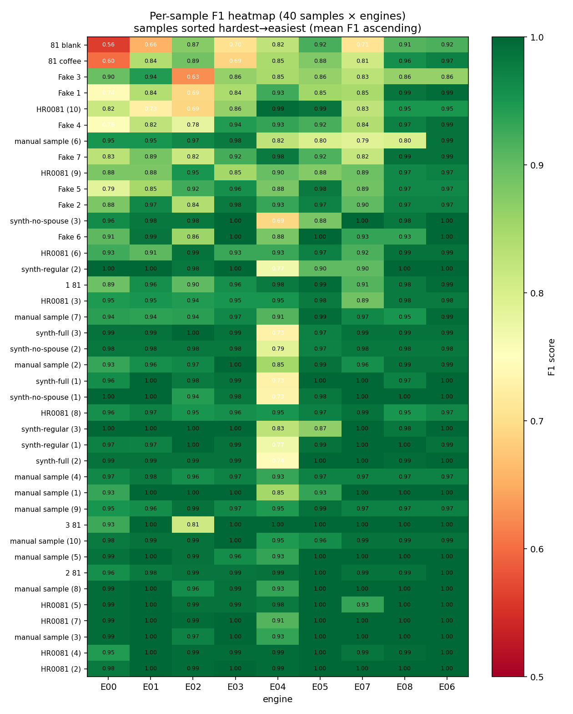

# Cross-engine extraction comparison report

## Executive summary

We tested eight ways to turn a hand-filled SDPR Monthly Report into structured data, scored each one against 40 real and synthetic forms, and measured both accuracy and per-page cost.

> **What this report is and isn't.** The findings below are specific to **a hand-filled, scanned, key-value-extraction workload** — a one-page form with handwritten data going into a fixed JSON schema. The right tool for a different document class (digital-native PDFs with selectable text, free-form contracts requiring summarisation or Q&A, multi-page tabular reports, ID cards, etc.) is very likely a different tool. In particular, the two-stage OCR + LLM pipeline that wins on this workload is a custom architecture — it takes ongoing prompt and schema maintenance and isn't a turnkey product. Treat the result as "this architecture is the strongest candidate observed on this benchmark of the SDPR Monthly Report" — not as "this is the universally best document-AI stack", and not as a final production endorsement (see [Statistical significance and confidence intervals](#statistical-significance-and-confidence-intervals) for what 40 samples can and cannot tell us).

The bottom line:

- **Our custom pipeline beats Microsoft's off-the-shelf managed product on both accuracy *and* cost.** Combining Azure's OCR service with a GPT-5.2 call — sending both the form image *and* the OCR text — reads ~**95% of fields correctly per form** on this dataset, ~2 percentage points better than Azure's managed "Content Understanding" service (averaged across 40 samples). On the cost side, our pipeline runs at **~$0.046/page** vs the managed product's **~$0.073/page** — about 37% cheaper — measured across 5 representative samples per engine.
- **The previous approach (a hand-trained custom model, V1) has been overtaken.** Modern generative AI engines now match or beat the supervised template's accuracy *without* needing re-training every time the form changes — removing a significant ongoing maintenance cost.
- **One engine is far cheaper but with a structural accuracy ceiling.** Mistral's document AI runs at ~$0.003/page (~20× cheaper than the GPT-based options) but cannot recover handwriting its OCR layer misses. A reasonable fallback for low-stakes documents, not for income reporting.
- **Results are directional, not a production guarantee.** The 40-sample dataset includes deliberately-hard edge cases (blank, coffee-stained, pencil-filled forms). On production volume the *rankings* between engines should hold; the *absolute* accuracy numbers will move.

### When to choose each engine

The single best engine on this workload (E08, our custom pipeline) isn't the right answer for every situation. The other engines remain meaningfully useful in specific contexts:

- **Azure Content Understanding (CU, E03) — the managed-service alternative.** Choose CU when (a) you want a single managed service that handles OCR-to-LLM orchestration, structured output, and retries (you still maintain the schema and prompt), (b) downstream workflows need per-field confidence scores and bounding-box source spans on *generative* answers (DI grounds what its OCR reads; CU grounds what the LLM infers — including derived or summarised values), or (c) the documents are unstructured or vary heavily in layout. CU is bring-your-own-deployment: you connect any supported Foundry model (gpt-5.2, gpt-4.1, gpt-4.1-mini, mini/nano variants) and can swap to a cheaper/lower-latency model if accuracy allows. Note that this means CU shares the same model-region constraints as our pipeline (e.g. gpt-5.2 in Canada is still PTU-only) — CU is not a shortcut around data residency. CU is ~2 pp less accurate on this workload and ~37% more expensive per page, but it is a turnkey product.

- **Document Intelligence custom Neural model (E01) — the supervised, non-LLM alternative.** Best of the non-LLM engines on this dataset (~95% of fields per form, F1.mean 0.946) and the best single-engine on the `sin` category. Choose DI Neural when (a) data residency or compliance rules out generative AI, (b) you have a representative labelled training set, or (c) you want a turnkey Microsoft-managed deployment with no prompt or schema maintenance and no LLM token cost. The trade-offs are still the labelling-and-retraining loop — labelling effort is the same as E00's (same training-data shape and volume); the Neural model's advantage over E00 is not less labelling work but greater tolerance of layout variations, which lowers the *retraining cadence* as the form drifts over time — and meaningfully lower accuracy than E08 (-2.7 pp F1.mean). Cost is the standard DI custom rate (~$0.030/page).

- **Document Intelligence custom template (E00) — the older supervised path.** A template-based custom model. **Largely superseded by E01** (the Neural model) on the same workload — E01 hits F1.mean 0.946 vs E00's 0.916. Choose E00 only if you already have a trained template in production and the cost of migrating to E01 outweighs the accuracy gain.

- **Mistral Document AI (E02) — the high-volume, cost-sensitive option.** Choose Mistral when (a) per-page cost dominates the decision (it is ~15× cheaper than every gpt-5.x option at $0.003/page), (b) the documents are mostly typed or have clean handwriting that OCRs reliably, or (c) the workload tolerates a structural accuracy ceiling. Mistral's annotation pass doesn't see the image, so anything its OCR layer misses is irrecoverable. On this hand-filled handwriting workload that ceiling matters; on cleaner documents it might not.

- **Our custom pipeline (E08) — the accuracy-optimised path.** A custom two-stage pipeline: **Azure Document Intelligence (`prebuilt-layout`) OCR + GPT-5.2 chat-completion, with both the form image *and* the OCR text sent to the model**. Highest accuracy on this benchmark (~95% of fields, F1.mean 0.973) and lowest cost among the gpt-based options. The architecture warrants further exploration for SDPR-shaped workloads (image-based forms going into a fixed key-value schema, where the volume justifies maintaining a prompt + schema). Treat the result as promising rather than conclusive: a larger production sample is needed before committing it as the production path, and the choice of Azure OpenAI deployment mode (Global Standard, PTU Regional in Canada, etc.) changes the per-page cost picture materially — see [Production deployment — Canada data residency](#production-deployment--canada-data-residency).

## Overview — what we tested and why it matters

Each SDPR Monthly Report has 74 fields (names, SINs, dates, signatures, 14 yes/no checkboxes, 35 income amounts). The system needs to read all 74 from a scanned or photographed page and produce reliable structured data for downstream eligibility processing. We compared eight approaches: two supervised models trained against the form, two managed Microsoft / Mistral products, one direct vision-language model call, and three variants of a custom pipeline that combines Microsoft's OCR with a generative AI call.

Two seemingly-technical choices drive most of the accuracy gap between the winner and Microsoft's managed alternative:

1. **We give the AI both the image and the OCR text.** When the OCR layer misses a small handwritten `0` on an income line, the model can still recover it from the picture. Microsoft's managed product never shows the image to the AI, so it cannot recover what the OCR drops — and on this dataset it drops **13× more handwritten zeros** than our pipeline does.
2. **We control the prompt directly.** The managed product hides its prompt behind a "contextualization" layer that re-builds the instructions server-side. Our pipeline tells the model in plain language to *trust the image when the OCR text disagrees* and *return blank rather than guessing*. That **reduces** a class of "fluent-but-wrong" answers the managed product produces more often — but does not eliminate them: both pipelines still occasionally fabricate plausible values, just at different rates.

The cost picture turned out to favour the custom pipeline for the same reasons: the managed product's hidden contextualization layer inflates the prompt enough that, end-to-end, it sends more tokens to the AI model than our pipeline does *even with the image attached*, and it pays its own per-page meters on top.

## Observations on a candidate production path

**On this benchmark**, the strongest single engine is the custom pipeline (Azure Document Intelligence `prebuilt-layout` OCR + GPT-5.2, with both the form image *and* the OCR text sent to the model — referenced as "E08" in this report): F1.mean 0.973, ~95% field accuracy, ~$0.046/page cold-cache. It beats Microsoft's managed Content Understanding service on both accuracy (+2.0 pp F1.mean) and per-page cost (~37% lower), and beats the V1 trained-template approach by ~5.7 pp F1.mean. These results warrant further exploration of the architecture as a candidate production path for SDPR — not a commitment to it.

Caveats to weigh before any production decision:

1. **Small, edge-case-skewed dataset.** 40 samples; rankings should hold but absolute deltas will shift. Differences below ~2 pp F1.mean are close to noise — see [Statistical significance and confidence intervals](#statistical-significance-and-confidence-intervals).
2. **Workload-specific.** E08 suits image-based, key-value-shaped forms going into a fixed schema. Digital-native PDFs, free-form documents, multi-page tabular reports, or one-off extraction likely favour a managed product or different tooling.
3. **Operating cost depends on the Azure OpenAI deployment mode** (Global Standard vs gpt-5.2 PTU Regional in Canada vs a Canada-pinned alternate model). The architectural choice is independent of the residency question; the per-page cost is not — see [Production deployment — Canada data residency](#production-deployment--canada-data-residency).
4. **Generative engines hallucinate, including E08** (FP.mean 1.58 vs E03's 1.85 — reduced, not eliminated). For high-stakes fields like incomes and names, the safety net has to be a **comparison source** — full/majority human review, ensemble disagreement-flagging, or cross-data consistency checks — not a confidence-gated sample, because confidence thresholds cannot reliably separate fabrications from correct answers. A custom pipeline also requires ongoing prompt-and-schema maintenance (lower effort than re-training a template, but not zero); managed Content Understanding (E03) is the trade-off if maintenance cost dominates.

If exploring E08 further: re-measure on a larger production sample, resolve the deployment-mode question with the BC data-residency policy owner (this shifts cost more than the architectural choice does), and right-size human-in-the-loop review to each field category's risk profile.

## Introduction

The British Columbia government's **SDPR Monthly Report** is a one-page form that income-assistance recipients fill out monthly. Each form has 74 fields covering applicant and spouse names, signatures, dates, SINs, phone numbers, a free-form comment box, two parallel income-amount columns (18 applicant lines, 17 spouse lines — the spouse column has no `income_of_dependent_children` row), and 14 yes/no checkbox pairs. Most fields are filled by hand. The forms come in via scanner or phone photo and need to be turned into structured data that downstream eligibility processing can consume.



This report is a head-to-head comparison of **eight different ways to do that extraction**, plus a synthesised ensemble. Each engine reads the same set of 40 sample forms, returns the same 74 fields per form, and is scored the same way against the same ground truth. The forms span hand-filled real-world samples (varying handwriting styles, including pencil and a phone photo), synthetically generated samples, and two deliberately-hard edge cases (a blank form and one with coffee stains over the data).

**What the engines have in common.** Every engine takes an image (or PDF page) of the form and returns a JSON object with 74 field values. Re-scoring is strict: an answer is either an exact match to ground truth (with small allowances for known-equivalent format variants on dates, SINs, and phone numbers) or it isn't.

**What the engines differ on.** They differ on the OCR layer (or whether there is one), whether the engine is trained on this specific form (E00 and E01 are; the rest aren't), the generative model used to interpret the text and fill the schema, whether the image itself is shown to the generative model, and how the prompt and schema are presented to it. Those levers turn out to drive most of the accuracy differences we see — picking the right combination matters more than picking the latest model.

**Headline finding.** A custom pipeline that pairs **Azure Document Intelligence's `prebuilt-layout` OCR with a Foundry-deployed GPT-5.2 chat-completions call** — sending both the image and the OCR markdown to the model — is the strongest single engine on this dataset, beating the managed Azure Content Understanding (CU) service on most aggregates *even though CU runs the same gpt-5.2 model internally*. The gap is structural, not model-driven: CU's OCR (Microsoft-confirmed) is tuned for stricter grounding than the standalone DI `prebuilt-layout` E08 uses, and CU never shows the image to the LLM. Our pipeline sees both the image *and* the OCR text, which lets the model recover content the OCR step did not capture. Measured per-page cost (across 5 samples per engine) also favours our pipeline: E08 averages **~$0.046/page** vs E03's **~$0.073/page** — ~37% cheaper. CU sends substantially more input tokens to gpt-5.2 than we do (mean 18,844 vs 11,968) and produces ~37% more output tokens. Full breakdown in the [E08 section](#e08--gpt-52-vlm--azure-di-layout-hybrid) and [Cost per page](#cost-per-page).

**How to read the rest of this document.** The headline aggregate metrics at the top give the bottom line. The per-category and per-field views show where each engine wins and loses. The per-engine sections describe what each engine is and how we ran it. The Reflection ties the patterns together. Appendix A documents the ensemble (E06).

## The dataset

The dataset contains **40 SDPR Monthly Report documents** — the form that anchors this comparison:

- **21 hand-filled real-world samples** from the HR0081 series and a "Fake N" series — pen-on-paper handwriting from a range of people, including one sample filled in pencil, one phone-camera photo with the form's background visible, and two intentionally hard samples (one blank, one with coffee-stain obscuration). These are the closest analogue we have to documents that would arrive in production. (A handful of fields on some real samples — printed labels, pre-typed identifiers — are typed rather than hand-written, but the data entries themselves are hand-written.)
- **10 hand-filled "manual sample" forms** — additional handwriting samples, captured cleanly.
- **9 synthetic samples** ("synth-full", "synth-no-spouse", "synth-regular" series) — synthetically-generated forms with hand-written field values. The handwriting style is more uniform than the real-world samples, but the data itself is handwriting, not typed text.

**Caveat on generalisability:** the numbers in this report are computed against 40 sample documents. **These results may not match what you would see on production data; treat the rankings as directionally correct rather than as absolute production accuracy estimates.** Production submissions will have different handwriting styles, scan qualities, lighting conditions, and edge cases that this dataset does not cover. The engine-level patterns (which engines win which categories, where the failure modes are) are likely to hold, but the absolute F1 / precision / recall numbers will move on a larger and more representative corpus.

## Engines compared

- **E00 — Azure Document Intelligence custom template.** A supervised, form-specific model: a labelled template is trained against the SDPR form and inferred against new images. This is the same workflow that produced the **V1 Report**.
- **E01 — Azure Document Intelligence custom Neural model.** A deep-learning custom model in the Azure DI family — same training-data shape as E00 (labelled SDPR forms) but the model infers field positions from learned representations rather than from labelled bounding boxes. Trained on the production-grade `sdpr-monthly-prod-neural-v2` model and evaluated on the same 40-sample dataset as the other engines.
- **E02 — Mistral on Azure AI Foundry.** A general-purpose document AI model. The engine first runs OCR over the page, then a Mistral generative pass extracts structured fields against a JSON schema.
- **E03 — Azure Content Understanding (CU) + GPT-5.2.** A managed two-stage Microsoft service. Stage 1 is a specialized OCR/Layout model (the same Document Intelligence `prebuilt-layout` family, tuned for stricter grounding) that produces a layout-aware Markdown representation of the page. Stage 2 sends that Markdown plus the analyzer schema (field names, types, descriptions) to a customer-deployed GPT-5.2 chat model and gets a structured JSON response back. **The image itself is never sent to the LLM** — stage 2 is text-only.
- **E04 — GPT-5.4 vision-language model (direct).** The page image is sent directly to GPT-5.4 with a strict JSON-schema response format. No separate OCR step.
- **E05 — GPT-5.4 VLM + Azure DI layout (hybrid).** Two-pass: Azure DI's layout reader transcribes the page to markdown, then GPT-5.4 sees both the raw image and the OCR text, with a prompt that tells it to trust the image when the OCR text disagrees.
- **E07 — GPT-4o VLM + Azure DI layout (hybrid).** Same pipeline as E05; the only difference is the generative model — GPT-4o instead of GPT-5.4. Lets us isolate the model contribution on the hybrid pipeline.
- **E08 — GPT-5.2 VLM + Azure DI layout (hybrid).** Same pipeline as E05 and E07; the generative model is GPT-5.2 — the same model E03's Content Understanding uses internally. The third leg of the same-pipeline model bake-off.
- **E06 — ensemble combiner.** Not itself a deployed engine. It takes the predictions produced by all eight upstream engines (E00, E01, E02, E03, E04, E05, E07, E08) and picks each field's value from that category's best single engine (E01 for sin, E03 for checkboxes, E05 for date/name/freeform_text, E07 for signature, E08 for phone/income_amounts). Full details in [Appendix A](#appendix-a--e06-ensemble-combiner).


## How the metrics are computed

Each document has 74 fields with known correct values. Every engine returns the same 74 fields with whatever values it extracted. For each field on each document, we ask: did the engine's value match the correct value? The comparison is strict — values either match exactly or they don't (with a small allowance for known-equivalent format variants on dates / SINs / phones, so e.g. `2025-Nov-12` and `2025-11-12` are both accepted for a date written on the form as `2025-Nov-12`).

### The atomic units: TP, FP, FN

Every per-field comparison falls into one of four buckets:

| case | correct value (GT) | engine prediction | classification | counts |
|---|---|---|---|---|
| match | value | matches GT | **TP** (true positive) — engine read the field correctly | TP += 1 |
| deletion | value | null / missing | **FN only** (false negative) — the correct value did not appear in the output | FN += 1 |
| insertion | null | non-null | **FP only** (false positive) — the engine produced a value that wasn't there | FP += 1 |
| substitution | value | non-null, wrong | **FP + FN** — the engine BOTH produced a wrong value (precision miss) AND missed the correct value (recall miss) | FP += 1, FN += 1 |

These definitions match the standard OCR / information-extraction formulation. A substitution counts on both sides because it's two errors in one place: a wrong value was produced *and* the correct value was missed.

### The derived metrics

- **Precision (per sample)** = TP / (TP + FP). *"Of the answers the engine gave, what fraction was correct?"* Low precision means the engine produces wrong values or hallucinates values for blank fields.
- **Recall (per sample)** = TP / (TP + FN). *"Of the values that were actually on the form, what fraction did the engine read?"* Low recall means the engine misses fields or returns nothing when it should have produced a value.
- **F1 (per sample)** = 2·Precision·Recall / (Precision + Recall). Harmonic mean of precision and recall, designed to drop sharply if either input is weak. F1 is the single-number summary that punishes lopsided systems — an engine with high precision but low recall (or vice versa) gets a worse F1 than an engine that balances both.
- **matchedFields (per sample)** = TP. Absolute count of correctly-extracted fields out of 74 (or 52 for documents with no spouse).
- **Field accuracy (per engine)** = total matched fields summed across all 40 documents, divided by the total number of GT fields evaluated (2,852). The intuitive *"if you pick a random field on a random document, how often is it right?"* metric.
- **FP.mean (per engine)** = average number of false-positive predictions per sample. With 74 fields per sample, typical FP.mean values are in the 0–10 range — counts wrong-value substitutions plus values produced for genuinely blank cells plus any fields the engine emitted outside the schema.

Per-engine aggregates (median, mean) are computed across the 40 per-sample F1 / precision / recall values.

## Statistical significance and confidence intervals

Accuracy numbers come from **40 samples per engine** (2,852 field observations); cost numbers come from **5 samples per engine**. Both are small. Some of the engine-vs-engine deltas this report quotes are within the noise band — treat rankings as directional and absolute deltas with caution.

**Reading the F1.mean deltas by size:**

- **≥ 5 pp gaps are robust.** E04 vs E08 (8.6 pp), E00 vs E08 (5.7 pp) are well outside any plausible noise band.
- **2–4 pp gaps are directional, not precise.** This includes the headline **E08 vs E03 gap (2.0 pp)** and the **same-pipeline E05 / E07 / E08 ordering**. Each engine ran against the same 40 samples (paired comparison), and the per-sample direction agrees with the mean for these gaps — plus each is supported by an identified structural mechanism — so the ordering is likely to hold. The *magnitude* of the lead would move materially on a larger corpus.
- **Sub-2 pp gaps should be read as essentially tied.** This applies to several per-category comparisons and the tightest cost spreads.

**Per-category numbers are noisier than the aggregates** because the denominators are smaller. The five 2-field categories (`sin`, `date`, `phone`, `name`, `signature`) have only 80 observations each — naïve 95% CI of roughly **± 5–7 pp**. So per-category leaders separated by less than that — e.g. E01 (0.963) vs E08 (0.950) on `sin`, or E05 (0.948) vs E08 (0.923) on `name` — are **not statistically distinguishable** on this dataset. Treat the per-category leader call-outs as suggestive, not as confident "engine X wins category Y" claims. Large per-category gaps (e.g. E08 0.970 vs E03 0.880 on `income_amounts` over n ≈ 1,315) remain robust.

**Single-sample claims are anecdotes, not statistics** — useful for understanding *which* failures each engine is prone to, but they don't generalise to "engine X is N pp better on samples like Y".

**Dataset composition matters independent of size.** The 40-sample set is deliberately tilted toward edge cases (blank, coffee-stained, pencil-filled, dense-handwriting) to expose failure modes. Production form-mix will lean heavier on "normal" documents, which tend to be easier for every engine. Expect absolute accuracy numbers to rise and gaps between engines to narrow on a representative production sample. **The rankings should hold; the deltas almost certainly won't.**

## Headline aggregate metrics



> **How to read:** every metric on this chart runs from 0 to 1 (1 is perfect). The Y-axis is zoomed (the visible range starts well above 0) so that small differences between engines are visible — the absolute differences look modest here, but they compound: a 2 pp difference in field accuracy is roughly 1.5 extra correct fields per document, or several hundred extra correct extractions across a batch of 10,000 documents. Each group of bars is one metric; each colour is one engine (full names in the legend). Higher is better.

| | E00 (DI template) | E01 (DI Neural) | E02 (Mistral) | E03 (CU + gpt-5.2) | E04 (gpt-5.4 direct) | E05 (gpt-5.4 hybrid) | E07 (gpt-4o hybrid) | E08 (gpt-5.2 hybrid) | **E06 (ensemble)** |
|---|---|---|---|---|---|---|---|---|---|
| **F1 (median)** | 0.952 | 0.980 | 0.966 | 0.981 | 0.918 | 0.980 | 0.973 | 0.984 | **0.990** |
| **F1 (mean)** | 0.916 | 0.946 | 0.927 | 0.953 | 0.887 | 0.957 | 0.936 | 0.973 | **0.984** |
| **Precision (mean)** | 0.930 | 0.966 | 0.950 | 0.972 | 0.892 | 0.965 | 0.955 | 0.978 | **0.989** |
| **Recall (mean)** | 0.912 | 0.931 | 0.910 | 0.937 | 0.882 | 0.950 | 0.921 | 0.968 | **0.980** |
| **matchedFields (median)** | 68 | 70 | 70 | 71 | 67 | 72 | 69 | 72 | **73** |
| **Field accuracy (matched / processed)** | 0.885 (2524/2852) | 0.920 (2625/2852) | 0.905 (2580/2852) | 0.928 (2648/2852) | 0.884 (2522/2852) | 0.949 (2707/2852) | 0.911 (2599/2852) | 0.965 (2752/2852) | **0.978 (2787/2850)** |
| **False positives (mean per sample)** | 4.73 | 2.25 | 3.45 | 1.85 | **7.30** | 2.33 | 3.10 | 1.58 | **0.83** |

Four observations to keep in mind throughout the rest of the document:

1. **E08 (gpt-5.2 on the hybrid pipeline) is the strongest single engine on every accuracy aggregate.** F1.mean 0.973, F1.median 0.984, precision.mean 0.978, recall.mean 0.968, FP.mean 1.58. It beats E03 — which uses the same gpt-5.2 generative model internally — by 2.0 pp on F1.mean and 3.1 pp on recall. The gap is structural: CU's stage-1 OCR is tuned for stricter grounding than the standalone DI prebuilt-layout E08 uses, and CU's stage 2 is text-only (image never reaches the LLM), while E08 sends image + OCR Markdown together. **E08 is also cheaper per page than E03** (~$0.0455 vs ~$0.0725, ~37% lower, measured across 5 samples per engine): CU sent ~57% more input tokens and ~37% more output tokens to its gpt-5.2 call than our pipeline did, and the per-sample variance is much wider on CU (E03 input ranged 17,287–21,952 across our 5 samples vs E08's tight 11,817–12,165 over the same samples). We can observe the token counts but not the contents of CU's prompt, so the *mechanism* behind the input-side gap is not directly verifiable. See [Cost per page](#cost-per-page) for the full build-up and the [E08 notes](#e08--gpt-52-vlm--azure-di-layout-hybrid) for the accuracy mechanism.
2. **The same-pipeline model bake-off (E05 / E07 / E08) gives a clear model ranking on this task: gpt-5.2 > gpt-5.4 > gpt-4o.** With pipeline, prompt, and field-descriptions held constant, gpt-5.2 wins by 1.6 pp F1.mean over gpt-5.4 and 3.7 pp over gpt-4o. Counter-intuitive ordering (the older model number wins on this workload).
3. **E04 (gpt-5.4 VLM-direct) is meaningfully weaker than its peers.** Lowest precision (0.892) and highest FP.mean (7.30) — the engine substitutes wrong values for fields it isn't sure about. F1.mean 0.887 trails the hybrid-pipeline siblings by 5–9 pp. The OCR layer in front of the same VLM closes that gap entirely (compare E04 vs E05).
4. **The ensemble (E06) beats every single engine on every aggregate** (F1.mean 0.984, F1.median 0.990, precision 0.989, recall 0.980, matched.median 73, FP.mean 0.83). It picks each field's value from that category's best single engine: E01 for sin, E03 for checkboxes, E05 for date/name/freeform_text, E07 for signature, E08 for phone/income_amounts. Per-category, E06 ties the category leader (by construction — it *is* that engine for that category); the aggregate lift comes from the fact that no single engine wins all 8 categories, so combining specialists outperforms picking one engine for everything. The deployable form requires running those five specialist engines per page (~$0.249/page, ~5.5× E08 alone). Full breakdown in [Appendix A](#appendix-a--e06-ensemble-combiner).

## Cost per page

The per-page numbers below are bottom-up estimates built from Azure's published retail-pricing rates for the East US 2 region (Global Standard SKU, 2026-05-14) combined with per-call token and page counts measured across 5 representative samples per token-consuming engine.

The five samples (`synth-full (1)`, `manual sample (1)`, `1 81`, `HR0081 (10)`, `81 blank`) were chosen to span the form-density spectrum, from dense typed to sparse blank. Token-consuming engines are E03, E04, E05, E07, and E08 — for E00 / E01 (DI custom and Neural) and E02 (Mistral) the billing is per page with no token component, so a single rate is exact.

All prices in USD.

| engine | OCR / extraction layer | LLM input mean (range) | LLM output mean (range) | **cold $/page mean** | warm $/page mean |
|---|---|---|---|---|---|
| **E00** — DI custom template | DI S0 Custom Pages $30/1K | n/a | n/a | **$0.030** | $0.030 |
| **E01** — DI Neural custom | DI S0 Custom Pages $30/1K | n/a | n/a | **$0.030** | $0.030 |
| **E02** — Mistral on Foundry | Mistral Doc AI 2512 $3/1K (annotation meter; OCR bundled) | n/a (billed per page) | n/a | **$0.003** | $0.003 |
| **E03** — CU + gpt-5.2 | CU Std $0.005/page + Std Contextualization $0.001/page | 18,844 (17,287–21,952) | 2,395 (2,051–3,390) | **$0.0725** | $0.0725* |
| **E04** — gpt-5.4 VLM-direct | none (image goes straight to LLM) | 10,283 (10,264–10,288) | 1,437 (1,197–2,014) | **$0.0473** | $0.0307 |
| **E05** — gpt-5.4 hybrid | DI S0 Pre-built (layout) $0.010/page | 11,953 (11,801–12,154) | 1,660 (1,213–1,973) | **$0.0548** | $0.0379 |
| **E07** — gpt-4o hybrid | DI S0 Pre-built (layout) $0.010/page | 11,689 (11,528–11,905) | 1,654 (1,429–1,942) | **$0.0458** | $0.0370 |
| **E08** — gpt-5.2 hybrid | DI S0 Pre-built (layout) $0.010/page | 11,968 (11,817–12,165) | 1,751 (1,412–2,186) | **$0.0455** | $0.0301 |
| **E06** — ensemble (per-category specialist routing: E01+E03+E05+E07+E08) | sum of constituent engines | — | — | **~$0.249** | — |

\* For E03 the warm-cache rate is shown as equal to cold. The Azure OpenAI cached-input field is not exposed in CU's response payload, so we cannot tell whether CU's gpt-5.2 calls benefit from the 5-minute prompt cache in the same way our pipeline's direct calls do. The "warm = cold" assumption is conservative; if CU does benefit from caching, its true warm-cache cost is somewhat lower.

> **How to read.**
>
> **Cold-cache cost** is the per-page bill if no prompt caching applies — i.e. single-document inference with sparse call cadence, the worst-case rate.
>
> **Warm-cache cost** is what continuous-batch processing pays, where Azure's 5-minute prompt cache serves the static system prompt + schema at 10% of base rate.
>
> For production planning, cold-cache is the conservative number for sporadic inference and warm-cache is the floor for continuous batched processing.
>
> The "OCR / extraction layer" column is the pre-LLM page-based meter (where one exists); the LLM columns are the customer-side Azure OpenAI tokens. For E03 (Content Understanding), gpt-5.2 tokens bill to the customer's own gpt-5.2 deployment on top of CU's meters.

**Per-sample variance.** E03 shows ~5× more input-token variance than every other engine.

Its input ranged 17,287 → 21,952 across 5 samples (a 27% spread), while E08 ranged 11,817 → 12,165 (a 3% spread). The sample where E03 sent the most tokens was `HR0081 (10)` at 21,952 — ~82% more than E08's 12,068 on the same sample. Notably this is *not* the same sample by handwritten-content density: `synth-full (1)` has all income cells filled with real numbers, whereas `HR0081 (10)` has most income cells filled with `0`. But `HR0081 (10)` triggered the largest E03 prompt of the five samples — we can observe this but cannot inspect CU's internal prompt to attribute it to a specific mechanism.

This variance is the practical reason E03's per-page cost lands meaningfully higher than E08's on average.

**E03 vs E08 cost gap.** E08 averages **~$0.0455/page (cold)** vs E03 **~$0.0725/page (cold)** — E08 is **~$0.027/page cheaper, or ~37% lower per-page cost**. With prompt caching warm, E08 falls to ~$0.0301/page while E03 stays at ~$0.0725 (no observable caching) — a ~58% cost gap.

**Reference rates** (`eastus2`, Global Standard SKU, 2026-05-15):

- DI S0 Custom Pages $30/1K · S0 Pre-built (layout) Pages $10/1K · S0 Read Pages $1.50/1K.
- CU Doc Content Extraction Standard $5/1K pages · CU Std Contextualization $1.00/1M tokens.
- Mistral Doc AI 2512 $3/1K pages · Mistral OCR 2512 $2/1K pages.
- Azure OpenAI Global Standard token rates: gpt-5.2 $1.75/1M input · $14/1M output · $0.18/1M cached input; gpt-5.4 $2.50/1M input · $15/1M output · $0.25/1M cached input; gpt-4o (1120) $2.50/1M input · $10/1M output · $1.25/1M cached input.

**Observations.**
1. **E08 is meaningfully cheaper per page than E03** at ~$0.0455 vs ~$0.0725 (cold-cache means across 5 samples per engine) — ~37% lower per-page cost. E08 wins on every individual sample, not just the mean. CU consistently sends a larger prompt to gpt-5.2 than our pipeline does, even though it never includes the image; on the sample where CU sent the most tokens (`HR0081 (10)`) it issued 21,952 input tokens vs E08's 12,068 (~82% more). We can observe these token counts directly via Azure's `usage` field but cannot inspect what's in CU's prompt — the mechanism for the gap is not directly verifiable.
2. **Mistral (E02) is the cheapest engine by a large margin** at ~$0.003/page — roughly 15× cheaper than the cheapest gpt-5.x-based engine. The trade-off is the accuracy ceiling documented in the E02 section (handwriting that doesn't OCR cleanly is lost, because Mistral's annotation pass doesn't see the image).
3. **The custom DI template (E00) is the most expensive non-LLM option** at $0.030/page — 10× Mistral. That cost is the supervised-template billing tier, not anything about the form complexity.
4. **The hybrid trio (E05/E07/E08) costs ~$0.046–$0.055/page cold-cache** — ~20% cost swing across the three models, 3.7 pp F1.mean accuracy swing. **gpt-5.2 (E08, $0.0455) and gpt-4o (E07, $0.0458) are essentially tied on cold-cache cost** — gpt-4o's lower output rate offsets gpt-5.2's lower input rate. gpt-5.4 (E05, $0.0548) is the most expensive of the three. With prompt caching warm, E08 ($0.0301) edges out E07 ($0.0370) by ~20%. On accuracy, E08 wins by 1.8 pp F1.mean over E05 and 3.7 pp over E07 — so for the same money or cheaper, E08 is the right choice on this workload.
5. **The ensemble (E06) is ~5.5× more expensive than E08 alone** (~$0.249/page vs ~$0.046/page) because it runs five specialist engines (E01+E03+E05+E07+E08) per page. The deltas vs E08: +1.1 pp F1.mean (0.984 vs 0.973), +1 matched field at the median (73 vs 72), FP.mean roughly halved (0.83 vs 1.58). Paying ~$0.20/page extra makes sense for workloads where every wrong-value substitution costs human-review time worth more than the inference delta, or where the extra recall on hard samples justifies the cost.
6. **Prompt caching is highly effective for batched workloads.** Azure's 5-minute prompt cache was active on most calls (cache hit rates 77–95% after the first call). Cached input is billed at ~10% of the base rate. Across the trio, warm-cache costs fall to **$0.030 (E08), $0.037 (E07), $0.038 (E05)** — roughly 30–35% below cold-cache. E03 cannot benefit the same way: its Contextualization layer rebuilds the prompt server-side, and CU's response payload does not expose the `cached_tokens` field, so we have no visibility into whether CU's gpt-5.2 calls cache internally.

**Caveats on the cost numbers.**

- All figures in USD. CAD conversion at the FX rate of the day applies for billing in Canada.
- Token counts come from 5 samples per token-consuming engine, deliberately spread from dense-typed to sparse-blank. The E08-vs-E03 cost gap is consistent on every individual sample, not just the mean. A larger pass would tighten the bounds but is unlikely to flip the ranking.
- Prompt-caching savings depend on call cadence (≥5 min idle drops the cache). Quoted cold-cache numbers are conservative for production single-document inference.
- Egress, storage of the source document, and the per-month Azure resource flat fees are ignored — at this volume they are noise relative to the per-page numbers.
- The Mistral OCR-only meter ($2/1K) is *not* what E02 bills against — E02 uses the higher Doc AI annotation meter ($3/1K) which is a single combined OCR+annotation page price.
- **Content Understanding has three content-extraction tiers**, not one. We quote the **Standard** meter ($5/1K pages) which is correct for image-based scans / phone photos / image-PDFs with full layout analysis. CU also bills **Basic** ($1/1K — Read on image PDFs without layout) and **Minimal** ($0.01/1K — digital-native PDFs with a selectable text layer). If any portion of production volume arrived as digital-native PDFs the effective CU rate would be ~5× lower on that subset. SDPR forms are scans / photos, so Standard applies.

### Production deployment — Canada data residency

The benchmark was run in `eastus2` on Azure OpenAI **Global Standard** SKU. Production for this workload will realistically run in Canada (BC government data).

Azure OpenAI offers three deployment types (per Microsoft's pricing page):

- **Global Deployment** — worldwide capacity pool; Microsoft routes each request to whichever data centre has spare capacity. The data may execute outside Canada moment-to-moment.
- **Data Zone Deployment** — geographic pool (EU or US). **GPT-5.2 has no Data Zone offering** (the price row shows N/A).
- **Regional Deployment** — pinned to a specific region (up to 27 regions available, including Canada Central / Canada East). For GPT-5.2 specifically, Regional is **only offered as Provisioned Throughput Units (PTUs)** — there is no token-based Regional Standard for GPT-5.2. GPT-4o (2024-11-20) *does* have a token-based Regional Standard, at a ~21% uplift over Global.

**A note on PTU pricing.** A Provisioned Throughput Unit is *reserved capacity*, not metered usage — you pay for the reservation regardless of how many pages flow through it, and the data stays in the region you reserved capacity in. Microsoft offers three commitment tiers (longer commitment = bigger discount):

- **Hourly** — no commitment, billed hour-by-hour, can be stopped anytime. Highest unit rate.
- **Monthly reservation** — 1-month commitment, ~80% off the hourly rate.
- **Yearly reservation** — 1-year commitment, ~83% off the hourly rate.

Each model has its own minimum-PTU floor (e.g. 15 PTUs for GPT-5.2 Global, 50 PTUs for GPT-5.2 Regional) — you cannot deploy below it.

**GPT-5.2 Regional (PTU) pricing per Microsoft's published rate card:**

| Tier | Per-PTU rate | 50-PTU minimum, $/month |
|---|---|---|
| Hourly (no commitment) | $2.20 / hour | ~$80,300 / month |
| Monthly reservation | $315 / month | $15,750 / month |
| Yearly reservation | $3,204 / year | ~$13,350 / month equivalent |

**GPT-4o-2024-1120 Canada Regional token-based pricing per the same rate card:**

| Meter | Per-1M tokens | vs Global Standard |
|---|---|---|
| Input | $3.025 | ~21% uplift |
| Cached input | $1.513 | ~21% uplift |
| Output | $12.10 | ~21% uplift |

**Implications for production.** Three deployment paths exist, depending on the residency requirement:

1. **GPT-5.2 Global Standard** (the benchmark's deployment) preserves the per-page cost numbers above (~$0.046 cold, ~$0.030 warm) but routes data outside Canada at Microsoft's discretion. Whether this satisfies BC data-residency rules is a policy question, not a technical one.
2. **GPT-5.2 PTU Regional in Canada Central** keeps inference in-country with the highest accuracy but converts the cost model from "per token" to "fixed monthly reservation". At SDPR-realistic volume the per-page cost is much higher than Global — only economic at sustained high page volume.
3. **GPT-4o token-based Regional in Canada East** is the only Canada-pinned token-based fallback. E07's per-page cost moves from ~$0.046 (measured in eastus2 Global) to ~$0.055 (projected at the +21% Regional uplift). The trade-off is the 3.7 pp F1.mean accuracy drop from gpt-5.2 to gpt-4o documented in the model bake-off — meaningful on this workload but acceptable if Canada residency is non-negotiable and PTU is uneconomic.

The DI / CU / Mistral page-meter rates do not change between US and Canada in Microsoft's published rate card.

**Open question for any production decision:** confirm with the BC data-residency policy owner whether Global Standard routing (where inference may execute outside Canada) meets the residency requirement. If it doesn't, the deployment model shifts to one of the two Canada-pinned options above — resolve by quote at deployment time, particularly for PTU sizing. The architectural choice between E08, CU, and DI Neural is largely independent of this question; the per-page cost picture is not.

## Per-sample F1 distribution



> **How to read:** Each box summarises the distribution of one engine's per-sample F1 scores across the 40 documents.
>
> - The **box** spans the 25th to 75th percentile — the middle half of samples.
> - The **line inside the box** is the median sample.
> - The **white diamond** is the mean sample.
> - The **whiskers** (the thin lines extending above and below the box) reach to the most-extreme samples that are still "within reach" of the bulk of the data — specifically, up to 1.5× the box's height (the interquartile range) above and below the box edges. This is the standard Tukey convention for box plots; it's not based on standard deviation. Any sample further out than that shows up as a separate dot — an *outlier*, meaning a sample that is unusually bad (or unusually good) compared to the engine's typical performance.
> - Higher boxes are better. Tighter (shorter) boxes mean the engine performs consistently across samples.

The bottom of each box and the whiskers tell the worst-case story. E04 has the lowest whisker and widest box — its performance varies a lot across samples. E00 also has a wide box (the custom template either nails a sample or struggles meaningfully). E07 (gpt-4o on the hybrid pipeline) widens out vs E05/E08 — its `81 blank` outlier sits noticeably lower than any other engine's worst case. **E08 has the tightest distribution of any single engine** (stdDev 0.039 vs E05's 0.053 vs E07's 0.075); its box sits highest on the chart and its whiskers don't reach as far down as E03's or E05's. **The ensemble (E06) is tighter still** (stdDev 0.026, min F1 0.862) — by routing each field to its category specialist, it avoids every engine's worst single-category failures.

## Per-category field accuracy



> **How to read:** Each group of bars is one field category; each colour is one engine. The Y-axis is zoomed so the differences are visible. The 74 schema fields are grouped into 8 categories: `sin` (2 fields), `date` (2), `phone` (2), `name` (2), `signature` (2), `freeform_text` (`explain_changes`, 1 field), `checkboxes` (28), and `income_amounts` (35 numeric fields — 18 applicant + 17 spouse; the spouse column does not have `income_of_dependent_children`).

| category | n fields | E00 (DI template) | E01 (DI Neural) | E02 (Mistral) | E03 (CU+gpt-5.2) | E04 (gpt-5.4 direct) | E05 (gpt-5.4 hybrid) | E07 (gpt-4o hybrid) | E08 (gpt-5.2 hybrid) | E06 (ensemble) |
|---|---|---|---|---|---|---|---|---|---|---|
| **sin** | 2 | 0.825 | **0.963** | 0.861 | 0.934 | 0.809 | 0.923 | 0.923 | 0.950 | **0.963** |
| **date** | 2 | 0.907 | 0.934 | 0.873 | 0.920 | 0.693 | **0.936** | **0.936** | 0.909 | **0.936** |
| **phone** | 2 | 0.818 | 0.934 | 0.884 | **0.988** | 0.820 | 0.936 | 0.909 | **0.988** | **0.988** |
| **name** | 2 | 0.738 | 0.898 | 0.818 | 0.845 | 0.845 | **0.948** | 0.923 | 0.923 | **0.948** |
| **signature** | 2 | 0.961 | 0.948 | 0.796 | 0.923 | 0.945 | 0.986 | **1.000** | 0.946 | **1.000** |
| **freeform_text** | 1 | 0.625 | 0.800 | 0.625 | 0.800 | 0.675 | **0.900** | 0.850 | 0.825 | **0.900** |
| **checkboxes** | 28 | 0.952 | 0.984 | 0.939 | **0.996** | 0.885 | 0.952 | 0.941 | 0.973 | **0.996** |
| **income_amounts** | 35 | 0.851 | 0.870 | 0.906 | 0.880 | 0.912 | 0.952 | 0.883 | **0.970** | **0.970** |

**Category leaders** among the single engines:
- **E01 (Azure DI Neural)** wins `sin` outright (0.963) — the supervised model's fixed-position recognition is best in class for the SIN field, edging out E08. E01 is also strong on `checkboxes` (0.984) and `phone` (0.934).
- **E03 (Azure CU + GPT-5.2)** wins checkboxes (0.996) and ties phone (0.988) — CU's dedicated `selectionMark` primitive is purpose-built for box-style yes/no inputs and edges out every VLM-based approach when it works, and CU's phone normalisation is reliable. (Caveat: E03's `selectionMark` has a separate hard-failure mode on a small number of edge-case samples where it flips spouse-column `_no` checkboxes to "selected" — covered in the [E08 notes](#e08--gpt-52-vlm--azure-di-layout-hybrid).)
- **E08 (gpt-5.2 hybrid)** wins on `income_amounts` (0.970) and ties `phone` (0.988). The same gpt-5.2 model that powers E03's generative leg outperforms E03 on these categories when paired with Azure DI prebuilt-layout instead of CU's content-extraction layer. DI's OCR layer transcribes dense digit handwriting more reliably than CU's on this dataset.
- **E05 (gpt-5.4 hybrid)** wins on name (0.948) and freeform_text (0.900), and ties date (0.936 with E07). gpt-5.4 on this pipeline is best at interpretive text fields with fewer literal-character constraints.
- **E07 (gpt-4o hybrid)** wins on signature outright (1.000). Signature is scored as presence/absence, so most engines near-saturate this category and its discriminative power is limited.

E06 ties the per-category leader in every category — by construction, since the chosen S1 strategy takes its value from the category's best engine on each field.

**Where E08 makes up ground on E03** — most of E08's aggregate lead over E03 is on `income_amounts` (+9.0 pp: 0.970 vs 0.880) and `sin` (+1.6 pp: 0.950 vs 0.934). These are categories where literal-digit fidelity matters most. Both engines run the same gpt-5.2 generative model; two architectural choices explain the gap: (a) DI's standalone prebuilt-layout transcribes handwritten digits with less aggressive grounding than CU's prebuilt-layout, so it drops fewer small zeros and faint glyphs; (b) E08's gpt-5.2 receives the image alongside the OCR Markdown, so it can recover digits the OCR layer mistranscribed by reading them off the image — CU's gpt-5.2 never sees the image and can only work with what the OCR produced.

**`name` and `freeform_text` are the lowest-scoring categories for the weaker engines.** Signature is scored as presence/absence and most engines clear 0.94 there. `freeform_text` sits at 0.625 on E00 and E02 because `explain_changes` is a single long natural-language string per document and the simpler engines transcribe verbatim less reliably than the generative ones. `name` is the only other category where multiple engines sit below 0.85.

## Per-field accuracy heatmap



> **How to read:** Each row is one of the 74 SDPR fields, grouped by category (horizontal black lines mark category boundaries) and sorted within each category by mean accuracy. Each column is an engine. Cell colour is the field's accuracy across the 40 samples — red ≈ 40% or worse, yellow ≈ 70%, green ≈ 100%. Visual stripes within a category mean "all 5 engines struggle here in the same way"; lone-red cells mean "this engine has a specific weak spot the others don't".

Patterns the per-category averages hide:
- **Spouse-column `_no` checkboxes flip to "selected" on empty cells.** E07 (gpt-4o hybrid) and E04 (gpt-5.4 VLM-direct) hit this broadly (0.62–0.75); E03 hits it on a smaller subset (`81 coffee`, `Fake 1`, etc.); E08 only on `manual sample (6)`; E05 rarely. The OCR pre-pass appears to help gpt-5.4 anchor on the actual checkbox state, but does not help gpt-4o the same way.
- **Applicant-column income lines are weaker than spouse-column lines** for E00 and E02 (applicant 0.70–0.80, spouse 5–15 pp higher). Most likely because applicant cells are filled on far more samples than the spouse column, so there are simply more opportunities to make errors there.
- **E04's date band is visibly redder than the others** — gpt-5.4's vision encoder makes systematic year misreads on hand-written dates. The same gpt-5.4 model with an OCR pre-pass (E05) recovers the date band.

## Per-sample F1 heatmap



> **How to read:** Each row is one of the 40 samples, sorted from hardest (top) to easiest (bottom) by the mean F1 across engines. Each column is an engine. Cells are coloured by F1 — red ≈ 0.5 or worse, yellow ≈ 0.78, green ≈ 1.0 — and the numeric F1 is printed in each cell. Rows that are red across the board are the genuinely hard samples (e.g. `81 blank`, `81 coffee`); rows that are red on one engine but green elsewhere are engine-specific failures.

Failure clusters:
- **`81 blank`, `81 coffee`** — the dataset's floor across all engines; both are intentionally-hard samples.
- **`Fake` series (`Fake 1`, `Fake 4`, `Fake 5`, `Fake 7`)** — the OCR-based engines E00 and E02 struggle most here; E03/E04/E05/E08 mostly clear 0.85.
- **`synth-*` cluster** — every synth sample drops E04 (gpt-5.4 VLM-direct) below 0.80. The same gpt-5.4 model with an OCR pre-pass (E05) closes most of the gap.
- **`HR0081 (10)`** — hard specifically for E02 (F1 0.67) and E07 (0.825). Every other engine clears 0.80.
- The bottom ~25 samples are green across the board; the engine ranking on easy samples is essentially noise.

## Per-engine notes

The sections below describe each engine — what it is and how we ran it. Accuracy and failure-mode commentary is in the per-category / per-field / per-sample sections above and in the Reflection. The verbatim prompts sent to the generative engines (E02 / E03 / E04 / E05 / E07 / E08) are reproduced in [Appendix B — Extraction prompts](#appendix-b--extraction-prompts-verbatim).

### E00 — Azure DI custom template

A supervised, form-specific model trained inside Azure Document Intelligence. A representative set of forms was uploaded with manual field-position labels and value annotations; Azure trained a custom template model that locates each field by its position on the form and reads the value at that position. At inference time, the engine submits the page image to the trained model, polls the long-running operation until terminal, and receives a JSON object of `{ field_key: value }` pairs. There is no prompt — extraction behaviour is entirely a function of the labels in the training set. This is the same workflow that produced the V1 Report.

### E01 — Azure DI Neural custom model

A custom Neural deep-learning model in the Azure Document Intelligence family. Unlike E00's template path (which locates each field by labelled bounding boxes), the Neural model learns field positions from training examples and generalises to layout variations. Same labelling workflow as E00 — a representative set of forms is uploaded with field-value annotations; Azure trains the model, and at inference time the customer submits the page image and receives a JSON object of `{ field_key: value }` pairs with per-field confidence. **There is no prompt and no LLM step.** The model evaluated here is the production-trained `sdpr-monthly-prod-neural-v2`.

### E02 — Mistral on Azure AI Foundry

Mistral's general-purpose Document AI model, accessed via the Azure AI Foundry deployment route. Each document goes through two passes inside Mistral: (1) an OCR pass that transcribes the page to text + markdown, and (2) a generative annotation pass that maps that text into a JSON schema. We supply a JSON Schema of the 74 fields (with per-field descriptions) plus a ~2 KB instruction prompt that describes the SDPR form's two-column income layout, checkbox conventions, and blank-vs-zero rules. **Mistral's annotation pass on this deployment reads only the OCR text output from the first pass, not the raw image** — anything the OCR layer fails to transcribe cannot be recovered by the structured pass.

### E03 — Azure Content Understanding + GPT-5.2

Azure Content Understanding is a managed two-stage extraction service. Per Microsoft's GA documentation (November 2025):

1. **Stage 1 — Content Extraction.** A specialized OCR/Layout model from the Document Intelligence family (Microsoft Learn: *"prebuilt-read and prebuilt-layout analyzers now bring key Document Intelligence capabilities to Content Understanding"*) reads the image and produces a layout-aware Markdown representation plus parallel structural metadata (pages, paragraphs, sections, tables with HTML-like markup, words with bounding polygons, selection-mark detector output, confidence scores). This stage is **tuned for stricter grounding than the standalone DI `prebuilt-layout` model** — Microsoft's own Q&A documents cases where CU's prebuilt returns empty content for documents the standalone DI prebuilt parses cleanly: *"Content Understanding prebuilt analyzers are designed for higher-level content extraction, RAG, and domain-specific scenarios, not as a drop-in replacement for raw OCR."* No LLM is involved at this stage.

2. **Stage 2 — Field Extraction.** A customer-deployed Foundry GPT-5.2 chat model receives the **Markdown output from stage 1** plus the analyzer's JSON schema (field names, typed property declarations, per-field descriptions) and returns a structured JSON object. **The image is not sent to the LLM** — stage 2 is text-only at the model layer. Microsoft handles the prompt construction (the "Contextualization" layer), grounding back-mapping, confidence scoring, and output normalization.

Our analyzer configuration includes one typed field per output key (string, number, date) with a per-field description string, checkbox fields mapped to CU's `selectionMark` primitive (which runs as a dedicated specialized model in stage 1), and a global ~2 KB instruction string describing the form's column conventions, blank-vs-zero rules, and checkbox semantics — sent as part of the analyzer schema; how exactly CU's Contextualization layer surfaces this to the LLM is hidden.

CU "forces grounding" (Microsoft Q&A): *"Content Understanding forces grounding — anchoring outputs in the text of the input documents — and will not return answers if they cannot be grounded."* So if the stage-1 OCR layer didn't transcribe a value, stage 2 returns null rather than guessing from context.

### E04 — GPT-5.4 vision-language model (direct)

A direct call to Azure OpenAI's GPT-5.4 deployment with the form page sent as an inline base64-encoded image. The request uses strict JSON-Schema response formatting — GPT-5.4 must return a JSON object that conforms to a schema with one property per field key, plus a sibling `source_quotes` object mapping each field to a verbatim quote the model believes it pulled the value from. The same ~2.5 KB instruction prompt as the other generative engines describes the form layout, column conventions, and blank-vs-zero rules. There is **no OCR pre-pass** — GPT-5.4's vision encoder reads the image directly.

### E05 — GPT-5.4 VLM + Azure DI layout (hybrid)

A two-pass setup that combines the strengths of OCR and a vision LLM:
1. Azure Document Intelligence's `prebuilt-layout` reader transcribes the page to markdown plus per-word bounding boxes.
2. GPT-5.4 receives **both** the raw image **and** the OCR markdown, wrapped in `<ocr_text>` delimiters. The system prompt explicitly tells the model: *"Use both inputs together. The OCR text helps you locate fields and read structure. The image is the source of truth. When the OCR text and the image disagree, trust the image and ignore the OCR text."*

The same ~2.5 KB instruction prompt as E03/E04 describes the form's column conventions, blank-vs-zero rules, and checkbox semantics. The output schema is identical to E04's (one property per field plus a sibling `source_quotes` mapping).

### E07 — GPT-4o VLM + Azure DI layout (hybrid)

Identical pipeline to E05 — the only change is the generative model. Azure DI prebuilt-layout transcribes the page to markdown plus per-word bounding boxes; the GPT-4o deployment receives both the raw image and the OCR markdown (wrapped in `<ocr_text>` delimiters); the response is constrained by the same strict JSON-Schema response format with the same prompt and field descriptions as E05.

### E08 — GPT-5.2 VLM + Azure DI layout (hybrid)

Same pipeline as E05 and E07 — Azure DI prebuilt-layout → image + OCR markdown → strict-mode JSON Schema. The generative model is GPT-5.2 (already deployed for E03's Content Understanding generative leg, so no new Azure infrastructure was needed).

The architectural differences between E08 and E03 — which run the same generative model but differ on (a) which OCR layer (standalone DI vs CU's stricter-tuned one), (b) whether the image is shown to the LLM, and (c) whether the prompt is direct or hidden behind CU's Contextualization layer — drive the 2.0 pp F1.mean / ~37% per-page-cost gap documented above. The [Headline aggregate metrics](#headline-aggregate-metrics), [Cost per page](#cost-per-page), and [Reflection](#reflection) sections cover the comparison.

### Industry context — this pattern is "document anchoring"

The "OCR markdown + page image into a generalist VLM" architecture E08 uses has a name and an academic reference: **document anchoring**, introduced by Allen AI's **olmOCR** (arXiv:2502.18443, Feb 2025). The paper validates the same trade we observe here — dual-input (image + OCR text) reduces hallucinations versus image-only VLM prompting and outperforms image-only OCR on the olmOCR-Bench (75.5% vs Mistral OCR's 72.0%). The "trust the image when OCR text disagrees" clause in E08's prompt is the same disambiguation hint that paper (and TNG Technology's follow-up fine-tuning work) recommends.

Commercial vendors running variants of this architecture include **Reducto** (Agentic OCR — multi-pass VLM review of OCR regions, $24.5M Series A led by Benchmark in Apr 2025), **LandingAI** Agentic Document Extraction, **LlamaParse Premium**, **Tensorlake** (with `skip_ocr=False`), and **Google Document AI Layout Parser v1.6** (Gemini 3-powered, Preview from Dec 2025). The *dominant* commercial pattern is still OCR-then-text-only-LLM (Azure CU, AWS Textract → Bedrock by default, most Mistral-chained pipelines) — primarily because attaching the page image at inference time is roughly 10–20× more expensive than the OCR meter alone. So E08 is a known but less common point on the accuracy/cost curve, not a novel architecture.

Direction-of-travel caveat worth tracking: with stronger fine-tuned VLMs, **olmOCR-2** (Oct 2025) and Reducto's **RolmOCR** fork both dropped the OCR-anchor input in favour of image-only prompting. If frontier VLMs keep improving on raw handwriting, the OCR-anchor leg may eventually become unnecessary — but on this dataset's scanned handwritten forms, the OCR layer is still doing real work (E08's +8.6 pp F1.mean over E04 vision-direct demonstrates that the anchor is load-bearing here, not redundant).

## Same-pipeline model bake-off (E05 / E07 / E08)

E05, E07, and E08 run an identical pipeline with three different generative models. With the pipeline / prompt / field descriptions held constant, the gap between them is entirely attributable to the VLM. The ordering on this dataset:

| metric | **E08 (gpt-5.2)** | E05 (gpt-5.4) | E07 (gpt-4o) |
|---|---|---|---|
| `f1.mean` | **0.973** | 0.957 | 0.936 |
| `f1.median` | **0.984** | 0.980 | 0.973 |
| `precision.mean` | **0.978** | 0.965 | 0.955 |
| `recall.mean` | **0.968** | 0.950 | 0.921 |
| `matchedFields.median` | **72** | **72** | 69 |
| `falsePositives.mean` | **1.58** | 2.33 | 3.10 |
| Wallclock | 356 s | 344 s | 326 s |

**Counter-intuitive direction: the older model number wins.** gpt-5.2 is roughly 1.6 pp F1.mean ahead of the more recently released gpt-5.4 on this task. We don't have a confirmed mechanism for this — it's what the dataset shows. gpt-4o sits clearly behind both.

The gap between E05 (gpt-5.4) and E07 (gpt-4o) is roughly the same size as the gap between E08 (gpt-5.2) and E05 (gpt-5.4), so model-quality differences on this task scale linearly: ~1.5–2 pp F1.mean per generation step. The wallclock differences are small (~9% spread across the three).

## The blank-vs-zero problem

Across the dataset, **the most common error mode is "engine returns blank when the form has a 0"** — what we call a *blank-when-zero* error. The income-amount fields are particularly affected: many cells on the form are visually empty *and* the GT marks them as `null`, but a fair number of cells contain a hand-written `0`. Engines vary widely in how often they pick up that `0` as a zero vs treat it as empty.

| engine | blank_when_zero (predicted blank/null, GT 0) | zero_when_blank (predicted 0, GT blank) |
|---|---|---|
| E00 (DI custom template) | 93 | 1 |
| E02 (Mistral / Foundry) | 96 | 1 |
| E03 (CU + gpt-5.2) | 95 | 1 |
| E04 (gpt-5.4 VLM-direct) | 10 | 1 |
| E05 (gpt-5.4 hybrid) | 29 | 2 |
| **E07 (gpt-4o hybrid)** | **103** | **17** |
| **E08 (gpt-5.2 hybrid)** | **7** | 2 |

Counts are total per-cell occurrences across the 40-sample dataset (each sample has ~10 GT-`0` numeric cells on the income-amount fields).

**E08 (gpt-5.2 hybrid) is the best of any single engine on this metric** — only 7 dropped zeros across the whole dataset. **E04 (gpt-5.4 VLM-direct) is second at 10**, surprisingly strong here. E04 has no OCR layer in front of it — its vision encoder reads the cells directly.

**E07 (gpt-4o hybrid) is by far the worst** — 103 dropped zeros and 17 spurious zeros (10× any other engine on the `zero_when_blank` side). The same gpt-4o tendency that hammers E07 on the spouse-column `_no` checkboxes: it is more eager to "see" content where the form is actually blank, and yet misses zeros more often.

**E03 (CU + gpt-5.2) is nearly as bad as E07 and E00 / E02** — 95 dropped zeros — despite using the same generative model as E08. Spot-checks of CU's stage-1 output show two failure modes: a handwritten `0` is sometimes absent from the OCR output entirely, and sometimes mis-classified by CU's `selectionMark` checkbox detector and never reaches the LLM as a digit at all. Whichever path the failure takes in stage 1, CU's stage 2 can't recover because the LLM never sees the image. E08 hits both situations differently: standalone DI `prebuilt-layout` produces an OCR output for many of these cells, and where it doesn't, the gpt-5.2 call still has the image and can read the `0` directly. We can observe the resulting 13× gap (95 vs 7) but the exact split between "OCR captured it" and "image recovered it" inside E08 is not separately broken out in the benchmark data. E05 (gpt-5.4 hybrid) sits in the middle at 29 on the same pipeline as E08 — the difference here is purely the generative model.

For production workloads where literal zeros matter (income reporting, financial-document extraction), **E08 is the strongest engine on this dataset** on this metric — and per the [Cost per page](#cost-per-page) section it is also ~37% cheaper than E03.

## Reflection

1. **E08 (gpt-5.2 hybrid) is the strongest single engine on every accuracy aggregate.** F1.mean 0.973, F1.median 0.984, precision.mean 0.978, recall.mean 0.968, FP.mean 1.58. It beats E03 — which runs the same gpt-5.2 model internally — by 2.0 pp F1.mean and 3.1 pp recall. The gap is structural, not model-driven: CU's stage-1 OCR is tuned for stricter grounding than the standalone DI prebuilt-layout E08 uses (E08 captures 13× more handwritten zeros: 7 vs 95 dropped), and CU's stage 2 is text-only — the LLM never sees the image, so it cannot recover content the OCR step did not produce. E08 sends image + OCR Markdown to gpt-5.2 with an instruction to trust the image. **E08 is also ~37% cheaper per page than E03 cold-cache** (~$0.0455 vs ~$0.0725, measured across 5 representative samples per engine; E08 wins on every sample individually). CU sent ~57% more input tokens and ~37% more output tokens to its gpt-5.2 call than our pipeline did, with much wider per-sample variance (input 17,287–21,952 vs E08's tight 11,817–12,165). See [Cost per page](#cost-per-page).

2. **The same-pipeline model bake-off (E05 / E07 / E08) settles a clear ranking on this task: gpt-5.2 > gpt-5.4 > gpt-4o.** With pipeline, prompt, field descriptions, and OCR pre-pass held constant, the gap is entirely attributable to the generative model: E08 wins F1.mean by 1.6 pp over E05 and 3.7 pp over E07. The older-numbered model winning is counter-intuitive; we don't have a confirmed mechanism for it on this workload.

3. **Three architectural levers are co-equal in importance; "same model" doesn't mean "same engine".** The E03 vs E08 comparison isolates three differences while holding the generative model (gpt-5.2) constant: (a) OCR tuning — CU's `prebuilt-layout` is tuned for stricter grounding than the standalone DI `prebuilt-layout`; (b) image visibility — CU never shows the image to the LLM, E08 always does; (c) prompt control — CU's prompt is hidden behind its Contextualization layer, E08's is direct. Together these three give a 2.0 pp F1.mean gap. The model-only lever (E05 vs E08, same pipeline different generative model) gives a 1.6 pp gap. Practical implication: when picking a production engine, "we're using gpt-5.2" is far less informative than "we're using DI prebuilt-layout + gpt-5.2 with image-on-the-prompt and a 2.5 KB instruction string". Microsoft's own GA documentation acknowledges this trade-off — CU is designed for managed grounding and confidence; a custom pipeline like E08 trades that for flexibility and recall.

4. **Generative engines + good prompts have eclipsed the custom-trained template, and the Neural model has eclipsed the template-based one.** E00 (the V1 Report's labelled-bounding-box approach) lands at F1.mean 0.916; **E01 (the Neural custom model trained on the same labelling workflow but with a deep-learning model class) lands at F1.mean 0.946** — a clear successor to E00 within the supervised-non-LLM family. The four hybrid / generative paths (E02, E03, E05, E08) all sit between 0.927 and 0.973 on F1.mean. The template's structural advantage (it knows the form layout exactly) is matched and exceeded by generative engines once they have field-level descriptions and a workflow-level prompt, and by E01's Neural model within the supervised family.

5. **VLM-direct (E04) and gpt-4o (E07) both have precision problems on this workload.** E04 precision 0.892 (FP.mean 7.30) is the worst overall; E07 precision 0.955 (FP.mean 3.10) is the second-worst among the generative engines. Both share a tendency to fill in plausible-but-wrong values on cells where the model isn't certain. The OCR pre-pass closes most of the gap for gpt-5.4 (E04 → E05 jumps F1.mean from 0.887 to 0.957), but gpt-4o's empty-checkbox failure mode persists even with the OCR layer in front. The OCR layer is the bigger lever for *gpt-5.4*; for *gpt-4o*, model choice itself is the lever.

6. **Mistral has a structural ceiling on this dataset.** E02's annotation step reads only the OCR output of its first pass, not the raw image — so when the OCR layer fails to transcribe handwriting cleanly, the structured pass has nothing to work with. This is visible in the `Fake` and `HR0081 (10)` failure cluster, where Mistral lags significantly behind the engines whose generative pass sees the image directly (E03, E05, E08).

7. **Custom-trained models carry a lifecycle cost penalty that generative engines don't.** Even where E00 matches the generative engines on accuracy, the trained template needs re-labelling and re-training whenever the form schema changes. Schema changes on a generative engine are a prompt edit. For forms that evolve over time, the generative path wins on maintenance even when accuracy is roughly equal.

8. **The ensemble (E06) beats E08 across the board, but at ~5.5× the per-page cost.** E06 routes each field to its category specialist (E01 for sin, E03 for checkboxes, E05 for date/name/freeform_text, E07 for signature, E08 for phone/income_amounts). It posts F1.mean 0.984, F1.median 0.990, precision 0.989, recall 0.980, matched.median 73, FP.mean 0.83 — every aggregate beats E08 (0.973 / 0.984 / 0.978 / 0.968 / 72 / 1.58). Per-page cost is ~$0.249 (sum of the five specialist engines that participate in routing) vs E08's ~$0.046. E06 is the right call when wrong-value substitutions cost human-review time worth more than the inference delta, or when the extra recall on hard samples justifies the spend. E08 alone is the right call when per-page cost dominates.

9. **Freeform text remains a weak spot for the simpler engines.** Signature is scored as presence/absence and most engines clear 0.94 there, leaving `explain_changes` as the only category where strict-equality friction is visible — and only on the non-generative engines (E00 / E02 at ~0.63), where verbatim transcription of a long natural-language string is the actual challenge, not metric choice. The generative engines clear 0.80 on freeform_text without any metric relaxation.

10. **Production behaviour will differ from these numbers.** The 40-sample dataset is small and skews toward known-hard edge cases (blank/coffee/pencil samples included by design to test robustness). On a larger and more representative production corpus, expect the relative rankings to hold but the absolute numbers to move — both up (more typical samples will be easier) and down (more unfamiliar edge cases will appear). Use these numbers as a directional guide to engine selection, not as a guarantee of production accuracy.

---

# Appendix A — E06 ensemble combiner

This appendix documents the ensemble combiner that produces the E06 row in the comparison tables above.

## Production note (read this first)

**E06 is a synthesised measurement, not a packaged deployment.** Each field's value comes from a different upstream engine — the engine that wins that category on the per-category accuracy table. Reproducing E06 on new documents means running the five specialist engines (E01, E03, E05, E07, E08) per page and routing each field to its specialist. That is ~5.5× the per-page cost of E08 alone (~$0.249 vs ~$0.046 cold-cache). The remaining engines (E00, E02, E04) are part of the strategy-selection step — they are evaluated to confirm the chosen strategy still wins, but their predictions aren't used at routing time.

If the architecture observations in the body of this report led to E08 alone being explored as a candidate production path (best single engine on this benchmark, ~$0.046/page), E06 would be worth considering only when wrong-value substitutions cost human-review time worth more than the ~$0.20/page inference delta.

## Strategies explored

Six deployable strategies plus one oracle baseline:

| code | how it picks |
|---|---|
| **`S1_per_category_best`** | per field's category, take the per-category best engine (E01 for sin, E03 for checkboxes, E05 for date/name/freeform_text, E07 for signature, E08 for phone/income_amounts). No fallback. **Chosen.** |
| `S2_best_then_majority_fallback` | S1, but if the best engine returns null-like, fall back to a ≥3 majority vote. |
| `S3_majority_then_best` | If ≥3 engines agree on a non-null value, use it. Else, fall back to per-category best. |
| `S4_weighted_majority` | Weighted vote: each engine's vote weight = its per-category accuracy on this field's category. Pick the highest-weighted value. |
| `S5_weighted_with_null_preference` | S4, but if the per-category best engine returned null AND any other engine agrees null, prefer null (avoids over-extraction). |
| `S6_per_field_weighted_majority` | Same as S4 but with **per-field** weights instead of per-category — finer granularity. |
| `Z_oracle_upper_bound` | Cheating baseline: if any engine got the field right, take that engine's value. Headroom measurement only. |

## Results — strategies vs single-engine baselines

| strategy | F1.median | F1.mean | Precision.mean | Recall.mean | matched.median | FP.mean |
|---|---|---|---|---|---|---|
| E00 alone | 0.952 | 0.916 | 0.930 | 0.912 | 68 | 4.73 |
| E01 alone | 0.980 | 0.946 | 0.966 | 0.931 | 70 | 2.25 |
| E02 alone | 0.966 | 0.927 | 0.950 | 0.910 | 70 | 3.45 |
| E03 alone | 0.981 | 0.953 | 0.972 | 0.937 | 71 | 1.85 |
| E04 alone | 0.918 | 0.887 | 0.892 | 0.882 | 67 | 7.30 |
| E05 alone | 0.980 | 0.957 | 0.965 | 0.950 | 72 | 2.33 |
| E07 alone | 0.973 | 0.936 | 0.955 | 0.921 | 69 | 3.10 |
| E08 alone | 0.984 | 0.973 | 0.978 | 0.968 | 72 | 1.58 |
| **`S1_per_category_best`** | **0.990** | **0.984** | **0.989** | **0.980** | **73** | **0.83** |
| `S2_best_then_majority_fallback` | 0.990 | 0.984 | 0.989 | 0.980 | 73 | 0.83 |
| `S3_majority_then_best` | 0.986 | 0.970 | 0.989 | 0.956 | 72 | 0.80 |
| `S4_weighted_majority` | 0.986 | 0.973 | 0.988 | 0.961 | 72 | 0.85 |
| `S5_weighted_with_null_preference` | 0.986 | 0.973 | 0.988 | 0.961 | 72 | 0.83 |
| `S6_per_field_weighted_majority` | 0.986 | 0.973 | 0.988 | 0.961 | 72 | 0.85 |
| `Z_oracle_upper_bound` (cheating) | 1.000 | 0.995 | 0.996 | 0.995 | 74 | 0.30 |

S1 and S2 tie at F1.mean 0.984; the null-fallback in S2 doesn't fire often enough to matter on this dataset. S1 is the simpler of the two and is the strategy used to produce the E06 numbers in the headline tables.

**Per-category specialist routing wins outright.** With eight engines and clear category leaders, the weighted-majority strategies (S3/S4/S5/S6) trail S1 by 1.1–1.4 pp F1.mean: their votes drag the result toward the average of the engine pool rather than the specialist's answer. The per-category leaders are clearly differentiated — E01 dominates sin, E07 dominates signature, E08 dominates income, E03 dominates checkboxes — so trusting the specialist unconditionally outperforms diluting its vote with non-specialists.

## Per-category accuracy — E06 vs the leader of each category

| category | E06 (S1) | best single | engine | delta |
|---|---|---|---|---|
| sin | 0.963 | 0.963 | E01 | tie (by construction) |
| date | 0.936 | 0.936 | E05 / E07 | tie |
| phone | 0.988 | 0.988 | E03 / E08 | tie |
| name | 0.948 | 0.948 | E05 | tie |
| signature | 1.000 | 1.000 | E07 | tie |
| freeform_text | 0.900 | 0.900 | E05 | tie |
| checkboxes | 0.996 | 0.996 | E03 | tie |
| income_amounts | 0.970 | 0.970 | E08 | tie |

S1 routes each field to the category's best engine, so per-category accuracy is identical to that engine's per-category accuracy by construction. The aggregate F1 lift over any single engine comes from combining specialists: no single engine wins every category, so picking the category-specific best beats picking one engine for everything.

## Where the F1 lift over E08 alone comes from

E08 is the strongest single engine but it is not best in every category. The table below shows the per-category gap between E08 and the engine S1 routes to:

| category | E08 | S1 routes to | specialist score | gap closed |
|---|---|---|---|---|
| sin | 0.950 | E01 | 0.963 | +1.3 pp |
| date | 0.909 | E05 | 0.936 | +2.7 pp |
| phone | 0.988 | E08 | 0.988 | (no gap) |
| name | 0.923 | E05 | 0.948 | +2.5 pp |
| signature | 0.946 | E07 | 1.000 | +5.4 pp |
| freeform_text | 0.825 | E05 | 0.900 | +7.5 pp |
| checkboxes | 0.973 | E03 | 0.996 | +2.3 pp |
| income_amounts | 0.970 | E08 | 0.970 | (no gap) |

The biggest contributions to E06's F1 lead over E08 come from **freeform_text** (E05's natural-language transcription), **signature** (E07's presence detection), **date / name / sin** (small but consistent), and **checkboxes** (CU's dedicated `selectionMark` primitive).

## Headroom — the oracle baseline

The oracle baseline cheats: for every field it asks "did any engine get this right?" and takes that engine's answer. It is not deployable but tells us the upper bound any router could achieve on these eight engines' predictions.

| | best single (E08) | E06 (S1) | Oracle |
|---|---|---|---|
| F1.median | 0.984 | 0.990 | 1.000 |
| F1.mean | 0.973 | 0.984 | 0.995 |
| precision.mean | 0.978 | 0.989 | 0.996 |
| recall.mean | 0.968 | 0.980 | 0.995 |
| matched.median | 72 | 73 | 74 |
| FP.mean | 1.58 | 0.83 | 0.30 |

E06 closes roughly **half** of the F1.mean gap between the best single engine (0.973) and the oracle (0.995). The remaining gap is on the table for a smarter router — primarily through per-field (not per-category) confidence scoring with cross-engine calibration. The matched-fields gap (E08 = 72, S1 = 73, Oracle = 74) means there exists at least 1 field per sample at the median where *one of the eight engines* got it right but the category-best engine didn't, and S1 doesn't switch to that engine.

## E06 residual errors

E06 has **63 mismatches across 23 samples** (17 samples have zero mismatches under strict eval). This is the lowest mismatch count of any engine on this dataset:

| engine | mismatches | samples with ≥1 mismatch |
|---|---|---|
| E00 (DI custom template) | 328 | 36 |
| E04 (gpt-5.4 VLM-direct) | 330 | 39 |
| E02 (Mistral / Foundry) | 272 | 36 |
| E07 (gpt-4o hybrid) | 253 | 27 |
| E01 (DI Neural custom) | 227 | 27 |
| E03 (CU + gpt-5.2) | 204 | 29 |
| E05 (gpt-5.4 hybrid) | 145 | 28 |
| E08 (gpt-5.2 hybrid) | 100 | 29 |
| **E06 (ensemble)** | **63** | **23** |

E06's structural strength shows up not just in fewer total mismatches but also in fewer samples that have any mismatch at all — 17 samples come back perfectly matched.

The residual error categories on E06 break down into:
- **Single-character handwriting** (X-marks, isolated `0`s). When the category specialist misreads the character, S1 has no fallback because it doesn't consult the other engines.
- **Numeric blank-vs-zero ambiguity** on a small handful of income-amount fields where the form has a stray pen mark visible. E08 (the income specialist) extracts `0`; the GT is `""`.
- **One-of-array GT not yet covering an engine's format variant.** Caught by the GT format-variant promotion step and absorbed in subsequent GT cleanup passes.
- **Genuine OCR misreads** — `5` vs `8`, `1` vs `7` confusions on dense handwriting. The irreducible per-engine errors the category specialist makes that no router can fix without consulting another engine.

---

# Appendix B — Extraction prompts (verbatim)

The prompts below are the *global instruction text* sent to each generative engine, captured verbatim as of this report. They are paired with a 74-field JSON schema carrying the per-field type declarations and descriptions (not included here for length).

E00 has no prompt (it's a supervised trained template — extraction behaviour is encoded in the labelled training set, not in instructions).

## E04 / E05 / E07 / E08 — VLM and VLM+OCR-hybrid prompt (shared, verbatim)

The four VLM-based engines share a single byte-for-byte identical prompt — only the deployment target (gpt-5.4 / gpt-4o / gpt-5.2 / VLM-direct vs. hybrid) differs between them. This is the cleanest evidence that the same-pipeline model bake-off (E05 / E07 / E08) actually isolates the model contribution rather than smuggling in prompt differences.

E05/E07/E08 also receive the OCR markdown produced by Azure DI's `prebuilt-layout` reader, wrapped in `<ocr_text>...</ocr_text>` delimiters and appended *after* the prompt below — with one extra system-side instruction the engines inject programmatically: *"Use both inputs together. The OCR text helps you locate fields and read structure. The image is the source of truth. When the OCR text and the image disagree, trust the image and ignore the OCR text."* E04 receives only the image (no OCR pass), so this hybrid-specific clause is omitted.

```
Extract structured field values from this BC SDPR Monthly Report form.

Conventions:
- The form has two parallel income columns: **Applicant** (left) and **Spouse** (right). Each `applicant_*` field reads the LEFT column; each `spouse_*` field reads the RIGHT column. Never mix columns.
- **Numeric income fields:** Look at the cell carefully and distinguish two cases:
  - If the cell is **completely blank** (no number written, no "0", no "$0", no dash), return **null**.
  - If the cell explicitly shows `0`, `$0`, `$ 0`, `0.00`, or any literal zero, return the number `0`.
  - Otherwise, return the dollar amount as a plain number with no `$`, no commas, no spaces (e.g., `1234.56`).
  - This distinction matters: do NOT default empty cells to 0 — that loses information.
- **Comma is a thousands separator, not a decimal.** When you see `$8,641` or `$ 8,641`, the value is `8641` (eight thousand six hundred forty-one), NOT `8.641`. The decimal separator on this form is the period (`.`); commas only group thousands. So `$1,234.56` → `1234.56` and `$ 8,641` → `8641`.
- Checkbox fields ending in `_yes` or `_no`: return `selected` if the box is filled/checked, `unselected` otherwise. The form gives a Yes/No pair for every question — for any answered question exactly one of the pair is `selected` and the other is `unselected`. Some questions have separate Applicant and Spouse Yes/No pairs (suffix `_spouse_yes` / `_spouse_no`); read those from the spouse-specific row.
- Text fields (`signature`, `name`, `phone`, `sin`, and their `spouse_*` counterparts): extract the visible text exactly as written, preserving punctuation, hyphens, parentheses, dots, and spacing as they appear on the form. For phone numbers, do NOT normalize the format — if the form shows `(227) 837-843`, return `(227) 837-843`, not `227 837 843`. Use empty string `""` if blank.
- `signature` is the cursive/initial mark in the signature box. `name` is the printed full name. They are separate fields and must not be swapped.
- Date fields (`date`, `spouse_date`): extract in `YYYY-MM-DD` format. The form prints date headers like `(yyyy-mmm-dd)` — interpret the value accordingly (`mmm` is a 3-letter month abbreviation, e.g. `MAR` → `03`, `SEP` → `09`).
- `explain_changes`: free-text field. Capture the entire paragraph if present, otherwise empty string.
- Officer-only / case-management fields (NEXT CHEQUE ISSUE, CASE ID, CASELOAD, etc.) are NOT in the schema — ignore them.

Be conservative: if a number is illegible, return null (treat as blank). Do NOT guess values that aren't visibly written on the form.
```

## E03 — Azure Content Understanding prompt

CU receives this prompt as part of the analyzer configuration's `description` field. CU's managed "Contextualization" layer wraps it server-side with additional schema metadata, in-context examples, and grounding instructions before sending the final prompt to gpt-5.2 — we do not see and cannot edit that wrapping. The text below is the *only* prompt-side lever we control on E03.

```
Extract structured field values from this BC SDPR Monthly Report form.

Conventions:
- The form has two parallel income columns: **Applicant** (left) and **Spouse** (right). Each `applicant_*` field reads the LEFT column; each `spouse_*` field reads the RIGHT column. Never mix columns.
- **Numeric income fields:** Look at the cell carefully and distinguish two cases:
  - If the cell is **completely blank** (no number written, no "0", no "$0", no dash), return **null**.
  - If the cell explicitly shows `0`, `$0`, `$ 0`, `0.00`, or any literal zero, return the number `0`.
  - Otherwise, return the dollar amount as a plain number with no `$`, no commas, no spaces (e.g., `1234.56`).
  - This distinction matters: do NOT default empty cells to 0 — that loses information.
- Checkbox fields ending in `_yes` or `_no`: return `selected` if the box is filled/checked, `unselected` otherwise. The form gives a Yes/No pair for every question — for any answered question exactly one of the pair is `selected` and the other is `unselected`. Some questions have separate Applicant and Spouse Yes/No pairs (suffix `_spouse_yes` / `_spouse_no`); read those from the spouse-specific row.
- Text fields (`signature`, `name`, `phone`, `sin`, and their `spouse_*` counterparts): extract the visible text exactly as written, preserving punctuation, hyphens, and spacing where present. Use empty string `""` if blank.
- `signature` is the cursive/initial mark in the signature box. `name` is the printed full name. They are separate fields and must not be swapped.
- Date fields (`date`, `spouse_date`): extract in `YYYY-MM-DD` format. The form prints date headers like `(yyyy-mmm-dd)` — interpret the value accordingly (`mmm` is a 3-letter month abbreviation, e.g. `MAR`).
- `explain_changes`: free-text field. Capture the entire paragraph if present, otherwise empty string.
- Officer-only / case-management fields (NEXT CHEQUE ISSUE, CASE ID, CASELOAD, etc.) are NOT in the schema — ignore them.

Be conservative: if a number is illegible, return null (treat as blank). Do NOT guess values that aren't visibly written on the form.
```

The CU prompt is a near-twin of the shared VLM/hybrid prompt — only minor wording differs (no thousands-separator clause, no parenthesis/dot guidance on phone formatting, no `→ 03 / SEP → 09` example on date abbreviation). Worth noting: both prompts are short (~18 lines, ~2.5 KB). The accuracy gap between E03 and E08 is therefore *not* a prompt-quality story — both engines get roughly the same instructions; the gap traces to whether the image reaches the LLM and how the OCR layer is tuned (see the [E08 notes](#e08--gpt-52-vlm--azure-di-layout-hybrid)).

## E02 — Mistral on Azure AI Foundry prompt

Mistral's prompt is ~10× longer than the others (179 lines vs ~18). The reason is structural: Mistral's annotation pass **sees only the OCR text from the first stage, not the image**. The prompt therefore has to encode the form layout knowledge explicitly — which row is which income field, where checkboxes live in the two-column layout, which field-keys map to which boxes — because the model has no visual fallback when the OCR text is ambiguous. The VLM-based prompts can stay terse because the model can read the image directly and infer layout from what it sees.

```
You are extracting structured field values from a BC SDPR Monthly Report form.
Read the form image carefully and return values for every field in the schema.
Treat the printed form layout as the source of truth and prefer literal,
verbatim transcription over normalisation.

<form_layout>
The form has two parallel income columns in Section 2: APPLICANT (left) and
SPOUSE (right). Each `applicant_*` field reads the LEFT column ONLY; each
`spouse_*` field reads the RIGHT column ONLY. Never copy a value across
columns. Income rows are ordered: Net Employment Income, Employment Insurance,
Spousal Support / Alimony, Child Support, WorkBC Financial Support, Student
Funding, Rental Income, Room/Board Income, Worker's Compensation, Private
Pensions, OAS/GIS, Trust Income, Canada Pension Plan (CPP), Tax Credits,
Child Tax Benefits, Income Tax Refund, All Other Income, Income of Dependent
Children. Section 1 has Yes/No checkbox pairs for nine questions; questions
5-9 have separate Applicant and Spouse pairs (suffix `_spouse_yes` /
`_spouse_no`).
</form_layout>

<numeric_income_rules>
For every `applicant_*` and `spouse_*` numeric field in Section 2, decide
between three outputs:

1. The dollar amount as a plain number (no `$`, no commas, no spaces) —
   `1,234.56` → `1234.56`. Use this when the cell clearly shows a non-zero
   amount.
2. The number `0` — use this ONLY when the cell VISIBLY contains one of:
   the digit `0` (printed or handwritten), `$0`, `$ 0`, `0.00`, a written-out
   "zero" / "nil" / "none", a horizontal dash `-` written in the cell, or the
   literal text `N/A` written in the cell. The mark must be unambiguously
   inside the cell's bounding box.
3. `null` — for any other case, including:
   - The cell is completely empty (no ink, no print, no mark inside the
     cell's bounding box).
   - The cell has stray pen marks, smudges, dots, light shadows, faint
     printing residue, or scanner noise that you cannot confidently
     identify as a `0` or any other digit. **When in doubt, return `null`.**
   - The entire column appears unused (e.g. spouse column where no spouse
     fields are filled in elsewhere on the form).

Hard rule: **DO NOT INFER ZEROS.** Do not return `0` just because the cell
*looks* like it might have a zero — only return `0` when you would, looking
at this single cell in isolation, say "yes, there is a clear `0` here". If
adjacent cells in the same column all show clear zeros and this cell is
ambiguous, the ambiguous cell still returns `null`, not `0`. False-positive
`0`s are worse than missed `0`s — they corrupt the financial data.

Do NOT propagate zeros across columns: if the applicant column is filled
with `0`s and the spouse column has no marks at all, the spouse cells
return `null`, not `0`.
</numeric_income_rules>

<checkbox_rules>
Section 1 has nine numbered questions. The checkbox LAYOUT differs between
two groups — read each group with its own rule.

**Group A — Questions 1-4 (single Yes/No pair, no applicant/spouse split):**

Each of these four questions has exactly ONE Yes box and ONE No box on the
form, spanning the full width of the row. There is no separate applicant
or spouse column for these questions.

Field-key mapping for Group A (NOTE: even though these field keys do not
contain the word "applicant", they belong to this single-pair group, NOT
to the applicant column of Group B):

Q1 "Are you still in need of assistance?"   → checkbox_need_assistance_yes / _no
Q2 "Has your family unit received or disposed of any assets?"  → checkbox_family_assets_yes / _no
Q3 "Any changes to your shelter costs?"     → checkbox_shelter_yes / _no
Q4 "Any changes in Dependants or Persons living in the home?"  → checkbox_dependants_yes / _no

Read the single Yes box and the single No box for these four questions.

**Group B — Questions 5-9 (TWO COLUMNS: Applicant column on the left,
Spouse column on the right):**

Each of these five questions has FOUR boxes laid out as:

                                         APPLICANT col    SPOUSE col
                                         [Yes] [No]       [Yes] [No]
Q5 Any employment changes?
Q6 Are you attending school/training?
Q7 Are you looking for work?
Q8 Have you moved or entered a facility?
Q9 Any outstanding warrants for arrest?

Field-key mapping for Group B — the `_yes` / `_no` keys WITHOUT `_spouse_`
read the APPLICANT (left) column; the keys WITH `_spouse_` read the SPOUSE
(right) column:

Q5: checkbox_employment_changes_yes / _no       → APPLICANT column boxes (left)
    checkbox_employment_changes_spouse_yes / _no → SPOUSE column boxes (right)
Q6: checkbox_school_yes / _no                    → APPLICANT (left)
    checkbox_school_spouse_yes / _no             → SPOUSE (right)
Q7: checkbox_work_yes / _no                      → APPLICANT (left)
    checkbox_work_spouse_yes / _no               → SPOUSE (right)
Q8: checkbox_moved_yes / _no                     → APPLICANT (left)
    checkbox_moved_spouse_yes / _no              → SPOUSE (right)
Q9: checkbox_warrant_yes / _no                   → APPLICANT (left)
    checkbox_warrant_spouse_yes / _no            → SPOUSE (right)

**Read each box INDEPENDENTLY using these rules:**

The form's checkbox style is a small square `☐` that becomes filled (`☑`,
`☒`, X-mark `×`, tick `✓`, scribble, blacked-out fill, clear dot inside)
when selected.

- If the box visibly contains ANY clear mark inside it (X, ✓, scribble,
  fill, clear dot), return `selected` for THAT field.
- If the box is empty/clean (no ink inside the box's borders), return
  `unselected` for THAT field.

Yes and No boxes are SEPARATE fields. Do not assume "if YES is selected,
then NO is unselected" without looking at NO. Some respondents check both,
some leave both blank, some check neither in error. Return what you
literally see in each box.

For Group B, **do not swap the columns**: read the APPLICANT (left) pair
ONLY for `_yes` / `_no` keys, and the SPOUSE (right) pair ONLY for
`_spouse_yes` / `_spouse_no` keys. If the spouse column on this form is
entirely empty (no spouse name, no spouse signature, no marks anywhere in
the spouse column), every `_spouse_yes` and `_spouse_no` field returns
`unselected`.

Stray marks outside the box (e.g. ink that touches the box border from
outside, signature loops that cross over the box) are NOT selections —
only marks visibly INSIDE the box count.
</checkbox_rules>

<text_field_rules>
PRESERVE FORMAT. For every text field, return the value EXACTLY as written on
the form, character for character including:

- Spaces, including double spaces or unusual spacing.
- Punctuation: hyphens, parentheses, slashes, commas, periods.
- Capitalization (do not change case).
- Original separators in numbers (do NOT strip hyphens from `123-456-789`,
  do NOT add hyphens to `123456789`, do NOT change `2025-Nov-12` to ISO).

Specifically:

- `sin` / `spouse_sin`: the Social Insurance Number AS WRITTEN — preserve
  hyphens, spaces, or no separators based on what appears on the form.
- `phone` / `spouse_phone`: the telephone number AS WRITTEN — preserve
  parens, hyphens, dots, spaces, or whatever format appears.
- `date` / `spouse_date`: the date AS WRITTEN. If the form prints
  `2025-Nov-12`, return `2025-Nov-12`. If it prints `1985JAN4`, return
  `1985JAN4`. If it prints `2026-03-24`, return `2026-03-24`. Do NOT
  normalise to a different format.
- `name` / `spouse_name`: the printed full name AS WRITTEN, preserving
  spacing and capitalization. Distinct from `signature`.
- `signature` / `spouse_signature`: WHATEVER MARK is visible inside the
  signature box — cursive name, initials, single character (e.g. `X`),
  scribble, or short text. If the box is completely empty, return `""`.
  This is a recall-sensitive field: do not skip the box. If you see ANY ink
  inside, transcribe it.
- `explain_changes`: the free-text paragraph AT BOTTOM of the form, character
  for character including punctuation, spacing, capitalization, and
  abbreviations. Do not paraphrase, do not "clean up". `""` if blank.

Return `""` (empty string) ONLY for text fields where the field on the form
is genuinely blank (no ink inside the cell or signature box).
</text_field_rules>

<scope>
Officer-only / case-management fields (NEXT CHEQUE ISSUE, CASE ID, CASELOAD,
ADDRESS BLOCK, etc.) are NOT in the schema — ignore them. Only return values
for the field_keys provided in the schema.
</scope>

Be conservative on illegible text fields: return `""` only when the cell is
truly empty. If you can read SOMETHING inside the box (even partially),
return what you see.
```

Note the prompt opens with *"Read the form image carefully"* even though Mistral's annotation pass does not actually receive the image — that wording is aspirational, preserved from earlier prompt iterations. In practice the annotation model sees only the OCR text output of Mistral's first stage, which is why the prompt has to encode the form layout (income-row order, checkbox grid) explicitly.

