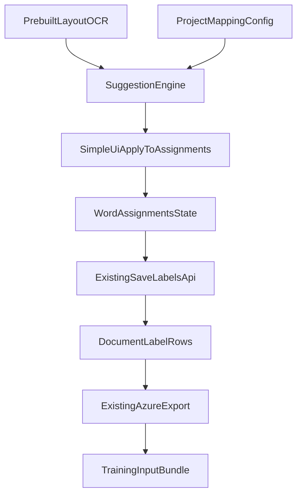

# Better Template Labelling - Implementation Plan

## Goal

Reduce manual first-document labeling effort by auto-generating field assignments from prebuilt-layout OCR output and applying them directly into the existing assignment model so labels appear as if the user selected them manually.

This plan keeps the UI interaction intentionally simple:

- Auto-load suggestions only on initial load when no labels exist.
- Provide two explicit actions: `Load suggestions` and `Reset`.
- Reuse current `wordAssignments` and `handleSave` flow.
- Do not add frontend tests for this feature phase.

## Outcome

Implement a semi-automated first-document labeling workflow that:

- Suggests labels from `keyValuePairs`, ordered `selectionMarks`, and `tables.cells`.
- Applies suggestions directly to assignment state so highlighting/interaction behaves exactly like manual clicks.
- Keeps persistence and training export contracts stable (`fields.json`, `*.ocr.json`, `*.labels.json`).
- Supports repeatability with explicit `Load suggestions` and `Reset` actions.

## Scope

### In scope

- Suggestion generation from:
  - `analyzeResult.keyValuePairs`
  - `analyzeResult.pages[].selectionMarks`
  - `analyzeResult.tables[].cells`
- Mapping configuration between field schema keys and OCR extraction rules.
- Initial-load auto-apply only when the document has no saved labels and no current assignments.
- Manual buttons:
  - `Load suggestions`: regenerate and apply suggestions to current assignments.
  - `Reset`: clear assignments and local label state.
- Save path remains unchanged (`POST /labels` with existing `LabelDto` shape).

### Out of scope

- Frontend tests (explicitly excluded for this implementation).
- New acceptance/rejection workflow states in UI.
- Changes to training endpoint contract.
- Multi-document propagation or active-learning loops in this iteration.

## Current State (Code Anchors)

- OCR data capture and storage:
  - `apps/backend-services/src/labeling/labeling-ocr.service.ts`
- Labeling document/project retrieval and label save APIs:
  - `apps/backend-services/src/labeling/labeling.controller.ts`
  - `apps/backend-services/src/labeling/labeling.service.ts`
- Label persistence (`replaceAll` behavior):
  - `apps/backend-services/src/database/database.service.ts`
- Training export generation (`fields.json` + `*.labels.json`) and packaging:
  - `apps/backend-services/src/labeling/labeling.service.ts`
  - `apps/backend-services/src/training/training.service.ts`
- Existing frontend assignment/canvas path:
  - `apps/frontend/src/features/annotation/labeling/pages/LabelingWorkspacePage.tsx`
  - `apps/frontend/src/features/annotation/labeling/hooks/useLabels.ts`
  - `apps/frontend/src/features/annotation/labeling/hooks/useProjects.ts`

## Proposed Architecture

Design principle: keep export/persistence stable while introducing a deterministic suggestion layer and project-level mapping.

## Current Flow (Baseline)

1. OCR result is stored in `labeling_document.ocr_result`.
2. UI renders clickable elements derived from:
   - words
   - selection marks
3. User manually assigns field -> click element.
4. Save serializes current `wordAssignments` into `LabelDto[]`.
5. Backend persists rows and export path uses those rows for `*.labels.json`.

## Proposed Flow (Simple UX)

1. User opens labeling workspace.
2. If no saved labels exist and no local assignments exist:
   - System runs suggestion engine once.
   - Suggestions are applied directly into `wordAssignments`.
   - UI highlights appear exactly like manual assignments.
3. User may:
   - edit assignments manually as today,
   - click `Load suggestions` to reapply suggestions,
   - click `Reset` to clear all assignments.
4. User clicks Save and existing payload/persistence/export flow runs unchanged.

## Data Model and Contracts

### 1) Project-level mapping configuration

- Add `suggestion_mapping` JSON field to `LabelingProject`.
- Prisma schema/migration files:
  - `apps/shared/prisma/schema.prisma`
  - `apps/shared/prisma/migrations/*`
- Suggested mapping schema:
  - `version: number`
  - `rules: SuggestionRule[]`
    - `fieldKey: string`
    - `sourceType: "keyValuePair" | "selectionMarkOrder" | "tableCellToWords"`
    - `keyAliases?: string[]`
    - `selectionOrder?: number`
    - `table?: { anchorText?: string; rowLabelAliases?: string[]; columnLabel?: string }`
    - `normalizers?: Array<"trim" | "currency" | "number" | "date" | "phone" | "sin">`
    - `confidenceThreshold?: number`

### 2) Suggestion API contracts

- New endpoint (required):
  - `POST /api/labeling/projects/:projectId/documents/:docId/suggestions`
- Optional endpoint (if not piggybacked on project update):
  - `PATCH /api/labeling/projects/:projectId/suggestion-mapping`

Proposed response item (backend to UI):

- `field_key`
- `label_name`
- `value`
- `page_number`
- `bounding_box` (polygon + optional span)
- `element_ids` (must only reference existing OCR UI elements from `pages[].words[]` or `pages[].selectionMarks[]`)
- `source_type`
- `confidence`
- `explanation`

### 3) How users define the mapping model

Mapping is project-level, user-editable configuration stored in `LabelingProject.suggestion_mapping`.

Authoring flow:

1. User opens project mapping settings (new UI section under labeling project settings).
2. User selects field from existing schema.
3. User picks source type:
   - `keyValuePair` for labeled text fields (name/phone/date/signature).
   - `selectionMarkOrder` for checkbox fields mapped by order.
   - `tableCellToWords` for table-derived values that must resolve to words on canvas.
4. User configures source-specific rule inputs:
   - KVP: `keyAliases`, optional `confidenceThreshold`, optional normalizers.
   - Selection order: `selectionOrder` (or use schema order by default).
   - Table: `anchorText`, `rowLabelAliases`, `columnLabel`, optional row/column fuzzy threshold.
5. User saves mapping; mapping is used by suggestion endpoint.

Default behavior when mapping is missing:

- KVP fields: use normalized `fieldKey` token heuristics as fallback aliases.
- Selection marks: use schema order for all `selectionMark` fields.
- Table fields: no auto assignment unless table mapping rule exists.

### 4) Save/export compatibility contract

- Save contract remains existing `LabelDto[]` payload.
- Training export remains existing:
  - `fields.json`
  - `{filename}.ocr.json`
  - `{filename}.labels.json`
- No training endpoint signature changes.

## How Table Data Becomes Highlightable on Existing Canvas

This is the key clarification requested.

Current canvas highlights only elements represented in `ocrWords`/`wordBoxes`.  
This must stay unchanged: users select only from `pages[].words[]` and `pages[].selectionMarks[]`.

Therefore, table-derived suggestions must be converted into assignments against existing word elements.

### Implementation approach

Keep element extraction unchanged:

- `type: "word"` from `pages[].words`
- `type: "selectionMark"` from `pages[].selectionMarks`

Table mapping pipeline in suggestion engine:

1. Find target table cell from `tables[].cells` using mapping rules.
2. Use cell polygon/page as a search window.
3. Find overlapping words from `pages[].words[]` on the same page (IoU/intersection threshold).
4. Return those matched word element ids as `element_ids` for the field.
5. Frontend applies `wordAssignments[wordId] = fieldKey` for each returned word id.

Result: highlights appear through the existing words/selectionMarks canvas path, identical to manual user selection.

Additional implementation detail:

- Build a polygon/spatial index for existing word elements (and selection marks where relevant) to support reliable table-cell-to-word matching.
- Use deterministic tie-breaks (higher overlap, then reading order by span offset).

## Backend Plan

## 1) Mapping model and contracts

- Add project-level suggestion mapping config to `LabelingProject` (JSON field).
- Define typed mapping DTOs:
  - KVP mapping: `fieldKey`, `keyAliases[]`, optional confidence threshold.
  - Selection mark mapping: ordered list by schema key.
  - Table mapping: `fieldKey`, table anchor/header hints, row label aliases, target column label, and word-overlap threshold for cell-to-word conversion.

## 2) Suggestion engine service

Add dedicated service under labeling module:

- `suggestFromKeyValuePairs(ocrResult, mapping, fieldSchema)`
- `suggestFromSelectionMarks(ocrResult, fieldSchema)`
- `suggestFromTables(ocrResult, mapping, fieldSchema)`
- `mergeSuggestions(...)` with deterministic precedence and conflict handling.

Output shape should minimally include:

- `fieldKey`
- `elementIds` (must map only to rendered word/selectionMark elements)
- `value`
- `pageNumber`
- `polygon`
- `sourceType`

## 3) API endpoint

Add endpoint:

- `POST /api/labeling/projects/:projectId/documents/:docId/suggestions`

Behavior:

- Reads document OCR + field schema + mapping config.
- Returns suggestion set mapped to UI element ids.

Optional (if needed in same iteration):

- endpoint to update mapping config at project level.

## Frontend Plan

## 1) Keep existing element extraction

In `LabelingWorkspacePage.tsx`:

- Keep current extraction model unchanged:
  - words from `pages[].words[]`
  - selection marks from `pages[].selectionMarks[]`
- Do not introduce new canvas element types for tables.

## 2) Suggestion load behavior (simple)

- On initial workspace load, auto-run suggestions only when:
  - saved labels are empty,
  - `wordAssignments` empty,
  - OCR data exists.
- Apply returned suggestions directly to `wordAssignments`.

No extra “pending suggestion” model is introduced.

## 3) Buttons

Add two buttons near existing save controls:

- `Load suggestions`
  - Calls suggestion endpoint.
  - Replaces current `wordAssignments` with suggested assignments.
- `Reset`
  - Clears `wordAssignments`.
  - Clears derived local `labelState` for unsaved assignments.

## 4) Save path remains unchanged

- Keep current `handleSave` and `saveLabelsAsync(payload)` pattern.
- Table-derived suggestions are already converted to word assignments before save.
- Saved payload remains generated from selected words/selection marks only.

## Suggestion Logic Details

## A) Key-value pairs

- Normalize OCR key text and alias text (casefold, trim, punctuation-stripped).
- Match with best-score strategy:
  - exact normalized match first,
  - fallback token overlap/fuzzy threshold.
- Select polygon from `value.boundingRegions` (fallback `key.boundingRegions`).
- Map polygon to element id:
  - primary: exact polygon match with element index,
  - fallback: highest IoU overlap on same page.

## B) Selection marks (ordered)

- Flatten marks in deterministic reading order:
  - page asc, then `span.offset` asc, else top-left geometry ordering.
- Filter schema field keys where type is `selectionMark`.
- Map by position: nth field -> nth mark.
- Convert mark polygon to matched element id (`p{page}-sm{index}`).

## C) Table cells

- Detect target table by header/anchor text configured in mapping.
- Resolve row by row label aliases.
- Resolve column by header label (e.g., Applicant/Spouse).
- Select intersecting data cell and map that cell to one or more overlapping `pages[].words[]` elements on the same page.
- Return only those word element ids so the UI can assign/highlight through existing word selection behavior.

## Deterministic Arbitration Rules

When more than one source can populate the same `field_key`, choose one candidate using strict precedence:

1. Explicit mapping rule with exact alias/header match.
2. Explicit mapping rule with fuzzy match above threshold.
3. Source priority:
   - text-like fields: `keyValuePairs` > `tableCellToWords`
   - numeric grid fields: `tableCellToWords` > `keyValuePairs`
   - checkbox fields: `selectionMarkOrder` only
4. Higher confidence score.
5. Lower span offset (stable final tie-break).

If no candidate meets threshold, do not auto-assign that field.

## File-Level Implementation Map

- Backend:
  - `apps/backend-services/src/labeling/labeling.service.ts`
  - `apps/backend-services/src/labeling/labeling.controller.ts`
  - `apps/backend-services/src/labeling/dto/*`
  - `apps/backend-services/src/database/database.service.ts` (if mapping persistence helpers needed)
  - `apps/shared/prisma/schema.prisma`
  - `apps/shared/prisma/migrations/*`

- Frontend:
  - `apps/frontend/src/features/annotation/labeling/pages/LabelingWorkspacePage.tsx`
  - `apps/frontend/src/features/annotation/labeling/hooks/useLabels.ts` (or new suggestions hook)
  - `apps/frontend/src/features/annotation/labeling/hooks/useProjects.ts` (if endpoint integration belongs here)
  - `apps/frontend/src/features/annotation/labeling/types.ts` (if shared type additions needed)

- Docs:
  - `docs/TEMPLATE_TRAINING.md` (update with simplified UX and table-cell highlighting note after implementation)

## Rollout Sequence

1. Add backend suggestion generation + endpoint.
2. Add frontend element unification (include table cells).
3. Add simple suggestion auto-load + `Load suggestions` + `Reset`.
4. Validate save/export output for:
   - string/date/signature fields via KVP,
   - checkbox fields via ordered marks,
   - table numeric fields via table-cell mapping.

## Testing Strategy

### Backend tests (required)

- Unit tests for suggestion matching:
  - key alias normalization and matching
  - type guards (date/number/string)
  - ordered `selectionMark` field assignment
  - table row/column resolution by headers/aliases
  - arbitration and tie-breaking
- Service/controller tests:
  - suggestion endpoint response shape
  - empty/partial OCR behavior
  - count mismatch handling for selection marks
- Export compatibility tests:
  - saved suggestion labels produce valid `*.labels.json`
  - selection mark values convert correctly to `:selected:`/`:unselected:`
  - table-cell-derived labels preserve page and polygon

### End-to-end verification (required)

- Use a golden OCR fixture (like the provided `ocr_output.json`) and assert:
  - expected fields are auto-assigned on initial load when no labels exist
  - `Load suggestions` rehydrates assignments deterministically
  - `Reset` clears assignments and visual highlights
  - saved payload still compatible with current label save path
  - training package includes expected labels output

### Frontend tests

- Not part of this implementation phase (intentionally skipped).

## Validation Checklist

- Initial load with empty labels auto-populates assignments.
- Highlighting for KVP and selection marks appears identical to manual assignment highlights.
- Table cell suggestions visibly highlight corresponding cell polygons on canvas.
- `Reset` clears visible assignments.
- `Load suggestions` reapplies expected assignments.
- Save persists labels without API contract changes.
- Export still produces correct `*.labels.json` and training pipeline accepts output.

## Risks and Mitigations

- Polygon mismatch between OCR entities and rendered elements:
  - maintain polygon index maps and IoU fallback matching.
- Table parsing variability:
  - require explicit mapping anchors/aliases per project.
- Misassignment confidence:
  - deterministic ranking, optional thresholds, and manual override via existing editing workflow.

## Observability and Quality Gates

- Add structured logs in suggestion engine:
  - source type, field key, match score, confidence, selected candidate reason.
- Add counters:
  - suggestions generated
  - suggestions applied
  - suggestions manually changed before save (if measurable)
- Add basic quality thresholds for rollout:
  - minimum auto-assignment coverage per document type
  - mismatch/error rate below agreed threshold in pilot.

## Rollout Plan

1. Add feature flag (project-level or env-level): `auto_suggestions_enabled`.
2. Enable for internal/test projects only.
3. Validate with representative forms and monitor logs/counters.
4. Expand to default-on for new template-training projects once stable.

## Milestones and Deliverables

- Milestone 1: schema + mapping persistence + DTOs.
- Milestone 2: backend suggestion engine + API.
- Milestone 3: frontend integration with simple UX (`initial auto-load`, `Load suggestions`, `Reset`).
- Milestone 4: backend/E2E validation + observability + rollout flag.
- Documentation updates after implementation:
  - `docs/TEMPLATE_TRAINING.md`
  - `feature-docs/002-better-template-labelling/README.md` (tracking/checklist)

