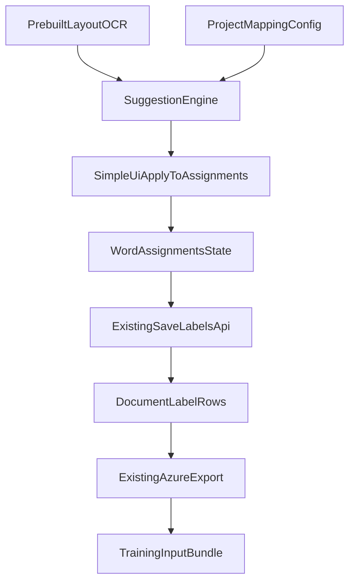

# Better Template Labelling - Implementation Plan

## Goal

Reduce manual first-document labeling effort by auto-generating field assignments from prebuilt-layout OCR output and applying them directly into the existing assignment model so labels appear as if the user selected them manually.

This plan keeps the UI interaction intentionally simple:

- Auto-load suggestions only on initial load when no labels exist.
- Provide two explicit actions: `Load suggestions` and `Reset`.
- Reuse current `wordAssignments` and `handleSave` flow.
- Do not add frontend tests for this feature phase.

## Outcome

Implement a semi-automated first-document labeling workflow that:

- Suggests labels from `keyValuePairs`, ordered `selectionMarks`, and `tables.cells`.
- Applies suggestions directly to assignment state so highlighting/interaction behaves exactly like manual clicks.
- Keeps persistence and training export contracts stable (`fields.json`, `*.ocr.json`, `*.labels.json`).
- Supports repeatability with explicit `Load suggestions` and `Reset` actions.

## Scope

### In scope

- Suggestion generation from:
  - `analyzeResult.keyValuePairs`
  - `analyzeResult.pages[].selectionMarks`
  - `analyzeResult.tables[].cells`
- Mapping configuration between field schema keys and OCR extraction rules.
- Initial-load auto-apply only when the document has no saved labels and no current assignments.
- Manual buttons:
  - `Load suggestions`: regenerate and apply suggestions to current assignments.
  - `Reset`: clear assignments and local label state.
- Save path remains unchanged (`POST /labels` with existing `LabelDto` shape).

### Out of scope

- Frontend tests (explicitly excluded for this implementation).
- New acceptance/rejection workflow states in UI.
- Changes to training endpoint contract.
- Multi-document propagation or active-learning loops in this iteration.

## Current State (Code Anchors)

- OCR data capture and storage:
  - `apps/backend-services/src/labeling/labeling-ocr.service.ts`
- Labeling document/project retrieval and label save APIs:
  - `apps/backend-services/src/labeling/labeling.controller.ts`
  - `apps/backend-services/src/labeling/labeling.service.ts`
- Label persistence (`replaceAll` behavior):
  - `apps/backend-services/src/database/database.service.ts`
- Training export generation (`fields.json` + `*.labels.json`) and packaging:
  - `apps/backend-services/src/labeling/labeling.service.ts`
  - `apps/backend-services/src/training/training.service.ts`
- Existing frontend assignment/canvas path:
  - `apps/frontend/src/features/annotation/labeling/pages/LabelingWorkspacePage.tsx`
  - `apps/frontend/src/features/annotation/labeling/hooks/useLabels.ts`
  - `apps/frontend/src/features/annotation/labeling/hooks/useProjects.ts`

## Proposed Architecture

Design principle: keep export/persistence stable while introducing a deterministic suggestion layer and project-level mapping.

## Current Flow (Baseline)

1. OCR result is stored in `labeling_document.ocr_result`.
2. UI renders clickable elements derived from:
   - words
   - selection marks
3. User manually assigns field -> click element.
4. Save serializes current `wordAssignments` into `LabelDto[]`.
5. Backend persists rows and export path uses those rows for `*.labels.json`.

## Proposed Flow (Simple UX)

1. User opens labeling workspace.
2. If no saved labels exist and no local assignments exist:
   - System runs suggestion engine once.
   - Suggestions are applied directly into `wordAssignments`.
   - UI highlights appear exactly like manual assignments.
3. User may:
   - edit assignments manually as today,
   - click `Load suggestions` to reapply suggestions,
   - click `Reset` to clear all assignments.
4. User clicks Save and existing payload/persistence/export flow runs unchanged.

## Data Model and Contracts

### 1) Project-level mapping configuration

**Note:** The suggestion system currently uses **default heuristics only** (no override configuration). The implementation is **brittle and tuned specifically for SDPR forms**. Making it more generic and robust is a **TODO**.

**TODO:** Standardize field matching to work across different form types without SDPR-specific tuning. Consider:
- More robust key-value pair matching (fuzzy matching, semantic similarity)
- Better table structure detection (handling merged cells, varying layouts)
- Generic field alias generation that works across form types
- Standard way of generating `fields.json` (currently done with VLM as beginner for SDPR case)

### 2) Suggestion API contracts

- Endpoint:
  - `POST /api/labeling/projects/:projectId/documents/:docId/suggestions`

Proposed response item (backend to UI):

- `field_key`
- `label_name`
- `value`
- `page_number`
- `bounding_box` (polygon + optional span)
- `element_ids` (must only reference existing OCR UI elements from `pages[].words[]` or `pages[].selectionMarks[]`)
- `source_type`
- `confidence`
- `explanation`

### 3) Default mapping behavior

The system uses **default heuristics only** (no user-configurable mapping). All matching is done automatically based on field keys and OCR structure:

- **KVP fields**: Uses normalized `fieldKey` token heuristics to generate aliases (e.g. `spouse_name` → `["spouse_name", "spouse name", "name", "spouse"]`). Special cases: `sin`/`spouse_sin` get "social insurance number" aliases; `phone`/`spouse_phone` get "telephone" alias.
- **Selection marks**: Uses schema `display_order` to map nth checkbox field → nth selection mark in document order.
- **Table fields**: Infers row label from field key (e.g. `applicant_workers_compensation` → row "workers compensation", column "Applicant").

### 4) Save/export compatibility contract

- Save contract remains existing `LabelDto[]` payload.
- Training export remains existing:
  - `fields.json`
  - `{filename}.ocr.json`
  - `{filename}.labels.json`
- No training endpoint signature changes.

## How Table Data Becomes Highlightable on Existing Canvas

This is the key clarification requested.

Current canvas highlights only elements represented in `ocrWords`/`wordBoxes`.  
This must stay unchanged: users select only from `pages[].words[]` and `pages[].selectionMarks[]`.

Therefore, table-derived suggestions must be converted into assignments against existing word elements.

### Implementation approach

Keep element extraction unchanged:

- `type: "word"` from `pages[].words`
- `type: "selectionMark"` from `pages[].selectionMarks`

Table mapping pipeline in suggestion engine:

1. Find target table cell from `tables[].cells` using mapping rules.
2. Use cell polygon/page as a search window.
3. Find overlapping words from `pages[].words[]` on the same page (IoU/intersection threshold).
4. Return those matched word element ids as `element_ids` for the field.
5. Frontend applies `wordAssignments[wordId] = fieldKey` for each returned word id.

Result: highlights appear through the existing words/selectionMarks canvas path, identical to manual user selection.

Additional implementation detail:

- Build a polygon/spatial index for existing word elements (and selection marks where relevant) to support reliable table-cell-to-word matching.
- Use deterministic tie-breaks (higher overlap, then reading order by span offset).

## Backend Plan

## 1) Mapping model and contracts

**Note:** The system uses default heuristics only. No project-level mapping configuration is stored or used.

- Default alias generation from field keys (see `buildFieldAliases()`).
- Selection mark mapping by schema `display_order`.
- Table mapping by inferring row/column from field key structure (see `parseTableFieldKey()`).

## 2) Suggestion engine service

Implemented in `apps/backend-services/src/labeling/suggestion.service.ts`:

- `suggestFromKeyValuePairs(ocrResult, fieldSchema, words, usedWordIds, mapping)` - always passes `null` for mapping (uses defaults)
- `suggestFromSelectionMarks(fieldSchema, marks, usedSelectionIds, mapping)` - always passes `null` for mapping (uses defaults)
- `suggestFromTables(fieldSchema, ocrResult, words, usedWordIds, mapping)` - always passes `null` for mapping (uses defaults)

Output shape (`LabelSuggestionDto`):

- `field_key`: Field key from schema
- `label_name`: Same as field_key
- `value`: Suggested text value
- `page_number`: Page number (1-indexed)
- `element_ids`: Array of word/selectionMark element IDs (e.g. `["p1-w0", "p1-w1"]`)
- `bounding_box`: Polygon + optional span
- `source_type`: `"keyValuePair" | "selectionMarkOrder" | "tableCellToWords"`
- `confidence`: Optional confidence score
- `explanation`: Human-readable explanation

## 3) API endpoint

Implemented endpoint:

- `POST /api/labeling/projects/:projectId/documents/:docId/suggestions`

Behavior:

- Reads document OCR + field schema.
- Uses default heuristics (no mapping config).
- Returns suggestion set mapped to UI element ids.

## Frontend Plan

## 1) Keep existing element extraction

In `LabelingWorkspacePage.tsx`:

- Keep current extraction model unchanged:
  - words from `pages[].words[]`
  - selection marks from `pages[].selectionMarks[]`
- Do not introduce new canvas element types for tables.

## 2) Suggestion load behavior (simple)

- On initial workspace load, auto-run suggestions only when:
  - saved labels are empty,
  - `wordAssignments` empty,
  - OCR data exists.
- Apply returned suggestions directly to `wordAssignments`.

No extra “pending suggestion” model is introduced.

## 3) Buttons

Add two buttons near existing save controls:

- `Load suggestions`
  - Calls suggestion endpoint.
  - Replaces current `wordAssignments` with suggested assignments.
- `Reset`
  - Clears `wordAssignments`.
  - Clears derived local `labelState` for unsaved assignments.

## 4) Save path remains unchanged

- Keep current `handleSave` and `saveLabelsAsync(payload)` pattern.
- Table-derived suggestions are already converted to word assignments before save.
- Saved payload remains generated from selected words/selection marks only.

## How the Suggestion System Works (Detailed)

This section documents the current implementation based on code and tests. **Note:** The implementation is **brittle and tuned for SDPR forms**. Making it more generic is a **TODO**.

### Overview

The suggestion engine (`SuggestionService`) generates field assignments from OCR data using three sources:
1. **Selection marks** (checkboxes) → mapped by order
2. **Key-value pairs** (labeled fields) → matched by key aliases
3. **Table cells** (numeric grid values) → matched by row/column headers

All suggestions are converted to **word/selectionMark element IDs** so they integrate with the existing canvas highlighting system.

### Step-by-Step Flow

1. **Extract elements** (`extractWordElements()`, `extractSelectionElements()`):
   - Words: `pages[].words[]` → `WordElement[]` with IDs `p{page}-w{index}`
   - Selection marks: `pages[].selectionMarks[]` → `SelectionElement[]` with IDs `p{page}-sm{index}`
   - Both include: `pageNumber`, `polygon`, `spanOffset`/`spanLength`, `content`/`state`

2. **Process selection marks** (`suggestFromSelectionMarks()`):
   - Filter schema to `FieldType.selectionMark` fields, sort by `display_order`
   - Sort selection marks by page, then `spanOffset` (reading order)
   - Map: nth field → nth mark (e.g. first checkbox field → first mark)
   - Output: `{ field_key, value: "selected"|"unselected", element_ids: [markId] }`
   - Mark selection mark IDs as "used"

3. **Process key-value pairs** (`suggestFromKeyValuePairs()`):
   - Iterate **keyValuePairs in document order** (OCR array order)
   - For each pair:
     - Find best matching **unassigned** field using `findBestFieldForPair()`
     - Score each field's aliases against OCR key using `scoreTextMatch()`
     - Choose field with highest score (tie-break: longer alias, then schema order)
     - If value has content and bounding region/spans:
       - Match words by span (if value has spans) or polygon (IoU)
       - Create suggestion with matched word IDs
     - Mark matched words as "used"
   - Output: `{ field_key, value, element_ids: [wordIds...], source_type: "keyValuePair" }`

4. **Process tables** (`suggestFromTables()`):
   - Filter schema to `FieldType.number` fields, sort by `display_order`
   - For each numeric field:
     - Infer row/column from field key (`parseTableFieldKey()`)
     - Find matching table using `findTableCellMatch()`:
       - Match column header (e.g. "Applicant") using `scoreTextMatch()` (threshold 0.4)
       - Match row header (e.g. "workers compensation") using `scoreTextMatch()` (threshold 0.4)
       - Get value cell at intersection
     - Match words in value cell region:
       - Use IoU > 0.05 OR containment ≥ 0.5 (for small words in large cells)
       - Filter out currency-only words (`$`, `€`, `£`, `¥`)
     - Output: `{ field_key, value, element_ids: [wordIds...], source_type: "tableCellToWords" }`
     - Mark matched words as "used"

5. **Sort and return**:
   - Sort all suggestions by `page_number`, then `span.offset` (reading order)
   - Return `LabelSuggestionDto[]`

### Key Algorithms

**Text normalization** (`normalizeText()`):
- Lowercase
- Remove apostrophes (`'`, `'`, `'` → removed) so "Worker's" → "workers"
- Replace non-alphanumeric with spaces
- Collapse whitespace
- Trim

**Text matching** (`scoreTextMatch(a, b)`):
- Exact match: 1.0
- Substring match (one contains the other): 0.8
- Token overlap (Jaccard): `intersection_tokens / union_tokens`
- Minimum threshold: 0.45 for key-value pairs, 0.4 for table headers

**Polygon overlap** (`computeIoU(polygonA, polygonB)`):
- Convert polygons to bounding rectangles
- Compute intersection area
- IoU = `intersection / (areaA + areaB - intersection)`

**Containment** (for table cells):
- Containment = `intersection_area / word_area`
- Used when IoU is low but word is fully inside cell (e.g. "$" in large cell)

**Field alias generation** (`buildFieldAliases(fieldKey)`):
- Base: `fieldKey`, `fieldKey.replace(/_/g, " ")`
- Multi-part: add without-prefix, without-suffix variants
- Special cases: `sin`/`spouse_sin` → add "social insurance number", etc.; `phone`/`spouse_phone` → add "telephone"

**Table field key parsing** (`parseTableFieldKey(fieldKey)`):
- Split by `_`: `applicant_workers_compensation` → `["applicant", "workers", "compensation"]`
- Column: first part, title-cased → `"Applicant"`
- Row: remaining parts joined → `"workers compensation"`

### Current Limitations and TODOs

**Brittleness:**
- Field matching relies on heuristics tuned for SDPR form structure
- Table matching assumes specific layout (row headers in column 0, column headers in row 0/1)
- Key-value pair matching may fail for forms with different label formats
- **TODO:** Make matching more robust and generic across form types

**Field schema generation:**
- Currently `fields.json` is generated manually or with VLM (vision language model) as a beginner for SDPR case
- **TODO:** Standardize and automate `fields.json` generation process

**No override configuration:**
- All matching uses default heuristics only
- No project-level or field-level configuration
- **TODO:** Consider adding configuration UI if needed for other form types

## Suggestion Logic Details

**Note:** The current implementation is **brittle and tuned for SDPR forms**. Making it more generic is a **TODO**.

### A) Key-value pairs

**Processing order:** Key-value pairs are processed in **document order** (as they appear in the OCR array). For each pair, the best matching **unassigned** field is chosen.

**Field alias generation** (`buildFieldAliases(fieldKey)`):
- Base aliases: `fieldKey`, `fieldKey.replace(/_/g, " ")` (e.g. `spouse_name` → `["spouse_name", "spouse name"]`)
- For multi-part keys (e.g. `spouse_name`):
  - Without prefix: `["name"]` (parts after first underscore)
  - Without suffix: `["spouse"]` (parts before last underscore)
- Special cases:
  - `sin` or `spouse_sin`: adds `["social insurance number", "sin number", "sin #"]`
  - `phone` or `spouse_phone`: adds `["telephone"]`

**Key matching** (`findBestFieldForPair()`):
- Normalize both OCR key and field aliases: lowercase, remove apostrophes (`'` → removed), strip non-alphanumeric to spaces, collapse whitespace.
- Score each alias against OCR key using `scoreTextMatch()`:
  - Exact match: 1.0
  - Substring match (one contains the other): 0.8
  - Token overlap (Jaccard): `intersection_tokens / union_tokens`
- Minimum score threshold: **0.45**
- Tie-break when multiple fields match the same pair:
  1. Higher score
  2. Longer matching alias (more specific)
  3. Lower `display_order` (earlier in schema)

**Value word matching:**
- **Only use value's bounding region** (never fall back to key region - prevents assigning key label as value).
- **Skip if value has no content** (e.g. empty spouse signature).
- **Span-based matching** (preferred): If value has `spans` (character offset/length), match words by span overlap (`matchWordsBySpan()`). This ensures multi-line values (e.g. "Explain changes") include all words, not just those overlapping the value polygon.
- **Polygon-based matching** (fallback): If no spans, use `matchWordsInRegion()` with IoU (intersection over union) threshold 0.05.

**Document order assignment:**
- First occurrence of a key pattern (e.g. "Date") → first matching field in schema (`date`)
- Second occurrence → second matching field (`spouse_date`)
- Same for repeated keys like "Social Insurance Number" → `sin`, then `spouse_sin`

### B) Selection marks (ordered)

**Processing order:** Selection marks are sorted by page number, then `span.offset` (reading order).

**Field matching:**
- Filter schema to only `FieldType.selectionMark` fields.
- Sort by `display_order`.
- Map nth field → nth selection mark (index-based).
- Optional: mapping can override with `selectionOrder` (not currently used - defaults only).

**Output:**
- `value`: `"selected"` or `"unselected"` based on OCR mark state.
- `element_ids`: `[`p{page}-sm{index}`]` (single selection mark ID).

### C) Table cells

**Field filtering:** Only processes `FieldType.number` fields (numeric table values).

**Row/column inference** (`parseTableFieldKey(fieldKey)`):
- Split field key by `_`: `applicant_workers_compensation` → `["applicant", "workers", "compensation"]`
- Column label: First part, title-cased → `"Applicant"` or `"Spouse"`
- Row label: Remaining parts joined → `"workers compensation"`

**Table matching** (`findTableCellMatch()`):
- Iterate all tables in OCR.
- **Column matching**: Find cell whose normalized content best matches the column label (e.g. "Applicant"). Uses `scoreTextMatch()` with threshold 0.4. Prefers longer matching text when scores tie.
- **Row matching**: Filter cells where `columnIndex === 0` (row headers). Score each row header against inferred row label aliases. Uses `scoreTextMatch()` with threshold 0.4. Text normalization removes apostrophes (e.g. "Worker's Compensation" → "workers compensation").
- **Value cell**: Find cell at `(matchedRow.rowIndex, matchedColumn.columnIndex)`.

**Word matching from table cells:**
- Get value cell's bounding region (polygon).
- Find words on the same page that overlap or are contained in the cell:
  - **IoU** (intersection over union) > 0.05, OR
  - **Containment** (intersection area / word area) ≥ 0.5 (for small words in large cells, e.g. "$ 0")
- **Currency filtering**: Exclude words that are only currency symbols (`$`, `€`, `£`, `¥`) so the value is just the number.
- Return matched word element IDs.

**Result:** Table cell values are converted to word assignments, so they highlight through the existing word canvas (no new element types).

## Deterministic Arbitration Rules

**Current implementation:** Sources are processed in fixed order (selection marks → key-value pairs → tables). Each source marks words/selection marks as "used" so later sources don't reuse them.

**Processing order:**
1. **Selection marks first** (`suggestFromSelectionMarks`)
2. **Key-value pairs second** (`suggestFromKeyValuePairs`)
3. **Tables last** (`suggestFromTables`)

**Within each source:**
- Selection marks: Processed by schema `display_order` (no conflicts).
- Key-value pairs: Processed in **document order**; each pair assigned to best unassigned field (prevents conflicts).
- Tables: Processed by schema `display_order`; words marked as used by previous sources are excluded.

**Final sorting:** All suggestions sorted by `page_number`, then `span.offset` (reading order).

**Note:** No explicit arbitration between sources for the same field - the first source that matches "wins" and marks elements as used.

## File-Level Implementation Map

- Backend:
  - `apps/backend-services/src/labeling/labeling.service.ts`
  - `apps/backend-services/src/labeling/labeling.controller.ts`
  - `apps/backend-services/src/labeling/dto/*`
  - `apps/backend-services/src/database/database.service.ts` (if mapping persistence helpers needed)
  - `apps/shared/prisma/schema.prisma`
  - `apps/shared/prisma/migrations/*`

- Frontend:
  - `apps/frontend/src/features/annotation/labeling/pages/LabelingWorkspacePage.tsx`
  - `apps/frontend/src/features/annotation/labeling/hooks/useLabels.ts` (or new suggestions hook)
  - `apps/frontend/src/features/annotation/labeling/hooks/useProjects.ts` (if endpoint integration belongs here)
  - `apps/frontend/src/features/annotation/labeling/types.ts` (if shared type additions needed)

- Docs:
  - `docs/TEMPLATE_TRAINING.md` (update with simplified UX and table-cell highlighting note after implementation)

## Rollout Sequence

1. Add backend suggestion generation + endpoint.
2. Add frontend element unification (include table cells).
3. Add simple suggestion auto-load + `Load suggestions` + `Reset`.
4. Validate save/export output for:
   - string/date/signature fields via KVP,
   - checkbox fields via ordered marks,
   - table numeric fields via table-cell mapping.

## Testing Strategy

### Backend tests (required)

- Unit tests for suggestion matching:
  - key alias normalization and matching
  - type guards (date/number/string)
  - ordered `selectionMark` field assignment
  - table row/column resolution by headers/aliases
  - arbitration and tie-breaking
- Service/controller tests:
  - suggestion endpoint response shape
  - empty/partial OCR behavior
  - count mismatch handling for selection marks
- Export compatibility tests:
  - saved suggestion labels produce valid `*.labels.json`
  - selection mark values convert correctly to `:selected:`/`:unselected:`
  - table-cell-derived labels preserve page and polygon

### End-to-end verification (required)

- Use a golden OCR fixture (like the provided `ocr_output.json`) and assert:
  - expected fields are auto-assigned on initial load when no labels exist
  - `Load suggestions` rehydrates assignments deterministically
  - `Reset` clears assignments and visual highlights
  - saved payload still compatible with current label save path
  - training package includes expected labels output

### Frontend tests

- Not part of this implementation phase (intentionally skipped).

## Validation Checklist

- Initial load with empty labels auto-populates assignments.
- Highlighting for KVP and selection marks appears identical to manual assignment highlights.
- Table cell suggestions visibly highlight corresponding cell polygons on canvas.
- `Reset` clears visible assignments.
- `Load suggestions` reapplies expected assignments.
- Save persists labels without API contract changes.
- Export still produces correct `*.labels.json` and training pipeline accepts output.

## Risks and Mitigations

- **Brittleness**: Current implementation is tuned for SDPR forms and may not work well for other form types. Field matching relies on heuristics that assume specific label formats and table structures.
  - **Mitigation**: Manual override via existing editing workflow. Users can correct suggestions before saving.
  - **TODO**: Make matching more generic and robust.
- Polygon mismatch between OCR entities and rendered elements:
  - Maintain polygon index maps and IoU fallback matching. Use span-based matching when available (more reliable).
- Table parsing variability:
  - Current implementation infers row/column from field keys. May fail for tables with non-standard layouts.
  - **Mitigation**: Containment-based word matching helps with small values in large cells.
- Misassignment confidence:
  - Deterministic ranking, thresholds (0.45 for KVP, 0.4 for tables), and manual override via existing editing workflow.
- Field schema generation:
  - Currently `fields.json` is generated manually or with VLM for SDPR case.
  - **TODO**: Standardize and automate `fields.json` generation process.

## Observability and Quality Gates

**Implemented logging** (debug level):
- `[suggestFromTables]`: Table count, word count, per-field matching results
- `[findTableCellMatch]`: Table iteration, column/row matching scores, match results
- `[matchWordsInRegion]`: Containment matching details (overlaps, containments)
- Set `LOG_LEVEL=debug` to see detailed suggestion matching logs

**Quality gates:**
- Backend unit tests cover all three suggestion sources
- End-to-end validation with golden OCR fixtures
- Manual override workflow allows users to correct suggestions

## Rollout Plan

**Current status:** Implemented and in use. Uses default heuristics only (no configuration UI).

**Future improvements:**
1. Make field matching more generic (less SDPR-specific)
2. Standardize `fields.json` generation process
3. Consider adding configuration UI if needed for other form types

## Milestones and Deliverables

- Milestone 1: schema + mapping persistence + DTOs.
- Milestone 2: backend suggestion engine + API.
- Milestone 3: frontend integration with simple UX (`initial auto-load`, `Load suggestions`, `Reset`).
- Milestone 4: backend/E2E validation + observability + rollout flag.
- Documentation updates after implementation:
  - `docs/TEMPLATE_TRAINING.md`
  - `feature-docs/002-better-template-labelling/README.md` (tracking/checklist)

