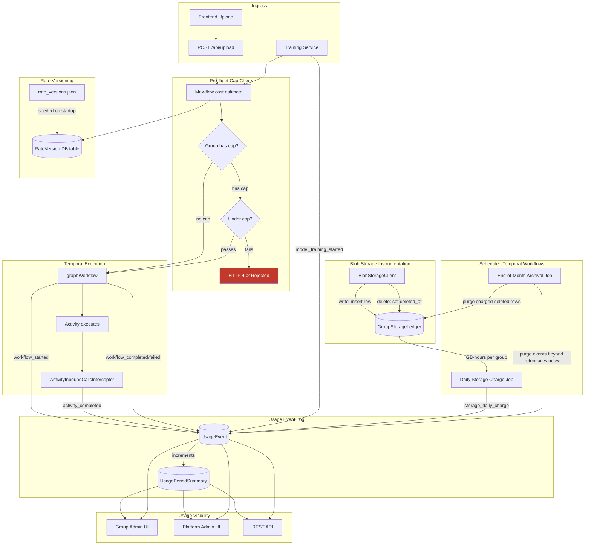

# Usage Metering & Billing — Architecture Diagram

```mermaid
flowchart TD
    subgraph Ingress
        FE[Frontend Upload]
        API[POST /api/upload]
        TR[Training Service]
    end

    subgraph PreFlight[Pre-flight Cap Check]
        EST[Max-flow cost estimate]
        CAP{Group has cap?}
        CHK{Under cap?}
        REJ[HTTP 402 Rejected]
    end

    subgraph TemporalExec[Temporal Execution]
        WF[graphWorkflow]
        ACT[Activity executes]
        INT[ActivityInboundCallsInterceptor]
    end

    subgraph RateVersioning[Rate Versioning]
        JSON[rate_versions.json]
        RV[(RateVersion DB table)]
    end

    subgraph Events[Usage Event Log]
        UE[(UsageEvent)]
        UPS[(UsagePeriodSummary)]
    end

    subgraph BlobTracking[Blob Storage Instrumentation]
        BC[BlobStorageClient]
        GL[(GroupStorageLedger)]
    end

    subgraph Scheduled[Scheduled Temporal Workflows]
        DAILY[Daily Storage Charge Job]
        ARCH[End-of-Month Archival Job]
    end

    subgraph ReadLayer[Usage Visibility]
        GA[Group Admin UI]
        PA[Platform Admin UI]
        RA[REST API]
    end

    FE --> API
    API --> EST
    TR --> EST
    JSON -- seeded on startup --> RV
    EST --> RV
    EST --> CAP
    CAP -- no cap --> WF
    CAP -- has cap --> CHK
    CHK -- passes --> WF
    CHK -- fails --> REJ

    WF -- workflow_started --> UE
    WF --> ACT
    ACT --> INT
    INT -- activity_completed --> UE
    WF -- workflow_completed/failed --> UE
    TR -- model_training_started --> UE

    UE -- increments --> UPS

    BC -- write: insert row --> GL
    BC -- delete: set deleted_at --> GL

    GL -- GB-hours per group --> DAILY
    DAILY -- storage_daily_charge --> UE

    ARCH -- purge charged deleted rows --> GL
    ARCH -- purge events beyond retention window --> UE

    UPS --> GA
    UPS --> PA
    UPS --> RA
    UE --> GA
    UE --> PA
    UE --> RA

    style REJ fill:#c0392b,color:#fff
```
