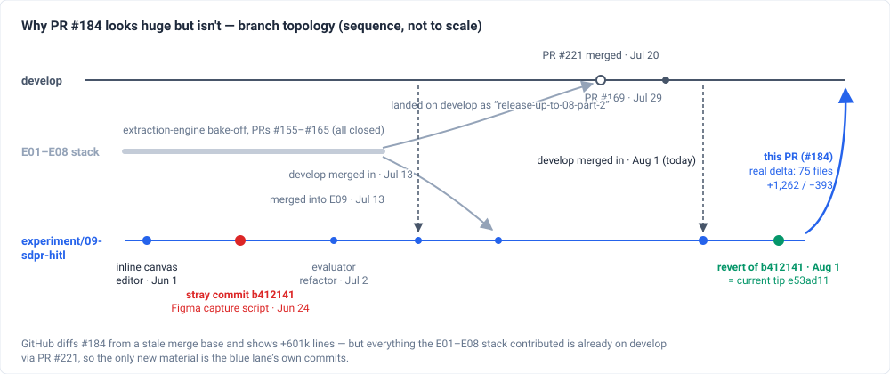
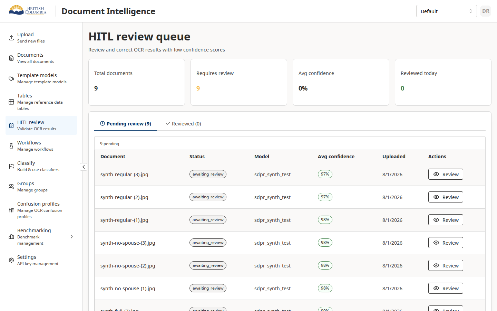
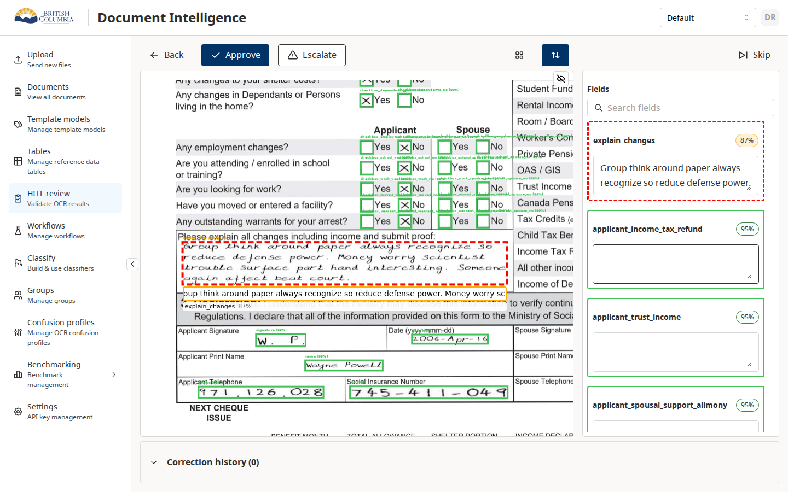

# Review: PR #184 — SDPR HITL inline editor

**PR:** [bcgov/ai-adoption-document-intelligence#184](https://github.com/bcgov/ai-adoption-document-intelligence/pull/184) · branch [`experiment/09-sdpr-hitl-committed`](https://github.com/bcgov/ai-adoption-document-intelligence/tree/experiment/09-sdpr-hitl-committed) → `develop` · draft
**Reviewed:** 2026-08-01, final tip [`a6c0110`](https://github.com/bcgov/ai-adoption-document-intelligence/commit/a6c01105) (after all fixes described below were pushed)

## The ask

**Can this leave draft and merge? One gate left, and it isn't yours.**

| Gate | Who | Status |
|---|---|---|
| 1. Product decision — persist OCR before the gate? | ~~You~~ | **Resolved 2026-08-01**: you chose persist-before-gate; shipped as [`27757f7`](https://github.com/bcgov/ai-adoption-document-intelligence/commit/27757f7c) (a `persistOcr` node in all six gated seeded templates). [→ background](#gate-1-the-decision-only-you-can-make) |
| 2. Broken tests on develop | Dylan | Open — [PR #239](https://github.com/bcgov/ai-adoption-document-intelligence/pull/239) fixes 5 suites that fail on develop itself (not caused by #184). After it merges: re-merge develop here, Temporal QA goes green, undraft. [→ details](#ci-on-todays-tip) |

Also resolved: the unused deployment plumbing was **stripped** ([`1086f3e`](https://github.com/bcgov/ai-adoption-document-intelligence/commit/1086f3e3)), and docs shipped ([`a6c0110`](https://github.com/bcgov/ai-adoption-document-intelligence/commit/a6c01105)); the PR title/body were rewritten to match the real payload.

Already handled (details in [What was pushed](#what-was-pushed-to-the-branch-today)): the branch was 19 commits behind develop — caught up; a stray commit that injected a third-party Figma script into the app was found and reverted; and three commits stranded on the local-only branch since July 13 were rescued and pushed — the OCR **box-scale fix** (without it every overlay box renders 2× off), the **reviewer demo seed**, and a Reviewed-queue fix.

**To see the feature working:** `npm run demo:reset` (⚠ resets the local DB), then open the review queue — 9 seeded HR0081 monthly-report documents with real captured Azure OCR. [→ details](#seeing-it-work)

What's left: [→ Remaining work](#remaining-work).

## What this PR is

The platform routes low-confidence OCR extractions to a human reviewer — the HITL subsystem ([wiki: Human-In-The-Loop](../../docs-md/wiki/hitl.md), architecture in [HITL_ARCHITECTURE.md](../../docs-md/architecture/HITL_ARCHITECTURE.md)). Until now the reviewer edited field values in a side panel, disconnected from the document image.

This PR puts the editing **on the image**: each extracted field gets an input box anchored to its bounding box on the scanned form, colored by OCR confidence, keyboard-navigable (Tab between fields, F2 to peek under the overlay). It was built for the SDPR income-assistance pilot during extraction experiment E09, which is why its git history is tangled with the E01–E08 OCR-engine bake-off ([wiki: Extraction](../../docs-md/wiki/extraction.md), [experiment report](../../docs-md/EXTRACTION_EXPERIMENTS.md)) — the tangle is historical only, as the next section shows.

## Why the PR page shows +601,000 lines



GitHub had picked a stale merge base; the 2026-08-01 catch-up merge reset it, and [the PR's Files tab](https://github.com/bcgov/ai-adoption-document-intelligence/pull/184/files) now shows the true diff. After the 2026-08-01 merge-artifact cleanup (see §4) the delta is **56 files, purely HITL** — editor frontend, demo fixtures (the bulk of the insertions), gated-template fix, and HITL docs.

## Seeing it work

The PR now carries its own reviewer demo (commit [`7846d78`](https://github.com/bcgov/ai-adoption-document-intelligence/commit/7846d78e), docs in [HITL_DEMO_RESET.md](https://github.com/bcgov/ai-adoption-document-intelligence/blob/experiment/09-sdpr-hitl-committed/docs-md/extraction/HITL_DEMO_RESET.md)):

```bash
npm run demo:reset   # ⚠ prisma migrate reset (wipes the local DB) + reseed + load 9 demo docs
```

Then open the review queue: 9 synthetic HR0081 monthly-report documents (`synth-full` / `synth-no-spouse` / `synth-regular` × 3) land as `awaiting_review` **with their OCR results written directly to the DB** — captured once from real Azure Document Intelligence and stored as fixtures in [`data/hitl-demo/`](https://github.com/bcgov/ai-adoption-document-intelligence/tree/experiment/09-sdpr-hitl-committed/data/hitl-demo) (~5 MB), so no Azure credentials or paid OCR calls are needed. The seeder is blob-provider-aware (MinIO compose default or Azure) and idempotent. Because it writes `ocr_results` itself, the demo works independently of the persist-before-gate template fix (which is now also on the branch).

Verified live 2026-08-01 (local stack, seeded queue):





## Complete file inventory — all 57 changed paths

Every path this PR touches relative to develop (counts updated 2026-08-01 late: +2 committed screenshots, −1 near-duplicate CSS file removed after the stray-commit audit), with insertions/deletions and origin commit. Nothing outside this list changes. (Rule added after this review initially summarized "reviewable groups" and left ~30 merge-artifact files undescribed — a gap Alex had to find himself; inventories are now mandatory.)

```
apps/backend-services/src/hitl/
  hitl.service.ts                     +15 −1   Reviewed-queue statuses include `complete` (d0117bc)
  hitl.service.spec.ts                +27 −1   spec for the above
apps/frontend/src/
  App.css                             +21 −16  workspace routes: one-viewport layout, pinned field-list scroller (55b6340)
  layouts/RootLayout.tsx              +3 −8    drop footer from workspace routes (55b6340)
  (bcds-mantine-fallbacks.css was +15 here until the UX reviewer audit: the lines
   were rebased copies of his table-hover CSS, already on develop via his own
   PR — removed in 9aec4bc6; the file is now identical to develop)
  features/annotation/
    core/canvas/AnnotationCanvas.tsx  +158 −27 renderActiveBoxOverlay slot, confidence-tier box colors, hideBoxes (3840c77)
    core/field-panel/FieldListScrollArea.tsx
                                      +19 −12  absolute-pinned scroll viewport (pairs with App.css) (55b6340)
    hitl/components/CanvasFieldOverlay.tsx
                                      +219 A   NEW — the inline canvas editor input (3840c77 + fa6276d/2d0b75d)
    hitl/components/ConfidenceIndicator.tsx
                                      +24 −0   add getConfidenceBorderColor / getConfidenceCanvasColor (CSS-var vs
                                               hex — Konva canvas can't resolve CSS variables) (3840c77)
    hitl/components/ReviewToolbar.tsx +11 −0   hide/show-overlay toggle button (3840c77)
    hitl/components/SnippetView.tsx   +19 −9   confidence-tier colors in snippet view (3840c77)
    hitl/hooks/useFieldFocus.ts       +111 −3  smart auto-zoom: pan/zoom target sized from box + overlay font math (3840c77)
    hitl/pages/ReviewWorkspacePage.tsx +208 −68 overlay wiring, F2/Escape/Tab shortcuts, coordScale fix,
                                               Tab-skips-boxless-fields fix (3840c77, 55b6340, 5bd64b7)
    hitl/text-measure.ts              +23 A    NEW — shared canvas text measurement (2d0b75d)
biome.json                            +13 −0   lint override for scripts/*.mjs (allow console, no secrets-scan
                                               false-positives on fixture ids) (7846d78)
data/hitl-demo/                       27 files A (9 docs × meta.json + ocr.json + normalized.pdf)
  synth-full-{1,2,3}/                 ~4,990-line ocr.json each — captured real Azure DI output (7846d78)
  synth-no-spouse-{1,2,3}/            ~4,360-line ocr.json each
  synth-regular-{1,2,3}/              ~4,200-line ocr.json each
docs-md/
  README.md                           +1 −1    extraction/ row mentions HITL demo reset (a6c0110)
  architecture/HITL_ARCHITECTURE.md   +12 −1   queue-entry ordering, canvas-editor components, stale
                                               queue-status diagram fixed (a6c0110)
  extraction/HITL_DEMO_RESET.md       +105 A   NEW — demo capture/seed/reset runbook (7846d78, relocated a6c0110;
                                               later: db:seed-layering rationale + screenshots)
  extraction/images/hitl-demo-{queue,workspace}.png
                                      2 A      committed screenshots — runbook illustrations + PR-body embeds (5e36710)
  wiki/hitl.md                        +5 −1    routing notes + canonical source, updated date (a6c0110)
  wiki/log.md                         +6 −0    ingest entry (a6c0110)
  workflows/templates/                6 files  persistOcr node before reviewSwitch (27757f7); sdpr variant +29
                                               (expanded formatting), others +15 −2 each
package.json                          +3 −0    capture:hitl-demo / seed:hitl-demo / demo:reset (7846d78)
scripts/
  capture-hitl-demo.mjs               +176 A   NEW — export awaiting_review docs → fixtures (7846d78)
  seed-hitl-demo.mjs                  +263 A   NEW — rebuild demo docs from fixtures, blob-provider-aware (7846d78)
```

Reading guide: the PR is ~42k inserted lines, but ~39k of those are the nine `ocr.json` fixtures (mechanical captures). Hand-written code is roughly 1,300 lines across the frontend editor, the two demo scripts, and the backend/template fixes.

## What actually merges

### 1. The inline editor (frontend, the point of the PR) — merge as-is? **Yes**

New file [`CanvasFieldOverlay.tsx`](https://github.com/bcgov/ai-adoption-document-intelligence/blob/experiment/09-sdpr-hitl-committed/apps/frontend/src/features/annotation/hitl/components/CanvasFieldOverlay.tsx) (219 lines) plus wiring edits in [`AnnotationCanvas.tsx`](https://github.com/bcgov/ai-adoption-document-intelligence/blob/experiment/09-sdpr-hitl-committed/apps/frontend/src/features/annotation/core/canvas/AnnotationCanvas.tsx), [`ReviewWorkspacePage.tsx`](https://github.com/bcgov/ai-adoption-document-intelligence/blob/experiment/09-sdpr-hitl-committed/apps/frontend/src/features/annotation/hitl/pages/ReviewWorkspacePage.tsx), [`useFieldFocus.ts`](https://github.com/bcgov/ai-adoption-document-intelligence/blob/experiment/09-sdpr-hitl-committed/apps/frontend/src/features/annotation/hitl/hooks/useFieldFocus.ts). The core idea, from the component's own doc:

```tsx
/**
 * Inline edit widget anchored under a field's bounding box in the document
 * view. The input is exactly the bounding box's width. Font size scales up
 * (no letter-spacing tricks) so the natural rendered text matches the box
 * width — first and last characters land near the box's left/right edges.
 * ...
 * Hovering fades the overlay to 0 opacity (with 80ms transition) so the
 * reviewer can see the underlying source region.
 */
export const CanvasFieldOverlay: FC<CanvasFieldOverlayProps> = ({
```

This suite went through interactive review sessions in July: Tab-focus loss ([`fa6276d`](https://github.com/bcgov/ai-adoption-document-intelligence/commit/fa6276d9b)), text-measure duplication and rotated-page handling ([`2d0b75d`](https://github.com/bcgov/ai-adoption-document-intelligence/commit/2d0b75d2f)), and the 2×-offset box-placement bug ([`55b6340`](https://github.com/bcgov/ai-adoption-document-intelligence/commit/55b6340b) — stranded on the local branch until 2026-08-01; the first review pass wrongly reported it as already pushed). No open issues remain against it.

### 2. Deployment-picker endpoint (backend) — **STRIPPED** ([`1086f3e`](https://github.com/bcgov/ai-adoption-document-intelligence/commit/1086f3e3), 2026-08-01)

New [`azure-openai.controller.ts`](https://github.com/bcgov/ai-adoption-document-intelligence/blob/experiment/09-sdpr-hitl-committed/apps/backend-services/src/azure/azure-openai.controller.ts) + DTO + unit spec. One GET endpoint listing which Azure OpenAI deployments a workflow node may select — an env-driven allow-list, no Azure call, no data access:

```ts
@Get("deployments")
@Identity({ allowApiKey: true })
async getDeployments(): Promise<AzureOpenAiDeploymentsResponseDto> {
  const list = this.configService.get<string>("AZURE_OPENAI_DEPLOYMENTS");
  // comma-separated allow-list; falls back to the single AZURE_OPENAI_DEPLOYMENT
```

Auth guard present, Swagger decorators complete per repo convention, spec covers the fallback chain.

**Provenance and status:** this is not HITL work — it rode in with [`97e4942`](https://github.com/bcgov/ai-adoption-document-intelligence/commit/97e49426a) "per-node Azure OpenAI deployment selection" from the experiment-stack foundation (the intent: a workflow-editor dropdown for choosing which model runs a node). **No frontend, script, or backend code on this branch calls the endpoint.** The repo's own rule is no unused plumbing "for future use", so the clean options are: strip it from this PR (it belongs with the workflow-builder deployment-picker when that UI exists), or keep it knowingly as the endpoint that work will target.

### 3. Per-node model override (temporal) — **STRIPPED** (same commit as #2)

[`enrich-results.ts`](https://github.com/bcgov/ai-adoption-document-intelligence/blob/experiment/09-sdpr-hitl-committed/apps/temporal/src/activities/enrich-results.ts) gains one optional parameter so a workflow node can pin which deployment does LLM enrichment (this is what the endpoint above feeds). The entire behavioral change:

```diff
- const deployment = process.env.AZURE_OPENAI_DEPLOYMENT;
+ const deployment =
+   params.azureOpenAiDeployment ?? process.env.AZURE_OPENAI_DEPLOYMENT;
```

Unset means exactly the old behavior. Covered by a new [`enrich-results.test.ts`](https://github.com/bcgov/ai-adoption-document-intelligence/blob/experiment/09-sdpr-hitl-committed/apps/temporal/src/activities/enrich-results.test.ts).

**Provenance and status:** same origin as #2 (commit [`97e4942`](https://github.com/bcgov/ai-adoption-document-intelligence/commit/97e49426a)); the VLM providers already on develop use this exact per-node-deployment pattern via workflow ctx, but **no template currently passes `azureOpenAiDeployment` to the enrichment node** — like #2, it's plumbing whose consumer hasn't landed. Strip or keep together with #2.

### 4. Experiment-folder churn — **REMOVED as merge artifacts** ([`19af0131`](https://github.com/bcgov/ai-adoption-document-intelligence/commit/19af0131), 2026-08-01)

The diff originally showed `apps/temporal/scripts/` moving into `src/scripts/`, a `briefs/` rename, and ~40 doc-link edits. Alex flagged them; investigation proved they were **reversions, not contributions**: PR #221 fully contained the stack's release polish (commits `e4036113`, `634a0b0b` went the *opposite* direction), and the Jul 13 merge of `08-part-2` into this branch — likely via rerere trained during the June rebase — resolved those files back to the stale pre-polish layout. Merging would have silently reverted develop. Develop's side was restored wholesale (~80 paths, plus the silently-dropped `local-datasets-seeding.md` in [`b6621a28`](https://github.com/bcgov/ai-adoption-document-intelligence/commit/b6621a28)).

## The stray commit (found and reverted)

You suspected a commit that didn't belong. Confirmed: [`b412141`](https://github.com/bcgov/ai-adoption-document-intelligence/commit/b41214108) "Update frontend components and styles" (a UX designer, Jun 24) existed only on this branch, and its entire content was:

```diff
     <title>AI OCR Frontend</title>
+    <script
+      src="https://mcp.figma.com/mcp/html-to-design/capture.js"
+      async
+    ></script>
```

A third-party script loaded into every page of the app — an artifact of a Figma "html-to-design" capture session, likely committed by accident while a UX designer was testing the workflow designer. Reverted in [`e53ad11`](https://github.com/bcgov/ai-adoption-document-intelligence/commit/e53ad117); `index.html` is now byte-identical to develop.

## CI on today's tip

| Check | Result | Reading |
|---|---|---|
| Frontend / Backend QA, lint, Dockerfiles, dependency review | ✅ pass | — |
| CodeQL | ✅ pass | An earlier "3 high / 10 medium" report was an artifact of the stale +601k diff; it cleared once the branch was caught up |
| [Temporal QA](https://github.com/bcgov/ai-adoption-document-intelligence/actions/runs/30725990940/job/91437685744) | ❌ 89 failures in 5 suites | **Pre-existing on develop** — develop's own last two Temporal QA runs fail the same way. The docs reorg renamed `docs-md/graph-workflows/` → `docs-md/workflows/` and the five `experiment-0X` test suites still read templates from the old path (every failure is that one `ENOENT`). The other 87 suites — 1,147 tests — pass. [PR #239](https://github.com/bcgov/ai-adoption-document-intelligence/pull/239) fixes the paths; duplicating the fix here would just create a conflict with it. |

## Gate 1: the decision only you can make

Every seeded OCR workflow saves results to the database **after** the human gate ([`mistral-standard-ocr-workflow.json`](https://github.com/bcgov/ai-adoption-document-intelligence/blob/develop/docs-md/workflows/templates/mistral-standard-ocr-workflow.json), same shape in all seeded templates):

```
checkConfidence → reviewSwitch → humanReview → storeResults
                              ↘ storeResults        (high-confidence path)
```

But the review queue ([`HitlService.getQueue`](../../apps/backend-services/src/hitl/hitl.service.ts)) only lists documents that already **have** a stored OCR result. Net effect: documents awaiting review never appear in the queue, so the editor this PR ships is unreachable in a stock deployment. The July demo worked because the seeded workflow was rewired locally (persist before the gate) — that rewire was never committed.

**History (established 2026-08-01, from git + the work store):** this is not a regression — the two designs were never compatible. `getQueue` has required a stored `ocr_result` since HITL's first PR ([#25](https://github.com/bcgov/ai-adoption-document-intelligence/pull/25), Feb 11): the original model was *post-hoc* review — OCR completes and persists, then low-confidence documents surface in the queue. The graph template put `humanReview` before `storeResults` in its **very first version** ([#32](https://github.com/bcgov/ai-adoption-document-intelligence/pull/32), Feb 12) and the order has never changed since. Every occasion the queue "worked" satisfied the ocr-result requirement another way: the original post-hoc flow, the benchmark ground-truth review screens (read benchmark data, not the queue), the May 29 timing experiment (its harness — `seed-documents.ts` + `experiment-ocr-loader.service.ts`, archived at [`archive/sdpr-hitl-harness`](https://github.com/bcgov/ai-adoption-document-intelligence/tree/archive/sdpr-hitl-harness) — loaded documents and OCR results straight into the DB, bypassing the workflow), and the July demo (local rewire, never committed).

**Decision:** should committed templates store OCR results before the human gate (making review queues work out of the box), or should `getQueue`/`humanGate` learn to surface pre-persistence state? This predates #184 — but merging a review UI that stock gated workflows can't reach is worth a deliberate call. Related reading: [wiki: Graph workflows](../../docs-md/wiki/graph-workflows.md) on pause/resume routing.

## What was pushed to the branch today

1. [`445a489`](https://github.com/bcgov/ai-adoption-document-intelligence/commit/445a4896) — merge of develop (was 19 commits behind, including [#169](https://github.com/bcgov/ai-adoption-document-intelligence/pull/169) zero-recovery and [#221](https://github.com/bcgov/ai-adoption-document-intelligence/pull/221)). One conflict, `apps/temporal/package.json`: the branch side was a whitespace reformat that also carried a duplicate `setupFilesAfterEnv` JSON key (last-key-wins had silently disabled `jest.setup.ts`). Resolved to develop's file plus the branch's one real change (dropping the `type-check:scripts` step, consistent with the scripts move).
2. [`e53ad11`](https://github.com/bcgov/ai-adoption-document-intelligence/commit/e53ad117) — revert of the stray Figma-script commit.

Second push (same day, later session) — three commits authored 2026-07-13 that existed only on the local machine's branch:

3. [`55b6340`](https://github.com/bcgov/ai-adoption-document-intelligence/commit/55b6340b) — OCR box-scale fix (`coordScale` fallback `144` → `RENDER_SCALE·72`) + review-page layout fixes.
4. [`7846d78`](https://github.com/bcgov/ai-adoption-document-intelligence/commit/7846d78e) — the demo capture/seed/reset mechanism and 9 HR0081 fixtures ([Seeing it work](#seeing-it-work)).
5. [`d0117bc`](https://github.com/bcgov/ai-adoption-document-intelligence/commit/d0117bcb) — approved documents appear in the Reviewed queue.

The local branch's remaining unpushed commit is `c3090c3a` "EXPERIMENT (DO NOT MERGE): env-gated HITL field filter" — deliberately excluded.

Third push (after the strip/fix decisions):

6. [`1086f3e`](https://github.com/bcgov/ai-adoption-document-intelligence/commit/1086f3e3) — strip the consumer-less deployment endpoint + enrich-results override back to develop's state.
7. [`27757f7`](https://github.com/bcgov/ai-adoption-document-intelligence/commit/27757f7c) — `persistOcr` node before `reviewSwitch` in the six gated seeded templates (+104/−11, formatting preserved).
8. [`a6c0110`](https://github.com/bcgov/ai-adoption-document-intelligence/commit/a6c01105) — docs: HITL architecture (queue-entry ordering, canvas editor, stale queue-status diagram fixed), demo runbook relocated to `extraction/HITL_DEMO_RESET.md`, wiki `hitl.md` refresh + ingest log.

## Remaining work

- [ ] **(Dylan)** [#239](https://github.com/bcgov/ai-adoption-document-intelligence/pull/239) merges.
- [ ] **(agent)** Merge develop into this branch again (expect `apps/temporal/package.json` to conflict — #239 touches it too); confirm Temporal QA green.
- [ ] **(you, optional)** `npm run demo:reset` locally to eyeball the queue — ⚠ wipes the local dev DB.
- [ ] **(you)** Undraft, request review.

Done 2026-08-01: ~~persist-before-gate fix~~ ([`27757f7`](https://github.com/bcgov/ai-adoption-document-intelligence/commit/27757f7c)) · ~~strip unused plumbing~~ ([`1086f3e`](https://github.com/bcgov/ai-adoption-document-intelligence/commit/1086f3e3)) · ~~docs + wiki refresh~~ ([`a6c0110`](https://github.com/bcgov/ai-adoption-document-intelligence/commit/a6c01105), `docs:wiki:check` passes) · ~~PR retitle/body rewrite~~ · ~~demo seed + stranded fixes pushed~~ · ~~catch-up merge + stray-commit revert~~
