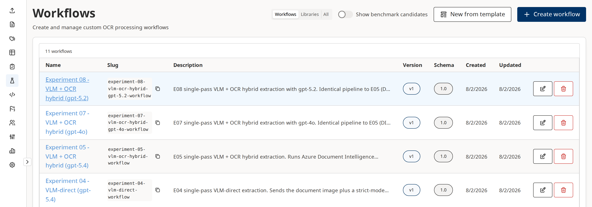
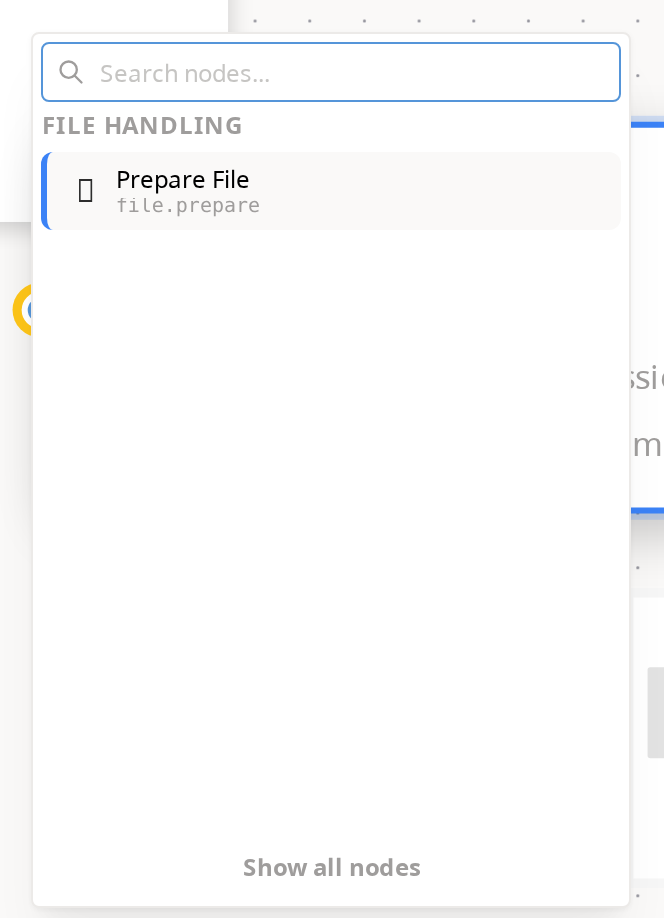
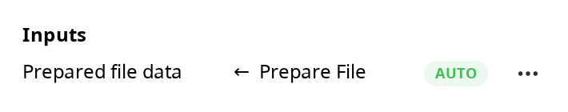
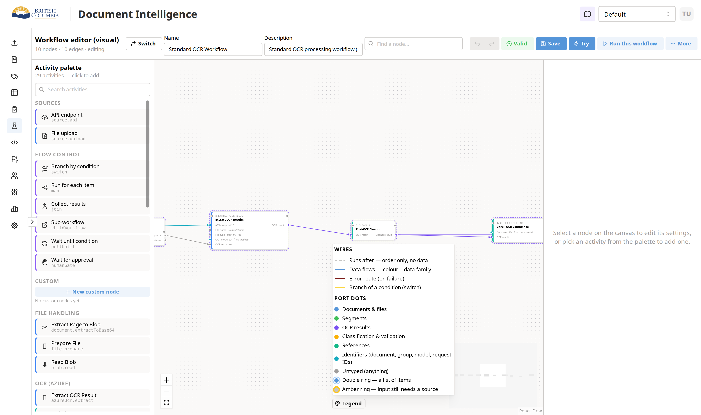
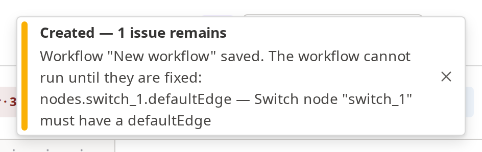
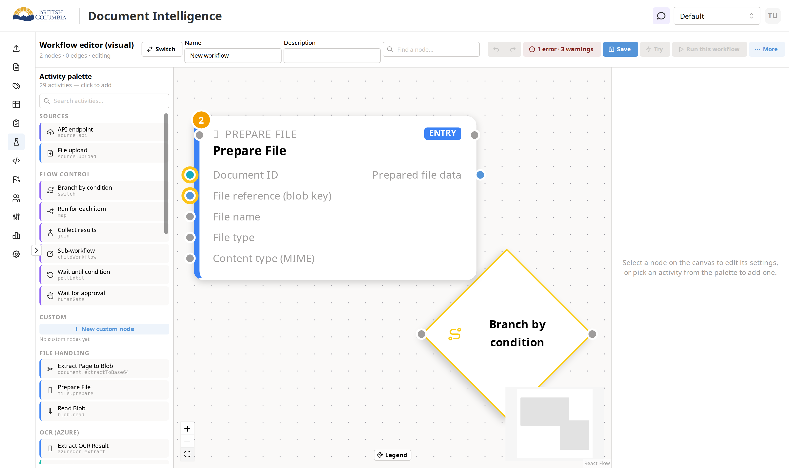

# Inderdeep walkthrough fix batch — illustrated review

**2026-08-02 · branch `feature/visual-workflow-builder`**

Same ground as [REVIEW.md](REVIEW.md), but every fix is shown rather than
described. Each screenshot below was captured from the app running locally on
2026-08-02 against the seeded database — nothing here is a mock-up or a
promise.

Read it in order and it doubles as the demo script for the next session with
Inderdeep: each numbered section is one thing to show him, in walkthrough
order.

---

## Status

All twelve items from the 2026-07-29 walkthrough are done, including the two
that were waiting on your decision.

| Commit | What |
|---|---|
| `b6b86d40` | Identifier retag (Option A) — 27 files |
| `637c024b` | Walkthrough fix batch 1 — items 1–2, 4–5, 7–10, 12 — 30 files |
| `b76d651c` | Draft save — item 3 — 11 files |
| `363b917c` | Grouping semantics — item 6 — 9 files |
| *uncommitted* | Disabled-button tooltip fix + this document (see [What the screenshots caught](#what-the-screenshots-caught)) |

Tests: frontend **2321** across 200 files, backend **2824** across 151 suites,
`tsc --noEmit` clean on both sides.

---

## 1. Workflow names are real links

Inderdeep tried right-click, double-click and clicking the name; rows
highlighted on hover but nothing opened. The name is now an actual `<a href>`,
so it has a hand cursor, underlines on hover, and "Open in new tab" works.



Row bodies still don't navigate — copy-slug, Edit and Delete stay safe to
click by accident.

---

## 2. An in-editor workflow switcher

There was no way out of the editor except the browser back button. The top bar
now carries **Switch**: type to filter by name or slug, pick one, and that
editor opens. The current workflow is marked and disabled; **← All workflows**
goes back to the list.


This is the searchable form Inderdeep argued for rather than the dropdown —
it still reads well at 25+ workflows.

---

## 3. Grouped steps look grouped

*"I don't remember, are they grouped or not?"* — the toast faded and the canvas
looked identical. Every member of a group now wears a dashed violet ring, and
hovering one names the group.


Creating a group also flips the canvas straight to Simplified view, so
grouping visibly does something the moment you do it.


---

## 4. Ungroup is discoverable, and says so

Ungrouping was reachable only through undo, and produced no feedback at all.
Right-click any grouped node:


The entry names the group and promises what it will do — *"(steps stay)"* —
because the whole risk here is someone expecting it to delete the steps. It
fires a green **Ungrouped** toast naming how many steps were released. The
right rail's old "Delete group" button now reads **Ungroup (steps stay)** too.

---

## 5. "Needs a source" explains itself

Every node Inderdeep clicked offered a red **Needs a source** button:


…which opened a modal with nothing in it — *"why is this even clickable if
it's just information?"*. The empty state now explains the model in plain
words instead of stating a fact about the graph:


> Sources come from connected steps: add a step whose output is a `DocumentId`
> and connect it so it runs before this one — it will wire up automatically, or
> appear here to pick.

Where a compatible producer already sits unconnected on the canvas, it is now
offered under a dashed border, and picking it draws the edge *and* pins the
binding in one click.

---

## 6. Building right-to-left

Hovering an **output** dot suggested next steps; hovering an **input** dot did
nothing, so you couldn't place "Submit OCR" and then ask what produces the
`PreparedFile` it needs. Now you can — hovering the input dot lists only
activities that *produce* that kind:



Flow Control is absent on purpose: it produces nothing, so it can never answer
"what makes one of these?". Picking an entry drops it to the left, already
wired into that input.

---

## 7. The green Auto badge (test case 3.4)

Neither of you could find this during the walkthrough, and it turned out the
feature was fine — the test plan just never said the settings panel had to be
open. Connect **Prepare File → Submit OCR** using the node-level handles, then
click the consumer:



The badge lives in the right rail only; nothing turns green on the canvas card
itself. 3.4 now spells that out, and also distinguishes **Auto** (node-level
drag, the resolver binds for you) from **Pinned** (you dropped onto a specific
port dot). Both are correct — they're different gestures.

---

## 8. A colour scheme you can look up

Colours were meaningful but undocumented. Bottom-centre of the canvas there is
now a **Legend**:



Wires split four ways (order-only, data, error, branch) and port dots by
family — including the new cyan **Identifiers** row.

---

## 9. Identifiers are a real type now

This is the retag you approved as Option A. Request IDs, document IDs, model
IDs and group IDs used to be untyped strings, which meant grey dots, no
suggestions and no protection. They are now a proper cyan family:


`APIM request ID` and `OCR model ID` are cyan where they used to be grey —
while `File name`, `File type` and `OCR response` stay grey, because those
genuinely are untyped.

**What to tell Inderdeep:** the greys now mean something. A grey dot used to
mean two different things — "this is genuinely untyped" and "nobody got round
to typing it" — and you couldn't tell which. Now grey means only the first.
Identifier ports join type-driven suggestions in both directions, wrong wires
between sibling ID kinds are refused, and the legend has a row that explains
the colour. 30 ports across 17 activities were retagged; no benchmark
activities were touched.

---

## 10. Draft save — saving and running are different things

Your rule: *"saving and running are different things. I should be able to save
whenever."* The validator didn't disappear; it **moved** to run start.

Add a **Branch by condition** node and leave it unwired — a switch with no
default edge is a genuine error — then hit Save:



The save **succeeds**. The toast is amber, names the count, and quotes the
finding. Reload and the half-built workflow is exactly as you drew it:



Meanwhile **Save stays blue and live while Try and Run are greyed**, with the
reason on hover and an error chip beside them:


The API enforces the same rule, so this isn't only a UI courtesy — `POST
/:id/runs`, `/:id/tries` and the upload-and-Try path all answer 400 with the
findings. Upload-and-Try refuses *before* the file is streamed to blob storage
and a Document row is created.

> **One correction to the test plan.** A required input with no source — a lone
> Submit OCR, say — is a **warning**, not an error: `ctx` can legitimately
> supply it at run time. That workflow saves green and stays runnable. Only
> severity-`error` findings turn the toast amber and gate Run. My first draft
> of test case 3.6a used that graph as the example and was wrong; it now uses
> the unwired switch, which is a real error.

---

## 11. Groups move as one

Inderdeep's Figma expectation: *"when I move one, the other one also moves."*
Your ruling was that Figma is right about **moving**, wrong about **deleting**.

Before — the five members of "OCR Extraction" sit level with the two
downstream steps:


After dragging **one** member upward — the whole group came with it, keeping
its shape, while the two nodes outside the group held position:


Measured during capture: dragging `extractResults` moved exactly the five
members of its group — `prepareFileData`, `submitOcr`, `pollOcrResults`,
`updateApimRequestId`, `extractResults` — each by an identical delta of
`(0, −122)`. The other five nodes on the canvas did not move at all.

Two deliberate limits:

- **Selection is not cohesive.** Clicking a member still selects and edits only
  that member, so per-step configuration is untouched. Only the *drag* carries
  the others.
- **Map bodies are excluded.** The box the canvas draws around a Map node's
  body is derived, not authored, so its members keep their own layout rules.

### Mechanism note

The approved sketch was *"clicking the ring selects all members, and xyflow's
multi-drag moves them for free."* Two things made that unbuildable as written:
the ring is a CSS `outline`, which cannot receive clicks, and xyflow captures
its drag set **before** `onNodeDragStart` fires, so selecting at drag time is
already too late. Making the drag itself cohesive delivers the same rule
without hijacking selection — which is the half of your ruling that protected
per-node work.

---

## 12. Deleting a group as a unit

Full Figma semantics live on the collapsed chip, where the chip *is* the object
and there is nothing else the gesture could mean. Select a chip in Simplified
view and press Delete:


The confirm names the step count, because that is the difference between this
and every other delete on the canvas. Cancel leaves everything in place;
confirm removes the group and its steps with an Undo toast. Expanded, deleting
a member still removes only that member.

This replaces the old behaviour, where deleting a chip did nothing at all, and
then later refused with a message pointing at a button that has since been
renamed.

---

## What the screenshots caught

Two things that a green test suite had not.

**A real bug: the "why can't I run this?" tooltip never appeared.** A disabled
button fires no pointer events, so the Mantine `Tooltip` wrapping the disabled
**Try** button never opened, and Chrome suppresses the native `title` attribute
**Run** was using. The reason was invisible at exactly the moment it mattered
most — draft save had just persisted an unrunnable graph. Both now hover
through an `inline-flex` wrapper, which is what shot 10 above is showing.

The existing test had asserted this behaviour and passed anyway: it fired
`mouseEnter` directly on the disabled button, which jsdom dispatches happily
and no browser ever will. It now hovers the real target, and a matching case
covers the Run button.

**A wrong claim in the test plan** — the 3.6a correction noted above. Both are
the kind of thing only a pass against the running app surfaces, which is the
argument for doing this before Inderdeep's next session rather than after.

---

## Running the demo yourself

```bash
npm run dev          # frontend :3000, backend :3002, temporal workers
```

Open **http://localhost:3000/workflows**. The seeded database carries 11
workflows, each with 5 groups — **Standard OCR Workflow** is the one used for
every canvas screenshot above.

Two environment notes worth knowing:

- If the canvas shows stale port colours after a package rebuild, restart Vite
  — `@ai-di/graph-workflow` is a workspace dependency and Vite caches its
  optimised build.
- Screenshots in this document were captured headless via Playwright with the
  IDIR auth bypass from `.claude/skills/app-browser-auth`; the capture scripts
  are throwaway and live in the session scratchpad, not the repo.

---

## Where the detail lives

| Document | What it holds |
|---|---|
| [REVIEW.md](REVIEW.md) | The original review — full file inventory, the UX story, the grouping opinion |
| [INDERDEEP_WALKTHROUGH_FIXES_20260729.md](../../docs-md/workflows/INDERDEEP_WALKTHROUGH_FIXES_20260729.md) | The 12-item checklist, all ticked, with the item-6 rationale |
| [MANUAL_TEST_PLAN.md](../../docs-md/workflows/MANUAL_TEST_PLAN.md) | Cases 3.6a, 6.2a and 6.2b are the new ones |
| [WORKFLOW_BUILDER_GUIDE.md](../../docs-md/workflows/WORKFLOW_BUILDER_GUIDE.md) | Colour scheme and the group-gesture table |
| [UNTYPED_PORTS_FINDINGS.md](../../docs-md/workflows/UNTYPED_PORTS_FINDINGS.md) | Why the retag went the way it did |
