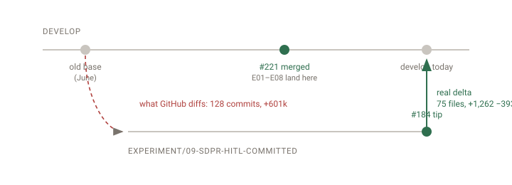

_PR review · PR #184 — SDPR HITL inline editor_

# Take PR #184 out of draft and merge it?

**Not yet — one decision is yours, two chores are mine.** — The code is clean and CI is green apart from a failure that is already on develop. What is blocking is a design question about seeded workflows that nobody has ruled on, plus dbarkowsky's #239 needing to land first.

## Background

This PR ships the human-in-the-loop inline editor for the SDPR pilot: the side-by-side
screen where a reviewer confirms values the extractor already pulled off an HR0081
monthly report, instead of typing them out. It has been in draft since June while the
E01–E08 extraction experiments landed ahead of it. GitHub shows the PR as 128 commits
and +601k lines, which is why it looks unreviewable — that number is wrong. The
experiment stack it was built on top of already merged into develop separately (via
#221), so GitHub is comparing against a merge base from before all of that. Measured
against develop as it stands today, the change is 75 files, +1,262 −393, and roughly 45
of those files are experiment notes. The code you would actually be merging is about a
dozen files, listed below.

## Why the diff looks enormous and is not



_GitHub diffs #184 from the old base (dashed), so the whole E01–E08 stack that already landed via #221 is counted a second time. The real delta is the short solid arrow._

## Your call — 1 decision

**Should committed workflow templates persist OCR results before the human gate?**
Seeded OCR workflows order the nodes checkConfidence → reviewSwitch → humanGate →
storeResults. Because storeResults runs last, a document sitting in the review queue has
no ocr_results row yet, so HitlService.getQueue returns empty and the editor this PR
ships is unreachable from a seeded workflow. It was rewired by hand for the demo and
that rewiring was never committed. This is pre-existing and not caused by #184 — but
#184 is the PR that makes it matter, because it is the first thing that needs the queue
to be non-empty.
  - Move storeResults before humanGate in the committed templates — the editor works out of the box, at the cost of persisting results for documents that may still be rejected.
  - Leave the templates and have HitlService read from the in-flight workflow payload instead — no schema change, more moving parts in the service.
  - Ship #184 as-is and track the template question separately — the editor stays demo-only until it is answered.

## Chores

- [ ] (agent) Merge dbarkowsky's #239, then re-merge develop into this branch — expect a second conflict on apps/temporal/package.json — #239 touches it too
- [ ] (agent) Retitle the PR and rewrite its body — the title still advertises a timing-experiment harness that was dropped in the June rebase, and the body's file inventory is stale
- [ ] (agent) Write the docs-md page for the HITL canvas editor — wiki/hitl.md documents the architecture but not the editor; CLAUDE.md expects a feature doc in the same PR as the code
- [x] (agent) Caught the branch up to develop (19 commits behind, incl. #169 and #221) — one conflict on apps/temporal/package.json — the branch side had a duplicate setupFilesAfterEnv key that was silently dropping jest.setup.ts under JSON last-key-wins. Resolved to develop's file plus the branch's one real change.
- [x] (agent) Reverted b41214108 'Update frontend components and styles' — a stray commit from a UX designer that injected a third-party Figma capture script into apps/frontend/index.html. It existed only on this branch; index.html now matches develop exactly.

## What is actually in it

### The HITL inline editor — the actual product change  — _reviewed_

Eight files under apps/frontend/src/features/annotation/hitl, one of them new. Reviewed
across earlier sessions; the five fixes that came out of those reviews (Tab focus order,
a shared text-measure module, a rotation guard, and the coordinate-scale correction) are
already committed on the branch. Nothing here is outstanding.

### Azure OpenAI deployments endpoint  — _clean_

New read-only controller so the workflow editor can offer the deployments it is allowed
to use. Authenticated, fully Swagger-annotated, has a unit spec, and degrades to the
pre-existing single-deployment variable rather than to an error.

`apps/backend-services/src/azure/azure-openai.controller.ts:20-46`
```ts
@ApiTags("Azure OpenAI")
@Controller("api/azure-openai")
export class AzureOpenAiController {
  constructor(private readonly configService: ConfigService) {}

  @Get("deployments")
  @Identity({ allowApiKey: true })
  async getDeployments(): Promise<AzureOpenAiDeploymentsResponseDto> {
    const list = this.configService.get<string>("AZURE_OPENAI_DEPLOYMENTS");
    if (list && list.trim() !== "") {
      const deployments = list
        .split(",")
        .map((s) => s.trim())
        .filter((s) => s.length > 0);
      return { deployments };
    }

    const fallback = this.configService.get<string>("AZURE_OPENAI_DEPLOYMENT");
```
The allow-list is env-driven rather than queried from Azure, so this endpoint cannot
leak deployments the operator did not name. The fallback to the older singular variable
is what keeps existing environments working without a config change.

### Per-node deployment override in the enrichment activity  — _clean_

An optional azureOpenAiDeployment parameter on the enrichment activity, falling back to
the environment when absent, with a test covering both paths.

### Scripts reorganisation and experiment docs  — _mechanical — skip_

apps/temporal/scripts/ moved to src/scripts/ with the matching tsconfig and package.json
cleanup, plus about 45 markdown files of experiment results. Nothing here needs a
reader.

### CI: green except Temporal QA, and that one is not this PR  — _not caused here_

CodeQL now passes — the earlier three-high/ten-medium alerts were an artifact of the
same stale merge base and disappeared when the branch caught up. Temporal QA fails, and
develop's own last two runs fail the same way: the docs-sync reorg renamed docs-
md/graph-workflows/ to docs-md/workflows/, and five experiment test suites still
hardcode the old template path, giving 89 ENOENT failures. The other 87 suites and 1,147
tests pass. #239 is the designated fix; do not duplicate it here.

## Links

- [PR #184 — the pull request](https://github.com/bcgov/ai-adoption-document-intelligence/pull/184)
- [PR #239 — dbarkowsky's Temporal QA fix](https://github.com/bcgov/ai-adoption-document-intelligence/pull/239) — merge this first
- [PR #221 — where the E01–E08 stack landed](https://github.com/bcgov/ai-adoption-document-intelligence/pull/221) — the reason the diff looks large
- [PR #169 — zero-recovery, picked up in the catch-up merge](https://github.com/bcgov/ai-adoption-document-intelligence/pull/169)
- [wiki/hitl.md — how HITL fits the system](https://github.com/bcgov/ai-adoption-document-intelligence/blob/develop/docs-md/wiki/hitl.md) — the page that still needs the editor added to it
- [wiki/index.md — the repo routing map](https://github.com/bcgov/ai-adoption-document-intelligence/blob/develop/docs-md/wiki/index.md)
- [archive/sdpr-hitl-harness — the dropped DO-NOT-MERGE commit](https://github.com/bcgov/ai-adoption-document-intelligence/releases/tag/archive%2Fsdpr-hitl-harness) — kept as a tag; no longer on the branch

## What I checked

- Diffed the branch against develop directly rather than trusting the PR's file count
- Read every non-experiment file in the merge delta
- Ran the conflicting package.json through both sides by hand and confirmed the duplicate JSON key
- Traced b41214108 to a single third-party script tag and confirmed index.html now matches develop byte for byte
- Compared this branch's Temporal QA run against develop's last two runs before calling the failure pre-existing
- Did NOT re-review the eight HITL frontend files — those were read in earlier sessions and their fix commits are on the branch
