# Workflow builder — illustrated review

**2026-08-02 / 2026-08-03 · branch `feature/visual-workflow-builder`**

Same ground as [REVIEW.md](REVIEW.md), but every fix is shown rather than
described. Each screenshot below was captured from the app running locally
against the seeded database — nothing here is a mock-up or a promise.

Read it in order and it doubles as the demo script for the next review session:
each numbered section is one thing to show, with the exact clicks to reproduce
it on your own machine.

**Three batches of work live here, tagged by where the item came from:**

| Tag | Source |
|---|---|
| **[UX walkthrough]** | The 2026-07-29 walkthrough with the UX designer. Sections 1–12. |
| **[Review 08-02]** | Alex's 2026-08-02 pass over the result. Sections 13–19. |
| **[Review 08-03]** | Alex's 2026-08-03 pass over *those* fixes. Sections 20–23. |

The tag matters when reading a section back: a **[UX walkthrough]** item was
somebody meeting the builder for the first time, and a **[Review 08-02]** item
was somebody who already knew it looking at the fixes. Section 11 carries both,
because the second batch reversed part of the first, and §18 carries the second
and third for the same reason.

**Sections 13, 15, 17 and 18 were re-shot on 2026-08-03.** Their screenshots
had gone stale — the third batch changed exactly what they were showing, and in
§18's case the section documented a limitation that is now fixed. That is the
failure mode this document is most exposed to, which is why the shots are now
taken by [`capture-screenshots.mjs`](capture-screenshots.mjs) rather than by
hand: run it after a batch and diff the images.

---

## Status

All twelve items from the 2026-07-29 walkthrough are done, so are all fourteen
from the 2026-08-02 review, and so are all seven from the 2026-08-03 pass over
those.

| Commit | What |
|---|---|
| `b6b86d40` | Identifier retag (Option A) — 27 files |
| `637c024b` | Walkthrough fix batch 1 — items 1–2, 4–5, 7–10, 12 — 30 files |
| `b76d651c` | Draft save — item 3 — 11 files |
| `363b917c` | Grouping semantics — item 6 — 9 files |
| `1707afc9` `4bb70764` | This document, then anonymised + reproduction steps |
| `3f1f0874` | **Review 08-02** phases 1 and 3 — four defects + seven chrome items — 28 files |
| `2df24f4a` | **Review 08-02** group container model — G-1, G-2, G-3 |
| `6124f7d5` | **Review 08-02** Auto-arrange in simplified view — G-4 |
| `ee97ba63` | **Review 08-03** simplified view keeps its own arrangement |
| `42264ce5` | **Review 08-03** pin a hover-extend port only when the match is unambiguous |
| `2b67ed87` | **Review 08-03** right-click acts on the selection, and can group it |
| `582ccd1f` | **Review 08-03** group boxes fit the cards, measured not estimated |
| `47285b99` | **Review 08-03** the Inputs value field is a labelled field, full width |
| `2e55d262` | **Review 08-03** workflow list — Name is the focus column |
| `fff29edc` | **Review 08-03** group chips are draggable |

Tests: frontend **2494** across 205 files, `tsc --noEmit` and Biome clean.

**Two items in the second batch turned out to be misdiagnosed, and the
correction is more useful than the original guess** — see
[§19](#19-two-things-that-were-not-what-they-looked-like).

---

## Before you click anything

```bash
npm run dev          # frontend :3000, backend :3002, temporal workers
```

Then open **<http://localhost:3000/workflows>**. Every *Try it* box below links
to a real local page.

The links use the **by-slug** form — `/workflows/by-slug/standard-ocr/edit` —
which is derived from the workflow name and therefore survives a reseed. An
id-based link does not: reseeding mints new ids and the link 404s.

Two things worth knowing before you start:

- **The seeded database is the demo set.** 11 workflows, each with 5 groups.
  **Standard OCR Workflow** is the one behind every canvas screenshot here.
- **Nothing below needs saving.** Only §10 (draft save) writes anything, and it
  writes a throwaway workflow you can delete from the list afterwards. Where a
  step does change a workflow, the box says so and tells you how to undo it.

---

## 1. Workflow names are real links

The UX reviewer tried right-click, double-click and clicking the name; rows
highlighted on hover but nothing opened. The name is now an actual `<a href>`,
so it has a hand cursor, underlines on hover, and "Open in new tab" works.


Row bodies still don't navigate — copy-slug, Edit and Delete stay safe to
click by accident.

> **Try it** → [the workflow list](http://localhost:3000/workflows)
> Hover any name in the **Name** column: pointer turns to a hand and the name
> underlines. Click it to open the editor; middle-click or right-click ▸ *Open
> in new tab* also works, because it is a real link now. Then click the empty
> part of a row — nothing happens, by design.

---

## 2. An in-editor workflow switcher

There was no way out of the editor except the browser back button. The top bar
now carries **Switch**: type to filter by name or slug, pick one, and that
editor opens. The current workflow is marked and disabled; **← All workflows**
goes back to the list.

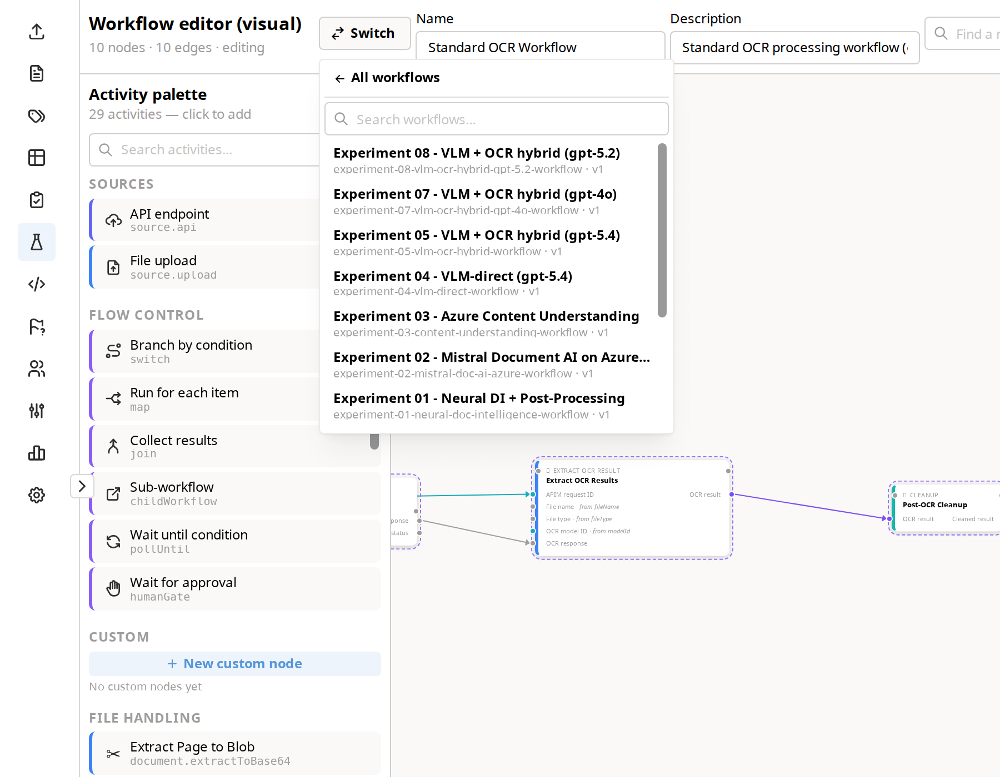

This is the searchable form the reviewer argued for rather than the dropdown —
it still reads well at 25+ workflows.

> **Try it** → [Standard OCR Workflow](http://localhost:3000/workflows/by-slug/standard-ocr/edit)
> Click **Switch** in the top bar, left of the Name field. Type `exp` to filter
> to the seven experiment workflows, or `mistral` to match on slug. Pick one and
> that editor opens. Re-open **Switch** and note the current workflow is listed
> but disabled, with **← All workflows** at the top to get back to the list.

---

## 3. Grouped steps look grouped

*"I don't remember, are they grouped or not?"* — the toast faded and the canvas
looked identical. Every member of a group now wears a dashed violet ring, and
hovering one names the group.

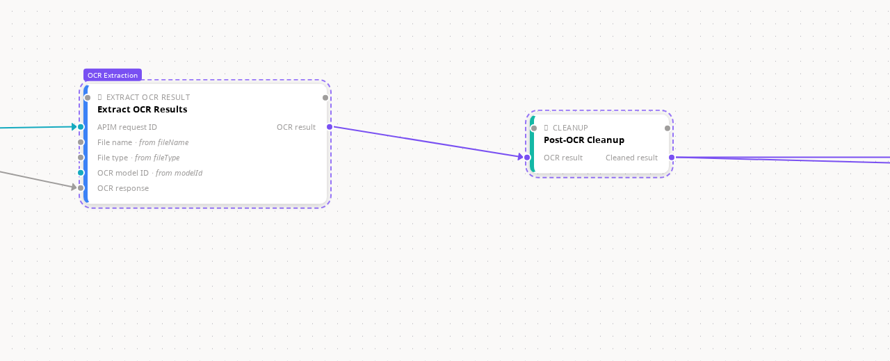

> **Try it** → [Standard OCR Workflow](http://localhost:3000/workflows/by-slug/standard-ocr/edit)
> Every node on this canvas belongs to one of its five groups, so they all wear
> the dashed violet ring. Hover **Extract OCR Results** and the violet
> *OCR Extraction* chip appears above the card.

Creating a group also flips the canvas straight to Simplified view, so
grouping visibly does something the moment you do it.

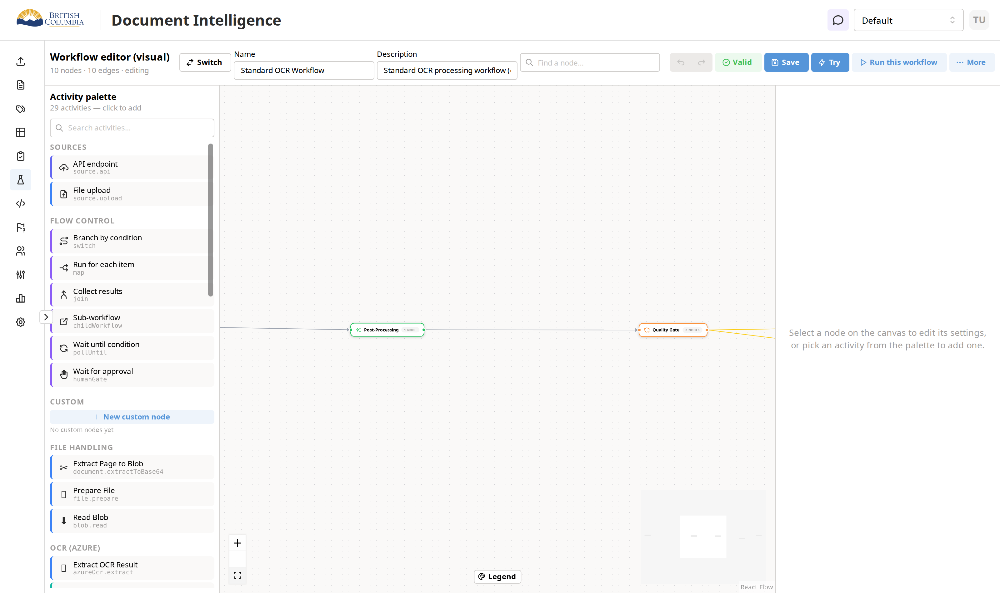

> **Try it** → same workflow, **More ▸ Simplified view**
> That is a *switch inside the menu row* — click the toggle itself, not the row.
> The ten nodes collapse to five chips. Toggle it back off to expand again.
> To watch grouping do this on its own: marquee-select two nodes with
> shift-drag (or Ctrl-click each), then **More ▸ Group selected**.

---

## 4. Ungroup is discoverable, and says so

Ungrouping was reachable only through undo, and produced no feedback at all.
Right-click any grouped node:

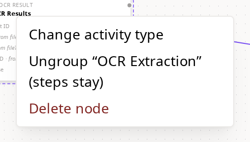

The entry names the group and promises what it will do — *"(steps stay)"* —
because the whole risk here is someone expecting it to delete the steps. It
fires a green **Ungrouped** toast naming how many steps were released. The
right rail's old "Delete group" button now reads **Ungroup (steps stay)** too.

> **Try it** → [Standard OCR Workflow](http://localhost:3000/workflows/by-slug/standard-ocr/edit)
> Right-click **Extract OCR Results**. The middle entry reads
> *Ungroup "OCR Extraction" (steps stay)*. Click it and a green **Ungrouped**
> toast names the five steps released — every node is still on the canvas, only
> the dashed rings are gone. <kbd>Ctrl</kbd>+<kbd>Z</kbd> puts the group back.
> **Don't save** afterwards unless you mean to keep it ungrouped.

---

## 5. "Needs a source" explains itself

Every node the reviewer clicked offered a red **Needs a source** button:

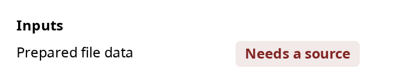

…which opened a modal with nothing in it — *"why is this even clickable if
it's just information?"*. The empty state now explains the model in plain
words instead of stating a fact about the graph:

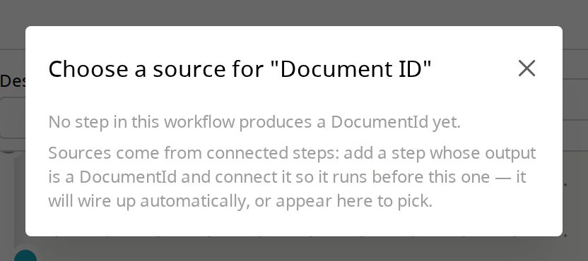

> Sources come from connected steps: add a step whose output is a `DocumentId`
> and connect it so it runs before this one — it will wire up automatically, or
> appear here to pick.

Where a compatible producer already sits unconnected on the canvas, it is now
offered under a dashed border, and picking it draws the edge *and* pins the
binding in one click.

> **Try it** → [a new workflow](http://localhost:3000/workflows/create)
> Click **Submit OCR** in the left palette (under *OCR (Azure)*), then click the
> node it drops on the canvas. The right rail's **Inputs** section shows the red
> **Needs a source** button — click it to read the new empty state. Now add
> **Prepare File** from the palette *without connecting it*, re-open the picker
> on the `Prepared file data` input, and it is offered under a dashed border:
> picking it draws the edge and pins the binding in one go.

---

## 6. Building right-to-left

Hovering an **output** dot suggested next steps; hovering an **input** dot did
nothing, so you couldn't place "Submit OCR" and then ask what produces the
`PreparedFile` it needs. Now you can — hovering the input dot lists only
activities that *produce* that kind:


Flow Control is absent on purpose: it produces nothing, so it can never answer
"what makes one of these?". Picking an entry drops it to the left and wires it
in.

> **Corrected 2026-08-03 — "wired in" is now two things, and only one is
> unconditional.** The execution edge always lands, so the order is what you
> asked for. The *data binding* onto that specific input is only made when the
> port pair is unambiguous. It used to be made always, which is how picking
> **Read Blob** from Poll Classify's *Result ID* bound `base64` to it — see
> [§22](#22-extending-backwards-no-longer-guesses--review-08-03).

> **Try it** → [a new workflow](http://localhost:3000/workflows/create)
> Add **Submit OCR** from the palette. On the node card, hover the small dot on
> the **left** of the `Prepared file data` row — the input dot, not the node's
> big left handle. After ~1s the popover lists **Prepare File** and nothing
> else, because it is the only activity that produces a `PreparedFile`. Click it
> and it lands to the left, already wired in. For contrast, hover an **output**
> dot on the right: that list is the downstream one, and it includes Flow
> Control.

---

## 7. The green Auto badge (test case 3.4)

Neither of you could find this during the walkthrough, and it turned out the
feature was fine — the test plan just never said the settings panel had to be
open. Connect **Prepare File → Submit OCR** using the node-level handles, then
click the consumer:


The badge lives in the right rail only; nothing turns green on the canvas card
itself. 3.4 now spells that out, and also distinguishes **Auto** (node-level
drag, the resolver binds for you) from **Pinned** (you dropped onto a specific
port dot). Both are correct — they're different gestures.

> **Try it** → [a new workflow](http://localhost:3000/workflows/create)
> Add **Prepare File**, then **Submit OCR**. Drag from Prepare File's
> **right-edge node handle** (the round handle on the card's border, not a port
> dot) to Submit OCR's **left-edge node handle**. Now click **Submit OCR** so
> the right rail opens: `Prepared file data` reads `← Prepare File` with the
> green **AUTO** badge. Repeat the drag onto the *port dot* instead and the same
> row reads grey **PINNED** — that difference is what nobody could see before.
>
> Seeded workflows all read **PINNED**, because they ship explicit bindings —
> so the Auto badge only shows on a connection you make yourself.

---

## 8. A colour scheme you can look up

Colours were meaningful but undocumented. Bottom-centre of the canvas there is
now a **Legend**:


Wires split four ways (order-only, data, error, branch) and port dots by
family — including the new cyan **Identifiers** row.

> **Try it** → [Standard OCR Workflow](http://localhost:3000/workflows/by-slug/standard-ocr/edit)
> Click **Legend** at the bottom-centre of the canvas, then read the graph
> behind it against the rows. The two edges into **Store Results** are a good
> pair to compare: one leaves the **Branch by condition** node on its default
> case, the other comes from **Human Review** carrying no data — so they render
> differently, and the legend is where you find out why.

---

## 9. Identifiers are a real type now

This is the retag you approved as Option A. Request IDs, document IDs, model
IDs and group IDs used to be untyped strings, which meant grey dots, no
suggestions and no protection. They are now a proper cyan family:

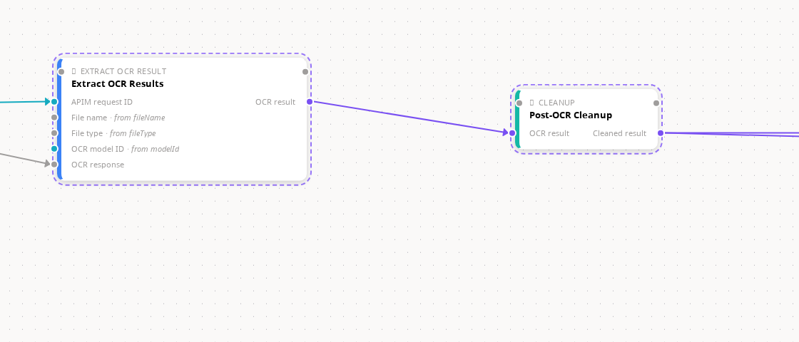

`APIM request ID` and `OCR model ID` are cyan where they used to be grey —
while `File name`, `File type` and `OCR response` stay grey, because those
genuinely are untyped.

> **Try it** → [Standard OCR Workflow](http://localhost:3000/workflows/by-slug/standard-ocr/edit)
> Look at **Extract OCR Results**: `APIM request ID` and `OCR model ID` have
> cyan dots, while `File name`, `File type` and `OCR response` stay grey. Then
> hover the `APIM request ID` **input** dot — the popover can now answer "what
> produces a Request ID?", which was impossible while it was an untyped string,
> because every kind-driven feature skips wildcards.

**What to tell the UX designer:** the greys now mean something. A grey dot used to
mean two different things — "this is genuinely untyped" and "nobody got round
to typing it" — and you couldn't tell which. Now grey means only the first.
Identifier ports join type-driven suggestions in both directions, wrong wires
between sibling ID kinds are refused, and the legend has a row that explains
the colour. 30 ports across 17 activities were retagged; no benchmark
activities were touched.

---

## 10. Draft save — saving and running are different things

Your rule: *"saving and running are different things. I should be able to save
whenever."* The validator didn't disappear; it **moved** to run start.

Add a **Branch by condition** node and leave it unwired — a switch with no
default edge is a genuine error — then hit Save:


The save **succeeds**. The toast is amber, names the count, and quotes the
finding. Reload and the half-built workflow is exactly as you drew it:


Meanwhile **Save stays blue and live while Try and Run are greyed**, with the
reason on hover and an error chip beside them:

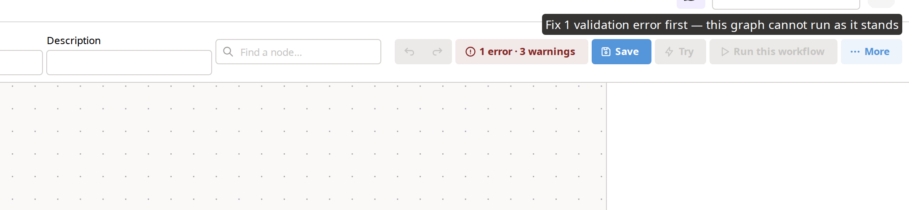

The API enforces the same rule, so this isn't only a UI courtesy — `POST
/:id/runs`, `/:id/tries` and the upload-and-Try path all answer 400 with the
findings. Upload-and-Try refuses *before* the file is streamed to blob storage
and a Document row is created.

> **Try it** → [a new workflow](http://localhost:3000/workflows/create)
> Add **Prepare File**, then **Branch by condition** from *Flow Control*, and
> leave the branch unwired. Hit **Save**. It saves — amber toast,
> *"Created — 1 issue remains"*, quoting the defaultEdge finding. Reload the
> page: your half-built workflow is exactly as you left it. Note **Save** is
> still blue while **Try** and **Run** are greyed; hover either for the reason.
> To see the API half, copy the workflow id out of the URL and run:
>
> ```bash
> curl -s -X POST -H "x-api-key: $TEST_API_KEY" -H 'content-type: application/json' \
>   -d '{}' http://localhost:3002/api/workflows/<id>/runs | jq
> ```
>
> → `400`, with the same finding. Then wire the switch's default edge, save
> again, and the toast turns green as Run lights up.

> **One correction to the test plan.** A required input with no source — a lone
> Submit OCR, say — is a **warning**, not an error: `ctx` can legitimately
> supply it at run time. That workflow saves green and stays runnable. Only
> severity-`error` findings turn the toast amber and gate Run. My first draft
> of test case 3.6a used that graph as the example and was wrong; it now uses
> the unwired switch, which is a real error.

---

## 11. Groups move as one

The UX reviewer's Figma expectation: *"when I move one, the other one also moves."*
Your ruling was that Figma is right about **moving**, wrong about **deleting**.

Before — the five members of "OCR Extraction" sit level with the two
downstream steps:

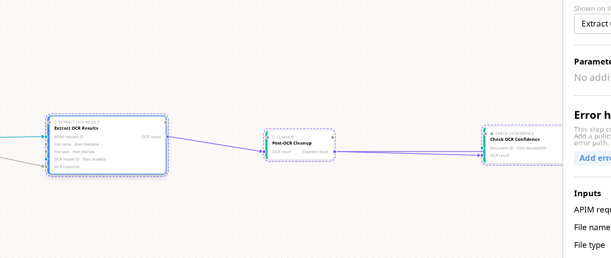

After dragging **one** member upward — the whole group came with it, keeping
its shape, while the two nodes outside the group held position:

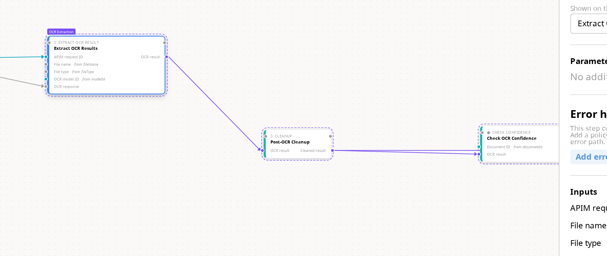

Measured during capture: dragging `extractResults` moved exactly the five
members of its group — `prepareFileData`, `submitOcr`, `pollOcrResults`,
`updateApimRequestId`, `extractResults` — each by an identical delta of
`(0, −122)`. The other five nodes on the canvas did not move at all.

Two deliberate limits:

- **Selection is not cohesive.** Clicking a member still selects and edits only
  that member, so per-step configuration is untouched. Only the *drag* carries
  the others.
- **Map bodies are excluded.** The box the canvas draws around a Map node's
  body is derived, not authored, so its members keep their own layout rules.

> **Try it** → [Standard OCR Workflow](http://localhost:3000/workflows/by-slug/standard-ocr/edit)
> Drag **Extract OCR Results** upward. *Prepare File Data*, *Submit OCR*,
> *Poll OCR Results* and *Update APIM Request ID* come with it — all five keep
> their spacing — while *Post-OCR Cleanup* and *Check OCR Confidence* stay put.
> One <kbd>Ctrl</kbd>+<kbd>Z</kbd> reverses the whole move, not one node at a
> time. Then click a single member: only that node is selected and the right
> rail shows *that* node's settings. For the excluded case, open
> [Multi-Page Report](http://localhost:3000/workflows/by-slug/multi-page-report/edit)
> and drag a node inside the Map body box — only that node moves.

### Mechanism note

The approved sketch was *"clicking the ring selects all members, and xyflow's
multi-drag moves them for free."* Two things made that unbuildable as written:
the ring is a CSS `outline`, which cannot receive clicks, and xyflow captures
its drag set **before** `onNodeDragStart` fires, so selecting at drag time is
already too late. Making the drag itself cohesive delivers the same rule
without hijacking selection — which is the half of your ruling that protected
per-node work.

---

## 12. Deleting a group as a unit

Full Figma semantics live on the collapsed chip, where the chip *is* the object
and there is nothing else the gesture could mean. Select a chip in Simplified
view and press Delete:

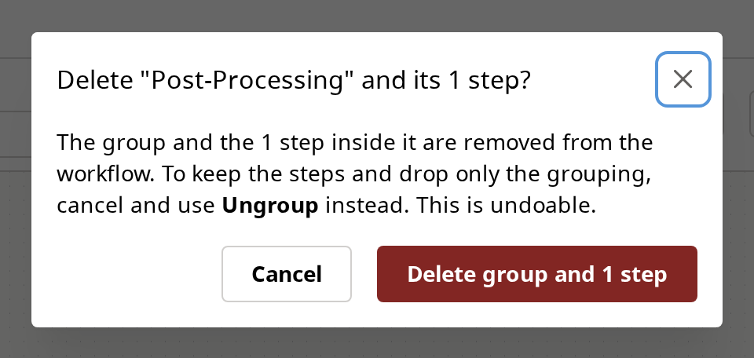

The confirm names the step count, because that is the difference between this
and every other delete on the canvas. Cancel leaves everything in place;
confirm removes the group and its steps with an Undo toast. Expanded, deleting
a member still removes only that member.

> **Try it** → [Standard OCR Workflow](http://localhost:3000/workflows/by-slug/standard-ocr/edit)
> **More ▸ Simplified view**, then click the **Post-Processing** chip and press
> <kbd>Delete</kbd>. The confirm names the real step count. Hit **Cancel** — the
> chip is still there, which is the point: it must not vanish while the question
> is open. Confirm instead and the group and its steps go, with an Undo toast;
> <kbd>Ctrl</kbd>+<kbd>Z</kbd> brings them back. Compare with expanded view,
> where deleting a member removes only that member.

This replaces the old behaviour, where deleting a chip did nothing at all, and
then later refused with a message pointing at a button that has since been
renamed.

---

# Review 08-02 — the second batch

Everything from here down came out of Alex's 2026-08-02 pass over the work
above. Fourteen items; four were outright defects, one changed the grouping
model, and two turned out to be misdiagnosed.

---

## 13. Groups are boxes now, not outlines · [Review 08-02]

*"Groups are not too obvious."* They weren't. There were **three** visual
languages for one idea: a map body drew a green container box, an authored
group drew a faint dashed outline round each member with a label that only
appeared on hover, and collapsed it drew a chip.

One language now. Every group is a container box with a header carrying its
icon, colour and label.

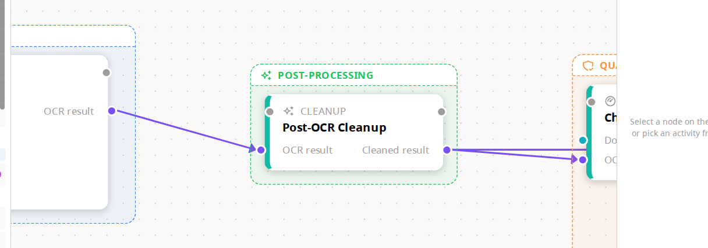

**Re-shot 2026-08-03, and the framing is the point.** Those three boxes used to
*overlap*: the box was sized from worst-case catalog estimates — a flat 522px
width for every activity card, and a height including a 120px preview block
most cards never render — so the slack piled up on the right and bottom.
Measured on this workflow before the fix, Post-Processing collided with both
Quality Gate and OCR Extraction. Boxes are sized from the cards as xyflow
measured them now, and the same measurement fixes the opposite error too: a
`humanGate` renders 200px wide against a 180px estimate, so it used to poke out
of its own box. See [§20](#20-the-boxes-fit-what-is-in-them--review-08-03).

Expanded view also gained something it never had: **clicking a group's header
opens its settings.** Previously the only way in was to collapse to a chip
first.

> **Try it** — <http://localhost:3000/workflows/by-slug/standard-ocr/edit>
>
> Five boxes, left to right: OCR Extraction (5 steps), Post-Processing (1),
> Quality Gate (2), Human Review (1), Store Results (1). Click any header to
> open that group's settings in the right rail.

---

## 14. Drag the header to move the group · [Review 08-02] · reverses §11

§11 shipped "drag any member and the whole group follows". That rule existed
because there was nothing else to grab. §13 gives the group a header, so the
reason expired, and the rule reverted to what Figma and ComfyUI both do:

| Gesture | What moves |
|---|---|
| Drag the box **header** | The whole group — box and every member, one delta, one undo step |
| Drag a **member** | Only that member. The box re-fits around it. |

The second row is new capability, not just a reversal: **repositioning a node
inside its group was impossible before**, because every drag dragged everything.

This is enforced by xyflow's own drag filter rather than by a geometry test —
containers declare `dragHandle: ".wb-group-header"`, so "the pointer is on the
header" and "the dragged node is the container" are the same fact.

> **Try it** — <http://localhost:3000/workflows/by-slug/standard-ocr/edit>
>
> 1. Drag the **OCR EXTRACTION** header. All five cards move together.
> 2. Ctrl+Z.
> 3. Now drag the **Poll OCR Results** card itself. Only it moves, and the box
>    stretches to keep containing it.
> 4. Drag it back inside, or Ctrl+Z.
>
> Verified in a real browser, not just in tests: a header drag moved the box
> and exactly its 5 members by an identical delta and left the other 9 nodes
> untouched; a member drag moved exactly one node.

**Grouping also stopped flipping you into simplified view.** That flip was
added in the first batch because a toast alone was not enough feedback against
a faint dashed outline. The box is the feedback now, so the mode change was
cost without benefit.

---

## 15. The bar above the canvas · [Review 08-02]

*"It's like an awkward form."* It was: a switcher, a Name field, a Description
field and a search box in a row, with the text inputs' labels sitting above
them so nothing shared a baseline, and Description truncating mid-word at 280px
while you were editing it.

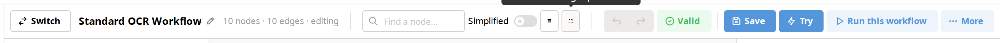

One row, one baseline, four groups. The name became a **click-to-edit title**;
the description moved into **Workflow settings**, where it wraps and has room.
**Simplified view** and **Auto-arrange** left the More menu for visible
controls — a mode toggle is not a menu item's job — and a **Fit** control is
new.

> **Try it** — click the workflow title to rename in place (Enter commits,
> Escape reverts). **More ▸ Workflow settings** now holds the description.

### And the workflow list

Same complaint, different table: Name was narrow while Description ran long on
one truncated line.

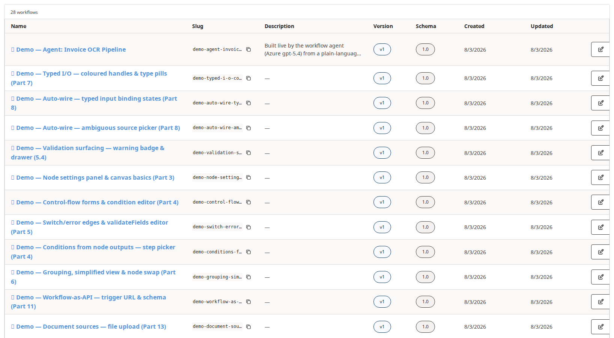

Name is the widest column and the heaviest text on the row; Description wraps
to two lines and stops; a slug truncates on one line, with the full value on
hover and the copy button beside it.

**Two attempts, and each was caught by looking rather than by a test.** The
first widened Name and Description, which squeezed Slug — and a slug is one
unbreakable token, so the browser broke it anywhere rather than overflow and
rows ended up *taller* than before the clamp meant to shorten them. Capping
Slug fixed that and over-corrected: it left Slug at 18% against Name's 24%.

The second attempt, on 2026-08-03, was to bump the percentages — **and it
changed nothing at all.** The table had no `table-layout`, so under the browser
default (`auto`) a percentage width is only a hint and content wins. The widest
content is the slug, rendered `nowrap`, so it took **495px against Name's
154px**. Fixed layout plus an explicit width on all eight columns is what made
the numbers mean anything: Name **387px**, Slug **129px**, tallest row **191px
→ 87px**. A percentage that the layout mode ignores is the kind of thing a
green test suite will happily assert.

> **Try it** — <http://localhost:3000/workflows>

---

## 16. Right-click anywhere · [Review 08-02]

Right-click on a node gave our menu; right-click on empty canvas gave the
browser's. Now the canvas has its own.

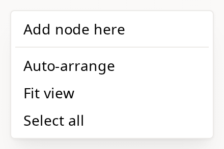

**Paste is deliberately not there.** There is no copy affordance anywhere in
the builder yet, and cloning a node correctly means remapping its
`__auto.<node>.<port>` ctx keys or the copy writes into the original's channel.
That is a feature with unruled semantics, not a fix, so it was left out rather
than shipped as a permanently-greyed entry.

**And the menus close on a left click now.** They did not, because Mantine's
click-away listens on document `mousedown` and xyflow's pane calls
`stopImmediatePropagation` — so the menu closed everywhere *except* the canvas,
which is the one place you click. The wire menu had the identical bug and got
the same fix.

---

## 17. A fixed value, typed where you need it · [Review 08-02]

*"`fileType` says it's an Artifact, can be 'pdf' or 'image', but I can't
type/select that anywhere."*

The first thing to say is that **you never had to.** `fileType`, `fileName` and
`contentType` on Prepare File are optional and derived from the blob key — a
new workflow runs with all three empty. What was broken was that the canvas
drew a port and described exactly what it accepted, while the only panel that
could accept an answer pretended the port did not exist.


Optional ports now fold behind **"N optional inputs"** — short by default,
never secret. Note the two genuinely-required ports still say *Needs a source*
and the three optional ones do not: the panel and the validation drawer agree.

**Re-shot 2026-08-03.** The row is a proper labelled field now. It used to put
the input on a second grid line indented into the middle *source* column, which
capped it at that column's width — measured on this exact node, a 159px field
starting at x=132 in a 327px panel, never beside its own label — and committing
a value moved the row up into the required list without changing any of it. The
field spans the full width, and the port's description moved out of the
placeholder, where it was always truncated (`` `pdf` or `image`. Auto-det… ``),
into wrapped helper text under the field.

Type a value on one and it sticks, via a hidden ctx entry carrying
`defaultValue`. **No engine change was needed** — the seeding, run-spec and
per-run-override paths already existed. A **Make this a workflow input** action
promotes the value to a named, caller-supplied input when you want that.

> **Try it** — <http://localhost:3000/workflows/create>, click **Prepare File**
> in the palette, then expand **3 optional inputs** in the right rail and type
> `image` into **File type**.

---

## 18. Auto-arrange in simplified view · [Review 08-02]

*"Auto arrange on simplified view doesn't do anything."* Correct — and for the
nodes you could see, it genuinely didn't. Chips sit at the *centroid* of their
members, but Auto-arrange laid out the *member-level* graph, so chips drifted to
wherever the middle of each chain happened to land.

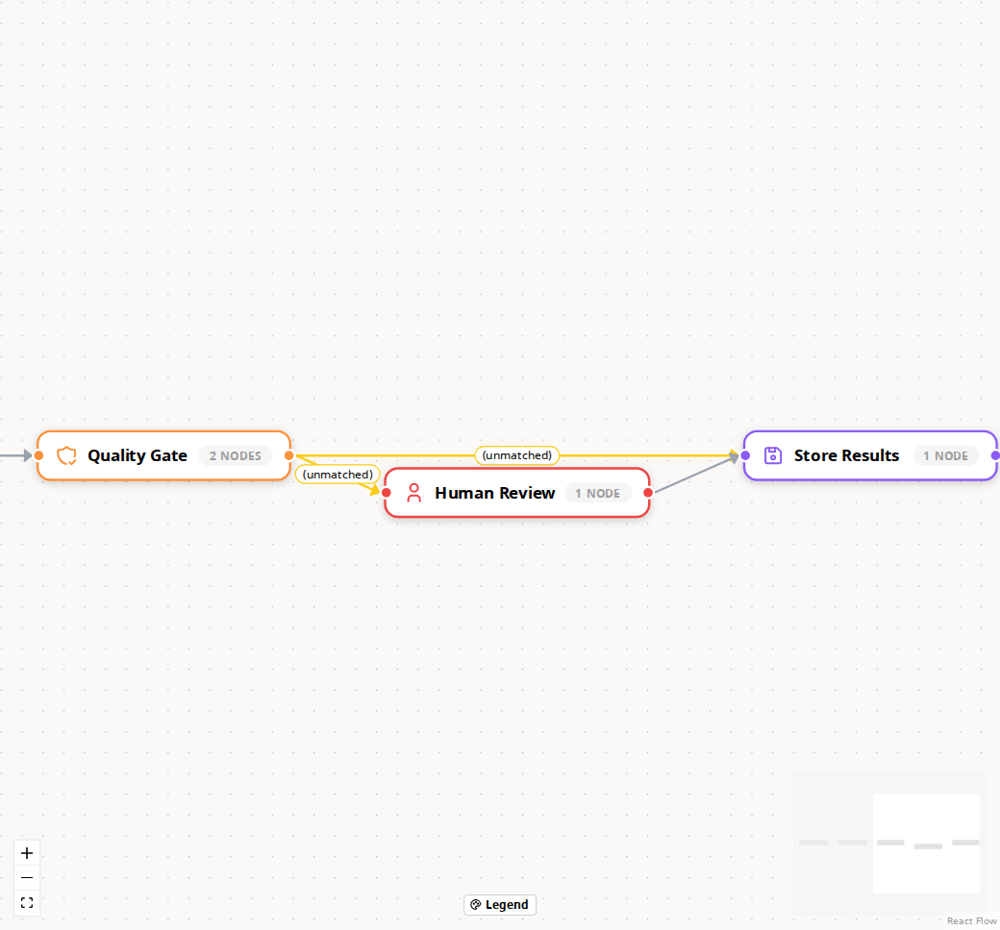

It now lays out the graph you are actually looking at.

**Superseded 2026-08-03 — the first fix carried a defect this section used to
describe as a known limit.** It laid out the chips, then dragged each group's
members along by their chip's delta. A chip reserves a *chip-sized* slot, so a
group whose members really span ~1500×600 got packed into 248×48 and dagre
pushed its neighbours right up against that slot. Expand again and the whole
graph was bunched up and overlapping — permanently, because the result is
saved. Alex's report: *"if i auto arrange in simplified view and then switch to
regular view, everything becomes bunched up."*

The rejected repair was to give each chip a dagre box the size of its group's
true bounding box. It removes the overlap by making the simplified view sprawl
exactly as much as the expanded one, which removes the reason to use it.

**The two views keep separate arrangements instead.** A simplified arrange
writes chip placements to the group and ungrouped steps to
`metadata.simplifiedPosition`; members are not touched at all, so the expanded
canvas is exactly as you left it. The accepted consequence, worth saying out
loud: a step that appears in both views has a position in each, so nudging it
in one does not move it in the other.

> **Try it** — open **standard-ocr**, turn **Simplified** on, hit
> **Auto-arrange**, then turn Simplified off. The expanded graph is untouched —
> every card where it was. Arrange it there too, switch back, and confirm
> neither arrange disturbed the other.

---

## 19. Two things that were not what they looked like · [Review 08-02]

Worth recording, because in both cases the first diagnosis was wrong and
checking cost minutes.

**"The seeded workflows have hardcoded layouts from a long time ago."** They do
not. All 15 shipped templates carry **zero** baked positions and never have —
`git log -S'"position"'` over that directory returns no commits at all. The
hand-placed grid that story came from is real, but it is in the *demo* seeder.

The actual cause of *loads too spread out, tightens after I hit Auto-arrange*
is that there are **two layout paths with different information**. Hydration
lays out a position-less config before anything is mounted, so dagre only has
the uniform 482px fallback width; the button feeds it each card's real measured
width and collapses the gaps. Same graph, two layouts, and the loose one was
the one you were shown. The measured pass now runs for any config that arrives
without positions.

**"It doesn't auto-arrange the demos either."** The demos are not in the
database. Zero rows carry the seeder's `🎯 Demo — ` prefix, so all 17 `demo-*`
links in `FEATURE_DEMO_GUIDE.md` are currently 404. The flag has been stamped
since 2026-07-16 — the seeder is a manual post-reset step that never got
re-run. `node scripts/seed-feature-demos.mjs` with the backend up fixes it, and
it only touches prefix-matched demos.

**A third, found only by opening a browser.** `fitView` was clamping at
xyflow's default `minZoom` of 0.5 and giving up silently. standard-ocr needs
~0.14 to fit, so the graph hung off both edges and every Fit press was a no-op
because it was already at the limit — including the Fit control this batch
added. jsdom cannot catch that class of bug: it mocks xyflow wholesale and
never lays anything out.

---

## 20. The boxes fit what is in them · [Review 08-03]

*"The group boxes have excessive padding on the bottom and right. This makes
adjacent group boxes overlap."*

Both halves were true and they were the same cause. `computeGroupBounds` sized
each box from worst-case **estimates** rather than from anything on screen.
Measured in the running editor on `standard-ocr-sdpr` — rendered against
assumed, in canvas units:

| Card | Rendered | Assumed | Error |
|---|---|---|---|
| `azureOcr.extract` | 350×174 | 522×183 | **+172** wide |
| `azureOcr.submit` | 292×130 | 522×199 | **+230** wide |
| `ocr.checkConfidence` | 376×108 | 522×183 | +146 wide |
| `humanReview` (gate) | 200×**58** | 180×**180** | **+122** tall, 20 **under** wide |

The box's right edge was `max(x) + 522` while the last visible pixel was
`max(x + rendered)`, so every bit of that slack landed on the right and bottom
— up to ~212px of empty box beside the last card, ~162px under a `humanGate`.
Two pairs of boxes overlapped on that workflow; after the fix, zero, with even
margins on every box. The `humanGate` row is the reason this was never just
"use a smaller pad": the estimate ran *under* on width, so a card could poke
out of its own box.

The shot in [§13](#13-groups-are-boxes-now-not-outlines--review-08-02) is the
after.

---

## 21. Right-click means the selection · [Review 08-03]

*"Selecting multiple nodes and then right clicking on one brings the menu for
just that one, i hit delete and deletes one node, but i selected multiple."*

Exactly that. The handler built the menu from the clicked node and never looked
at the selection — even though the canvas already reports the full selection
upward, which is what powers the top bar's *Group selected*.

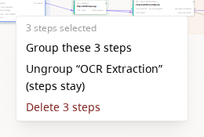

**Delete removes all three in one config write**, so a single <kbd>Ctrl</kbd>+<kbd>Z</kbd>
brings them all back. **Change activity type** and **Edit script** are gone from
this menu — they mean nothing for a set. Right-clicking a node *outside* the
selection resets the selection to that node and gives the ordinary single-node
menu, so the menu never offers to act on steps you stopped pointing at.

**Group these N steps** is the other half of the same item — *"I think being
able to group by right click and selecting group there would be useful"* — and
it runs the same operation the top-bar action does.

> **Try it** — <http://localhost:3000/workflows/by-slug/standard-ocr/edit>
>
> Click one card, then **<kbd>Ctrl</kbd>-click** two more — *not* shift-click,
> see the note below — and right-click any of the three.

> ⚠️ **Shift-click does not multi-select, and the guide said it did.** xyflow's
> `multiSelectionKeyCode` defaults to Meta/Control, while **Shift** is its
> `selectionKeyCode` — hold Shift and *drag* on the pane and you get a marquee.
> Measured 2026-08-03: shift-click leaves 1 node selected, Ctrl-click 2,
> shift-drag 9. The docs have said "shift-click to pick them individually"
> since before this batch; they now say what actually works. Whether Shift
> *should* also multi-select is a one-line change and an open question, not
> something this batch decided.

---

## 22. Extending backwards no longer guesses · [Review 08-03]

*"I created poll classify, then hovered over result id input, and picked read
blob, it auto wired base64 output from that to result id, which i don't think
is right. If this issue exists, wondering if it's some general problem."*

It is a general problem, and it is worse than declaration order. The first
diagnosis was "it takes the first type-compatible output, so whichever is
declared first wins". Checking the catalog says the type check was never doing
any work at all:

- `blob.read` declares exactly **one** output — `base64`, kind `DocumentContent`
- `azureClassify.poll` declares `resultId` with kind **`Artifact`**
- `Artifact` is the **root** of the kind lattice: every kind hangs off it via
  `baseKind`, so **every output in the catalog is assignable to it**

So there was never a set of plausible candidates to rank. `base64` trivially
"matched", it was the only output, and it got pinned with full confidence.
**Preferring an exact-kind match would not have caught this** — there is no
exact match to prefer.

The pick now returns a *reason*, and only three reasons are good enough to pin:
the ports share a **name**; exactly one candidate declares the **exact kind**;
or exactly one candidate is assignable at all. When the target's kind is the
`Artifact` wildcard the kind lane is skipped outright, because it proves
nothing.

**Only the pin is conditional.** The execution edge always lands, so the order
you asked for is the order you get; the input keeps its ordinary automatic
resolution instead of a confident wrong binding.
`azureClassify.submit.resultId → poll.resultId` still pins — on the name, no
longer on beating `constructedClassifierName` to the front of a list.

> **Try it** — drop a **Poll Classify**, hover its **Result ID** input dot,
> pick **Read Blob**. It lands to the left and wired, and Result ID still says
> it needs a source. Repeat with **Submit Classify** and it binds.

---

## 23. Chips can be put where you want them · [Review 08-03]

Falls out of §18. While a chip's position was re-derived from its members'
centroid on every projection, a drag had nowhere to land, and the code said so:
*"non-draggable today — dragging is filed as a follow-up because we recompute
the centroid every projection."* Giving the simplified view its own geometry
removed that blocker, so chips drag now.

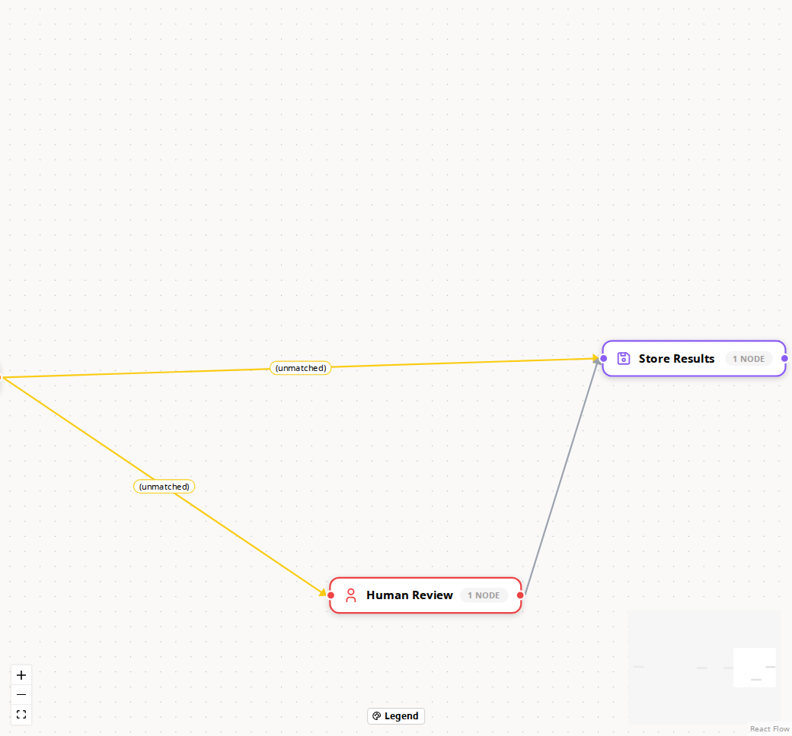

The members do not move — that is the whole point of the two views being
arranged independently. A chip dropped where it already sits writes nothing, so
no gesture costs an empty undo step.

> **Try it** — **standard-ocr**, **Simplified** on, drag a chip. Then turn
> Simplified off and confirm the expanded canvas is untouched.

---

## What the screenshots caught

Two things that a green test suite had not.

**A real bug: the "why can't I run this?" tooltip never appeared.** A disabled
button fires no pointer events, so the Mantine `Tooltip` wrapping the disabled
**Try** button never opened, and Chrome suppresses the native `title` attribute
**Run** was using. The reason was invisible at exactly the moment it mattered
most — draft save had just persisted an unrunnable graph. Both now hover
through an `inline-flex` wrapper, which is what shot 10 above is showing.

The existing test had asserted this behaviour and passed anyway: it fired
`mouseEnter` directly on the disabled button, which jsdom dispatches happily
and no browser ever will. It now hovers the real target, and a matching case
covers the Run button.

**A wrong claim in the test plan** — the 3.6a correction noted above. Both are
the kind of thing only a pass against the running app surfaces, which is the
argument for doing this before the UX reviewer's next session rather than after.

---

## If something doesn't look like the screenshots

- **Stale port colours after a package rebuild** — restart Vite.
  `@ai-di/graph-workflow` is a workspace dependency and Vite caches its
  optimised build, so a retag can be live in the worker and stale in the
  browser.
- **A by-slug link 404s** — the workflow was renamed (the slug is derived from
  the name) or the database was reseeded from different data. Find it on the
  [list page](http://localhost:3000/workflows) instead; the slug is in the
  second column.
- **The list is empty or short** — the seed has not run. `npx prisma db seed`
  from `apps/backend-services` is additive and safe; it brings the set back to
  11 workflows without touching anything you have authored.
- **Screenshots here are captured headless** via Playwright using the IDIR auth
  bypass from `.claude/skills/app-browser-auth`, by
  [`capture-screenshots.mjs`](capture-screenshots.mjs) beside this file. Run
  `node feature-docs/20260802-ux-walkthrough-fix-batch/capture-screenshots.mjs`
  with `npm run dev` up to re-take the set, or pass shot ids to re-take some of
  them. It shoots at **1920×1080** deliberately: at 1600 and below the editor's
  top bar overflows and the disabled Undo button lands on top of the Simplified
  switch, so neither a script nor a person can click it.
- **The set went stale once already** — four shots in the 08-02 batch were
  showing pre-08-03 behaviour, including one section whose text promised a
  limitation that had been fixed. That is why the script exists; the *Try it*
  boxes remain the version you can check by hand.

---

## Where the detail lives

| Document | What it holds |
|---|---|
| [REVIEW.md](REVIEW.md) | The original review — full file inventory, the UX story, the grouping opinion |
| [UX_WALKTHROUGH_FIXES_20260729.md](../../docs-md/workflows/UX_WALKTHROUGH_FIXES_20260729.md) | The 12-item checklist, all ticked, with the item-6 rationale |
| [MANUAL_TEST_PLAN.md](../../docs-md/workflows/MANUAL_TEST_PLAN.md) | 3.6a, 6.2a and 6.2b from 08-02; 3.17a, 6.7b and 16.7a from 08-03 |
| [PORT_WIRING_DESIGN.md](../../docs-md/workflows/PORT_WIRING_DESIGN.md) | §9.1 — which port a hover-extend pins, and when it declines to |
| [batch-three PLAN.md](../20260803-workflow-builder-batch-three/PLAN.md) | The 08-03 items, their causes as measured, and the two rulings |
| [WORKFLOW_BUILDER_GUIDE.md](../../docs-md/workflows/WORKFLOW_BUILDER_GUIDE.md) | Colour scheme and the group-gesture table |
| [UNTYPED_PORTS_FINDINGS.md](../../docs-md/workflows/UNTYPED_PORTS_FINDINGS.md) | Why the retag went the way it did |
