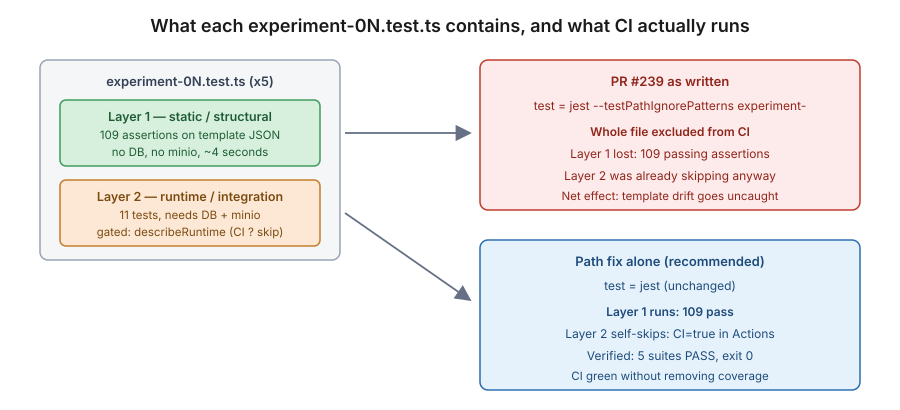

# PR #239 review — "Remove Experiment Tests from Unit Tests"

[PR #239](https://github.com/bcgov/ai-adoption-document-intelligence/pull/239) ·
author [@dbarkowsky](https://github.com/dbarkowsky) ·
`fix/experiment-tests` → `develop` ·
1 commit ([57ee954](https://github.com/bcgov/ai-adoption-document-intelligence/pull/239/commits/57ee9547ec0520f5f3b2c31681467139b7045a49)) ·
7 files, +215 / −12 · reviewed 2026-08-05

**Triage tier: focused.** One concern — CI test wiring — plus its blast radius.
Not deep (no auth, data, or tenancy surface), not rubber-stamp (it changes what
CI verifies on every future PR).

---

## 1. The ask

> **Updated 2026-08-06 — this PR is now superseded. Recommendation changed from
> "merge with changes" to "close it."** Overnight on 2026-08-05, commit
> [edea8aa8](https://github.com/bcgov/ai-adoption-document-intelligence/commit/edea8aa8)
> `fix(temporal): point experiment tests at docs-md/workflows templates` landed on
> `develop` via [PR #242](https://github.com/bcgov/ai-adoption-document-intelligence/pull/242)
> (kmandryk). It applies the identical path fix to all five experiment tests.
> `develop` now has 0 stale `graph-workflows` references and Temporal QA is
> **green** at `cdd3dd4b`, with `"test": "jest"` still running the experiment
> suites. So #239's one good change is already in, and everything left that is
> unique to #239 is the three things this review recommends against.

**Can this merge as-is? No.** With the path fix already on `develop`, merging
#239 would contribute only: the removal of 109 CI assertions (§4.1), an unused
dependency on a package that doesn't exist (§4.4), and 203 lines of
SDPR-specific seeding in a shared harness (§4.3).

**Recommendation: close #239 as superseded**, and open a separate issue only if
the `test:integration` split is still wanted on its own merits.

The original verdict — keep the path fix, drop the test split — is preserved
below because the reasoning in §4.1 is what justifies leaving the experiment
tests in CI now that they are green there.

### Decisions only Alex can make

| # | Question | Recommendation |
|---|---|---|
| D1 | Keep the experiment tests in CI, or accept the split? | **Keep them in CI.** The premise for removing them is wrong — see §4.1. Ask dbarkowsky to revert the `package.json` script change and keep the path fix. |
| D2 | The 203-line SDPR seeding block in the shared test harness — accept, or ask for it generically? | **Ask for it to come out.** It hardcodes one ministry's 75 field definitions into shared infrastructure, against the repo rule that the system carries no document-specific implementation. See §4.3. |

### Chores an agent can do (no decision needed)

| What | Who | State |
|---|---|---|
| Verify the path fix against `develop`'s real tree | agent | done — §4.2 |
| Run the 5 experiment suites exactly as CI runs them (`CI=true`) | agent | done — 109 passed, 0 failed, §4.1 |
| Confirm `packages/billing` does not exist and nothing imports it | agent | done — §4.4 |
| Confirm `npm install` tolerates the missing `file:` dep | agent | done — it does; dangling symlink, no CI break, §4.4 |
| Check `FieldDefinition` unique constraint makes `skipDuplicates` safe | agent | done — constraint exists, §4.3 |

---

## 2. Background

`apps/temporal` carries five experiment test files (`experiment-01` …
`experiment-05`) that came in with the OCR-engine experiment work. Each one
validates a workflow template JSON — the neural DI, Mistral, Content
Understanding, VLM-direct and VLM/OCR-hybrid chains — that lives under
[docs-md/workflows/templates/](docs-md/workflows/templates/).

Those tests broke CI. This PR diagnoses the break as "they need the full stack —
minio and a database — which the runners don't have" and responds by excluding
`experiment-` from `npm test` entirely, adding a separate `test:integration`
script for them. It also fixes a genuinely wrong template path and adds a
seeding routine to the shared integration harness.

The diagnosis is the part that doesn't hold up.

---

## 3. What the tests actually look like



---

## 4. Findings

### 4.1 The test split is unnecessary and drops 109 passing assertions — **the main finding**

Every one of the five experiment files is already two-layered, and the
infra-dependent layer already skips itself on CI. From
[experiment-01-neural-doc-intelligence.test.ts:398](apps/temporal/src/experiment-01-neural-doc-intelligence.test.ts#L398):

```ts
const describeRuntime = process.env.CI ? describe.skip : describe;
```

That line is present in all five files:

```
experiment-01-neural-doc-intelligence.test.ts:398
experiment-02-mistral-doc-ai-azure.test.ts:414
experiment-03-content-understanding.test.ts:364
experiment-04-vlm-direct.test.ts:391
experiment-05-vlm-ocr-hybrid.test.ts:519
```

GitHub Actions always sets `CI=true`, so the tests needing a database and minio
were **never running in CI to begin with**. The PR description's rationale —
"They relied on the full stack for testing. We won't have a minio component or
database component in these runners" — describes a problem the existing code had
already solved.

What remains is the static layer: template metadata, scope rules, chain wiring,
graph-schema validation, and recorded-fixture checks. It touches no infra.

Measured, running exactly as CI does, with only the path fix applied:

```
$ CI=true npx jest experiment- --maxWorkers=2

PASS src/experiment-02-mistral-doc-ai-azure.test.ts
PASS src/experiment-05-vlm-ocr-hybrid.test.ts
PASS src/experiment-04-vlm-direct.test.ts
PASS src/experiment-01-neural-doc-intelligence.test.ts
PASS src/experiment-03-content-understanding.test.ts

Test Suites: 5 passed, 5 total
Tests:       11 skipped, 109 passed, 120 total
Time:        4.077 s
JEST_EXIT=0
```

109 assertions pass in four seconds with no database and no minio. The 11 skips
are the runtime layer self-skipping, exactly as designed.

**So the path fix alone turns CI green.** The split then removes 109 working
assertions on top of that. What those assertions protect is real: they are the
only automated check that the five experiment workflow templates still parse,
still wire their nodes in the documented order, and still pass
`validateGraphConfigForExecution`. After this PR, someone renaming a node or
changing the OCR chain breaks those templates silently — CI stays green and
`test:integration` is not wired into any workflow.

**Verdict: revert the `package.json` script change. Keep the path fix.**

### 4.2 The path fix is correct — keep it

[apps/temporal/src/experiment-01-neural-doc-intelligence.test.ts](https://github.com/bcgov/ai-adoption-document-intelligence/pull/239/files):

```diff
   "docs-md",
-  "graph-workflows",
+  "workflows",
   "templates",
```

Verified against `develop`'s tree: `docs-md/graph-workflows/` does not exist,
`docs-md/workflows/templates/` does and holds all five experiment templates.
The same two-line change (doc comment + `TEMPLATE_PATH`) is applied to all five
files, consistently. This is the actual CI fix.

### 4.3 The harness gains 203 lines of SDPR-specific seeding

[apps/temporal/src/\_\_testlib\_\_/integration-harness.ts](apps/temporal/src/__testlib__/integration-harness.ts) grows a
hardcoded `SDPR_FIELDS` array — **75 field definitions**, ministry-specific:

```ts
const SDPR_FIELDS: Array<{ fieldKey: string; fieldType: FieldType; fieldFormat?: string }> = [
  { fieldKey: "checkbox_need_assistance_yes", fieldType: FieldType.selectionMark },
  ...
  { fieldKey: "applicant_oas_gis", fieldType: FieldType.number },
  { fieldKey: "spouse_trust_income", fieldType: FieldType.number },
];
```

Three problems, in order of weight:

1. **It duplicates [apps/shared/prisma/seed.ts](apps/shared/prisma/seed.ts)**, which already defines the same
   `sdpr-monthly-report` model and the same field keys (68 matching lines).
   Two copies of one form's schema in two places will drift, and the copy in a
   test harness will drift silently.
2. **It puts document-specific implementation into shared infrastructure**,
   which the project's own [CLAUDE.md](CLAUDE.md) rules out: *"Do not include
   any document-specific implementation, the system is generic and must support
   arbitrary workloads."* A harness that only self-seeds for SDPR is not generic.
3. It is a **speculative fix**. The PR says "Copilot wanted a change to the
   harness because it suspects there's expected data for these tests to run",
   and dbarkowsky notes he still can't run the experiment tests. Since the tests it
   would serve pass without it (§4.1), this is 203 lines solving an unconfirmed
   problem.

Two things I checked that are **not** problems: `TemplateModel.model_id` is
`@unique`, so the `upsert` key is valid; and `FieldDefinition` carries
`@@unique([template_model_id, field_key])`
([schema.prisma:256](apps/shared/prisma/schema.prisma#L256)), so `createMany({ skipDuplicates: true })`
will not duplicate rows on an already-seeded database. The code is correct — the
objection is to where it lives and whether it's needed.

**Verdict: ask for it to be dropped from this PR.** If a self-seeding harness is
wanted later, it should read field definitions from a fixture rather than
hardcode one ministry's form.

### 4.4 An unused dependency on a package that does not exist

[apps/temporal/package.json](apps/temporal/package.json) gains:

```json
"@ai-di/billing": "file:../../packages/billing",
```

There is no `packages/billing` in this repo — the packages directory holds
`blob-storage-paths`, `graph-insertion-slots`, `graph-workflow`, `logging`,
`monitoring`, `temporal-payload-codec`. Nothing under `apps/temporal/src`
imports `@ai-di/billing`, and `package-lock.json` (untouched by this PR)
contains zero references to it.

I expected this to break CI and checked rather than assuming. It does not: npm
resolves a missing `file:` dependency to a **dangling symlink** and exits 0.

```
$ npm install --ignore-scripts --no-package-lock
added 1 package, and audited 3 packages in 101ms
$ ls -la node_modules/@ai-di/
billing -> ../../packages/billing        # target does not exist
```

So it is not a blocker — it is an accidental leftover, undisclosed in the PR
description, that leaves a broken symlink in every temporal install and will
confuse the next person who greps for the billing package.

**Verdict: remove the line.** It has no relationship to anything else in this PR.

### 4.5 `test:integration` never runs its build prerequisites

The new script is `"test:integration": "jest experiment-"`. npm's `pre` hooks
are name-exact: `pretest` fires for `npm test` only, and there is no
`pretest:integration`. So the existing prerequisite build —

```json
"pretest": "npm run build:logging && npm run build:graph-insertion-slots && npm run build:graph-workflow"
```

— is skipped, and `npm run test:integration` runs against whatever is (or isn't)
in those packages' `dist/`. This is a plausible part of why dbarkowsky "still seems to
have issues running the experiment tests" on a clean tree.

**Verdict: minor, but if the split survives D1, add `"pretest:integration"` with the same body.**

---

## 5. Complete file inventory

All 7 files in the true diff (base [617da9a4](https://github.com/bcgov/ai-adoption-document-intelligence/commit/617da9a4cd8868231dabe56605162a43bd7269e7) → head [57ee954](https://github.com/bcgov/ai-adoption-document-intelligence/commit/57ee9547ec0520f5f3b2c31681467139b7045a49)), all from the single commit.

| File | +/− | What and why | Verdict |
|---|---|---|---|
| [apps/temporal/package.json](apps/temporal/package.json) | +3 / −1 | Three unrelated changes bundled: `test` now excludes `experiment-`; new `test:integration`; new `@ai-di/billing` dependency | **No** — §4.1, §4.4, §4.5 |
| [apps/temporal/src/\_\_testlib\_\_/integration-harness.ts](apps/temporal/src/__testlib__/integration-harness.ts) | +202 / −1 | Adds `ensureSeedGroup()` — upserts an Actor, the seed Group, the SDPR TemplateModel and 75 hardcoded FieldDefinitions; called from `seedTestDocument()` | **No** — §4.3 |
| [experiment-01-neural-doc-intelligence.test.ts](apps/temporal/src/experiment-01-neural-doc-intelligence.test.ts) | +2 / −2 | Template path `graph-workflows` → `workflows` (doc comment + `TEMPLATE_PATH`) | **Yes** |
| [experiment-02-mistral-doc-ai-azure.test.ts](apps/temporal/src/experiment-02-mistral-doc-ai-azure.test.ts) | +2 / −2 | Same path fix | **Yes** |
| [experiment-03-content-understanding.test.ts](apps/temporal/src/experiment-03-content-understanding.test.ts) | +2 / −2 | Same path fix | **Yes** |
| [experiment-04-vlm-direct.test.ts](apps/temporal/src/experiment-04-vlm-direct.test.ts) | +2 / −2 | Same path fix | **Yes** |
| [experiment-05-vlm-ocr-hybrid.test.ts](apps/temporal/src/experiment-05-vlm-ocr-hybrid.test.ts) | +2 / −2 | Same path fix | **Yes** |

No generated files, no fixtures, no merge artifacts. The branch base is 18
commits behind `develop`, but none of those commits touch these seven paths, so
the diff is clean and no rebase is needed to review it.

---

## 6. Description-vs-diff completeness check

| Change in the diff | Disclosed in the PR body? |
|---|---|
| Template path fix across 5 files | Yes — "They looked for the json files in a non-existent path." |
| `test` excludes `experiment-` | Yes — "I've removed them from running as part of the unit tests." |
| New `test:integration` script | **Partially** — the split is described, the new script name is not |
| Harness seeding (+202 lines) | Yes — "Copilot wanted a change to the harness…", flagged as uncertain |
| **`@ai-di/billing` dependency added** | **No — entirely undisclosed** |

One undisclosed behavioural change (§4.4), and one under-described (the new
script, which nothing in CI invokes — so the experiment tests now run nowhere
automatically; that consequence isn't stated either).

---

## 7. Recommended reply to dbarkowsky

> The path fix is right and fixes CI on its own — I ran the five experiment
> suites with `CI=true` (what Actions sets) after applying just that change, and
> all five pass: 109 assertions, 11 skipped, 4 seconds, no database or minio.
>
> The reason they don't need the stack is that each file already gates its
> integration layer behind `const describeRuntime = process.env.CI ? describe.skip : describe`
> (experiment-01 line 398, and the same in the other four), so the DB/minio tests
> were already skipping on the runners. The only thing that was actually failing
> was the bad template path.
>
> So could we keep the path fix and drop the `--testPathIgnorePatterns` change?
> As written it takes those 109 static template assertions out of CI, and since
> `test:integration` isn't wired into any workflow they'd then run nowhere — the
> experiment templates could drift with CI still green.
>
> Two smaller things: `apps/temporal/package.json` picks up
> `"@ai-di/billing": "file:../../packages/billing"`, but there's no
> `packages/billing` in the repo and nothing imports it — looks like it came
> along by accident (npm doesn't fail, it just leaves a dangling symlink). And
> the harness seeding hardcodes the 75 SDPR field definitions that
> `apps/shared/prisma/seed.ts` already defines — two copies of one form's schema
> that will drift, and it's document-specific code in shared infrastructure.
> Since the tests pass without it, I'd drop it from this PR.

---

## Appendix — how this was verified

Commands run against the PR head, on this machine:

```bash
# true diff, not the PR page's stats
git merge-base origin/develop pr239-review          # 617da9a4
git diff --numstat 617da9a4 pr239-review            # 7 files, +215/−12

# the decisive test — CI's exact conditions
CI=true npx jest experiment- --maxWorkers=2         # 5 passed, 109 assertions, exit 0

# test discovery split
npx jest --listTests | wc -l                        # 106
npx jest --listTests --testPathIgnorePatterns experiment- | wc -l   # 101
npx jest --listTests experiment- | wc -l            # 5

# the missing package
git ls-tree -d pr239-review --name-only packages/   # no billing
grep -rn "@ai-di/billing" apps/temporal/src         # no importers
npm install --ignore-scripts --no-package-lock      # exit 0, dangling symlink
```

**One caveat, stated plainly:** the full 101-suite `npm test` run was **not**
completed against PR #239's head. The first attempt took down the WSL VM (jest
defaults to 19 workers on this 20-core box, each running its own ts-jest
compile, exceeding the 24 GB cap). The re-run with `--maxWorkers=4` completed
but executed against the local `feature/visual-workflow-builder` working tree,
not the PR — its 2 failing suites (`graph-workflow.test.ts`,
`dynamic-nodes/graph-workflow.dynamic-nodes.test.ts`) are files that branch
carries 3,128 lines of changes in, unrelated to and untouched by PR #239.

That gap does not affect any finding above: PR #239 changes no non-experiment
test file, and every finding rests on the experiment suites, the package
manifest, or the harness — all verified directly.

For future runs on this machine: `npx jest --maxWorkers=4 --workerIdleMemoryLimit=1G`
peaks at ~13 GB and never touches swap.
