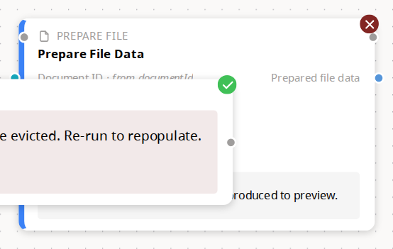
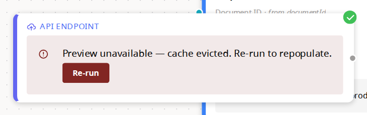
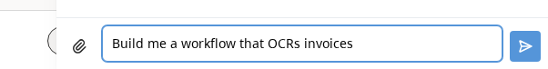
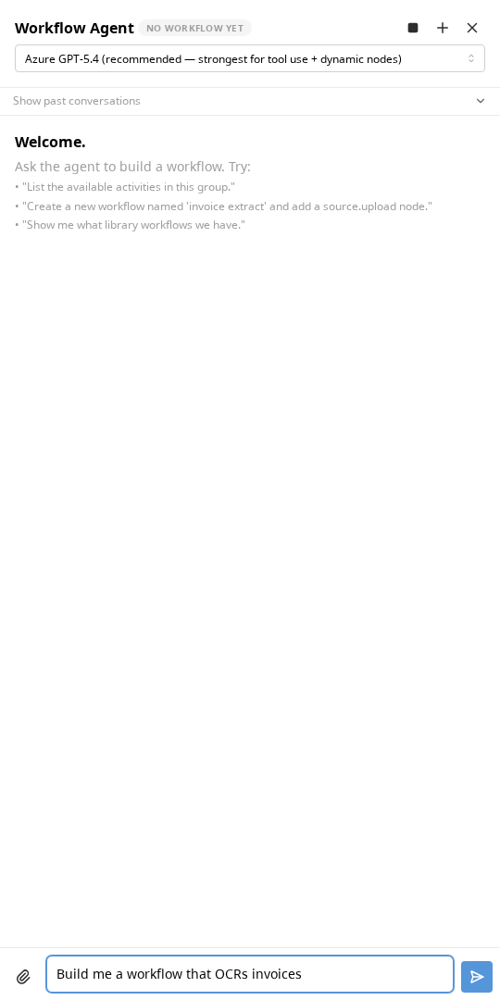
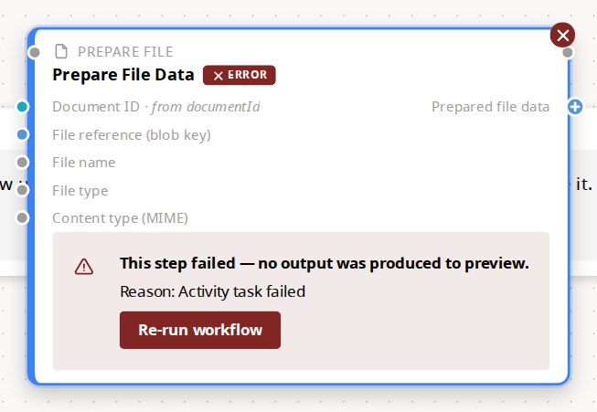
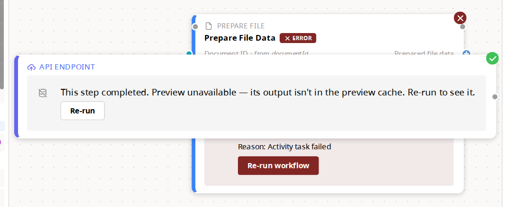

# Workflow designer — batch four, illustrated

**2026-08-07 · branch `feature/visual-workflow-builder`**

What the fixes from [CHECKLIST.md](CHECKLIST.md) actually look like. One section
per batch, after the change only — no before/after pairs. **One exception**, at
the end: item 9 is not fixed and is waiting on a ruling, so its frame is of the
defect and is named `…BEFORE…` to say so.

Every image was captured from the app running locally against the seeded
database by [`capture-screenshots.mjs`](capture-screenshots.mjs). Nothing here
is a mock-up. Re-run the script after a batch and diff the images:

```bash
npm run dev          # frontend :3000, backend :3002, temporal worker
npm run seed:demos   # the demo workflows the shots open
node feature-docs/20260806-inderdeep-ux-review-batch-four/capture-screenshots.mjs
```

---

## Batch 1 — the icons that don't say what they mean

Items **6, 25, 27, 28, 29**. Five glyph and colour fixes, one shared root
cause: a meaningful glyph drawn inside a container that wins the pixel budget.

### §1 · Run-status badges — item 6

The badge used to draw two concentric circles: the filled `ThemeIcon` disc, and
inside it `IconCircleCheck` / `IconCircleX`, which carry rings of their own. At
16px the rings won. Inderdeep: *"to notice the cross within the circle is very
hard … the more I zoom out, all I see is the circle, which is not the intent."*

Now the disc is the only circle. The glyph is a bare `IconCheck` / `IconX`,
raised from 12px to 15px inside a disc raised from 16px to 20px, and stroked at
2.6 instead of Tabler's default 2.





Both shots are of a real run of the **workflow-as-API** demo — the same demo
Inderdeep had open when he reported this. The badges only exist while a run is
active (`NodeStatusBadgeOverlay` renders nothing without an `activeRunId`, so
that a design-time canvas isn't littered with gray dots), so there is no way to
photograph them except by really running something.

**Two open items are visible in these frames, and both are worth seeing:**

- The neighbouring card overlapping the failed node is **item 9** — pressing
  Try grows the cards to fit their preview panels, and they collide. Unfixed.
- The second shot is **item 10** in one frame: a **green success check** on a
  node whose panel reads *"Preview unavailable — cache evicted."* Both verdicts
  on the same card, which is exactly what Inderdeep called confusing.

### §2 · Agent chat header — items 27, 28, 29

Three icons, three complaints, left to right in the shot:

| Icon | Was | Now |
|---|---|---|
| Stop | `IconPlayerStop`, an outlined square — *"I don't know what it represents"* | `IconPlayerStopFilled` |
| New conversation | `IconRefresh` — *"this says new conversation, while the icon says a refresh"* | `IconPlus` |
| Close | `IconCircleX` — *"the cross is way too small … should only be a cross rather than a cross within the circle"* | `IconX` |


The stop button still lives in the header, detached from the conversation it
stops. That placement is **item 26** and is not in this batch — only the glyph
changed here, and it travels with the button when the button moves.

### §3 · The composer — item 25



**Inderdeep was right and the cause was bigger than the chat.** He reported the
send icon as *"black on purple, not very accessible"*. Measured in the browser
on 2026-08-07, the enabled send button really did render a near-black glyph on
its coloured fill — `color: rgb(45,45,45)` on `background: rgb(85,149,217)`.

The cause was not in the agent chat at all. A project-wide rule in
[`ui/bcds-mantine-fallbacks.css`](../../apps/frontend/src/ui/bcds-mantine-fallbacks.css)
set the BC DS icon colour on **every** ActionIcon:

```css
.mantine-ActionIcon-root {
  color: var(--icons-color-primary);   /* near-black, unconditionally */
}
```

That beat Mantine's own `color: var(--ai-color)` on order, so it stamped
near-black over every *filled* icon button in the app — anywhere one exists,
not just here. It is now qualified to leave filled variants alone:

```css
.mantine-ActionIcon-root:not([data-variant="filled"]) {
  color: var(--icons-color-primary);
}
```

The button itself also moved off violet onto the theme's primary blue —
`appTheme.primaryColor` is `blue`, and the composer was the one place painting
its main action off-palette. The composer's focus ring followed it, off a
hardcoded `#845ef7`.

**One number worth knowing before this is called an accessibility win.** White
on the theme's filled blue `#5595D9` measures **3.14:1**. That clears the 3:1
floor WCAG 1.4.11 sets for non-text UI components, but not by much — and it is
*lower* than the near-black glyph scored on the same blue (4.37:1). The reason
the change is still right is the colour it replaced: on the violet that was
actually there, near-black scored **2.47:1** and failed, while white scores
5.55:1. So Inderdeep's call was correct for the button in front of him.

The residue is a design-system question, not a chat question: **the app's
default filled blue is a marginal background for white glyphs everywhere it is
used.** Darkening the filled shade to `blue.7` (`#3470B1`) would take white to
5.12:1. That is Inderdeep's call to make across the system rather than mine to
make on one button, so the button stays consistent with every other filled
action in the app and the question is recorded here.



**Verification:** frontend suite **2496 passed** across 205 files, `tsc
--noEmit` clean, Biome clean. The badge change carries a new regression test
asserting that `succeeded` and `failed` never render a circle-wrapped icon
again.

---

## Batch 8a — a port says there is something to add

Items **3** and **4**. One shared shape: something the author is meant to act on
did not look like it — an empty circle that hides an action, and three sentences
crushed into a toolbar that hides a decision.

### §4 · The "+" on an unconnected port — item 3

Hovering a port is the main way a graph gets built, and an empty circle does not
invite anything. Inderdeep: *"maybe consider adding a small plus sign here …
they might not be able to discover it by themselves that there is something here
if they hover."*

An unconnected, **required** port now carries a `+`. Connected ports and
optional ports keep the plain dot — inviting someone to fill in something the
workflow does not need is the opposite of guidance. The glyph is a knockout:
two bars in the card's body colour cut across the family-coloured disc, so the
hue still says what can connect to what. Following batch one's finding that a
glyph inside a ring loses, the plus is not squeezed into the existing 12px dot —
an inviting handle grows to 16px, leaving a 12px disc for an 8px cross.


One card, three states, which is why this node was chosen over a tidier one.
**Prepared file data** on the left is bound to the step before it: plain dot.
**Request ID** on the right is required and goes nowhere: `+`. **Submission
status code** and **Submission headers** are optional and also go nowhere: plain
dots. The frame is zoomed — an inviting dot is 16px at 1:1 and a canvas fitted
to a graph sits well below 1:1, so "can you tell that it is a plus" is a
question about the zoom people actually work at.

### §5 · Error handling as a decision, not a toolbar — item 4

The three outcomes were a `SegmentedControl`. Alex, looking at it live: *"it's
not obvious to me that those are like the three options … I feel like they
should be radio buttons or something"*, and *"the third option also doesn't fit
on the screen"*.

They are now a labelled radio group, one per line, and the help text moved
**onto each option**. That second half is not decoration: a single line of help
below a vertical list reads as describing *the list*, not the selection.


All three labels are whole, all three explanations are visible at once, and
nothing is clipped at the panel's width — which was the specific failure. The
shot is of the node's settings panel in the switch/error-edges demo, on a node
already set to *Follow the error path*, which is why the **Error path** picker
is showing underneath; that picker is existing behaviour, not part of item 4.

---

## Batch 8b — the error path, and failure at the title

Items **5**, **7** and **19**.

### §6 · The error handle explains itself — item 5

*"I don't even know first what the red dot is … and then like even if I notice
it, then it doesn't do anything."* The bottom `error` handle had no tooltip and,
unlike every other output handle the user had been trained by, hovering it
opened nothing.

Both halves are in one frame, because hovering produces both at once:


- The tooltip names the dot — **"Error path: runs when this step fails"**.
- The popover is the same hover-to-extend list every other output handle opens,
  in an **error-path mode**: a red banner headed *"Error path"* over the line
  *"Pick the step that runs when this step fails."*, so picking here is visibly
  a different act from ordinary wiring.

**What this shot does not show:** the edge a pick draws. Clicking a row does
work, and the edge it creates is genuinely `error`-typed with `fallbackEdgeId`
recorded — but it is not photographable on this graph. The new node is dropped
at a fixed offset with no re-layout, so it lands on top of the card it was
wired from, hiding both the source and the new edge; fitting the view to recover
puts the pair at a zoom where no label reads. Three framings were tried and all
three argued the wrong thing, so no frame was kept. That part of item 5 rests on
its tests.

### §7 · Failure named at the node's title — item 7

*"If it's an error, maybe it's better to mention it alongside the node name or
the title, because you will probably start reading from here and then you know
which step is an error — rather than at the top right of it."* Reading order is
title-first; the failure marker was in the last place the eye goes.



The whole card is in frame deliberately: item 7 asked for the verdict at the
title **as well as** the corner, not instead of it, and a crop that excluded the
corner badge would be arguing the opposite case. The chip carries the engine's
message on hover, the same text the badge and the no-output notice use.

This is a real run of the workflow-as-API demo — the chip only exists while a
run is live, so there is no way to photograph it except by running something.
Two other things in the frame are worth naming rather than explaining away: the
red panel reading *"This step failed — no output was produced to preview"* is
**item 11**, already shipped, and the neighbouring card visible behind this one
at both edges is **item 9**, below.

### §8 · The group is its own right-click target — item 19

*"I was trying to ungroup it … I'm just right clicking [the group]. Nothing is
happening. And then I realized, oh, I need to be on a particular node."*

Right-clicking the group's header strip now offers **Ungroup**, running the same
code path the member-node entry runs.


The dashed container is in frame with the menu on purpose: what was missing was
the *target*, not the entry, and the three cards inside the box are what
*"(steps stay)"* is promising to leave behind. The demo is the Part 6 grouping
demo, the only seeded workflow that carries `nodeGroups` — two of them, **OCR
Extraction** and **Finalize**.

The item shipped **header-only**. Right-clicking the group's interior still
opens the pane menu, deliberately: making the box's whole area a group target
would take "add a node here" away from a large part of the canvas, and adding a
node inside a group's area is an ordinary thing to want. Discoverability came
from the header's own tooltip instead — *"Drag to move the whole group · click
to open its settings · right-click to ungroup"*.

---

## Batch 9 — the workflows table fits · item 18

*"The delete icon is outside of this row and it's truncated … there's no
horizontal view, I'm at full view, I'm not zoomed in or zoomed out."*

The column widths are now pixels derived from the buttons' real dimensions
rather than percentages, and Name carries no width at all so that under fixed
layout it absorbs whatever the sized columns leave.


**This shot is the evidence, not the tests.** jsdom runs no table layout, so the
unit tests can only pin the rule — pixels not percentages, a floor on the table
— while whether the row actually fits is a question only a browser can answer.
It is the whole 1920×1080 window rather than a crop of the table, because a
scrollbar is a fact about the window's edges and a crop would cut off the thing
being claimed.

Measured in Chromium on 2026-08-08 at 1920px, alongside the frame: the table is
1612px inside a 1612px wrapper (`scrollWidth === clientWidth`, so no overflow),
the document's `scrollWidth` equals its `clientWidth` at 1920 (no page-level
horizontal scroll), and the delete button's right edge sits at 1814px inside a
row ending at 1886px — 72px of margin, where it used to hang past the row.
Columns come out at Name 712, Slug 193, Description 209, Version 84, Schema 88,
Created 92, Updated 92, Actions 140.

---

## Not fixed — pressing Try still reflows the graph · item 9

The one frame here that is of a defect. Item 9 is open and awaiting a ruling
between three options — see [DECISIONS/09-try-reflow.md](DECISIONS/09-try-reflow.md)
— and every option on the table removes exactly what this frame shows, so the
evidence had to be taken while the bug still exists.

Alex, watching the shared screen: *"when you hit try, it also resized the boxes
and they started to overlap in a strange way … it's kind of jarring."*



The **API Endpoint** card has grown to fit its preview pane and is now lying
straight across **Prepare File Data** — covering its port rows, its bindings and
half its body. Measured mechanism: `estimateNodeHeight` makes no allowance for a
preview because at rest there isn't one, dagre separates ranks by 60px, and the
preview pane is capped at 200px. So a card grows up to 200px into a 60px gap,
and does it twice — once for the loading skeleton, again when real content
replaces it.

**How the frame was chosen, since it matters for re-running this.** The script
asks the page which two cards overlap most and frames those, rather than
assuming where the collision is — what grows and by how much depends on what the
run produced. It also fails loudly if nothing overlaps. That check earned its
keep: the eight-node switch/error-edges demo was tried first, on the theory that
a bigger graph shows more collisions, and it shows **none** — its nodes are
authored ~570px apart on one horizontal rank, so a card 200px taller still hits
nothing. The collision needs a *vertical* neighbour.
