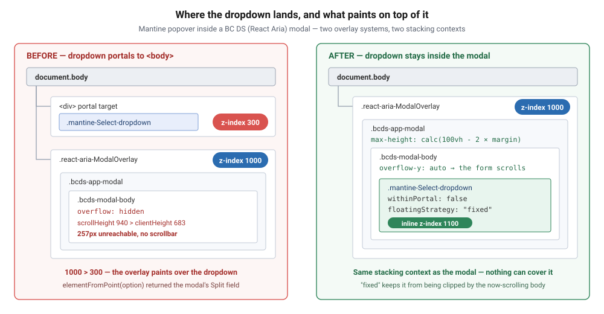
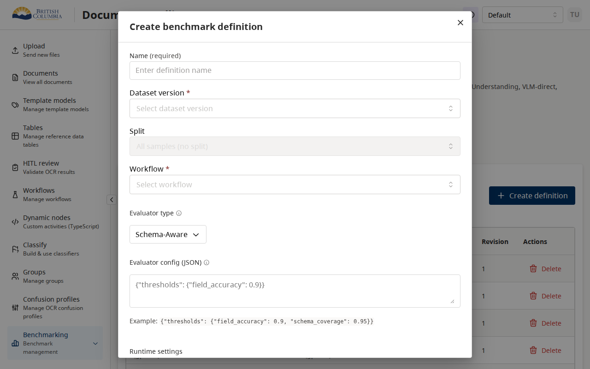
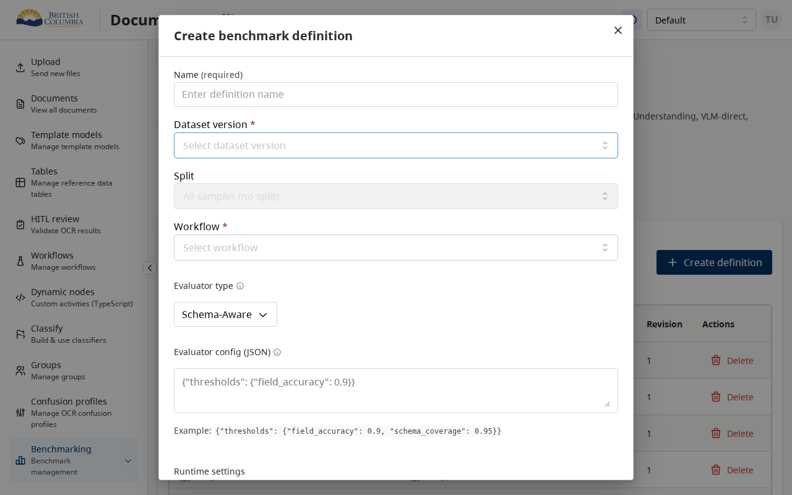
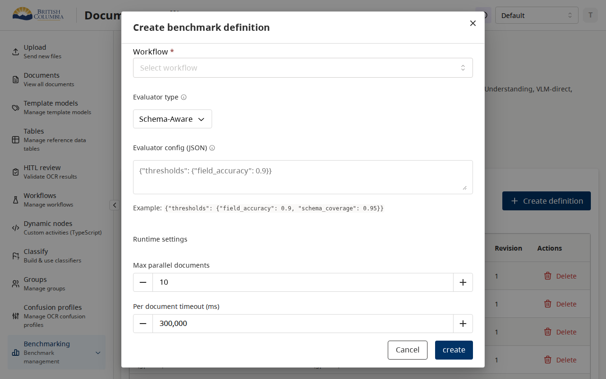
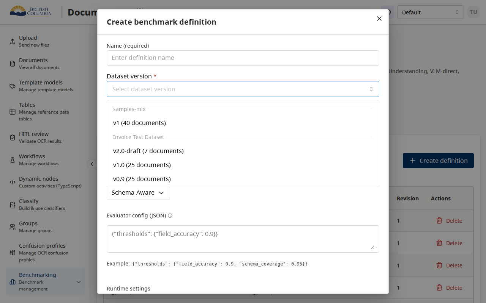

# PR #244 review — "Modal select dropdown scroll and clickability"

[PR #244](https://github.com/bcgov/ai-adoption-document-intelligence/pull/244) ·
author [@kmandryk](https://github.com/kmandryk) ·
`fix/modal-select-dropdown-in-dialogs` → `develop` ·
1 commit ([701468d](https://github.com/bcgov/ai-adoption-document-intelligence/pull/244/commits/701468db852abdfbec6b88e3f47345bbae1dd710)) ·
3 files, +32 / −0 · all 10 checks green · reviewed 2026-08-06

> Also in this folder: [review.html](review.html) — the work-store render of the
> same review, as it appears in the queue.

**Triage tier: focused.** One concern — a modal that clipped its own form and
hid its own dropdowns — but the fix lands in two *shared* places
([src/ui/Select.tsx](../../apps/frontend/src/ui/Select.tsx) and the modal
stylesheet), so the blast radius is every modal and every searchable select in
the app. Not deep: no auth, data, tenancy or API surface. Not rubber-stamp: it
changes CSS that every modal inherits.

---

## 1. The ask

**Can this merge? Yes — merge it.** I reproduced both bugs in a running
browser, applied this exact patch to the same tree, and confirmed both are
fixed with no regression across seven routes plus the workflow editor
(§3, §4). Two of the three changes do real work.

**The third change does nothing**, and the PR description credits it with
doing the work. That is a follow-up, not a merge blocker — the fix stands
without it — but it should not be left in place looking like protection that
isn't there.

### Decisions only Alex can make

| # | Question | Recommendation |
|---|---|---|
| D1 | Should the combobox defaults live in the `Select` adapter (where this PR put them) or in `appTheme` as Mantine `defaultProps`? | **Move them to `appTheme`.** The adapter only covers `Select`; `MultiSelect`, `TagsInput` and `Autocomplete` are re-exported raw from Mantine ([ui/index.tsx:289,311](../../apps/frontend/src/ui/index.tsx)) and 24 files import Mantine comboboxes directly (§5.2). A theme default covers all of them in one place. This is a boundary question — where the app's "house style" for third-party components lives — so it's yours, not mine. |

### Chores an agent can do (no decision needed)

| What | Who | State |
|---|---|---|
| Reproduce both bugs in a browser, pre-fix, with measurements | agent | done — §3 |
| Apply the patch and verify the fix on the same page | agent | done — §4 |
| Check the fix doesn't regress the tall document-viewer modal | agent | done — unaffected, §4.3 |
| Sweep 7 routes + the workflow editor for clipped/off-screen dropdowns | agent | done — none found, §4.4 |
| Run `Select.test.tsx` + `Modal.test.tsx` | agent | done — 13 passed, §4.5 |
| Delete or repair the inert CSS block | agent | **pending** — §5.1 |
| Add a test asserting `withinPortal: false` on the fallback path | agent | **pending** — §5.4 |
| Let callers override `comboboxProps` instead of it being silently dropped | agent | **pending** — §5.3 |

---

## 2. Background — and the answer to "why did it break"

Since 2026-05-22 ([4731a47f](https://github.com/bcgov/ai-adoption-document-intelligence/commit/4731a47fa), "Add BC DS UI components")
this app runs **two overlay systems side by side**. Modals are BC Gov Design
System `Modal`, which is React Aria underneath
([@bcgov/design-system-react-components 0.7.0 → react-aria-components 1.16.0](../../apps/frontend/src/ui/Modal.tsx)).
Dropdowns inside those modals are still Mantine, because BC DS has no
searchable select — the adapter falls back to Mantine the moment a caller
passes `searchable`, `clearable`, `allowDeselect` or `nothingFoundMessage`:

```tsx
// apps/frontend/src/ui/Select.tsx:144
function usesMantineSelectFallback(props: {…}): boolean {
  return (
    props.searchable === true ||
    props.clearable === true ||
    props.nothingFoundMessage != null ||
    props.allowDeselect === true
  );
}
```

Neither system knows the other exists, and that produces two independent
failures. **Nothing "broke" in the sense of a regression** — no commit turned
this from working to not working. Create benchmark definition is simply the
first form that is both long enough and searchable enough to hit both at once.

**Failure 1 — the dropdown paints underneath the modal.** Mantine portals its
popover to `document.body`, i.e. *outside* the modal's stacking context, at its
default `z-index: 300`. BC DS `ModalOverlay` sits at `z-index: 1000`. 1000 wins.
The dropdown was rendering, and populating, and was completely invisible.

**Failure 2 — the form clipped instead of scrolling.**
[bcds-modal.css](../../apps/frontend/src/ui/bcds-modal.css) gave
`.bcds-modal-body` `overflow: hidden` and gave the non-tall modal shell no
`max-height`. A form taller than the card was cut off, with no scrollbar and no
way to reach the rest.



---

## 3. The bugs, measured before the fix

Reproduced against the running app on `feature/visual-workflow-builder`, whose
copies of all three touched files are byte-identical to `develop`
(`git diff origin/develop HEAD -- <each file>` → empty). Route:
`/benchmarking/projects/seed-experiments-project` → **Create definition**,
viewport 1280×800.

### 3.1 The form was clipped — 257px unreachable

```json
{ "bodyOverflowY": "hidden",
  "bodyScrollHeight": 940,
  "bodyClientHeight":  683,
  "unreachablePx":     257 }
```

The **Cancel** and **create** buttons were below the cut. The form could be
filled but not submitted.



### 3.2 The dropdown was invisible and unclickable

With the Dataset version field focused and its listbox open in the DOM:

```json
{ "portaledOutsideModal": true,
  "overlayZIndex":        "1000",
  "optionCount":          4,
  "firstOptionText":      "v1 (40 documents)",
  "topElementAtFirstOption": "INPUT.mantine-Select-input",
  "optionClickError": "TimeoutError: locator.click: Timeout 4000ms exceeded." }
```

Read that third-from-last line carefully: hit-testing the centre of the first
option returned **the modal's Split field**, which sits behind the dropdown's
coordinates. The overlay and modal paint on top; the click lands on the form.
Playwright refused the click for the same reason a user's would fail.

Below — the field is focused (blue ring), four options are open in the DOM, and
nothing is visible:



---

## 4. What the fix does, verified

Applied [the PR patch](https://github.com/bcgov/ai-adoption-document-intelligence/pull/244/files)
to the same tree, same page, same viewport, then reverted it.

### 4.1 Scroll — fixed

`overflow-y` on the modal body flips `hidden → auto`, and the shell gains
`max-height: calc(100vh - 2 * var(--layout-margin-large))`. Scrolling the body
to the bottom now reaches the buttons (`scrollTop 257 / scrollHeight 940`):



### 4.2 Clickability — fixed

```json
{ "portaledOutsideModal": false,
  "position": "fixed",
  "zIndex":   "1100",
  "topElementAtFirstOption": "DIV.mantine-Select-option",
  "optionClicked": true,
  "inputValueAfterClick": "v1 (40 documents)" }
```

Hit-testing the option now returns the option, and the click sets the value.
The two props doing the work:

```tsx
// apps/frontend/src/ui/Select.tsx:229 (added)
comboboxProps={{
  withinPortal: false,       // stays inside the React Aria focus tree
  floatingStrategy: "fixed", // so the now-scrolling body can't clip it
  zIndex: 1100,              // written INLINE by Mantine — this is the real z-index fix
}}
```



### 4.3 The tall document-viewer modal is unaffected

The risk with `overflow-y: auto` on every modal body is the document viewer,
which manages scroll in nested regions. The PR adds a carve-out
(`.bcds-modal--tall .bcds-modal-body { overflow: hidden }`) and it holds —
measured on `/documents` → first row:

```json
{ "classes": "… bcds-modal--tall bcds-modal--elevated bcds-modal--dark-overlay",
  "maxHeight": "810px",          // = 90vh at 900px tall; the --tall rule still wins
  "bodyOverflow": "hidden/hidden" }
```

### 4.4 No regressions found across the app

`withinPortal: false` is the change with the widest reach — it applies to
*every* adapter select, not only ones in modals. Swept `/classify`, `/tables`,
`/template-models`, `/benchmarking/datasets`, `/benchmarking/projects/:id`,
`/hitl-review`, `/documents` and the workflow editor
(`/workflows/:id/edit`), opening every enabled Mantine select and measuring
each dropdown against its nearest clipping ancestor: **zero clipped, zero
off-screen, every option hit-testable.**

### 4.5 Tests

`npx vitest run src/ui/Select.test.tsx src/ui/Modal.test.tsx` → **13 passed**.
None of them assert the new behaviour (§5.4).

---

## 5. Findings

### 5.1 The CSS z-index block is dead code — and the PR body credits it

**Verdict: not a merge blocker; do fix it.** The added rule cannot ever apply:

```css
/* apps/frontend/src/ui/bcds-mantine-fallbacks.css:201 (added) */
.mantine-Select-dropdown,
.mantine-Combobox-dropdown,
.mantine-MultiSelect-dropdown {
  z-index: 1100;
}
```

Mantine writes the dropdown's z-index as an **inline style**, and inline beats
any stylesheet rule without `!important`:

```js
// node_modules/@mantine/core/esm/components/Popover/PopoverDropdown/PopoverDropdown.mjs:86
style: [ { ...transitionStyles, zIndex: ctx.zIndex, top: …, left: … }, … ]
```

Proof from the running app, with the patch applied. The rule **is** loaded,
and a dropdown carrying that exact class **still computes 300**:

```json
{ "ruleFoundInStylesheets": [
    { "selector": ".mantine-Select-dropdown, .mantine-Combobox-dropdown, .mantine-MultiSelect-dropdown",
      "css": "z-index: 1100;" } ],
  "statusDropdownComputedZIndex": "300"   // /documents → Status filter
}
```

So the PR body's change #2 — *"Raise Mantine Select/Combobox dropdown stacking
above BC DS ModalOverlay"* — does not happen. The z-index that matters is the
`zIndex: 1100` inside `comboboxProps`, which Mantine writes inline.

**Consequence:** `MultiSelect`, `TagsInput` and `Autocomplete` are **not**
covered. They get no `comboboxProps`, and the CSS meant to catch them is inert.
Any of them placed in a BC DS modal reproduces §3.2 exactly, and the next
person will find a rule in the stylesheet that looks like it already handles it.

**Recommendation:** delete the block, and cover the other components properly
via D1. If it stays, it needs `!important` to do anything.

### 5.2 The fix reaches only selects that go through the adapter

**Verdict: latent, not broken today.** 24 files import `Select`, `MultiSelect`,
`Autocomplete` or `TagsInput` straight from `@mantine/core`, bypassing
[ui/Select.tsx](../../apps/frontend/src/ui/Select.tsx) entirely — most of the
workflow builder ([JsonSchemaForm](../../apps/frontend/src/features/workflow-builder/json-schema-form/JsonSchemaForm.tsx),
[NodePicker](../../apps/frontend/src/features/workflow-builder/graph-widgets/NodePicker.tsx),
[KindSelect](../../apps/frontend/src/features/workflow-builder/settings/KindSelect.tsx),
[WorkflowSettingsDrawer](../../apps/frontend/src/features/workflow-builder/settings/WorkflowSettingsDrawer.tsx) …),
plus [DocumentsPage](../../apps/frontend/src/pages/DocumentsPage.tsx).

None sits inside a BC DS modal right now — notably
[LibraryPickerModal](../../apps/frontend/src/features/workflow-builder/library/LibraryPickerModal.tsx)
uses Mantine's *own* `Modal`, so both halves come from the same system and it
works. So nothing is broken. But the app now has two modal systems and a fix
that only covers one path into one of them. D1 is the durable answer.

### 5.3 A caller is already trying this workaround, and is silently ignored

**Verdict: pre-existing, but this PR makes it permanent.**
[DocumentValidation.tsx:242](../../apps/frontend/src/components/document/DocumentValidation.tsx)
passes `comboboxProps={{ zIndex: 10000 }}` — someone hit this same stacking
problem before and reached for the same lever. It has never worked: the adapter
filters props through an allowlist that does not include `comboboxProps`:

```ts
// apps/frontend/src/ui/formFieldUtils.ts:148
if (key.startsWith("data-") || key.startsWith("aria-") ||
    key === "id" || key === "name" || key === "autoComplete" ||
    key === "autoFocus" || key === "readOnly" || key === "placeholder") {
  passthrough[key] = value;
}
```

After this PR the adapter also hardcodes `zIndex: 1100`, so that call site's
intent still cannot be expressed. Cheap fix: merge caller-supplied
`comboboxProps` over the default rather than dropping it.

### 5.4 Nothing locks the behaviour in

**Verdict: minor.** `Select.test.tsx` has a "uses Mantine fallback when
clearable" case but asserts nothing about `withinPortal` or the floating
strategy. A future tidy-up of the adapter reintroduces an invisible dropdown
with green tests. One assertion prevents it.

### 5.5 `overflow-x: hidden` on the modal body is an undisclosed clip

**Verdict: minor.** The body now clips horizontally with no scrollbar. I found
nothing in the app wide enough to hit it, but it is a behaviour change for
every modal and it is not in the PR description.

### 5.6 The one place this could bite later

**Verdict: latent risk, worth knowing.** `floatingStrategy: "fixed"` escapes
clipping *only* while no ancestor establishes a containing block. Mantine's
`Drawer` does both things that break that: its content carries
`transform: translateX(0)` while open
(`transitions.mjs` — the `in` state of `slide-*` stays applied) and
`overflow-y: auto` (`Drawer.css:21`). A fallback select inside a drawer would
therefore be clipped at the drawer's edge, where before it escaped via the
portal. No fallback select is in a drawer today — my sweep (§4.4) found none —
but that is the failure mode to remember.

---

## 6. Complete file inventory

All three files, entire diff, single commit
[701468d](https://github.com/bcgov/ai-adoption-document-intelligence/pull/244/commits/701468db852abdfbec6b88e3f47345bbae1dd710).

| File | +/− | What it does | Verdict |
|---|---|---|---|
| [apps/frontend/src/ui/Select.tsx](../../apps/frontend/src/ui/Select.tsx) | +9 / −0 | Adds `comboboxProps={{ withinPortal: false, floatingStrategy: "fixed", zIndex: 1100 }}` to the Mantine fallback branch | **Merge as-is.** This is the whole clickability fix (§4.2). Applies app-wide, not just in modals — swept, no regressions (§4.4). |
| [apps/frontend/src/ui/bcds-modal.css](../../apps/frontend/src/ui/bcds-modal.css) | +13 / −0 | Caps `.bcds-app-modal` to the viewport as a flex column; body `overflow-x: hidden; overflow-y: auto`; `--tall` keeps `overflow: hidden` | **Merge as-is.** This is the whole scroll fix (§4.1); the `--tall` carve-out verified intact (§4.3). One undisclosed side effect (§5.5). |
| [apps/frontend/src/ui/bcds-mantine-fallbacks.css](../../apps/frontend/src/ui/bcds-mantine-fallbacks.css) | +10 / −0 | Sets `z-index: 1100` on Select/Combobox/MultiSelect dropdowns | **Inert — remove or `!important`.** Cannot beat Mantine's inline z-index; proven live (§5.1). Not blocking. |

## 7. Description vs diff

Three things the diff does that the body doesn't say:

1. **`withinPortal: false` is app-wide, not modal-scoped.** The body reads
   "Keep searchable Select dropdowns in the modal focus tree"; the code applies
   it to every adapter select on every page. Verified harmless (§4.4), but it is
   the widest-reaching line in the PR.
2. **Change #2 doesn't do what it says** (§5.1).
3. **`overflow-x: hidden`** on every modal body (§5.5).

The Testing section is accurate: `Select.test.tsx` does pass, and the manual
path described is the one I reproduced.

---

*Reviewed against the running app (backend + frontend on this machine), not by
reading the diff alone. Screenshots and JSON measurements in this folder were
captured pre- and post-patch on the same page, and the patch was reverted
afterwards — the working tree is unchanged.*
