# Workflow designer — batch four, illustrated

**2026-08-07 to 2026-08-08 · branch `feature/visual-workflow-builder`**

What the fixes from [CHECKLIST.md](CHECKLIST.md) actually look like. One section
per batch, after the change only — no before/after pairs. **One exception**, at
the end of the picture sections: item 9 is not fixed and is waiting on a ruling,
so its frame is of the defect and is named `…BEFORE…` to say so.

**A large part of this batch does not photograph at all** — a swallowed keyboard
shortcut, a reported bug that could not be reproduced, an empty environment
variable that read as a credential. Those are written up after the pictures, in
[The fixes that have no picture](#the-fixes-that-have-no-picture), so this
document is a complete record of the batch rather than a record of its
photogenic half.

Every image was captured from the app running locally against the seeded
database by [`capture-screenshots.mjs`](capture-screenshots.mjs). Nothing here
is a mock-up. Re-run the script after a batch and diff the images:

```bash
npm run dev          # frontend :3000, backend :3002, temporal worker
npm run seed:demos   # the demo workflows the shots open
node feature-docs/20260806-ux-review-batch-four/capture-screenshots.mjs
```

---

## Batch 1 — the icons that don't say what they mean

Items **6, 25, 27, 28, 29**. Five glyph and colour fixes, one shared root
cause: a meaningful glyph drawn inside a container that wins the pixel budget.

### §1 · Run-status badges — item 6

The badge used to draw two concentric circles: the filled `ThemeIcon` disc, and
inside it `IconCircleCheck` / `IconCircleX`, which carry rings of their own. At
16px the rings won. The reviewer: *"to notice the cross within the circle is very
hard … the more I zoom out, all I see is the circle, which is not the intent."*

Now the disc is the only circle. The glyph is a bare `IconCheck` / `IconX`,
raised from 12px to 15px inside a disc raised from 16px to 20px, and stroked at
2.6 instead of Tabler's default 2.

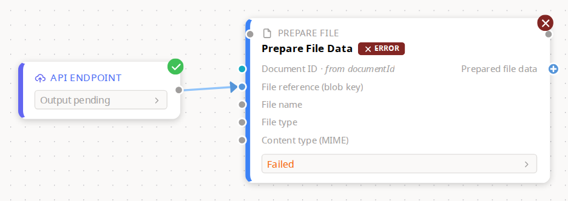

A real run of the **workflow-as-API** demo — the same demo the reviewer had open
when he reported this. The badges only exist while a run is active
(`NodeStatusBadgeOverlay` renders nothing without an `activeRunId`, so that a
design-time canvas isn't littered with gray dots), so there is no way to
photograph them except by really running something.

**This was two tight crops until 2026-08-08, and the reason is the point.** The
capture script's own comment said a wide frame "is unreadable right now because
the preview panels grow the cards mid-run and they overlap their neighbours" —
which was item 9. Item 9 is fixed, so both badges now fit in one legible frame
of the graph they actually live in.

Two other things this frame happens to show, both new in the same batch: the
grey band at the foot of each card is the **result strip** (§18 below), and
**item 10** — the green check sitting above *"cached output has expired"* — is
gone, because that verdict is no longer reachable during a live run. The API
Endpoint card says *Output pending* instead.

### §2 · Agent chat header — items 27, 28, 29

Three icons, three complaints, left to right in the shot:

| Icon | Was | Now |
|---|---|---|
| Stop | `IconPlayerStop`, an outlined square — *"I don't know what it represents"* | `IconPlayerStopFilled` |
| New conversation | `IconRefresh` — *"this says new conversation, while the icon says a refresh"* | `IconPlus` |
| Close | `IconCircleX` — *"the cross is way too small … should only be a cross rather than a cross within the circle"* | `IconX` |

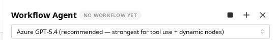

The stop button still lives in the header, detached from the conversation it
stops. That placement is **item 26** and is not in this batch — only the glyph
changed here, and it travels with the button when the button moves.

### §3 · The composer — item 25


**The reviewer was right and the cause was bigger than the chat.** He reported the
send icon as *"black on purple, not very accessible"*. Measured in the browser
on 2026-08-07, the enabled send button really did render a near-black glyph on
its coloured fill — `color: rgb(45,45,45)` on `background: rgb(85,149,217)`.

The cause was not in the agent chat at all. A project-wide rule in
[`ui/bcds-mantine-fallbacks.css`](../../apps/frontend/src/ui/bcds-mantine-fallbacks.css)
set the BC DS icon colour on **every** ActionIcon:

```css
.mantine-ActionIcon-root {
  color: var(--icons-color-primary);   /* near-black, unconditionally */
}
```

That beat Mantine's own `color: var(--ai-color)` on order, so it stamped
near-black over every *filled* icon button in the app — anywhere one exists,
not just here. It is now qualified to leave filled variants alone:

```css
.mantine-ActionIcon-root:not([data-variant="filled"]) {
  color: var(--icons-color-primary);
}
```

The button itself also moved off violet onto the theme's primary blue —
`appTheme.primaryColor` is `blue`, and the composer was the one place painting
its main action off-palette. The composer's focus ring followed it, off a
hardcoded `#845ef7`.

**One number worth knowing before this is called an accessibility win.** White
on the theme's filled blue `#5595D9` measures **3.14:1**. That clears the 3:1
floor WCAG 1.4.11 sets for non-text UI components, but not by much — and it is
*lower* than the near-black glyph scored on the same blue (4.37:1). The reason
the change is still right is the colour it replaced: on the violet that was
actually there, near-black scored **2.47:1** and failed, while white scores
5.55:1. So the reviewer's call was correct for the button in front of him.

The residue is a design-system question, not a chat question: **the app's
default filled blue is a marginal background for white glyphs everywhere it is
used.** Darkening the filled shade to `blue.7` (`#3470B1`) would take white to
5.12:1. That is the reviewer's call to make across the system rather than mine to
make on one button, so the button stays consistent with every other filled
action in the app and the question is recorded here.


**Verification:** frontend suite **2496 passed** across 205 files, `tsc
--noEmit` clean, Biome clean. The badge change carries a new regression test
asserting that `succeeded` and `failed` never render a circle-wrapped icon
again.

---

## Batch 8a — a port says there is something to add

Items **3** and **4**. One shared shape: something the author is meant to act on
did not look like it — an empty circle that hides an action, and three sentences
crushed into a toolbar that hides a decision.

### §4 · The "+" on an unconnected port — item 3

Hovering a port is the main way a graph gets built, and an empty circle does not
invite anything. The reviewer: *"maybe consider adding a small plus sign here …
they might not be able to discover it by themselves that there is something here
if they hover."*

An unconnected, **required** port now carries a `+`. Connected ports and
optional ports keep the plain dot — inviting someone to fill in something the
workflow does not need is the opposite of guidance. The glyph is a knockout:
two bars in the card's body colour cut across the family-coloured disc, so the
hue still says what can connect to what. Following batch one's finding that a
glyph inside a ring loses, the plus is not squeezed into the existing 12px dot —
an inviting handle grows to 16px, leaving a 12px disc for an 8px cross.

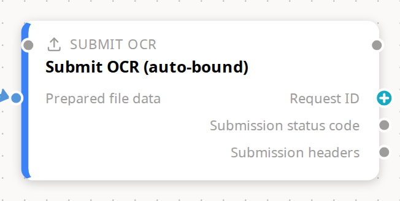

One card, three states, which is why this node was chosen over a tidier one.
**Prepared file data** on the left is bound to the step before it: plain dot.
**Request ID** on the right is required and goes nowhere: `+`. **Submission
status code** and **Submission headers** are optional and also go nowhere: plain
dots. The frame is zoomed — an inviting dot is 16px at 1:1 and a canvas fitted
to a graph sits well below 1:1, so "can you tell that it is a plus" is a
question about the zoom people actually work at.

### §5 · Error handling as a decision, not a toolbar — item 4

The three outcomes were a `SegmentedControl`. Alex, looking at it live: *"it's
not obvious to me that those are like the three options … I feel like they
should be radio buttons or something"*, and *"the third option also doesn't fit
on the screen"*.

They are now a labelled radio group, one per line, and the help text moved
**onto each option**. That second half is not decoration: a single line of help
below a vertical list reads as describing *the list*, not the selection.

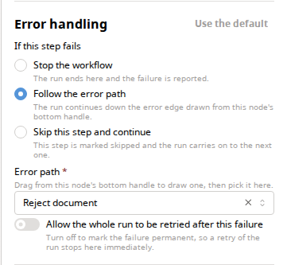

All three labels are whole, all three explanations are visible at once, and
nothing is clipped at the panel's width — which was the specific failure. The
shot is of the node's settings panel in the switch/error-edges demo, on a node
already set to *Follow the error path*, which is why the **Error path** picker
is showing underneath; that picker is existing behaviour, not part of item 4.

---

## Batch 8b — the error path, and failure at the title

Items **5**, **7** and **19**.

### §6 · The error handle explains itself — item 5

*"I don't even know first what the red dot is … and then like even if I notice
it, then it doesn't do anything."* The bottom `error` handle had no tooltip and,
unlike every other output handle the user had been trained by, hovering it
opened nothing.

Both halves are in one frame, because hovering produces both at once:

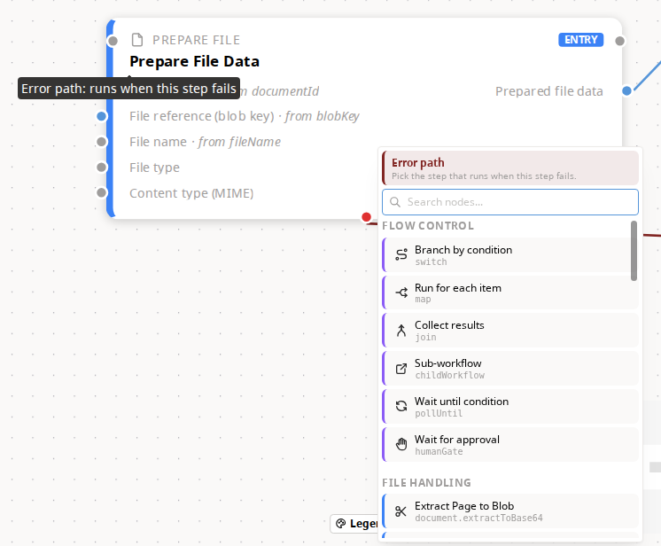

- The tooltip names the dot — **"Error path: runs when this step fails"**.
- The popover is the same hover-to-extend list every other output handle opens,
  in an **error-path mode**: a red banner headed *"Error path"* over the line
  *"Pick the step that runs when this step fails."*, so picking here is visibly
  a different act from ordinary wiring.

**What this shot does not show:** the edge a pick draws. Clicking a row does
work, and the edge it creates is genuinely `error`-typed with `fallbackEdgeId`
recorded — but it is not photographable on this graph. The new node is dropped
at a fixed offset with no re-layout, so it lands on top of the card it was
wired from, hiding both the source and the new edge; fitting the view to recover
puts the pair at a zoom where no label reads. Three framings were tried and all
three argued the wrong thing, so no frame was kept. That part of item 5 rests on
its tests.

### §7 · Failure named at the node's title — item 7

*"If it's an error, maybe it's better to mention it alongside the node name or
the title, because you will probably start reading from here and then you know
which step is an error — rather than at the top right of it."* Reading order is
title-first; the failure marker was in the last place the eye goes.


The whole card is in frame deliberately: item 7 asked for the verdict at the
title **as well as** the corner, not instead of it, and a crop that excluded the
corner badge would be arguing the opposite case. The chip carries the engine's
message on hover, the same text the badge and the no-output notice use.

This is a real run of the workflow-as-API demo — the chip only exists while a
run is live, so there is no way to photograph it except by running something.
Two other things in the frame are worth naming rather than explaining away: the
red panel reading *"This step failed — no output was produced to preview"* is
**item 11**, already shipped, and the neighbouring card visible behind this one
at both edges is **item 9**, below.

### §8 · The group is its own right-click target — item 19

*"I was trying to ungroup it … I'm just right clicking [the group]. Nothing is
happening. And then I realized, oh, I need to be on a particular node."*

Right-clicking the group's header strip now offers **Ungroup**, running the same
code path the member-node entry runs.

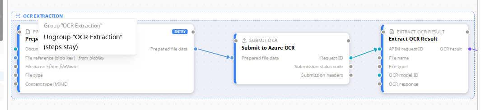

The dashed container is in frame with the menu on purpose: what was missing was
the *target*, not the entry, and the three cards inside the box are what
*"(steps stay)"* is promising to leave behind. The demo is the Part 6 grouping
demo, the only seeded workflow that carries `nodeGroups` — two of them, **OCR
Extraction** and **Finalize**.

The item shipped **header-only**. Right-clicking the group's interior still
opens the pane menu, deliberately: making the box's whole area a group target
would take "add a node here" away from a large part of the canvas, and adding a
node inside a group's area is an ordinary thing to want. Discoverability came
from the header's own tooltip instead — *"Drag to move the whole group · click
to open its settings · right-click to ungroup"*.

---

## Batch 9 — the workflows table fits · item 18

*"The delete icon is outside of this row and it's truncated … there's no
horizontal view, I'm at full view, I'm not zoomed in or zoomed out."*

The column widths are now pixels derived from the buttons' real dimensions
rather than percentages, and Name carries no width at all so that under fixed
layout it absorbs whatever the sized columns leave.

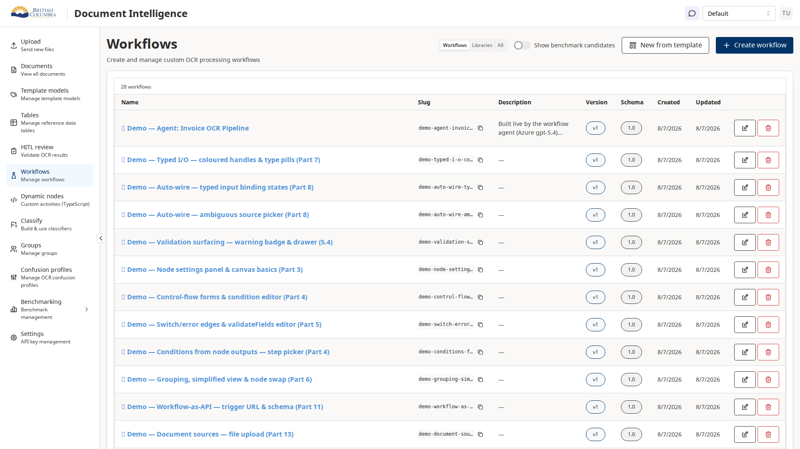

**This shot is the evidence, not the tests.** jsdom runs no table layout, so the
unit tests can only pin the rule — pixels not percentages, a floor on the table
— while whether the row actually fits is a question only a browser can answer.
It is the whole 1920×1080 window rather than a crop of the table, because a
scrollbar is a fact about the window's edges and a crop would cut off the thing
being claimed.

Measured in Chromium on 2026-08-08 at 1920px, alongside the frame: the table is
1612px inside a 1612px wrapper (`scrollWidth === clientWidth`, so no overflow),
the document's `scrollWidth` equals its `clientWidth` at 1920 (no page-level
horizontal scroll), and the delete button's right edge sits at 1814px inside a
row ending at 1886px — 72px of margin, where it used to hang past the row.
Columns come out at Name 712, Slug 193, Description 209, Version 84, Schema 88,
Created 92, Updated 92, Actions 140.

---

## Batch 12 and wave E — replay, and an agent that says what went wrong

Items **13**, **22**, **24** and **23**. Four surfaces that all had the same
shape of defect: the app knew something and did not say it out loud.

### §12 · Replay mode reads as a mode — item 13

Clicking a row in run history puts the editor into **replay** — a read-only view
of a past run, where the canvas shows the graph that run used and every edit is
silently dropped. It used to announce itself with a small chip parked next to
the Undo button. Alex, seeing it: *"there's like a weird tag there … it makes
sense for it to be an indicator somewhere, but perhaps not there and not like
that."*

It is now a full-width banner between the top bar and the canvas, and each of
its three states is a headline plus a sentence rather than a squeezed label.

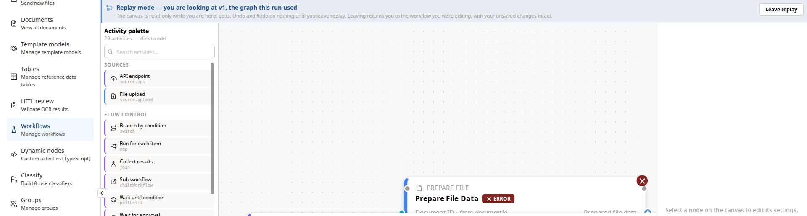

The sentence is the point. Replay's real effect used to be scattered across
controls that just went quiet — Undo and Redo disabled, config edits dropped by
three `if (isReplay) return;` guards — so an author could drag a node, type in a
field, press Ctrl+Z, and get nothing, with no explanation anywhere. The banner
now says it: *"The canvas is read-only while you are here: edits, Undo and Redo
do nothing until you leave replay."*

**Why the top bar is not in this frame, and how placement is evidenced instead.**
The bar's right-hand corner was being reworked while this was captured — item 8
collapsing the separate **Try** and **Run this workflow** buttons into one
`Run…` — so any frame containing it would have been stale the day it was taken.
That corner has since settled and has its own frame in [§16](#16--the-name-is-first-and-one-button-where-there-were-two--items-14-and-8).
The banner is full width and its
**Leave replay** button sits at the far right, so a crop narrow enough to dodge
that corner would also have cut off one of the two controls this item shipped.
The frame therefore starts at the exact pixel the top bar ends, and the capture
script refuses to save it unless that is true. Measured in
Chromium at 1920px alongside the frame: **the top bar's controls end at 103px,
the banner runs 112–168px (56px tall), and the canvas begins at 168px** — the
banner starts below every top-bar control and ends exactly where the canvas
starts, which is what "between the bar and the canvas, taking its height out of
the canvas" means as a coordinate.

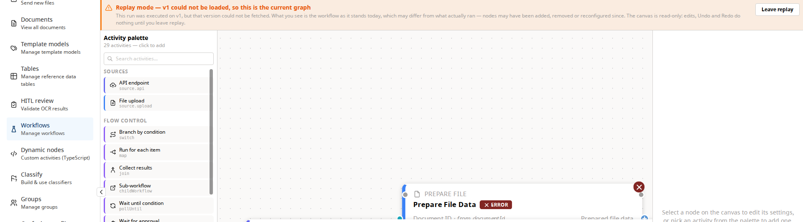

**This second frame is fault-injected, and says so.** It is the state that
matters most — the one where the graph on screen is *not* the graph that ran —
and it is unreachable by clicking on this database: every one of the 18 recorded
runs points at a workflow version that still resolves, checked by walking every
run of every workflow. Reaching it needs the version fetch to fail, so the
capture script fails that one request (and only that one, matched to the exact
endpoint) at the network layer. Everything in the image is the app's own
rendering of a real condition; only the condition was arranged. Nothing was
cropped, edited or substituted.

That state is also the reason item 13 became a banner rather than a top-bar
region at all. The old chip had to carry the sentence *"you are looking at the
current graph for an older run"* inside a control sized for one word. Here it
has room: **"Replay mode — v1 could not be loaded, so this is the current
graph"**, followed by *"…the workflow as it stands today, which may differ from
what actually ran — nodes may have been added, removed or reconfigured since."*

### §13 · The agent says why it failed — item 22

*"I ran the prompt. Nothing. Why is it not working?"* … *"No error message, no
feedback."* The agent chat had two separate silences, and the conversation now
speaks in both cases.

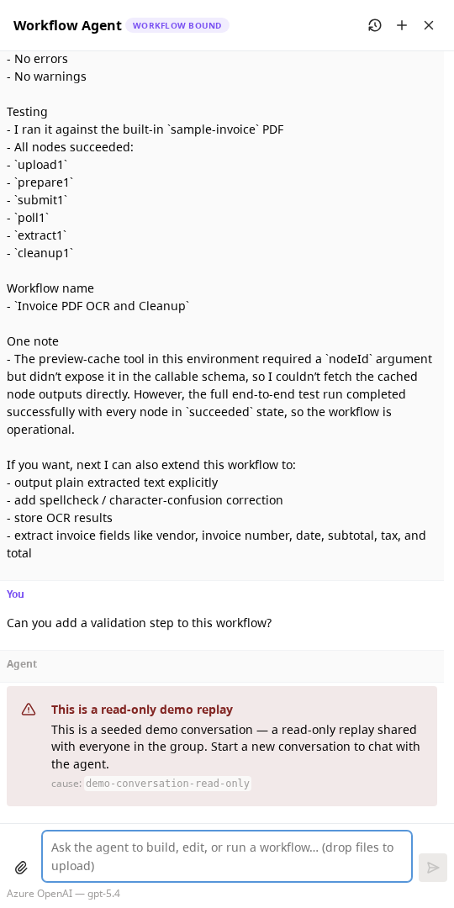

**The failure in this frame is real and it cost nothing.** Sending a message
into a *seeded demo conversation* — a shared, read-only replay of a chat that
already happened — is refused by the backend on the third statement of
`AgentService.startChat`, above every provider call, with HTTP 403 and the code
`demo-conversation-read-only`. So this exercises exactly the path item 22 built:
a typed refusal, carried intact through Nest instead of being flattened to
`{"statusCode":500,"message":"Internal server error"}`, parsed by
`describeAgentChatError`, and rendered as `agent-chat-error` at the end of the
thread. It was chosen over an ordinary send deliberately — this machine has a
working Azure deployment configured, so a plain turn would start a real billable
completion, and would succeed, which is the one thing that cannot photograph an
error.

Three things in the frame are the item, not decoration. The alert is **inside
the conversation**, last in the thread, so a failure reads as the turn's
outcome rather than as panel chrome. The headline names the *kind* of failure
and the body is the backend's own sentence, not a generic one. And `cause:
demo-conversation-read-only` is the machine-readable code, which is what makes a
bug report about this actionable. The alert clears itself when the next turn
starts.

### §14 · The seeded demo conversation opens for anyone in the group — item 24

He opened the seeded agent demo, clicked *Show past conversations*, and got
nothing — twice, including after a reload.

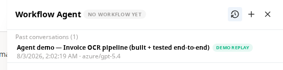

**The identity in this frame is not the identity that seeded the row**, which is
the whole of item 24. Chat conversations are private to their creator; the
seeded transcript was created by the seed user (actor `cmsbant4c…`) while the
screenshot is taken as the API-key identity (actor `cmsbant5o…`, a separate
actor row that every API key gets), so before this change the list was correctly
and uselessly empty. The demo is now marked `isDemo` and is visible to every
member of **its own group**, which is why it lists here.

The **demo replay** badge and the missing delete button are the other half. A
demo is shared, so it is nobody's to delete and nobody's to append to — sending
into one returns the 403 photographed in §13 rather than putting one reader's
follow-up into everybody else's demo.

### §15 · The model picker offers what the backend can serve — item 23

The picker used to be six hardcoded model names with the default being simply
the first array element, so every turn asked for `gpt-5.4` — a deployment nobody
but Alex could call — no matter what the backend actually had configured.

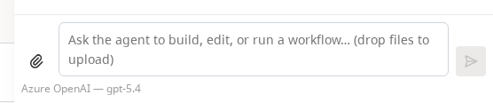

It now renders `GET /api/agent/models` and nothing else. **On this machine that
list has exactly one entry**, because `AZURE_OPENAI_DEPLOYMENT` holds one
deployment name and no multi-deployment configuration variable was invented to
pad it out. One entry renders as a static line naming the model rather than as a
dropdown whose only option is already chosen — a control that cannot do anything
is worse than a label, because it implies a choice that does not exist. Hovering
it says *"The only model this server is configured for."* (the tooltip is not in
frame: Mantine centres it above its target, which puts it straight across the
composer's placeholder, so it hid the input the label is meant to be sitting
under).

The picker's move down here beside the composer is item **30**, and the send
button is item **26** — the same button becomes a stop button while a turn is
streaming. Both are described in the written section below.

---

## The top bar, final — items 14 and 8

The one corner of the editor that could not be photographed until now. Every
earlier pass deliberately framed around it, because the two buttons on its
right-hand end were mid-collapse and a frame of a control about to be replaced
argues for a design nobody shipped. Item 8 landed as `9cf679ff`, so the bar is
final and both items read in one image.

### §16 · The name is first, and one button where there were two — items 14 and 8

Two complaints, opposite ends of the same bar.

*"The title, where I am, probably should be the first thing. Switch probably
should be somewhere else. I don't think it should be a button."* His model,
demonstrated live in Figma, is the Google Sheets pattern: the document name is
the leftmost thing, you click it to rename, and a chevron beside it opens the
list of other documents.

And, on the other end: *"Two options pretty much doing the same thing. And even
if I choose one, I still have the option to go to the other."*

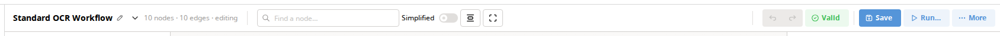

**Left end, item 14.** The workflow name leads, click-to-edit as before, with a
chevron `ActionIcon` beside it that opens the switcher. The labelled **Switch**
button is gone, which returned about 93px of bar. The node and edge counts
follow the name rather than preceding it.

**Right end, item 8.** Where there were two buttons — **Try** and **Run this
workflow** — there is now one, `Run…`. Both used to open the *same* drawer on
different tabs, so the bar was offering a choice that the drawer then offered
again one click later. The choice now lives only where it belongs, on the
drawer's tabs, and the button says only that a run is about to be configured.

**Two things in this frame are machine-checked, not eyeballed**, because a shot
that has to be trusted is weaker than one that has been measured. The capture
refuses to save it unless the old `try-button` test id is absent from the page
entirely, and unless `Run…` is *enabled* — a greyed-out button photographs as
"the feature is off" rather than "there is now one of these".

**Why this frame is of a real workflow rather than a seeded demo.** Every demo's
name opens with a 🎯, and headless Chromium has no font for it, so it renders as
an empty box — the worst possible first glyph in a frame whose argument is *"the
name is the first thing you see"*. **Standard OCR Workflow** has a plain name,
and it is the workflow the reviewer was hunting for when he hit the switcher's
truncated list.

### §17 · What `Run…` opens, and the sentence that names the real difference — item 8

This is the more useful of the two frames. Collapsing two buttons into one is
tidying; the sentence at the bottom of this drawer is the item.

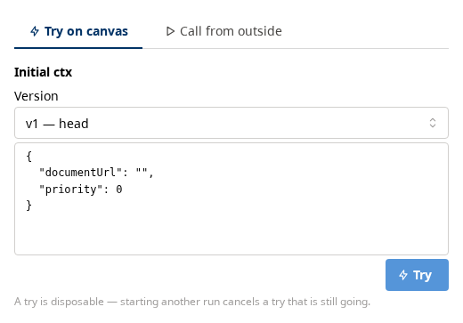

**The tabs were renamed because the old ones named a difference that does not
exist.** "Try" and "Run" imply a strength of commitment — a rehearsal versus the
real thing. There is no such difference: both start a real Temporal execution
against the saved version and both land in run history. The axis that *does*
exist is where the answer appears, so the labels now say that — **Try on canvas**
and **Call from outside**.

**And here is the one real difference, stated in the product for the first
time:** *"A try is disposable — starting another run cancels a try that is still
going."* A try posts to `/tries`, which stamps the run `RunTrigger = "try"`, and
every later run start cancels in-flight runs carrying that stamp. Nothing in the
UI had ever said so, which is how you lose a long-running try to your own next
click and have no idea why. Alex, in the call: *"at some point I asked what's the
difference between run and try and it gave me some sensible answer, but now I
don't remember what it was."* The answer is now in the drawer instead of in
somebody's memory.

The drawer opens on **Try on canvas** without anything being clicked — that tab
is chosen whenever the workflow has an input path that is not a file upload —
and the capture asserts that, plus that the sentence is present and non-empty,
before saving. A frame of a tab rename with the sentence missing would be a
picture of the wrong half of the item.

---

## §18 · Pressing Try no longer moves anything · item 9

Alex, watching the shared screen: *"when you hit try, it also resized the boxes
and they started to overlap in a strange way … it's kind of jarring."*


That is the **before**, kept. The **API Endpoint** card has grown to fit its
preview pane and is lying straight across **Prepare File Data**, covering its
port rows, its bindings and half its body.

The mechanism was arithmetic, not styling. `estimateNodeHeight` made no
allowance for a preview because at rest there isn't one, dagre separates ranks
by 60px, and the preview pane was capped at 200px with a 120px loading
skeleton. So a card grew up to 200px into a 60px gap — and grew *twice*, once
for the skeleton and again when real content replaced it. That is the "strange
way": cards don't just get bigger, they get bigger at two different moments,
per node.

**Option C, as ruled.** Every card that can produce output now carries a
fixed-height, one-line **result strip** at all times — including before any run,
where it says *Not run yet*. The full scrollable preview moved into a popover
behind it, reading the same shared query, so opening one costs no request.

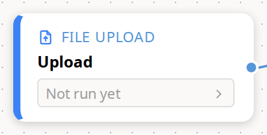

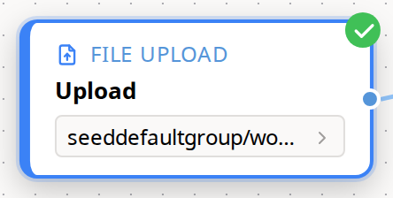

Those two frames are the whole fix: **the same card, the same size**, before and
after. Pressing Try changes what the strip says and never how tall the card is.

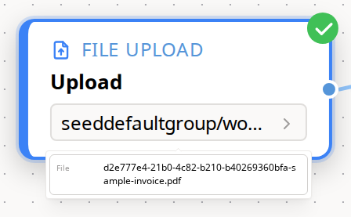

The value is one click away, not gone.

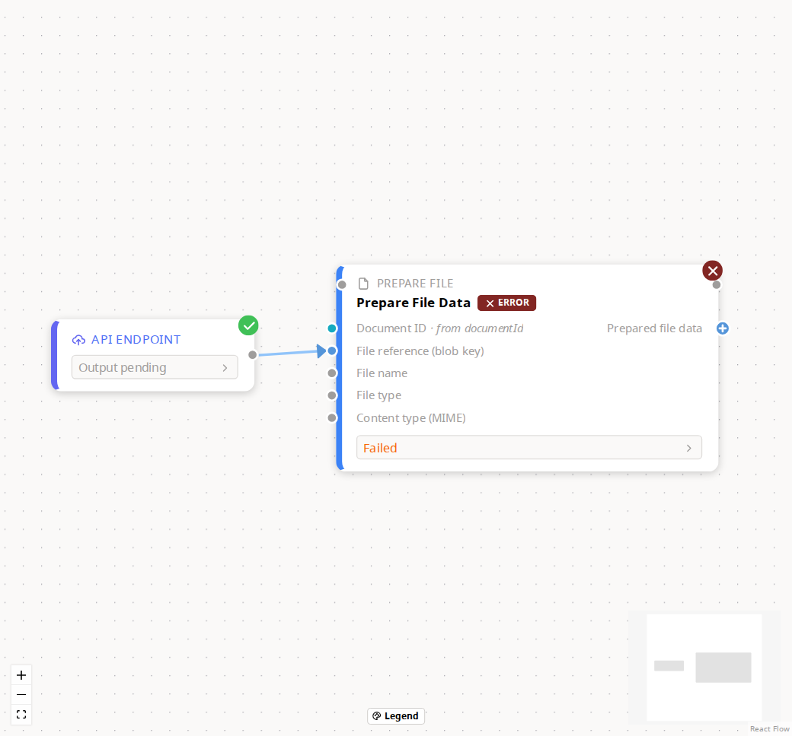

And the wide frame that used to be impossible. The shot that hunted for the
worst overlap now runs the **same search as an assertion**: if any two cards
still overlap after a Try, the capture fails loudly rather than saving a frame
that quietly contradicts its caption.

**Measured, not eyeballed.** jsdom runs no layout, so the guarantee was checked
in Chromium: every card's `offsetHeight` and `offsetWidth` on `standard-ocr`,
sampled before a Try, twenty-four times during it, and after. **0px drift in
both axes on all fifteen nodes.** An earlier run of the same measurement caught
5px on the one node that failed — the failure chip appearing, not the strip.

**And a second reflow, found by taking these pictures rather than by any of the
2,685 tests.** A node card is shrink-to-fit, so a child with `width: 100%` still
offers its *content* as its preferred width and drags the card out with it: the
upload card measured 200px at rest and **606px** the moment its DocumentRef
landed, covering the node beside it. Auto-layout never sees that one — it
estimates width per node *type*, not per value. Fixed with `width: 0` +
`minWidth: 100%`, and pinned by the same table that pins the height.

**What it cost.** During a run you now see *that* each node produced something
and roughly what, rather than every node's whole payload at once. The strip
shows the value's first line, per the ruling on the follow-up question. It does
**not** show the kind: on the 200px upload card, "DocumentRef" took so much of
the one line that the DocumentRef itself rendered as "seedd…", and the kind is
already on the card's output port pill. It names the port instead, and only when
a node has more than one.

---

# The fixes that have no picture

Everything above is a change you can point a camera at. Much of this batch is
not: a keyboard shortcut that stopped being eaten, an environment variable that
was blank and read as filled, a reported bug that could not be made to happen
again. Those are written down here so this document is the whole batch rather
than its photogenic half.

Ordered by what matters, not by when it was found. Where the checklist's own
diagnosis turned out to be wrong, the entry says so — those are the most useful
ones to read, because a wrong diagnosis that ships quietly is how the same bug
comes back.

## An empty environment variable counted as a credential — item 23

**TL;DR — the server treated `ANTHROPIC_API_KEY=""` as "Anthropic is
configured", handed the model library a blank key, and the user got a mid-stream
authentication failure instead of a clear refusal. Blank now means absent. The
same bug also meant a blank step limit was read as a limit of zero, so the agent
was allowed no tool calls at all.**

The agent reads its settings — provider keys, endpoints, deployment names,
numeric bounds — out of environment variables at startup. It read every one of
them with `?? null`, which is JavaScript's "use the fallback only if the value is
null or undefined". An empty string is neither. So a variable that exists but
holds nothing counted as a value.

That is not a hypothetical: the repository-root `.env` carries an empty
Anthropic key. The check that answers *"is this provider usable?"* said yes, the
resolver picked Anthropic as the default, and the request went out to Anthropic
with a blank credential. What came back was an HTTP 401 **after** the response
had already started streaming — which is precisely the shape of failure that the
typed-error work below could not catch, because by then the headers are on the
wire. So the "the agent does nothing" symptom had two independent causes, and
this was the quieter one.

Every setting is now trimmed of whitespace and an empty read counts as absent.
That change caught a second bug for free: a blank numeric bound was being parsed
with `Number("")`, which in JavaScript is **zero**, not "unset". `AGENT_MAX_STEPS`
is the ceiling on how many tool calls the agent may make in one turn, so an
empty value meant a ceiling of zero — the agent could plan, and then do nothing.

**One thing was flagged rather than fixed**, because fixing it was outside this
item: `docker-compose.yml` gives the language-model credentials to the Temporal
worker container and none to the backend container, so the agent would refuse to
start in Docker. This change makes that stricter, not looser, and it is worth
knowing before anyone runs the agent in a container.

## The agent's two silences — item 22

**TL;DR — a failed agent turn produced nothing at all on screen. There were
three separate reasons for that, in three different places, and all three had to
be fixed before the conversation could say a single word about a failure.**

*"I ran the prompt. Nothing. Why is it not working?"* The checklist guessed one
cause. There were three.

**First, the cause was destroyed at the HTTP boundary.** When no usable model
provider was configured, the code threw a plain `Error`. NestJS — the backend
framework — has no way to turn an unrecognised error into anything but
`{"statusCode":500,"message":"Internal server error"}`. The reason existed
inside the server and was thrown away on the way out. It now throws a typed
exception carrying a machine-readable `code`, the provider's name, and the
**names** of the environment variables that are missing — names only, never
values, so the response can be pasted into a ticket safely.

**Second, anything that failed mid-stream said "An error occurred."** Once the
response has begun streaming, later failures — a rejected key, a deployment that
does not exist, a rate limit — go through the AI SDK's default error masker,
which writes that literal string and nothing else. The stream now gets an error
handler that names the HTTP status the provider returned and what the provider
itself said, forwarding no URL, no header and no request body (any of which can
carry a key) and truncating at 400 characters.

**Third, the frontend dropped both on the floor.** The chat runtime was created
without an `onError` handler, so even the useless string never reached the
screen. It now stores the failure and renders it in the thread — the red alert
photographed in §13 above.

The refusal for a conversation that has spent its token budget was folded into
the same shape, so there is one error path rather than three.

## The seeded demo was invisible because per-user privacy was working — item 24

**TL;DR — the demo conversation was not missing, it was private. It belonged to
the identity that seeded it, and every other person — including the API-key
identity the demo links use — was correctly shown nothing. The fix names the
distinction instead of weakening the privacy rule.**

Chat conversations are scoped to the person who created them. The seeded demo
transcript was created under the seeding user's identity, so for anybody else the
list was empty, and reloading could never help — reloading does not change who
you are.

The tempting fix is to relax the visibility rule, and it would have quietly made
every private conversation in the system group-readable. Instead the demo is now
marked as one: a `isDemo` flag on the conversation row, set by the seeder. The
visibility rule is *"in the caller's group **and** (created by the caller **or**
flagged as a demo)"* — with the group condition a sibling of the or-clause, not
a branch inside it, so a demo can never leak to a group that does not own it.
There is a test guarding exactly that bracket, because getting it wrong is a
one-character mistake with a data-exposure consequence.

Demos are read-only for everyone, including the person who seeded them: writing
to one returns a 403 rather than putting one reader's follow-up into everybody
else's demo. Deleting stays owner-only. The switcher badges the row and
withholds its delete button, both visible in §14.

## The top bar overflowed on any laptop screen — found while measuring item 14

**TL;DR — the reported bug was cosmetic ("the title should come first"). The
measurement taken before touching anything found a real layout failure at every
width below 1512 pixels: controls escaping their own container and landing on
top of each other, and at 1280 the bar itself running off the window.**

Item 14 was a placement request — Alex's model, demonstrated live in Figma, is
the Google Sheets pattern where the document name is the leftmost thing, you
click it to rename, and a chevron beside it opens the list of other documents.
That shipped, the standalone **Switch** button retired, and that half *does* have
a picture now: [§16](#16--the-name-is-first-and-one-button-where-there-were-two--items-14-and-8).
What has no picture is everything below, because a defect that only appears
between 1024px and 1512px would need six frames to argue and the fix is the
absence of something.

The interesting part is what the before-measurement found. At seven window
widths in Chromium, from **1512px downward**, the top bar's centre section spilled
its contents outside its own box and the Undo/Redo buttons came to rest on top of
the Simplified-view switch — at 1440px the overlap was exactly the pair that had
been reported anecdotally — and at 1280px the bar overflowed the window by 15px.
A 1512px-wide window is a 14-inch MacBook Pro at its default scaling, so this was
not an edge case.

Three flexbox rules caused it, and naming them matters because the fix is to
state a shrink order rather than to add a breakpoint. The left section was marked
`flexShrink: 0`, meaning "never give up width", despite being almost entirely
truncatable text. The centre section had `minWidth: 0`, which permits a
no-wrapping flex container to shrink below the size of its own contents — the
container gets smaller and its children stay put and spill out. The right section
had no shrink rule at all. Now the right section is the one that never yields,
the centre has a floor of its own content width, and the left absorbs the
pressure by truncating the title. Retiring the Switch button returned about 93px
and the node search box gave up 30px of its minimum. **After: no overlap and no
overflow at 1920, 1600, 1440, 1366, 1280 or 1152.** The first overlap is now at
1024px with the left section fully collapsed. Nothing is hidden behind a menu;
the controls simply get narrower.

**Honest limit.** jsdom — the fake browser the unit tests run in — gives every
element a zero-by-zero rectangle, so none of this is reproducible in the test
suite. The tests pin the three flex rules so that a revert fails in continuous
integration rather than in a screenshot months later; the Chromium measurements
are the actual evidence. The 1280px result (the workflow-name truncating, the
node counter squeezed out) is a judgement call worth someone's eyes on a real
screen.

## Ctrl+Z was swallowed by every non-text control in the settings drawer — item 1

**TL;DR — the undo shortcut had a guard that stood down whenever the keyboard
focus was on an `<input>` element, on the reasonable theory that the browser's
own text undo should win. Radio buttons and checkboxes are `<input>` elements
too, and they have no text to undo — so after clicking any of them, Ctrl+Z did
nothing at all.**

The reviewer set **Error handling → Follow the error path** in the settings drawer,
pressed Cmd+Z to back it out, and nothing happened, while the top-bar Undo button
worked fine. Alex's guess in the call was that the shortcut was scoped to the
canvas; it is not, the listener is on the window.

The real cause was verified in the shipped Mantine 8.3.9 source rather than
assumed. A `SegmentedControl` — the three-option strip the error-handling choice
used to be — renders each option as a real hidden `<input type="radio">`. After
you click one, that radio holds the keyboard focus, so the next keypress has an
`INPUT` element as its target, and the guard bailed out.

The guard now stands down only where the browser genuinely has a text-undo stack
to protect: an `<input>` whose type is one of email, number, password, search,
tel, text or url; a `<textarea>`; or a contenteditable region — and in each case
only when it is not read-only. Everything else falls through to the graph's own
undo: radio, checkbox, range, colour, file, the button types and the whole
date/time family.

**Two things this fixed that nobody reported.** A Mantine `Select` that is not
searchable renders as a *read-only text input*, so a guard based on element type
alone would still have eaten undo there — which is why the read-only clause
exists. And the old code had a separate branch for `<select>` elements, which
have no text undo at all and were suppressing the shortcut for nothing.

**A related defect was found and deliberately not fixed**, because it belongs to
a different item and inventing work is how a review batch stops converging: the
settings drawer's Description and Version fields push an undo entry on **every
keystroke**, so typing one word costs roughly eight Ctrl+Z presses to back out,
and the 50-entry undo stack forgets real graph edits after a couple of
sentences. Every other text field in the feature commits on blur specifically to
avoid this. It is Alex's call.

## The chat appears where it works, and stop lives with the conversation — items 21, 26, 30

**TL;DR — three separate complaints about the agent chat panel, all fixed
together because they touch the same file. The chat icon no longer appears on
pages where the agent cannot do anything; the stop button is now the send button
mid-turn; and the model picker and conversation history swapped ends of the
panel.**

**The chat entry point was everywhere the agent is not.** *"I just pressed here
to come to the main screen and then I saw chat. I'm like, okay, let's do this …
and then nothing is stopping me."* The icon was mounted in the application's root
layout, so it rendered on every route, while the agent's tools only act on
workflows. Both the icon **and** the drawer are now gated on the workflow routes,
read off the router rather than guessed from the URL string. Gating both is not
belt-and-braces: gating only the icon would strand an already-open drawer on the
documents page. It is deliberately not narrowed to the editor alone, because the
agent's own "create workflow" tool navigates from the list page into the editor.

**The stop control was outside the conversation it stopped.** *"Generally what
happens with other AI agents is this send button changes to stop when it's
working, and once it's done it reverts back to send."* It does that now, and
stopping still does both halves of the job — tearing down the stream in the
browser and telling the backend to end the run. Both states stay filled blue, so
the button changes its job and its glyph rather than appearing to become a
different button mid-turn.

**The panel's two ends were the wrong way round.** The model picker moved down
beside the composer, where you are actually looking while typing; past
conversations moved up to the header beside new-conversation and close.

**Where the checklist was wrong.** It said the model picker and the conversation
switcher "both sit in the drawer header". The switcher was never in the header —
it was a separate collapsible strip rendered *below* it. That is why the fix is a
lifted open/closed prop rather than a move of markup, and it is the reason the
header button in §14 controls a panel that is not inside the header.

**Three references broke outside the files this touched** and were fixed in the
same commit: the end-to-end test page object still pointed at the removed abort
button's test id, a handoff document described the old placement, and a manual
test-plan step named the old test id. A fourth mention was left alone
deliberately — it is a dated record of a past walkthrough, not a live pointer.

## The switcher stopped hiding workflows — items 15, 16, 17

**TL;DR — the workflow dropdown behaved like a search tool over a huge corpus
when it is a picker over about 29 items: it capped the list at 12, dimmed the
row you were standing on, and would not close when you clicked away. All three
are fixed, and the reason the third one was broken is not the reason the
checklist gave.**

The cap showed *"+13 more — refine the search"* with no filter to refine with,
so the reviewer could not find the workflow he had been working in minutes earlier.
The cap and the dead line are gone and the list scrolls. The current row used to
be `disabled` and dimmed with the literal text `(current)` while every other row
was bold — *"its hierarchy is lower than the inactive ones, which should be the
reverse."* It now carries the highlight, the weight and a check mark, expressed
as "current" rather than "disabled" so that assistive technology reads it
correctly too.

**Where the checklist was wrong, and this one is worth reading.** It blamed the
click-outside failure on a missing `closeOnClickOutside` property. That property
already defaults to on. The real cause is React Flow's canvas: the zoom library
underneath it calls `stopImmediatePropagation` on mousedown, and Mantine's
click-outside detection listens for `mousedown` and `touchstart` only — so the
event never reached the document and the dropdown never learned it had been
clicked away from. Adding `click` to the listened events fixes it, because the
zoom library only suppresses the click when the pointer actually moved. The
Escape key was broken for an unrelated reason: Mantine handles Escape from
inside the dropdown, which needs the focus to be in there, so trapping focus is
what makes it work.

**Honest limit.** jsdom has no zoom library, so the new test guards against the
property regressing but cannot reproduce the propagation bug. That half is
confirmed by reading the source and by a browser pass, not by the suite.

## The demo link that 404s — item 31, and its acceptance criterion was never met

**TL;DR — the fix shipped and is right either way, but the item asked for
something that nobody did. The link, the route and the seeder were all proven
correct; "his database had no demos in it" is the best remaining explanation by
elimination, not a measured one. Nobody has asked him.**

*"This link was not working for me … not found."* The checklist's hypothesis was
that the seeder's generated URL slug and the test plan's link had drifted apart.
That was checked and disproved before any code was written: after running the
seeder they match character for character. What the reviewer hit was a
seeding-state problem on his own machine — the seeder opens by deleting the
previous demo set, so an interrupted run leaves none at all.

So the real defect is that a missing workflow dead-ends on a bare "not found".
The miss now names both possible causes and gives the command. It deliberately
does **not** try to detect a demo-looking address and give a more confident
message: the seeder marks demos with an emoji prefix on the name, the backend's
URL-slug generator collapses every non-alphanumeric run to a hyphen and destroys
that emoji, so a `demo-` prefix is not exclusive to seeded demos. Branching on it
would confidently tell someone whose own workflow had vanished to run a command
that *deletes and recreates the demo set*.

**The part to be honest about.** The item's own acceptance line was *"confirm
with the reviewer whether re-running the seeder fixes it on his machine."* That was
never done, and nothing in this batch records a check of his machine. What was
demonstrated is the negative — the link, the route and the seeder are correct,
and the workflow was absent from his list rather than merely unreachable. The
batch's own wording elsewhere ("turned out to be an unseeded database") states
that a register more confidently than the evidence supports.

There is a residual risk worth naming, and it is the reason this matters rather
than being pedantry. If the row was *invisible* rather than *absent* — which is
exactly the failure mode the seeded chat demo turned out to be, where a row
existed but belonged to another identity — then the new message sends the reader
to a destructive command for nothing. Ask him when showing him this batch.

## The undismissable error message — item 12, not reproduced

**TL;DR — a reported error that could not be closed. After a genuine attempt to
reproduce it, it does not appear to exist in the flow described, and no close
button was added on spec.**

From the reviewer's written notes: run history → open a run → *"no way to cancel
the error message."* He could not reproduce it live in the call either, and Alex
agreed to shelve it: *"we'll shelve it and see if it could be reproduced."*

The attempt was real rather than a shrug. Run history was opened (54 rows),
replay entered on the newest run, a run started from that state and driven to
failure, and then every alert and every notification element on the page was
enumerated: two node preview panels, both carrying actions, and no undismissable
surface anywhere.

One near-miss was found and is worth recording because it will be the first thing
anyone suspects next time. Forcing the run-list request to fail *does* produce a
"Failed to load runs" alert with no close button — but it appears before you
select a run, it clears itself on the next successful fetch, and it lives inside
a drawer that has its own close control. That is not the surface described.

No speculative close affordance was added. A close button on an alert nobody can
find is a change that can never be verified and can only rot.

## Two different undo granularities — item 2, closed as no-change

**TL;DR — undoing in the workflow-name field goes back a word at a time, and in
the drawer's description field a character at a time. That difference is real,
it is not our code, and making the two match would mean changing how one of the
fields works. Closed with the cause identified rather than shrugged at.**

*"On the name field, that's by word. And the side panel is by character."* Both
are the browser's own built-in undo, so a difference normally means one of the
two fields is rebuilding its value on every keystroke and destroying the
browser's undo history. Neither of them is: the title keeps a local draft and
commits on Enter or blur, and the drawer's description round-trips through a
synchronous state update, so React writes nothing back into the DOM in either
case.

The difference is `<input>` versus `<textarea>` **inside React itself**. React's
textarea update path assigns to the element's `defaultValue` property on every
keystroke, and on a textarea that property *is* the element's child text — so
each keystroke mutates the element's children, and the browser ends its
"typing transaction", which is the unit undo works in. React's input update path
writes only the `value` attribute, which the editing host ignores.

Making them behave alike would mean rendering the description as an uncontrolled
field — a behaviour change to a field this item did not ask about. The item said
that if the difference turned out to be pure browser behaviour with no
application cause, it should be closed as no-change with the reason recorded.
That is what happened.

## The test plan appeared to skip six steps — item 32

**TL;DR — the manual test plan's Part 14 jumped from step 14.6 straight to
14.14, so anyone reading top-down assumed six steps were missing. They were not
missing, they were filed out of order. The step was moved rather than renumbered,
on purpose.**

Renumbering would have looked tidier and broken references in three documents
and in the titles of the automated security tests, which name steps 14.11, 14.12
and 14.13 explicitly. So 14.14 moved to the end of Part 14, where its number
already put it. Reading order is now monotonic and zero cross-references
changed.

Found while doing it: the plan already said to seed the database before Part 14
— twice, in a header block 630 lines earlier, including the sentence *"Links 404
until the seeder has run."* That note is now repeated locally beside the demo
links, because 630 lines is further than any reader carries an instruction.

## Thirty-two colours became ten — item 20

**TL;DR — the reviewer counted the legend and got "12 to 13". He was exactly right
about the number on screen and understating the problem: the canvas painted 32
distinct colour values carrying about 24 separate meanings. The port dots are
now five families, each with a SHAPE as well as a colour, and the card borders
are five roles instead of thirteen. The one thing worth arguing about is that
this took the seven activity-category border colours down to one.**

Why it had to shrink rather than be re-picked: I simulated red-blind and
green-blind vision on the hexes actually being rendered and scored the distance
between every pair. Two colours under about 11 read as the *same* colour. Three
port pairs and fourteen border pairs were under it, several with no brightness
difference to fall back on either — References teal and Untyped grey simulated
to `#9E9E9C` against `#9E9E89`, which is one dot. Thirteen hues cannot be pulled
apart no matter which thirteen you pick.

### The five port families, on a real graph

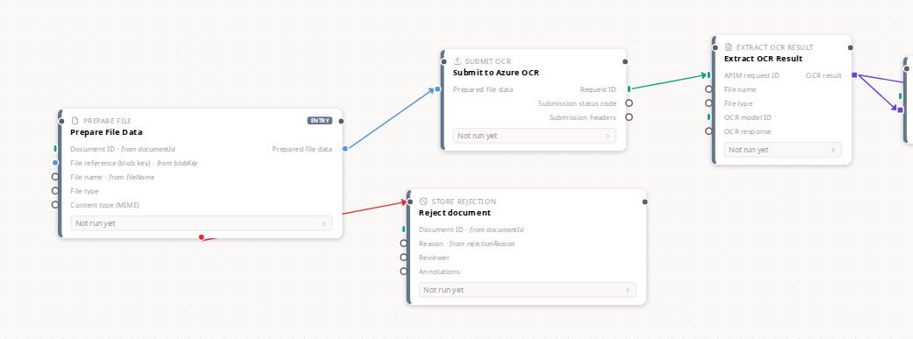

Four cards of the switch/error-edges demo. Blue circles for documents, teal bars
for IDs, violet squares for content taken out of a document, grey hollow circles
for untyped — plus the data wire in its producer's family colour and the red
error route leaving `prep`.

### The shapes, close enough to see

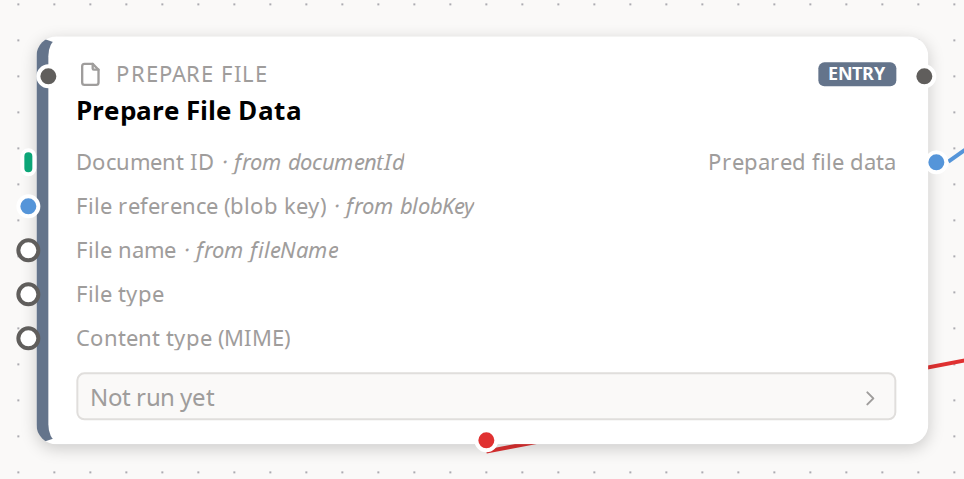

`Prepare File Data` at about 3×. One teal **bar** (Document ID — a pointer), one
blue **circle** (File reference — a document), three grey **hollow circles**
(untyped), and a blue circle output.

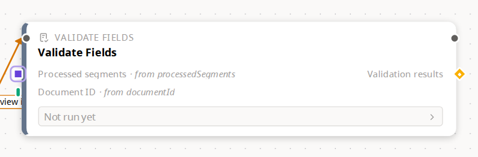

`Validate Fields` completes the set: a violet **square** wearing the double ring
that means "a list of these" (Processed segments), a teal bar (Document ID), and
a yellow **diamond** output (Validation results — a judgement about a document).

No single seeded card carries more than three of the five families, which is why
this is two frames rather than one.

### The legend now teaches all four codes

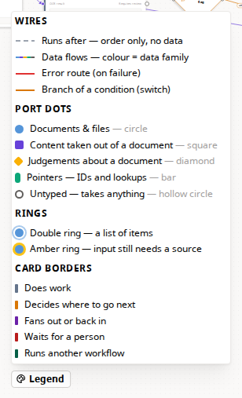

Wires, port dots, rings, card borders. Card borders had never been explained
anywhere in the product, because until now there were thirteen of them and no
popover can teach thirteen. Each family row names its shape in words as well as
showing it, so the legend is readable without colour at all.

The row count went **up**, from 13 to 16 — and that is the right trade. The
thing being taught went from about 24 decodable distinctions to 14, and the rows
are grouped by what you are looking at instead of run together in one list.
Counting rows was the symptom; the size of the vocabulary was the disease.

### Card borders: five roles

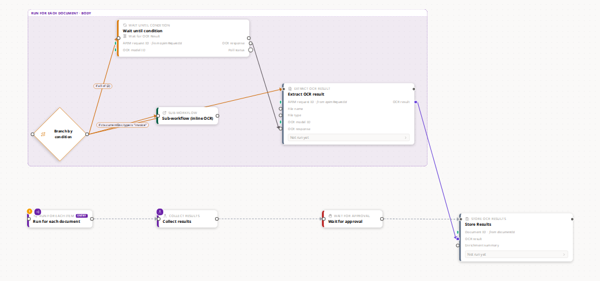

The control-flow demo — the only seeded workflow carrying all five roles at
once. Measured off the rendered DOM in this exact frame:

| Role | Rendered | Cards here |
|---|---|---|
| Does work | `rgb(100,116,139)` slate | Store Results, Extract OCR result |
| Decides where to go next | `rgb(217,119,6)` amber | Wait until condition, Branch by condition |
| Fans out or back in | `rgb(107,33,168)` purple | Run for each document, Collect results |
| Waits for a person | `rgb(185,28,28)` red | Wait for approval |
| Runs another workflow | `rgb(6,95,70)` green | Sub-workflow (inline OCR) |

The map body's box is that purple too, because it *is* the map node's body —
where the old scheme had one green (`#22c55e`) doing duty as the map node's
accent, the map body's outline, **and** an activity category, three things that
were never the same thing.

**This frame is also what caught a bug that every test had missed.** The first
capture still showed the body box green: `GroupContainerNode` defaults a
synthetic group to the map accent, but the default reads `data.color ?? …` and
the projection always supplies `color`, so the default was dead code and the old
hex was still winning. Asserting the constant could never have found it; there
is now a test that asserts the value which actually reaches the renderer.

**And the thing to push back on if you want to.** Every activity card is the
same slate now — OCR, validation, storage, transform, all of it. The upside is
that a *coloured* card is exactly a card doing something structurally unusual,
which is what you want to spot at a glance in a large graph. The cost is that
category is no longer in the border; it is in the icon, the label, and the
palette sidebar's grouping. The reduction was forced by the measurement, but the
choice of axis is taste. One line in `catalog-utils.ts` puts per-category
colours back, and brings the collisions with them.
