# The run and replay surfaces, photographed

Every frame below is a real Temporal execution against a seeded demo, taken by
[`capture-screenshots.mjs`](capture-screenshots.mjs) at 1920×1080 on
2026-08-09. Re-take them with:

```bash
npm run dev              # frontend :3000, backend :3002, Temporal worker, deno-runner
npm run seed:demos       # only if the demo workflows are missing
npm run seed:demo-runs   # the runs these shots are of
node feature-docs/20260809-run-replay-demo/capture-screenshots.mjs   # optional: shot ids
```

**Every shot asserts before it saves.** The script reads the badge statuses,
the edge stroke colours, the banner's version pin, the run row's
`data-status` and the peeked value out of the DOM, and refuses the frame when
any of them contradicts the caption. Where a caption says something is missing
— no tooltip, no mention of caching — the absence is asserted too, so a later
fix breaks the shot instead of quietly outdating this page.

**These are not staged.** Where a frame shows something wrong, the caption says
so. That is the point of the exercise: this is the first time any of these
surfaces has been looked at with real runs behind them.

> One thing needs saying before the pictures, because it is the most serious
> thing found today and it is not a UI issue. **A human gate cannot wait longer
> than 30 minutes.** See [§8](#8--the-gate-that-was-killed-by-the-clock).

---

## 1 · A workflow with fifteen runs behind it, as it opens

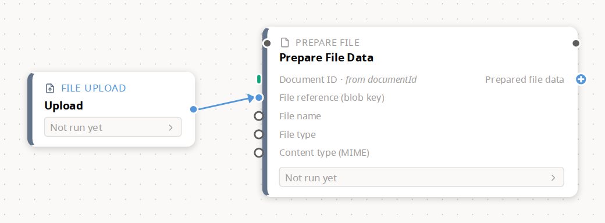

**Asserted:** the API returns ≥ 3 runs for this exact lineage — it returned
**15** when this frame was taken; the canvas renders **0** status badges; the
`prep` strip reads exactly `Not run yet`.

This is the state every author lands in, and it is honest rather than broken —
`RunStateProvider` mounts at `activeRunId = null` on purpose so a design-time
canvas is not littered with grey dots. But the consequence is that **a
workflow with a rich run history is pixel-identical to one that has never
run**. Nothing on the canvas, in the top bar, or on the workflows list says
"there are fifteen runs behind this". Run history is a drawer three clicks deep
(More → Run history), and you have to already know it is there.

Recommendation: put the count somewhere on the canvas — a "Last run: 2 minutes
ago · succeeded" line in the top bar that opens the drawer would cost one
request (`GET /:id/runs?limit=1`) and would make the whole feature discoverable.

---

## 2 · A succeeded run, replayed

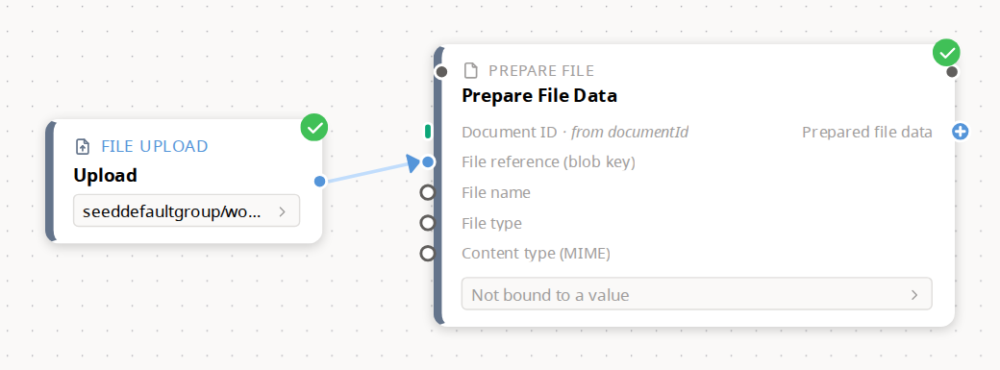

**Asserted:** `upload1` and `prep` badges both read `succeeded`; the
`upload1 → prep` hop is painted with the taken-path stroke `rgb(193, 221, 252)`
(`TAKEN_STROKE` in `canvas/WorkflowEdge.tsx`). Canvas at 1.44×.

This works, and the green discs are legible. Two things in the frame are not
about this run and are worth flagging:

- **"Not bound to a value"** on the `Prepare File Data` strip, on the demo
  literally called *"run a workflow & see previews"*. This is not a preview
  bug — the demo's `prep` node declares no `outputs`, so its cached
  `outputCtx` really is `{}` and the strip is telling the truth. The demo is
  the problem: it cannot demonstrate the feature it is named after. One
  `outputs: [{ port: "preparedData", ctxKey: "preparedFileData" }]` in
  `scripts/seed-feature-demos.mjs`'s `sourcePrepConfig` fixes it — the
  branch/error demo's `prep` already has exactly that line, which is why
  [§12](#12--a-wire-peek-a-result-strip-and-two-different-runs-on-one-card)
  had to be shot on that demo instead.
- **The taken-path stroke is the palest thing on the canvas.** It reads as
  "faded out", not as "this is the route". [§5](#5--the-switchs-taken-case)
  is where that becomes a real problem.

---

## 3 · A failed node, and the only explanation the canvas offers

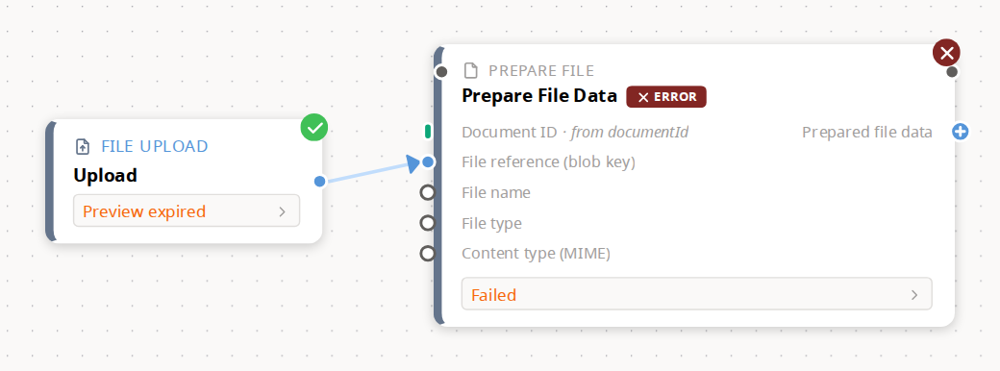

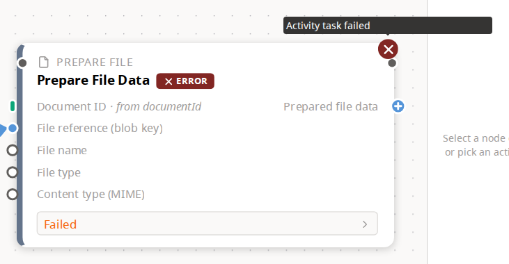

**Asserted:** `prep` reads `failed`; hovering its badge opens a tooltip whose
text is exactly `Activity task failed` — the shot fails if that string ever
changes, so this claim cannot silently go stale.

The node treatment is good: red disc, an `✕ ERROR` chip beside the title, and
the strip switches to `Failed`. The reason is the problem. **`Activity task
failed` is Temporal's generic wrapper, not the cause.** This run failed because
`file.prepare` was handed the blob key `does/not/exist.pdf` and could not
resolve it — a sentence the system has and does not show. The author gets a red
cross and a tautology, on the one surface where "why" is the entire question.

Recommendation: the activity's own `ApplicationFailure` message is in the
Temporal history; surface it in `NodeRunStatus.errorMessage` instead of the
wrapper, and keep the wrapper as a fallback.

---

## 4 · A cache-served node — the entire vocabulary is a violet bolt

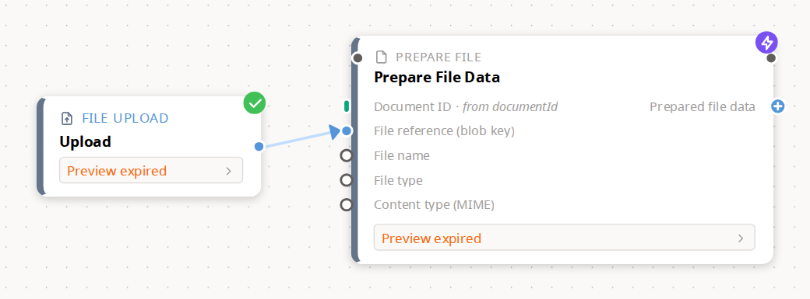

**Asserted:** `prep` reads `skipped`; the API carries its `cacheHit` with both
a `configHash` and an `inputHash` (printed by the script on every run — a fresh
seed mints a new `inputHash`, so no value is quoted here); the badge's wrapper computes
`pointer-events: none`, so there is nothing to hover; and the string `cach`
appears **nowhere in the page's visible text**.

Two separate problems in one frame.

**The word "cache" is never said.** `NodeRunStatusValue`'s `skipped` means
"served from the activity-output cache", and the API hands the UI both hashes
that prove it. On screen it is a violet lightning bolt with no tooltip, no
label and no pointer events. Every other reading of "skipped" — the branch was
not taken, the step was disabled, it was deliberately bypassed — is available
to the reader and wrong.

**And the two strips say "Preview expired".** On a run that finished ninety
seconds before the shot. This is not a stale screenshot; it is a real and
reproducible contradiction:

- `GET /:id/preview-cache-batch?runId=<the cache-hit run>` returns **an empty
  map**. A cache HIT writes no new `ActivityOutputCache` row, so there is no
  row inside that run's execution window — the row it *read* was written by
  the earlier run, outside the window.
- `no-output-state.ts` sees a node that is `skipped` (so it produced output)
  with no cache row and the run finished, and concludes `evicted` — label
  "Preview expired", detail *"This step's cached output has expired. Re-run to
  repopulate it."*

So **the one node whose value is definitely in the cache is the one the UI
tells you has lost it**, and the recovery it offers (re-run) would produce
another cache hit and the same message.

---

## 5 · The switch's taken case

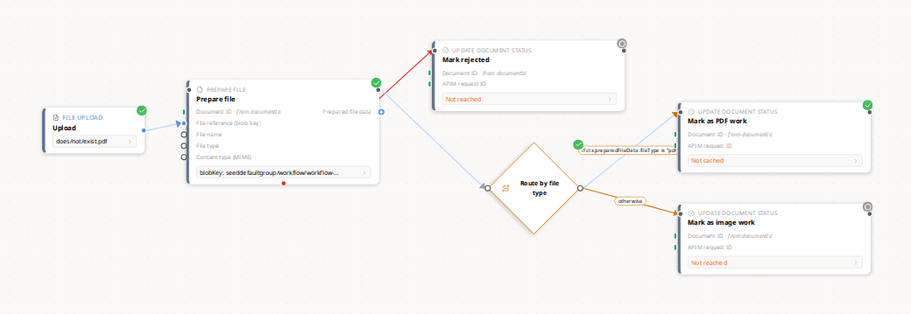

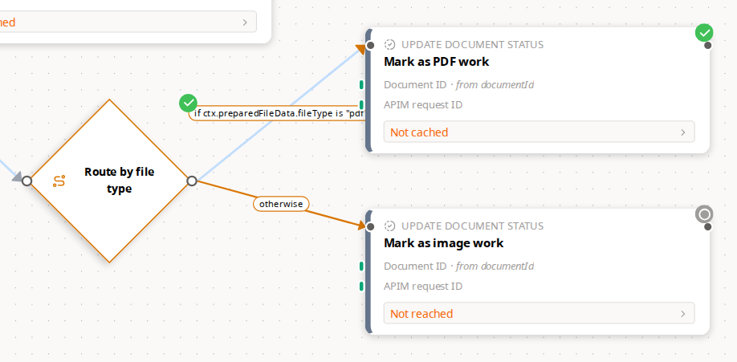

**Asserted:** `routeByType.selectedEdgeId === "to-pdf"` in the run's own status
map; on the canvas `to-pdf` is painted `rgb(193, 221, 252)` (taken) and
`to-image` is not; `markPdf` reads `succeeded` and `markImage` reads `pending`.

`selectedEdgeId` works — this is the first picture of it. But look at the close
crop, because the colour ranking is backwards:

- the case that **was** taken (`to-pdf`, up to *Mark as PDF work*) is drawn in
  `#C1DDFC`, a near-white blue, and keeps an **orange** arrowhead;
- the case that was **not** taken (`to-image`, labelled *otherwise*) keeps its
  full-strength conditional orange and is by far the most prominent line in
  the frame.

The eye goes to the branch that did not happen. The taken cue is also the only
one of the two that a monitor with poor contrast will lose entirely.

Two smaller things in the same frame:

- `Mark as image work` — the step that was never reached — carries a **grey
  `pending` dot**, the same badge a step that is about to run would carry.
  Nodes absent from the status map are rendered as `pending` by
  `NodeStatusBadgeOverlay` (`entry?.status ?? "pending"`). Its strip is
  better: it says *"Not reached"*. Badge and strip are telling the reader two
  different stories about the same node.
- `Mark as PDF work` ran and succeeded, and its strip says **"Not cached"** —
  a `document.updateStatus` node returns nothing worth caching. Reasonable
  internally, but as a report on a successful step it reads like a failure.

---

## 6 · An error path really taken

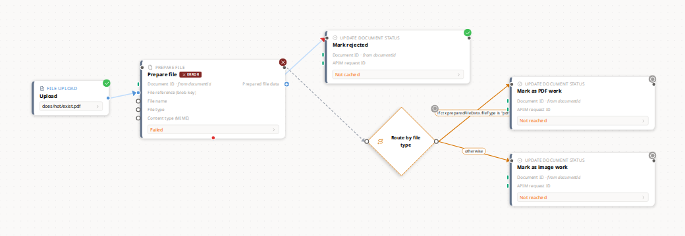

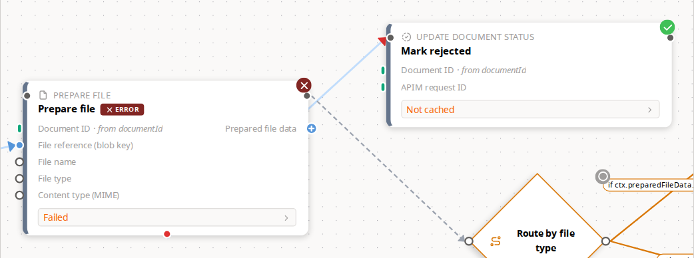

**Asserted:** `prep.selectedEdgeId === "prep-reject"`; the run-history row's
own `data-status` is `succeeded`; on the canvas `prep` reads `failed`,
`reject` reads `succeeded`, `prep-reject` is painted taken and `prep-route` is
not; `routeByType`, `markPdf` and `markImage` all read `pending`.

This is `errorPolicy: { onError: "fallback" }` doing exactly what it should —
and the most confusing state in the set:

**The run reads `succeeded` while a node on the canvas has a red cross on it.**
That is correct (the failure was handled, so the workflow completed), but
nothing anywhere says "handled". A reader who opens the row expecting a green
graph gets an `✕ ERROR` chip instead, with no sentence reconciling the two.

The error hop is drawn in the same pale taken-blue as any other taken edge,
with only its arrowhead left red — so "the error route was taken" is carried by
about twelve pixels of marker. The un-taken normal hop, meanwhile, is a
prominent grey dashed line running diagonally across the frame.

Recommendation: a "handled failure" note on the run row (the data is there —
the run succeeded and a node failed), and a taken-edge cue that keeps the
edge's own colour and changes weight instead of washing it out.

---

## 7 · A run genuinely in flight


**Asserted:** the run's row status is `running` **and** its `approve` node is
`running`, both read from the live API before the browser opens; on the canvas
`approve` reads `running`, `complete` reads `pending`, `prep` reads `skipped`;
the finished hop `prep-approve` is drawn taken, and the hop out of the gate is
`rgb(85, 149, 217)` — `ACTIVE_STROKE`, the live-hop animation.

The best frame in the set: four different node states in one picture, and the
marching-ants edge really is pointing at where the run is. The spinner, the
bolt, the check and the grey dot are all distinguishable at this zoom (0.67×).

Two things it exposes:

- `upload1` and `prep` both say **"Preview expired"** again — same mechanism as
  [§4](#4--a-cache-served-node--the-entire-vocabulary-is-a-violet-bolt), and
  here it is worse, because the run is *still going*. `NodeResultStrip` passes
  `runFinished: isReplay && hasRun`, and opening a run from Run history sets
  `isReplay = true` **even when the run is still executing**. So a live run
  viewed through the drawer is told it has finished: nodes it has not reached
  yet say *"Not reached"* (see `Mark complete`, above) rather than "not yet",
  and nodes served from cache are accused of losing their previews.
- There is no "this run is still going" affordance anywhere on the canvas — no
  elapsed time, no cancel, no "signal the gate". The gate *is* signallable, but
  only from the other end of the product: the upload path stamps
  `workflow_execution_id` on the document, and `HitlService.approveSession` /
  `DocumentController.approveDocument` send the signal from the HITL review
  queue. An author sitting on the canvas watching their own gate has no way to
  release it and nothing telling them where to go.

---

## 8 · The gate that was killed by the clock

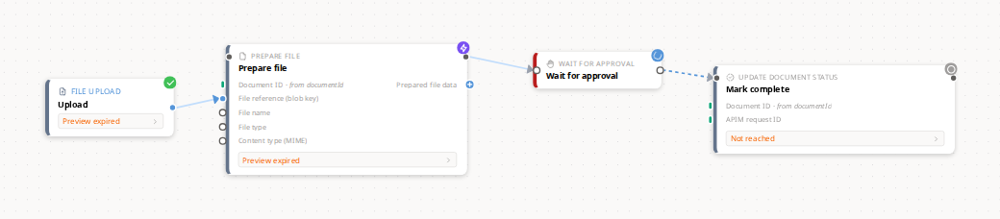

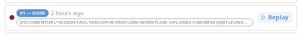

**Asserted:** a run whose history row reads `failed` while its `approve` node
still reads `running`; the row's `data-status` is `failed`; the canvas badge for
`approve` is `running` and `complete` is `pending`.

Compare this canvas with [§7](#7--a-run-genuinely-in-flight). **They are the
same picture.** One run is waiting for a person; the other was killed by
Temporal half an hour ago. The only difference anywhere in the product is the
colour of a 10-pixel dot in the run-history drawer.

### Why it died — and it was not the worker restart

The dev stack went down and came back up this evening, so the obvious
hypothesis was that the waiting gate did not survive it. **It didn't die of
that.** Temporal's own history for the run says so:

```
23:35:54.633  EVENT_TYPE_WORKFLOW_EXECUTION_STARTED
23:35:54.785  EVENT_TYPE_TIMER_STARTED        startToFireTimeout: 2592000s   (30 days — the gate)
00:05:54.638  EVENT_TYPE_WORKFLOW_EXECUTION_TIMED_OUT   retryState: RETRY_STATE_TIMEOUT
```

Exactly **30 minutes and 5 milliseconds** after it started, and the history
contains **zero `WORKFLOW_TASK_TIMED_OUT` events** — which is what a worker
outage would have left behind. The containers restarted at ~01:03, an hour
after the run was already dead.

The cause is one line, `apps/backend-services/src/temporal/temporal-client.service.ts:382`:

```ts
workflowExecutionTimeout: "30 minutes",
```

Every graph workflow — Try **and** production `POST /:id/runs`, they share
`startGraphWorkflow` — is capped at 30 minutes of wall-clock. A `humanGate`'s
own timeout is honoured by `executeHumanGateNode` via `condition(…, node.timeout)`
and this demo's is 30 days, so **the gate's configured timeout is unreachable
for any value over half an hour**. A human-in-the-loop workflow that waits for
a real person to review a document cannot work on this code path.

It is worse than a wrong number, because of how it ends:

- Temporal closes the execution as `TimedOut`, which `statusFromCode` maps to
  `"Unknown"`, which `mapTemporalStatusToDtoStatus` maps to **`failed`** — so
  the run reports a failure it did not have.
- The workflow never gets another workflow task, so the node-status map it
  answers queries from is frozen with `approve: running` forever. The canvas
  will show a spinning gate on a dead run for as long as the history is
  retained.

Recommendation, and this is the one item here that is not cosmetic: give
`startGraphWorkflow` a timeout derived from the graph (the sum/maximum of its
gate timeouts) or drop `workflowExecutionTimeout` altogether and rely on
per-activity timeouts, then map `TimedOut` to something that is not `failed`.

---

## 9 · A cancelled run

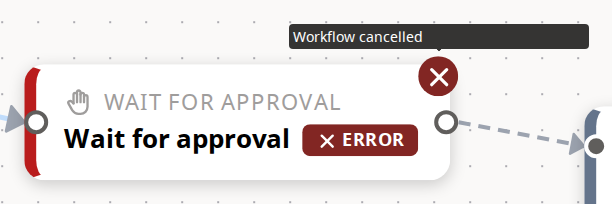

**Asserted:** the run's row status is `cancelled`; `approve` reads `failed`;
the badge tooltip is exactly `Workflow cancelled`.

Starting a second Try cancels the first (D-17), which is deliberate and
documented. What the canvas then shows is a node in the **failed** treatment —
red disc, red `✕ ERROR` chip — for a run nobody said failed. The tooltip is the
only place the word "cancelled" appears, and you have to hover a 20px disc to
find it. `NodeStatusBadge` does have a `cancelled` style (grey circle); the
runtime simply never writes that status, so cancellation borrows the failure
vocabulary.

---

## 10 · Run history, with three run states in it

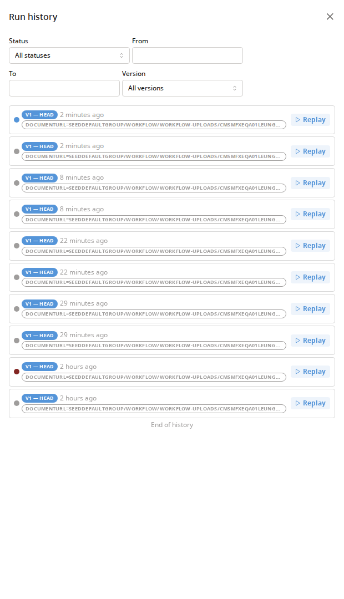

**Asserted:** at least three distinct `data-status` values across the rows. The
frame carries ten: one `running` (top, blue), eight `cancelled` (grey) and one
`failed` (red, second from bottom).

The drawer works — the list, the paging sentinel, "End of history", the Replay
button. Read it as a stranger, though:

- **No row says what happened.** Status is a 10px dot with no label; the only
  text is a version pin, a relative time and a ctx chip. Blue/grey/red have to
  be decoded, and `cancelled` (grey) is the same neutral tone as a disabled
  control.
- **The ctx chip is upper-cased by Mantine's `Badge`**, so a blob key —
  which is a case-sensitive path — renders as
  `DOCUMENTURL=SEEDDEFAULTGROUP/WORKFLOW/WORKFLOW-UPLOADS/CMSMFXEQA01LEUNG…`.
  The one identifier on the row is not the identifier. `tt="none"` on the
  Badge fixes it.
- **Every row reads `v1 — head`**, so the version pin — the thing that makes
  replay meaningful — is pure noise until a lineage has two versions.
- **All ten of these rows are canvas Tries**, not production runs — both the
  upload path and the explicit Try stamp `RunTrigger = "try"` — and nothing on
  any row says so. `listRunsForWorkflow`
  builds its visibility query from lineage, status, start time and version and
  has **no `RunTrigger` clause**, though the dev namespace registers
  `Keyword06:RunTrigger` as a search attribute. Filtering or labelling them is
  one clause, not a schema change.
- Nothing shows a duration, an outcome, or which node failed.

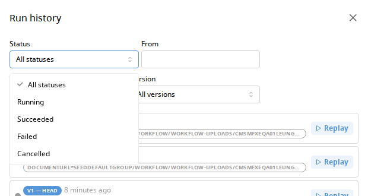

**Asserted:** the dropdown offers exactly `All statuses`, `Running`,
`Succeeded`, `Failed`, `Cancelled`.

The filter set matches `RunSummaryStatus` exactly, which is right. Note that the
open dropdown covers the *To* field and clips the *Version* label to
"…rsion" — the four filters are laid out in a 2×2 grid inside a drawer narrow
enough that any open list hides half of it.

---

## 11 · Replay pinned to an older version

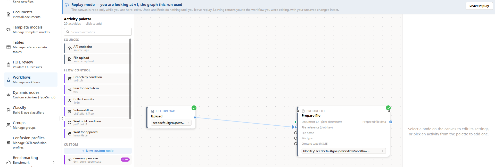

**Asserted:** the run's `versionNumber` is 1 while head is v2; the banner's
`data-version-number` is `1` and `data-version-unavailable` is `false`; its
headline contains *"you are looking at v1, the graph this run used"*; and the
canvas really renders the **v1** graph — 2 cards in replay against 3 at head,
with `markProcessing` (added in v2) absent.

G-004 works, and the copy is the best writing in the feature:

> **Replay mode — you are looking at v1, the graph this run used**
> The canvas is read-only while you are here: edits, Undo and Redo do nothing
> until you leave replay. Leaving returns you to the workflow you were
> editing, with your unsaved changes intact.

The contradiction is everything around it. The banner says *read-only*, and in
the same frame:

- the **Activity palette** is fully live — *"29 activities — click to add"*, a
  *"+ New custom node"* button, every entry a `<button disabled=false>`
  (measured, not eyeballed);
- the settings panel invites the reader to do exactly the forbidden thing:
  *"Select a node on the canvas to edit its settings, or pick an activity from
  the palette to add one."*

Clicking a palette entry in replay hits `if (isReplay) return;` and silently
does nothing — the failure mode the banner was introduced to explain, still
reachable from two controls in the same viewport. Disabling the palette and
swapping the settings-panel placeholder while `isReplay` is true would finish
the job item 13 started.

---

## 12 · A wire peek, a result strip, and two different runs on one card

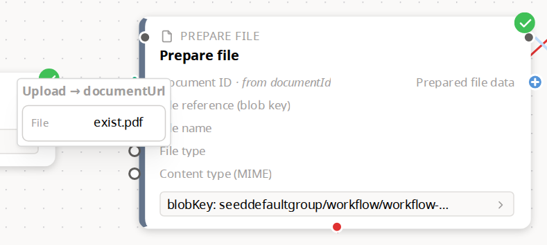

**Asserted:** the peek popover opens in its `ready` state with a non-empty
value; the source card's strip is compared against the run's own recorded
`initialCtx` — and the script printed **DIFFERENT RUN**.

The mechanism works: selecting a data wire pops the value that flowed along it,
at 1:1 through a portal so it stays legible at any canvas zoom. Two things
in this one frame are wrong.

**The value belongs to a different run.** The run being replayed was started
with `documentUrl = seeddefaultgroup/workflow/workflow-uploads/…`. The peek is
showing `does/not/exist.pdf` — the input of the *next* run of the same lineage,
which the seeder started about a second later. Previews come from
`GET /:id/preview-cache-batch?runId=…`, which resolves rows out of a
**lineage-scoped** cache filtered to the run's execution window **plus five
seconds of slack**, newest row per node wins
(`ActivityOutputCacheRepository.findManyInRunWindow`, `slackMs = 5_000`). Any
two runs of one lineage inside that window — a retry, a batch, two documents
submitted together, or this seeder — show each other's values. The canvas
statuses stay correct, so the graph looks right and the numbers on it are from
somewhere else. Nothing warns the reader.

**And the value is mis-rendered.** `does/not/exist.pdf` is displayed as a file
named `exist.pdf`: the renderer treats the string as a path and shows only the
basename. So the peek is showing a different run's value *and* hiding the part
that would have made that obvious.

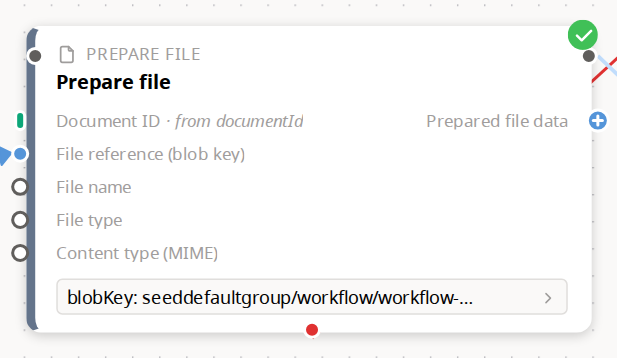

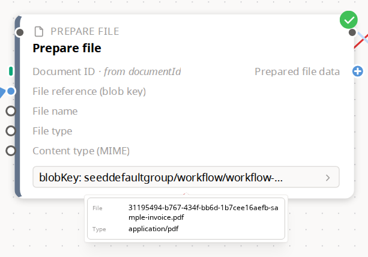

**Asserted:** the `prep` strip's `data-state` is `ready`; clicking it opens
`node-result-detail-prep`.

The strip and popover are the fix from batch-four item 9 and they hold up: one
constant-height line summarising the value, the full payload one click away.
Note the strip here is showing **this** run's data (`blobKey:
seeddefaultgroup/workflow/workflow-…`), because `prep`'s own row happens to sit
inside its own window.

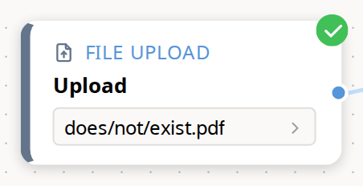

Which is the whole problem, stated in one frame: **on the same canvas, at the
same moment, the source card shows one run's input and the activity card shows
another run's output.** Both look authoritative. Neither is labelled.

Recommendation: drop the 5-second slack in favour of the run's own recorded
end time, or — better — key `ActivityOutputCache` rows by `runId` and select on
it, so "this run's values" is a lookup rather than an inference from
timestamps.

---

## What this leaves

Ordered by how much it matters, not by where it appears above.

1. **A human gate cannot outlive 30 minutes** ([§8](#8--the-gate-that-was-killed-by-the-clock)) — `workflowExecutionTimeout: "30 minutes"` on every graph run, and the resulting `TimedOut` reports as `failed` with the gate frozen at `running`. Product defect, not UX.
2. **Replay can show another run's values** ([§12](#12--a-wire-peek-a-result-strip-and-two-different-runs-on-one-card)) — 5s slack on a lineage-scoped cache, silently.
3. **A cache hit reports "Preview expired"** ([§4](#4--a-cache-served-node--the-entire-vocabulary-is-a-violet-bolt)) — and offers a re-run that would do it again.
4. **Opening a live run from Run history tells the canvas the run has finished** ([§7](#7--a-run-genuinely-in-flight)) — `runFinished: isReplay && hasRun`.
5. **A failed node never says why** ([§3](#3--a-failed-node-and-the-only-explanation-the-canvas-offers)) — always `Activity task failed`.
6. **The taken path is drawn fainter than the path not taken** ([§5](#5--the-switchs-taken-case)).
7. **`skipped` never says "cache"** ([§4](#4--a-cache-served-node--the-entire-vocabulary-is-a-violet-bolt)) — a violet bolt with no tooltip and no pointer events.
8. **A handled failure reads `succeeded` over a red cross** ([§6](#6--an-error-path-really-taken)) with nothing saying "handled".
9. **Replay says read-only while the palette invites you to add a node** ([§11](#11--replay-pinned-to-an-older-version)).
10. **Run rows carry no words** ([§10](#10--run-history-with-three-run-states-in-it)) — status is a 10px dot, the ctx chip is upper-cased into an unreadable blob key, and Tries sit beside production runs unlabelled.
11. **A cancelled run's node uses the failure treatment** ([§9](#9--a-cancelled-run)) while `NodeStatusBadge` has an unused `cancelled` style.
12. **Nothing says a workflow has history** ([§1](#1--a-workflow-with-fifteen-runs-behind-it-as-it-opens)).
13. **The try-in-place demo cannot show a preview** ([§2](#2--a-succeeded-run-replayed)) — its `prep` declares no outputs; one line in the seeder.

Not photographed, and why:

- **Expired run history (410 Gone).** The dev namespace's retention is 30 days
  (`DEFAULT_NAMESPACE_RETENTION`), and there is no way to age a run on demand,
  so the state where `node-statuses` throws `WorkflowNotFoundError` and the
  controller answers *"Run history no longer available — use the cached preview
  endpoint instead"* cannot be reached without waiting a month or editing
  Temporal's config. It remains the state nobody has looked at.
- **A run history containing all four statuses at once.** No single lineage
  has one: the human-gate demo carries `running` / `cancelled` / `failed`
  (shown above) and the try-in-place demo carries `succeeded` / `failed`.
  Producing all four on one lineage would need a fifth seeded workflow.
- **The orange "version could not be loaded" banner.** Already photographed,
  fault-injected, in
  [`../20260806-inderdeep-ux-review-batch-four/screenshots/14-replay-mode-version-unavailable.png`](../20260806-inderdeep-ux-review-batch-four/screenshots/14-replay-mode-version-unavailable.png).
