# Workflow designer — your review, answered

**Branch `feature/visual-workflow-builder` · reviews received 2026-08-14 · work
done 2026-08-14 → 15**

Two reviews arrived the same day and they are kept apart on purpose.
**[Part 1](#part-1--inderdeepsinghgill) is inderdeepsinghgill's five items. [Part 2](#part-2--dbarkowsky)
is dbarkowsky's thirty-four.** Neither of you needs to read the other's half; nothing
in Part 2 is required to understand Part 1 or the reverse.

Item ids (`I1`, `D22`, …) come from
[`CHECKLIST.md`](CHECKLIST.md) and are on every entry so you can point at one.
They are not the headline, and the entries are **not in numeric order** — within
each part they run from what blocked you, through real bugs, to questions and
polish.

---

## Before you read: three things that apply to both parts

### Running it yourself

Every "how to see it" below assumes the local stack is up. That is one command
after the usual setup, and it starts seven processes — Postgres, MinIO, Temporal
(a workflow engine that actually executes the steps), the deno-runner (a sandbox
container that type-checks custom steps), plus the backend, the frontend and the
Temporal worker:

```bash
docker compose --profile infra --profile temporal up -d
docker compose -f deployments/local/docker-compose.deno.yml up -d
cd apps/backend-services && npm run db:generate    # see D5 — this one bites
npm run dev
npm run seed:demos && npm run seed:demo-runs       # the 🎯 Demo — … workflows
```

The full, verified version of that is now the **Before you start** section of
[`docs-md/workflows/GALLERY.md`](../../docs-md/workflows/GALLERY.md) — which is
dbarkowsky's item D5, and it did not exist when he walked the tour.

### Where the pictures came from

Every image is a screenshot of that stack, taken by
[`capture-screenshots.mjs`](capture-screenshots.mjs) at 1920×1080, same route,
same crop and same canvas zoom in both phases, so a before/after pair differs by
the fix and not by the framing. Nothing is a mock-up and nothing is composited.

**Four frames are not straight photographs, and each one says so where it is
used:** `I1` and both `D12` frames need one API route intercepted to reach a
state this database cannot otherwise be in, and the `D12` *before* frame is
additionally a **reconstruction** of the old button label. The full accounting is
in [`screenshots/before/MANIFEST.md`](screenshots/before/MANIFEST.md) and
[`screenshots/after/MANIFEST.md`](screenshots/after/MANIFEST.md).

### What the status words mean

- **Fixed** — code changed, and the change is visible.
- **Answered** — the app was already right; what was missing was the answer, the
  documentation, or the words on screen. Where nothing changed at all, it says
  so.
- **Open** — a proposal that needs Alex's ruling. Two of those, both at the end
  of Part 2. They are not decided and are not presented as done.

---

# Part 1 — inderdeepsinghgill

Five items. The first is the one that mattered: it is why four of the five came
from screenshots rather than from using the thing.

---

## I1 · The assistant still didn't answer for you — **Fixed**

> *"The agent is not working for me, as was the case earlier."*

**Three separate causes, and only one of them was yours.**

1. **The build.** The error-surfacing you asked for last round shipped on
   2026-08-08 **on this branch only**. `origin/develop` contains no agent-chat
   code at all — `git ls-tree origin/develop -- apps/frontend/src/features/agent-chat/`
   is empty — so anything built from `develop` still fails silently. This is also
   the whole of I2.
2. **A genuinely silent state, and this was ours.** The drawer collapsed two
   opposite facts into one branch. `if (isError || options.length === 0)` both
   rendered the reassuring label *"Server default model"* with the composer left
   live. But "the request failed" means we don't know what the server has, while
   "the list is empty" means the server told us, successfully, that it has
   **nothing** — and an unconfigured server therefore never said so.
3. **A stale generated Prisma client** (the database access layer, regenerated
   per-developer and gitignored) was returning a 500 on every send that morning.
   Logged as `201` by the request logger, which is why nobody noticed. Cleared by
   regenerating; the mislabelled log line is filed as its own defect.

**What changed.** The drawer now has four states instead of two: *loading* ·
*unknown* (the request failed — composer stays live, the backend can still pick)
· **unconfigured** · *ready*. The unconfigured state names the environment
variables that are missing, points at a new setup page
(`docs-md/workflows/AGENT_SETUP.md`), and disables send with the reason on a
focusable tooltip wrapper. That wrapper is not decoration: a disabled Mantine
button fires neither pointer nor focus events, so a tooltip on the button itself
is unreachable by mouse *and* by keyboard — and jsdom cannot see the difference,
which is why it was verified in a real browser on both hover and focus.

Only variable **names** ever reach that response. The backend never puts a value
in it and the test suite asserts that.

| After |
|---|
| 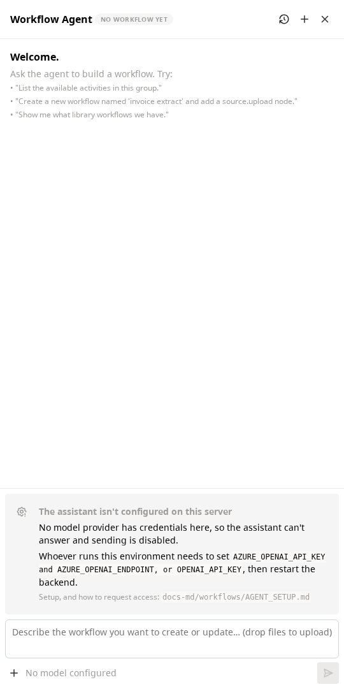 |

**⚠ This frame is intercepted, and here is exactly why.** The state is real code
on a real page, but it only renders on a backend with *no* model provider
credentials — and this dev stack has Azure OpenAI configured, so
`GET /api/agent/models` correctly answers with a model. The script therefore
fulfils that one route with the body an unconfigured backend really sends. There
is **no before frame**: the pre-fix build rendered "Server default model" and is
not in the tree to photograph.

**See it yourself.** `http://localhost:3000/workflows` → the speech-bubble icon
in the header opens the drawer. To reach the unconfigured state for real, unset
the Azure and OpenAI variables on the backend and restart it.

**Still not solved, and you should know:** the four `AZURE_OPENAI_*` variables
are wired into the Temporal worker only, never into the backend-services
container. The backend no longer *dies* without them (the constructor throw is
gone, so an unconfigured environment boots with a visibly disabled assistant
instead of a dead app), but **the assistant will not work on any deployed
instance** until those variables reach that container. That is a deployment
decision, deliberately out of scope here.

---

## I5 · The red CTA on the error card — **Fixed, and your question answered**

> *"In the error message, the CTA button is in red. Normally, red button means a
> destructive action whereas re-run workflow isn't destructive."*
>
> *"Also, not sure if the clicking Re-run workflow would re-run only this step or
> complete workflow from start. If only this step, maybe "Try again" might be
> better button label…"*

**Your question first, because it decides the label: it re-runs the whole
workflow from the start.** Traced end to end — the handler fetches the run's
*original* input (`GET /workflows/:id/runs/:runId/input-ctx`, which is per-run,
not per-node), posts a new try, and the backend starts a brand-new Temporal
execution from the entry node. There is no re-execute-one-step endpoint anywhere
in the workflow controller. So **"Try again" would have been the untrue label**
and "Re-run workflow" stays. What was wrong is that a card sitting on one failed
step left you to infer that, so the card now states the scope in a dimmed line:
*"Runs the whole workflow again from the start, with the same input."*

**On the colour, you were right.** Filled red is this UI's destructive treatment
— it is what the Delete, Remove and Ungroup buttons use — and re-running deletes
nothing. Restyled to the B.C. Design System inline-alert pattern you linked: a
1px danger border taken from the theme token rather than pasted as a hex (the
theme already maps Mantine's red to the BC scale), the **alert-circle** icon in
place of the triangle (the triangle is BC's *warning* icon, not its danger one),
and the button changed from filled red to outlined.

**One sibling swept.** The cache-evicted alert repeated the same filled-red
Re-run when a re-run itself failed; it is outlined now, and its variant type no
longer permits `filled` at all. Everything else red in the preview and run panels
was checked and left alone — they are alerts with no CTA, status badges, or
genuinely destructive Delete/Remove/Ungroup buttons. Those are what make filled
red mean something.

| Before | After |
|---|---|
| 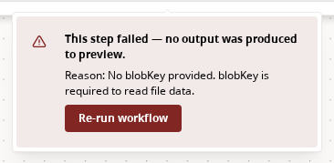 | 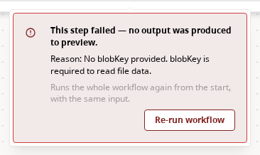 |

The after frame is 39px taller; that difference is the scope line.

**See it yourself.**
`http://localhost:3000/workflows/by-slug/demo-typed-i-o-coloured-handles-type-pills-part-7/edit`
→ **Run…** → **Try** with the ctx left as `{}` → wait for **Prepare** to go red
→ click that card's result strip (the one-line band that read "Not run yet"). The
notice is inside the strip's expanded detail, not on the card face. It has to be
a live failed run: this is a *preview* surface and renders nothing without one.

---

## I3 · The composer footer — **Rebuilt to your mock-up**

> *"I believe the bottom part of the chat ui looks off. How about this?"*

Rebuilt to [`source/inderdeep-mockup-composer.png`](source/inderdeep-mockup-composer.png):
the message box on its own line, then one footer strip — attach `+` hard left
(was a paperclip), the model name and tier as a menu trigger with a chevron
beside it, send/stop hard right. The open menu lists each model with its
one-line descriptor underneath and a check on the selected one.

**Nothing from the mock-up is hardcoded, and that is the part worth knowing.**
Your "Sonnet 4.5 / Haiku 4.5 / Opus 4.6" are not in the code. The picker renders
whatever `GET /api/agent/models` returns; a new backend module derives the short
name and the tier from the model *family* using each vendor's own published
positioning. An Azure deployment name is shown verbatim, because renaming
somebody's deployment in the UI would hide the one string they have to match
against their portal — and a deployment whose id names no recognised family gets
**no tier at all** rather than an invented one. On this machine that resolves to
one entry: `gpt-5.4`, `Balanced`.

| Before | After |
|---|---|
| 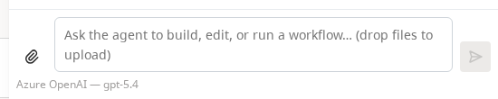 | 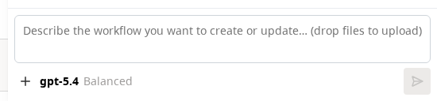 |

Measured from real bounding boxes in a browser rather than from the DOM order:
attach x=968 → picker x=1000 → send x=1458, all on one row.

**See it yourself.** `http://localhost:3000/workflows` → chat bubble in the
header → look at the bottom strip.

---

## I2 · Send-becomes-stop — **Already correct on this branch. No change made.**

> *"From the snapshots it seems like the stop icon is still at the top. I believe
> we discussed the send button transitioning to stop when inflight."*

**It already does, and nothing was changed for this item.** Four independent
checks agree:

- There is exactly **one** stop affordance in the whole agent-chat surface, and
  it is the composer's send button swapping `IconSend2` for
  `IconPlayerStopFilled` while a turn is running.
- The drawer header renders exactly three buttons — history, new conversation,
  close. There is no abort control up there and no test id for one anywhere in
  the tree.
- Git dates it: one commit, `5903a414`, **2026-08-08**, *"stop lives in the
  composer"*. `git merge-base --is-ancestor 5903a414 origin/develop` answers
  **no**, and `develop` has no agent-chat directory at all.
- Four tests assert the behaviour and still pass, and it was driven in a real
  browser as well.

**So your snapshot came from a build that is not this branch** — the same reason
the assistant didn't answer for you (I1). You need a build from
`feature/visual-workflow-builder`.

| Idle | In flight |
|---|---|
| 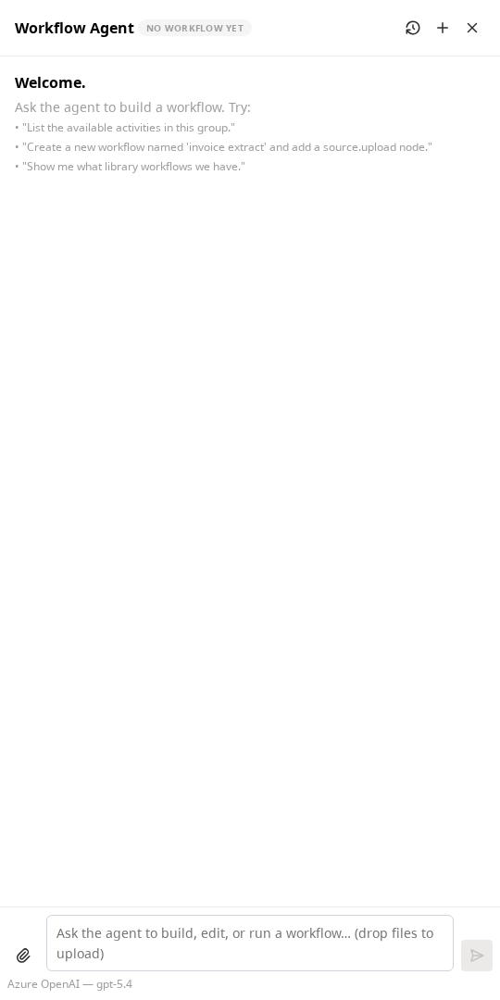 | 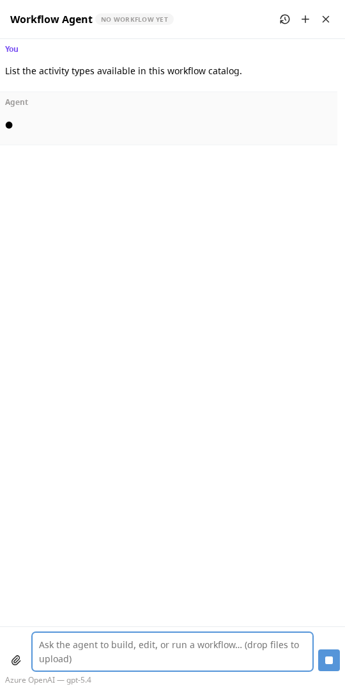 |

**These are filed under `before/` and they are also the *after*.** Re-shooting
them would produce two identical files and imply a change that was never made.

**One caveat you need in order to read the second frame.** The agent errors here
in about a tenth of a second, so the in-flight state is real but too brief to
photograph. The capture script therefore **delays the outgoing POST by nine
seconds**. Nothing about the response is faked — the same request reaches the
same backend and fails the same way a moment later.

**See it yourself.** Open the drawer from any page, type anything, press send,
watch the bottom-right button.

---

## I4 · The error chip's icon and text — **Fixed**

> *"Nitpicking but in the error chip, the icon and the text aren't aligned."*

You were right, and the cause is a typographic one worth a sentence. Mantine's
Badge centres the icon's *box* against the label's *line box*. A line box is
symmetric about the font's ascent and descent — but the ink of an all-caps word
is not: `ERROR` has cap height above the baseline and nothing below it, so the
empty descender space drags the visible ink down relative to the box it lives in.

Measured live in the browser at 2× canvas zoom: the glyph sat **0.5px above** the
text's optical centre. The fix is a derived nudge —
`(ascent − descent − capHeight) / 2 = (10 − 3 − 6) / 2 = 0.5px` — not a value
tuned by eye. Measured again after: delta **0.00px**.

**The nudge is on the glyph, not on the label, and that was the decision.**
Moving the label would have aligned this chip and desynchronised its text from
every sibling chip on the same card — `DYN`, `Deleted`, `ENTRY`, the group node
counts, the validation error count — all of which are text-only and therefore
correctly box-centred today.

| Before | After |
|---|---|
| 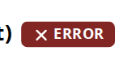 | 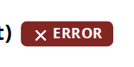 |

**This difference is sub-pixel by design.** At this zoom it reads; it is not a
frame that will survive being looked at on a phone.

**See it yourself.** `http://localhost:3000/workflows/by-slug/probe-clean-failure/edit`
→ **Run…** → **Try** with the ctx left as `{}`. That workflow's `file.prepare`
step points at a blob that does not exist, so it fails within seconds. Zoom in on
the failed card's title row. It has to be a live run — the chip renders nothing
without an active run id, because a design-time canvas deliberately shows no
statuses.

---

# Part 2 — dbarkowsky

Thirty-four items. Ordered by what they cost you: the five that stopped the
walkthrough, then six real bugs, then the questions where the app was right and
would not say so, then the three suggestions (all built), then the walkthrough
text itself.

Vocabulary you will meet below, defined where it first appears: a **run-order
edge**, a **kind**, a **ctx key**, **auto-wire**, a **lineage**, a **pin**.

---

## What stopped the walkthrough

### D1 + D2 · Standard OCR Workflow failing at Poll OCR — **Fixed** (GALLERY stops 9, 10)

> *"Could not complete because standard workflow is failing at Poll OCR step.
> What has changed since the develop branch that would affect this?"* — and, for
> stop 10, *"Same issue as #9"*.

**The workflow runs green end to end on this branch.** Verified with a live
Temporal run against real Azure Document Intelligence: nine of nine nodes
completed. What actually failed was **the diagnosis**, and that is the answer to
"what has changed".

Every failed step in the canvas, the run-history drawer and the node-status API
reported the literal string **`"Activity task failed"`** — for every failure mode.
That is the message Temporal puts on its own `ActivityFailure` envelope; the
activity's real message hangs off `.cause`, and the runner was reading
`error.message`. A missing credential, a wrong model id, a code defect and a
missing blob were indistinguishable. And this is genuinely new on this branch:
the per-node status map *itself* is new here, so `develop` never surfaced a
per-step message at all and the defect arrived with the surface that shows it.

Two supporting defects were found and fixed, both introduced by the
demo-rework commit `fc255284e`:

- **A phantom output port.** The catalog — the shared contract the builder, the
  validator and auto-wire all read — declared the poll activity's output as
  `ocrResponse`. The activity actually returned `response`. The runner binds
  outputs by reading `result[port]` and writes whatever it finds, **including
  `undefined`, without complaint**. So `ocrResponseRef` was never written, and
  the Poll OCR step had no output to preview — which is precisely what GALLERY
  stop 9 asks you to click, and stop 9 says in terms that a blank card is a bug.
  The runtime was renamed to match the catalog (renaming the catalog instead
  would have broken auto-wire's ability to connect poll → extract by name), and
  five templates plus three docs were corrected.
- **Poll's 404 said nothing.** It threw a bare `Status: 404` while its sibling
  Submit OCR had carried a full diagnostic hint for the identical status code
  since before this branch. Poll now names the request id and the model,
  explains that an analyze result belongs to the model it was submitted with,
  points at the endpoint variable, and mentions Azure's 24-hour result retention.

Before and after, on the same reproduced failure:

```
before:  Activity task failed
after:   Failed to poll OCR results. Status: 404 No analyze result
         "e8387e24-…" under model "prebuilt-layout". An analyze result belongs
         to the model it was submitted with, so check that this step polls the
         SAME model id the Submit OCR step used, and that
         AZURE_DOCUMENT_INTELLIGENCE_ENDPOINT points at the resource the
         document was submitted to. Azure also discards analyze results after
         24 hours.
```

713 temporal tests pass, `tsc` clean. No before/after screenshot: the change is
a string inside a run that has to fail, and the two strings above are the
evidence.

**See it yourself.** `http://localhost:3000/workflows/by-slug/standard-ocr/edit`
→ **Run…** → **Try**. If you have no Azure account, set `MOCK_AZURE_OCR=true` in
`apps/temporal/.env` and restart the worker — Submit and Poll then short-circuit
to canned responses and the whole thing runs green, which is enough to walk
stops 8–10.

**Two environment requirements you would have hit anyway**, both now in the
walkthrough: regenerate the Prisma client (`npm run db:generate` from
`apps/backend-services` — see D5), and the seeded workflow ships
`modelId: "sdpr_synth_test"`, a **custom-trained** Azure model, not a prebuilt.
An endpoint pointing at a different resource 404s at *Submit*, naming the model.

**One residual, not fixed and recorded rather than smuggled in.** The model id
now reaches Submit and Poll by two independent routes — Submit from a static node
parameter, Poll from a ctx input — and nothing keeps them equal. On `develop`
both read ctx, so they could not disagree; the split arrived with the same
commit. Both seeded values are currently identical, so it is latent rather than
live, and the new 404 message names the mismatch explicitly if anyone trips it.
The proper fix is for Submit to *return* the model it used and Poll to bind from
that, which is a larger change than this item warranted.

### D3 · "Publish failed — Failed to reach deno-runner /check" — **Fixed** (stop 14)

> Screenshot: *"Publish failed — Failed to reach deno-runner /check at
> http://localhost:9099 — see error markers."*

Your diagnosis was right: the **deno-runner** — the sandbox container that
type-checks a custom step before it is published — is a separate process in the
stack and yours was not running. Nothing in the walkthrough told you to start it,
and the error named an internal service instead of saying what to do.

**Both halves are fixed.**

*The message is now built where the failure happens*, and the URL is demoted out
of the headline onto a `details` field and a WARN log. A loopback URL means a
developer's own machine, so it names the command; any other URL is a deployed
sidecar the caller cannot start, so it says retry-then-escalate. Neither wording
contains a URL. A dedicated response DTO is wired into both service-unavailable
Swagger decorators. Verified by actually stopping the container:

```json
HTTP 503
{"code":"DENO_RUNNER_UNAVAILABLE",
 "message":"The custom-node checker is not running, so this script could not be
            type-checked. Start it with `docker compose -f
            deployments/local/docker-compose.deno.yml up -d`, then publish again.",
 "details":"POST http://localhost:9099/check could not be reached: fetch failed"}
```

*The editor caught up in a second pass the same day* — this was listed as a
residual on the checklist and is now closed. It had been wrong twice over: it
appended `" — see error markers"` to **every** publish failure, and for an
unreachable checker there are no markers at all (the script is perfectly valid;
the *service* is what failed). It also discarded `details` entirely. The marker
sentence is now appended only when markers actually exist, and the failure
renders as a **persistent** alert — not a notification, because a notification is
gone in four seconds and a failure whose remedy is "start this service and
publish again" has to survive long enough to be acted on — with an expandable
**Show technical details** carrying the endpoint diagnostic.

*And the walkthrough gained the prerequisite*, which is where D5 comes in.

**See it yourself.** `http://localhost:3000/dynamic-nodes/new`, write anything
valid, stop the deno-runner container, press **Publish**.

### D5 · Where the demo workflows come from — **Fixed** (documentation)

> *"It should be clearer where the Demo workflows come from and how to load them.
> I needed to find a separate file about seeding this separate demo data, then
> figure out that I had to generate an API key in the app and update some ENVs."*

The walkthrough opened by claiming *"You need no setup, no terminal, and no
database"*, which was simply false and is the root of this item and half of D3.
It now says somebody has to bring the stack up and seed it first — about ten
minutes of terminal, once — and carries a four-part **Before you start** section:
bring the stack up, seed the demos, read the demo names, and a table of which
stop needs what.

**Your API-key step is obsolete and that is worth knowing.** The seeder now loads
`apps/backend-services/.env` itself and probes candidate keys until one
authenticates. No key value is logged and none appears in the doc.

**Two additions you did not report but would have hit.** First,
`npm run db:generate` after any pull that touches the schema — the generated
Prisma client is written into two directories and **both are gitignored**, which
is what makes a stale one so baffling: `git status` is clean, the branch is
right, and what goes wrong looks unrelated (a run dies at its first step with
`Cannot read properties of undefined (reading 'findUnique')`, and the
dynamic-nodes endpoint 500s, which the palette renders as a calm *"No custom
nodes yet"* — identical to genuinely having none). Second, `MOCK_AZURE_OCR=true`
in `apps/temporal/.env` for anyone with no Azure account.

**See it yourself.** [`docs-md/workflows/GALLERY.md`](../../docs-md/workflows/GALLERY.md),
the **Before you start** section.

### D4 · Credentials for the assistant — **Answered, and the crash fixed** (stop 16)

> *"I don't think I have the credentials for this. Which subscription is it meant
> to be using?"*

**The answer: Azure OpenAI through the BC Gov AI Hub APIM proxy — the same Azure
OpenAI subscription key the OCR-enrichment code already uses, not a separate
one.** Four environment variables gate it (`AZURE_OPENAI_ENDPOINT`,
`AZURE_OPENAI_API_KEY`, `AZURE_OPENAI_DEPLOYMENT`, `AZURE_OPENAI_API_VERSION`).
Anthropic is fully implemented as a second provider but is configured nowhere in
this repo, so in practice there is one path.

**There is no self-serve route.** The working key lives out of band, in
`~/.config/bcgov-di/backend-services.env`, which the env loader reads *before*
the repo `.env`. Alex hands it out. So this was not a gap in your setup — it was
a gap in the repo, and two documentation silences produced it: `.env.sample`
shipped **non-empty placeholder values**, so a copied sample reported itself
configured and then died on a DNS lookup of a hostname that does not exist; and
the test plan's entire setup answer was one table cell.

**What changed.** The four Azure placeholders in `.env.sample` are blanked.
`docs-md/workflows/AGENT_SETUP.md` is written — which service, which variables,
where to put them, what an unconfigured environment looks like, and how to ask
for access — and linked from the test plan and the docs index.
`GET /api/agent/models` now returns the missing variable **names** (asserted by
tests that no value can leak).

**And the backend no longer refuses to boot.** With no provider configured at
all, the agent module threw at construction — a dependency-injection failure at
startup, in a module the app imports unconditionally. A developer without a key
got a **dead app**, and the error named the agent module, so it read as the agent
having broken the build. The throw is gone; an unconfigured environment boots
with a visibly disabled assistant. See I1's after frame for what that looks like.

### D6 · `Demo - Deleted` "wasn't seeded" — **Answered: it was, deliberately** (stop 15)

> *"Appropriate name, because the Demo - Deleted custom node doesn't appear to
> have been seeded."*

**Not a defect.** `demo-deleted-node` *is* seeded — published, referenced by the
Part 14 demo workflow, and *then* soft-deleted one second later. That order is
the whole fixture: a workflow has to reference a step before the step can become
a tombstone, which is what gives the canvas a genuinely missing step to draw.

```
 slug              | group_id         | deleted_at
 demo-deleted-node | seeddefaultgroup | 2026-08-09 23:35:23.967
```

`GET /api/dynamic-nodes` excludes soft-deleted lineages **by design** — a
*lineage* being the versioned history of one custom step, the thing that survives
across publishes — and the endpoint's own Swagger says so. So the management page
correctly does not list it. Its absence there *is* the state stop 15 is
demonstrating.

Two things made it read as a seeding gap, and both are answered rather than
coded: the stale Prisma client made that page 500 outright, so nothing could be
confirmed either way; and stop 15 never said the node is *supposed* to be missing
there. The walkthrough now spells out that the management page deliberately
hides it while the workflow's canvas is where it shows up — plus how to tell
"working as designed" from "seeding actually failed" (if the canvas has no such
step either, the deno-runner was down at seed time and the seeder printed
`– deleted-dyn skipped (deno-runner unavailable)`).

**Check it yourself, read-only:**

```bash
docker exec postgres psql -U postgres -d ai_doc_intelligence \
  -c "select slug, group_id, deleted_at from dynamic_node where slug like 'demo-%';"
```

---

## Bugs

### D11 · Restore just re-tags HEAD — **Fixed, and it was worse than you saw** (stop 11)

> *"It did not appear to bring back the old version as a new version in the UI as
> the instructions suggest. It looks like it just tags it as the HEAD."*

**You were right, and the consequence was worse than the symptom.** Restore
performed exactly one database write — it moved the lineage's head pointer onto
the existing old row. No new version was created. Confirmed against the running
stack: after a revert the lineage still had two rows and head pointed at v1.

The part nobody had noticed: **new versions are numbered from the head, not from
the maximum** (`nextNum = head.version_number + 1`), against a uniqueness
constraint on `(lineage, version_number)`. With head parked on v1 while v2
existed, the next save asked Postgres for a second `(lineage, 2)`. Reproduced on
the dev stack — HTTP 500, three passes of the retry loop, then
`duplicate key value violates unique constraint`. **Restoring an old version
silently made the workflow unsaveable.**

Two documents disagreed about which behaviour was intended, and the tie-break was
not editorial: only the append reading keeps head at the highest version number,
which is the invariant the rest of the versioning code already assumes. So the
behaviour is what changed. Restore now, in one transaction, copies the selected
version's config forward as a new version at `head + 1`, moves head to it, and
audits both. The source row is untouched, so its run counts stay attached to the
version that produced them.

| After |
|---|
| 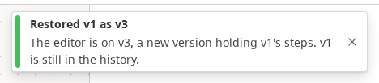 |

The old toast said *"Reverted to v1"*, which is precisely what read as a re-tag.
**There is no before frame** — the before pass did not shoot D11 and the old
toast is not in the tree.

**⚠ This frame was shot against a scratch lineage, not the seeded demo.**
Restoring *writes*, and doing it to the Part 12 demo would leave it sitting on a
v3 nobody seeded. The script creates its own lineage, reaches v2, restores v1
through the real UI, and deletes the lineage in a `finally`. The version numbers
in the toast are the backend's own answer to a real `revert-head` call.

Verified end to end: head moves to v3, and a save straight afterwards returns
**200** where it used to 500.

**See it yourself.**
`http://localhost:3000/workflows/by-slug/demo-versioning-history-revert-part-12/edit`
→ **More → Version history** → **Revert to this version** on the older row →
confirm. Then save — that is the half that used to fail.

### D7 · Typing in node config is very laggy — **Fixed** (stop 7)

> *"Typing in the field is very laggy. I suspect it's the same problem as the HITL
> page, where updates are causing a lot of the page to re-render when it really
> shouldn't if broken up."*

**Your hunch is right and it is the same class of defect.** There was no local
draft state anywhere on the input path, so **one keystroke wrote a whole new
workflow config at page level**, and three things then did work proportional to
the size of the graph:

- **auto-wire** — the resolver that connects a step's inputs to earlier steps'
  outputs automatically — re-ran an upstream graph walk *per typed port, per
  character*, and **rewrote downstream bindings from the half-typed value**:
  typing `c` → `cu` → `cur` bound the loop body's input to ctx key `c`, then
  `cu`, then `cur`;
- those bindings are part of the canvas's structural fingerprint, so the canvas
  re-projected the whole graph per character, allocating a fresh object per node
   — which defeats xyflow's identity reuse and re-renders every card;
- independently, the validation hook handed out a brand-new errors map on every
  edit, 300 ms before the debounced validator it belongs to had even run, and
  the canvas's badge-sync effect **always allocated a new node array** off it.
  The sibling hover effect twenty lines below already did the `return prev`
  guard correctly — it was the model, not an invention.

Three changes, cheapest first: the badge-sync guard; the validation result now
carries its own node-id snapshot so the live config leaves the memo's
dependencies; and free-text fields draft locally and commit on a quiet moment
through a new `useDebouncedTextCommit` hook, wired into the two components that
own them. Your exact field — *Item ctx key* on a map node — is one of them.

**This cannot be photographed, so it was measured.** 30 characters typed with no
delay between keys into a 22-card workflow, three rounds, medians. Dev build —
Vite dev server and a development React, which is the build you were typing into.

| | **Node label**<br>whole-config write per keystroke<br>*(not part of this change)* | **Map item ctx key**<br>*(the fixed path)* |
|---|---|---|
| React commits for 30 keystrokes | **152** | **68** |
| Wall time for the burst | **6752 ms** (225 ms/char) | **567 ms** (19 ms/char) |
| Long tasks (>50 ms) during the burst | **37**, 5286 ms total, longest 447 ms | **1**, 234 ms total |
| …of those, after the last keystroke | 1 (208 ms) | 1 (234 ms) — *the whole of it* |

**Be clear what the left column is.** It is *not* a recording of the old build —
the fix is in the tree and the tree is shared with other agents, so there is
nothing to check out. It is the **Node label** field on the same panel of the
same node in the same page load: a field this change did not touch, which still
writes the whole config per keystroke. The right-hand column additionally
re-expands its option list against the draft on every keystroke, work the left
column does not do at all, so the comparison is loaded *against* the fix.

**The shape matters more than the ratio.** The fixed field's only long task
arrives *after* typing stops — that is the single debounced commit — while the
per-keystroke field blocks the main thread 37 times *during* the burst. That is
what "typing is very laggy" is.

**Two honest gaps.** No test covers the canvas badge-sync guard directly; its
correctness rests on reading it against its sibling. And the two widget test
files are unmodified, so their passes establish compatibility rather than
proving that typing no longer writes per character — the measurement above is
what proves that.

**See it yourself.** Open any workflow with a busy canvas, select a map node, and
type into **Item ctx key** against **Node label** in the same panel. The
difference is the point of the table.

### D8 · The custom-step editor jumps the caret to the end — **Fixed, both causes** (stop 14)

> *"The editor occasionally forces the cursor to the end of the last line. Maybe
> this is happening when it reloads? Makes it very frustrating to type."*

Monaco — the code editor component — is driven as a fully controlled `value`
with a 150 ms debounced round-trip through the parent, so the text prop is
**the editor's own text echoed back late**. When that echo differs from the live
buffer, `@monaco-editor/react` applies it as a single full-model `executeEdits`
with `forceMoveMarkers: true` — caret to the end of the document — and suppresses
the change event for that programmatic edit, so nothing ever self-corrected.
Pause for 150 ms mid-sentence, keep typing, and the stale echo wins: characters
gone, caret moved.

**Your "when it reloads" guess was a real second contributor.** The hydration
effect had no once-per-lineage guard, and three modal mount sites render the
editor while the detail fetch is still in flight.

Fixed on both sides. A `lastEmittedRef` records what was emitted *before* the
parent can echo it, so a stale echo is always recognised and dropped while a
genuine external change — an undo, a revert, an agent write — still lands. A
`hydratedSlugRef` hydrates once per lineage, and in edit mode the editor is **not
rendered at all** while the detail fetch is loading: nothing may be typed into a
buffer that is about to be replaced.

**A sibling defect went with it**, 100% reproducible: select-all + delete
round-tripped an empty string, hit a `script || BOILERPLATE` fallback, and
re-inserted the whole boilerplate. It stays cleared now.

**No screenshot — a caret is not photographable — so the evidence is a browser
test.** `tests/e2e/workflow-builder/specs/tier1-code-pane-caret.spec.ts` drives
real Monaco in Chromium and reads the caret out of the rendered cursor layer,
because this app bundles Monaco locally and never exposes `window.monaco` for a
test to reach. Two checks pass: select-all + delete stays deleted with the caret
on the one empty line, and 26 pause-and-resume typing cycles swept across the
150 ms debounce boundary keep every character *and* the caret. Both were
confirmed to fail against the old behaviour — with the guard removed, 25 of the
26 characters were lost.

**And writing that test found a second cause of the same symptom — now fixed
too.** The echo guard worked, but `CodePane` still drove Monaco as a *controlled*
component, so its `value` trailed the editor's own model by one React commit
whenever two keystrokes landed inside a single commit; the library applied the
older string as the same full-model replace, and the caret went with it. The text
recovered on the next commit; the caret did not. That is exactly the
intermittency you described — it fires whenever a commit runs long, which a large
script makes routine.

The fix follows what the library and Monaco actually prescribe rather than a
tighter guard: `CodePane` now passes **`defaultValue`, never `value`**, so the
editor owns its buffer while you type, and deliberate re-seeds — first load, a
revert to an older version, a change of lineage — are pushed in imperatively.
The unit-test stub was a controlled `<textarea>`, which cannot express that
contract at all, so **the stub was rewritten rather than the assertions
weakened**. The third browser test, which reproduced this case, is un-skipped and
green: three of three pass, `tsc` clean, 67 unit tests pass.

**See it yourself.** `http://localhost:3000/dynamic-nodes/new` — type a sentence,
pause about a second mid-word, keep typing. Then select all and delete.

### D9 · A drag from the Segments output makes a run-order edge — **Fixed** (stop 7)

> *"It's strange that connecting the Split Document to the Run for Each Item nodes
> creates the edge between the order-of-operation connectors, even if I start it
> from the Segments output."*

**A real classification bug, reproduced.** Two kinds of connection live on these
cards: a **data edge**, drawn between two per-port dots, which carries a value
from one step to another; and a **run-order edge** (the dashed grey one, also
called the order-of-operations connector), drawn between the node-level dots,
which carries only "this runs after that" and no data at all.

The connection was classified by its **target handle alone**: both endpoints on
per-port handles → pin a binding; anything else → fall through and create a plain
run-order edge. A data-port source dropped on a node-level target satisfies
"anything else". And the validity check agreed with it —
`if (sourcePort === null || targetPort === null) return true` — so xyflow was
never given a reason to refuse the drop. **A test even asserted this as intended
behaviour.**

Reproduced with real mouse events before anything was changed:

```
from {"x":896,"y":483} -> to {"x":1073,"y":600}
after edges: [{"dash":"6px, 4px","stroke":"rgb(156, 163, 175)"}]   ← the run-order wire
after toasts: []                                                    ← silently
```

**The origin decides now.** A new module resolves the *target's real input rows*
— the dots the card actually mounts, not the catalog — and returns one of three
verdicts: exactly one compatible input → complete as the data edge you drew;
several → refuse and name them; none → refuse, distinguishing *"this step has no
data inputs at all"* from *"it has some and none accepts this kind"*. All three
consumers ask that one function, so they cannot disagree, and the handler returns
outright on a non-port verdict, so the invariant holds even if something reaches
it directly. Your exact case now:

```
after edges: []
after toasts: ["\"Run for each item\" has no data inputs — it reads its values
 from workflow variables. To make it run after this step, drag between the two
 grey run-order dots instead."]
```

Drags that *start* on the node-level dot are untouched — that gesture is
authoring run order, which is D10.

**No screenshot: this is a gesture and its refusal, and the two readouts above
are the evidence.** 2307 workflow-builder tests pass.

**See it yourself.** Any workflow with a Split Document and a Run-for-each-item
step: drag from the violet **Segments** output onto the loop card.

### D13 · Simplified view distorts the layout — **Fixed**

> *"Turning Simplified view on and off does some weird things to the formatting."*

**Not a canvas bug. Toggling the switch silently reverted the whole workflow to
the raw server copy.**

The `simplifiedView` flag was captured by the auto-arrange callback, whose
identity flowed into the dependency array of the server-hydration effect — and it
was that effect's **only** unstable dependency, changing for exactly one reason:
the toggle flipped. The effect's guards are "edit mode with a workflow" and "no
unsaved changes", and the arrange-on-load path deliberately re-bases its
reference so demos do not open dirty — so a freshly arranged workflow is *clean*
and therefore unprotected. Which is exactly the walkthrough's state.

Every flip re-ran the hydrate. The measured arrange-on-load layout was replaced
by the loose pre-mount fallback and never repaired; an unsaved rename was
reverted; neither left an undo step, and one subsequent edit plus Save would make
it permanent. It reads as "on **and** off" because of effect ordering: the ON
flip re-projects from the still-good config, and only the OFF flip re-projects
from the reverted one.

Fixed with both changes the diagnosis proposed: the flag now lives in a ref read
at call time, so the arrange callback's dependencies are stable; and a
`hydratedFromRef` guard means hydration is driven by *the server copy changing*
and never by the identity of anything inside the component.

| Before — Simplified off | Before — Simplified on |
|---|---|
| 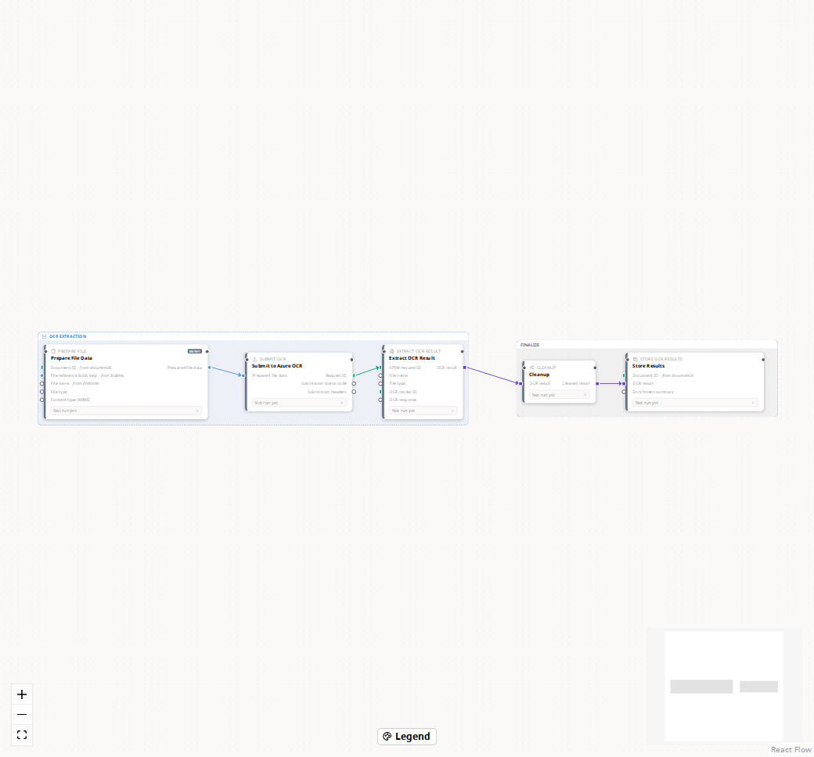 | 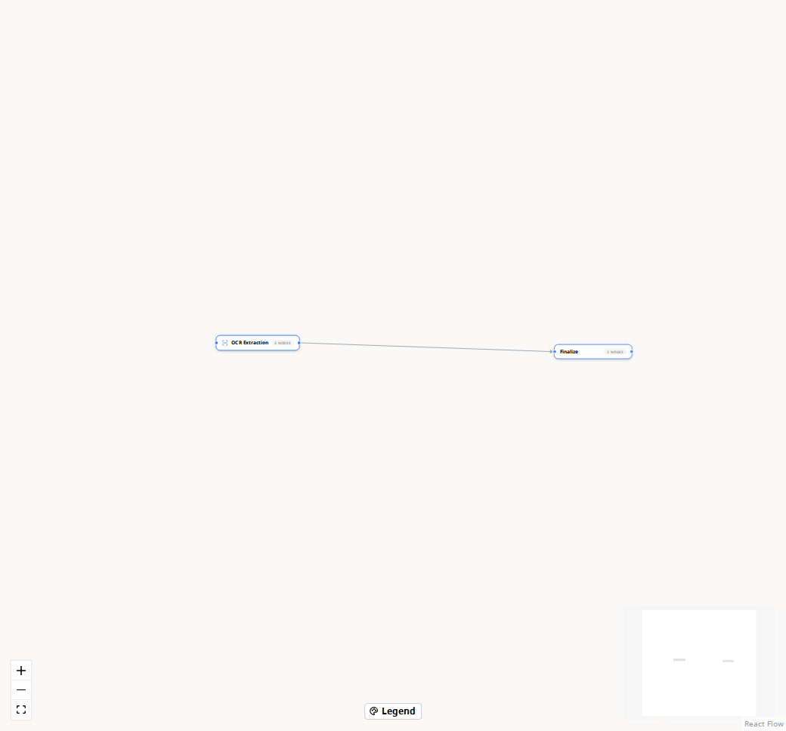 |

| After — Simplified off | After — Simplified on |
|---|---|
|  |  |

**That first pair cannot show this fix, and saying so is the point.** The after
"on" frame is pixel-identical to the before "on" frame, because what the toggle
broke was never the simplified projection — it was the revert, and that is only
observable on the way *back*. The before pass stopped at "on". Rather than crop
the pair differently and imply the projection changed, two unpaired frames carry
the evidence:

| The round trip | The unsaved rename |
|---|---|
| 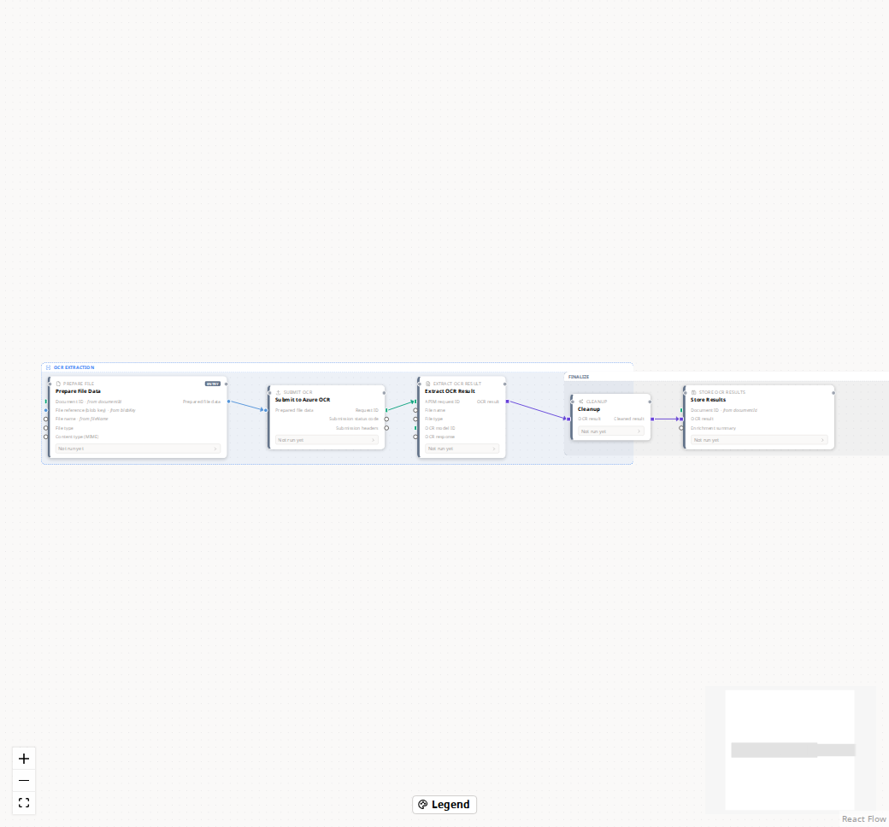 | 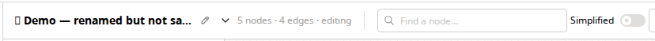 |

**Read the first of those honestly.** The cards, wires and layout come back at
the positions they had on arrival. The **Finalize** group box is drawn wider than
on arrival — its right edge runs past the pane — so the round trip is not
perfectly identity. That secondary group-box sizing question was diagnosed as a
separate, unconfirmed guess about frame ordering and is **untouched**.

**See it yourself.**
`http://localhost:3000/workflows/by-slug/demo-grouping-simplified-view-node-swap-part-6/edit`
→ **Fit view** (the ⛶ button) → flick **Simplified** on, then off. For the second
frame: rename the workflow in the top bar, press Enter, do *not* save, then flick
Simplified on and off and read the title.

### D12 · Two plus symbols on the empty-state button — **Fixed**

> *"Dynamic nodes page. Button contains two + symbols:"*
> ([`source/dylan-double-plus-button.png`](source/dylan-double-plus-button.png))

One plus came from `leftSection={<IconPlus />}`, the other was a literal `+ ` at
the head of the label. The literal is gone and the button names its object:
**"Create your first custom node"**. The bare phrase was a dangling fragment,
and a button's accessible name is all a screen reader gets — the surrounding
"No custom nodes yet" is not read with it. The file's own header comment repeated
the mistake and is corrected. The test asserts the *accessible name*, because
the doubled plus was a rendering artefact of the icon plus the label, which is
exactly what the accessible name composes.

| Before | After |
|---|---|
| 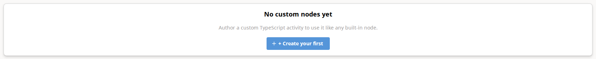 | 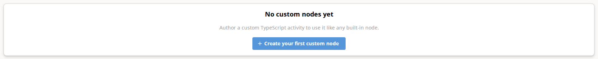 |

**⚠ Both frames are intercepted into the empty state, and the before frame is
additionally a reconstruction. Read this before you read the pictures.**

1. **Intercepted.** The empty state only renders when the calling group owns no
   custom node, and this database's single group owns `demo-uppercase`, which the
   Part 14 demo depends on. Deleting it to take a screenshot is not on, and there
   is no second group to switch to (one row in the `group` table, and the API key
   resolves to it). So `GET /api/dynamic-nodes` is fulfilled in the browser with
   `{"items": []}` — the exact body the endpoint returns for a group with none.
   No row is read or written; the interception dies with the browser context.
2. **Reconstructed.** The fix is already in the working tree and `git stash` is
   not available here (the tree is shared with other agents), so the old label
   cannot be checked out. The shipped button is photographed with **one string
   put back** — the string the diff changed — on the same button, the same icon,
   the same theme. The script asserts it is rewriting the *fixed* label first, so
   it cannot silently "reconstruct" a build that already had the old text. **It
   is a faithful render of the old markup, not a photograph of the old build.**

**See it yourself.** `http://localhost:3000/dynamic-nodes`, on a group that owns
no custom node.

---

## Questions where the app was right and would not say so

### D10 · Order-of-operations edges can't be drawn by hand — **Answered: they always could**

> *"Cannot seem to manually connect order-of-operations edges. Is this
> intentional?"*

**Neither. The gesture works, and always did — nothing was disabled and nothing
was enabled.** Drawn by hand in a real browser in both directions, both producing
the dashed grey wire. Both handles are plain connectable handles and the
node-level branch of the connect handler has always created the edge. **The
behaviour was intentional; the invisibility was not.**

Three measured reasons you could not find it:

1. **The dot did not say it was a run-order dot.** On a control-flow card (map,
   join, sub-workflow, human gate, poll-until, switch) hovering it read
   **"No typed inputs" / "No typed outputs"** — a sentence about *data ports*, on
   the connector that carries no data. On an activity card the same dot read
   **"Flow — execution order"**. Two different explanations of the same dot, and
   one of them describes a different concept entirely.
2. **Neither sentence said it could be dragged.** "Flow — execution order" names
   the thing; it does not tell you it is an affordance.
3. **Hovering the outgoing dot opens a 300×404px picker on top of the canvas.**
   The hover-extend popover fires after 200 ms anchored at the handle, so it
   covers the space you would drag across — measured at `x:901 y:456 w:300 h:404`
   while the drag target sat at `x:1073 y:600`, i.e. underneath it. The press
   still lands and the drag still works, but what the UI *says* when you approach
   that dot is "pick a step to add", not "drag me".

Both dots now carry one sentence, identical on every card, in the legend's own
vocabulary:

> *"Runs after — drag from here to another step's matching dot to make it run
> after this one. Order only, no data."*

**No screenshot: the change is a tooltip that requires a hover, and a
hover-held frame would cover the connectors it is about.** Confirmed after the
change on both a control-flow card and an activity card, returning identical
strings.

**See it yourself.** Any workflow editor: hover either grey node-level dot, then
drag from one card's outgoing dot to another card's incoming dot.

### D28 · Run-order connectors — inconsistent, different heights, different sizes — **One accident, one real signal, one explanation**

> *"Why do some nodes connect with the run-order connections, but others don't?
> These connector nodes also appear at different heights on the nodes. Is there
> meaning behind the difference in the size of the Poll status connector?"*

**(a) Why only some pairs are joined.** A run-order line is drawn **only where
order is the only thing between two steps**. Where data also flows, the edge is
stamped onto the coloured data wire and no second line is drawn — the colour says
what kind of data it is, and the order is implied by it. So on your screenshot
the dashed grey lines are the pairs that pass control but no values
(`Check OCR Confidence → Needs review?`, `Human review → Store results`) and the
coloured lines are pairs that pass both. Two consequences that look like
exceptions but are not: a **source** card has no incoming run-order dot at all
(nothing can run before the start), and every other card has both dots whether or
not a wire is attached. **No code changed for this half** — it is an explanation.

**(b) The different heights were an accident, and so were the fills.** Measured
before, on your own graph — `dy` is the dot's centre below the card's top edge:

```
prepareFileData (activity)  dy=3   bg=rgb(96, 94, 92)     <- solid grey
pollOcrResults  (pollUntil) dy=9   bg=rgb(255, 255, 255)  <- hollow, and lower
reviewSwitch    (switch)    dy=13  bg=rgb(255, 255, 255)
```

Two independent causes, both accidents of which renderer a card goes through.
Activity cards pinned the pair at `top: 18` while every other card passed no top
at all, so xyflow's default 50% applied and the height varied with the card's own
height. And the activity pair was painted `#605E5C` — which is the **wildcard
data-port** grey — while the control-flow pair came out hollow white with a grey
ring. Whichever one you looked at, it resembled a data port. Both now come from
one module: 18px on every rectangular card, filled in the dashed wire's own grey
(imported, not re-picked, and a grey no port family uses). Measured after, every
card reads `dy=3 bg=rgb(156, 163, 175)`.

The switch is the one remaining difference and it is **forced by geometry, not
chosen**: the card is a rotated square whose left and right vertices *are* its
vertical midpoint, so an 18px offset would float the dots off the shape.

**(c) The size difference is real and meant something, and said so nowhere.** A
port dot grows from 12px to 16px and gains a `+` exactly when the port is
**required and nothing is attached**. Measured on your own node:

```
pollOcrResults  out-ocrResponse  12x12  invites=false
pollOcrResults  out-status       16x16  invites=true    <- "Poll status"
```

So your instinct was right and the app was at fault for a different reason: the
meaning was carried by 4px and a glyph that reads as a smudge at working zoom,
and hovering the dot said nothing (deliberately — that hover is already spoken
for by the extend picker). It is now on the row's tooltip:
*"…Nothing reads this yet — the larger dot with a + is where to drag one from."*

| Before | After |
|---|---|
|  | 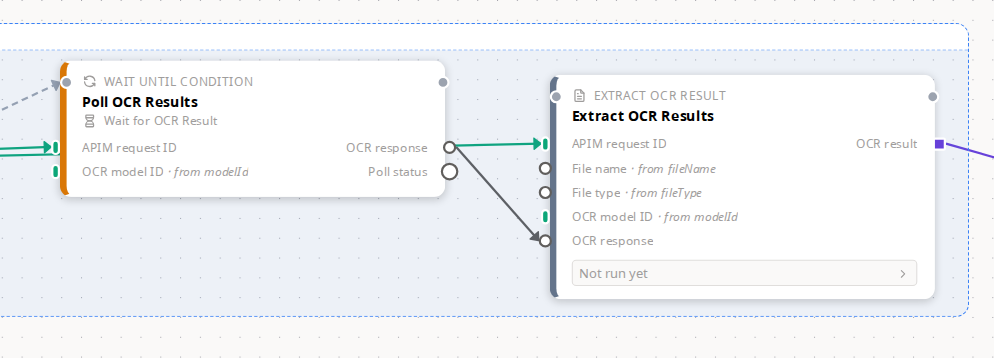 |

The 16px `+` variant is unchanged, because it is a real signal; what the fix
added is the tooltip that says so, and that needs a hover, so it is not in this
frame.

**See it yourself.** `http://localhost:3000/workflows/by-slug/standard-ocr/edit`,
pan to the Poll → Extract pair, and hover a port's *label*.

### D25 · The wire is purple, not green — **Answered: the doc was wrong, not the app** (stop 7)

> *"The wire is not green, it is purple, but so is the Run for Each Item node, so
> maybe that's just an expected change."*

**There is no green family.** A **kind** is the builder's word for the sort of
thing that travels a wire — `PreparedFile`, `DocumentSegment`, `OcrResult` — and
each kind belongs to one of five colour families. Split Document emits
`DocumentSegment[]`, so one item off that list is a `DocumentSegment`, which is
registered **violet**. The doc's claim that segments are green was simply false,
and it was false in two places: stop 4's colour list and stop 7's "green wire".
Both are corrected, along with the image alt text, which carried the same false
claim and is what a screen-reader user gets instead of the picture.

**Your aside is the more interesting half, and it resolves too.** The wire is
`#6741D9` — the violet *data* family, saying what is travelling it. The
Run-for-each-item card is `#6B21A8` — the `fan` *node accent*, saying what sort
of step it is ("fans out or back in"). Two independent registries, two
vocabularies, one hue family. **The resemblance is coincidence, not shared
meaning**, and the walkthrough now says so rather than leaving the next reader to
re-discover it.

**No code changed. No screenshot.** The change is text in
[`docs-md/workflows/GALLERY.md`](../../docs-md/workflows/GALLERY.md), stops 4 and 7.

### D26 · The validation tick is below, not beside — and never turns red — **Answered and fixed** (stop 14)

> *"Instructions make it sound like the green tick should be on the right, but
> it's below."* · *"Couldn't get it to turn red. What's it looking for?"*

**On position: the doc is wrong and the UI is right.** There are two surfaces and
stop 14 described them as one — the signature *preview card* on the right, and
the *parse strip* full-width below the editor. The tick is on the strip, and the
strip belongs there: its error lines are click-to-jump, moving the editor's caret
to that line and column. That gesture depends on adjacency to the editor it
points into. Moving it right would have broken a working affordance to fix a
sentence, so the sentence was fixed instead.

**On red — what makes it go red is breaking the `@workflow-node` comment block,
and only that.** The strip runs a signature parse and nothing else: the marker is
present, the required tags are all there and decode, the name matches its
pattern, **every declared kind exists in the registry**, and each parameter is a
string/number/boolean/enum. Monaco's own TypeScript checker is **deliberately
disabled**, because publish-time `deno check` is the source of truth — so
mangling the code does nothing visible, which is exactly why you could not turn
it red. The compile check and the network allowlist run server-side at Publish
and arrive as gutter markers instead. None of that was stated anywhere.

The strip now carries the clarifier and a **What is checked?** popover listing
both sets — checked-as-you-type and checked-at-Publish — derived from the two
stage lists rather than hand-written prose, so it cannot drift.

| Before | After |
|---|---|
| 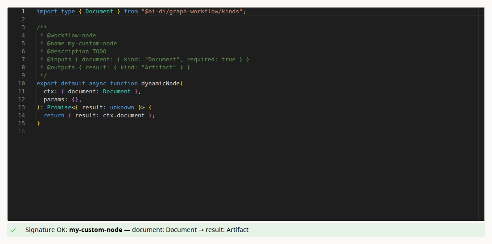 | 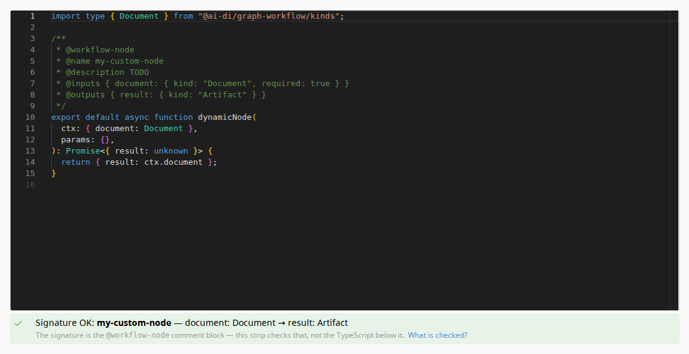 |

**The position did not change, and that is the answer rather than an omission.**
The after frame is 18px taller; that is the added line.

**See it yourself.** `http://localhost:3000/dynamic-nodes/new`. The starter file
validates clean, so the tick is green on arrival — click **What is checked?**. To
turn it red, break the comment header (for example change an `@inputs` kind to
one that does not exist), not the TypeScript.

### D30 · Poll OCR Results has far more fields than Extract OCR Results — **Answered and fixed**

> *"Why does a node like Poll OCR Results have so many more fields than something
> like Extract OCR Results?"*

**Because they are not the same shape of thing, and the badge on your own
screenshot says it: `POLLUNTIL` versus `ACTIVITY`.** Extract OCR Results is a
plain activity — one card, one step. Poll OCR Results is a **poll-until loop**, a
control-flow node that *wraps* an activity and repeats it until a condition
holds. Its panel therefore carries the activity's fields plus the loop's own:
which activity to run each iteration, the termination condition, and the
schedule.

**And the punchline: neither OCR activity declares a single parameter of its
own.** Both parameter schemas are empty objects, which is why both panels read
*"No additional fields"* under Parameters. **Every extra field you counted is
loop machinery, not OCR configuration.** Nothing is inconsistent.

The panel now leads with that sentence, and the three optional limits (max
attempts, initial delay, timeout — the three with engine defaults, set least
often) fold behind a disclosure. **Nothing is removed:** interval stays visible
because it is required, the toggle names anything already set so a configured
limit can never hide behind a collapsed section, and a node that arrives with a
limit set opens the section rather than making you find it.

| Before — Poll OCR Results | After — Poll OCR Results |
|---|---|
| 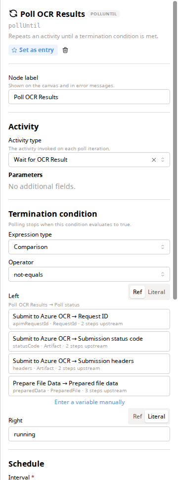 | 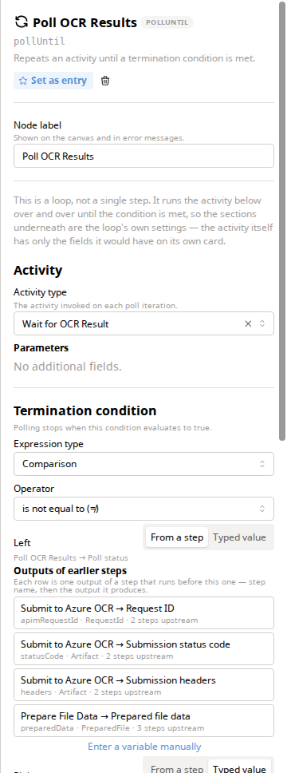 |

| Before — Extract OCR Results | After — Extract OCR Results |
|---|---|
| 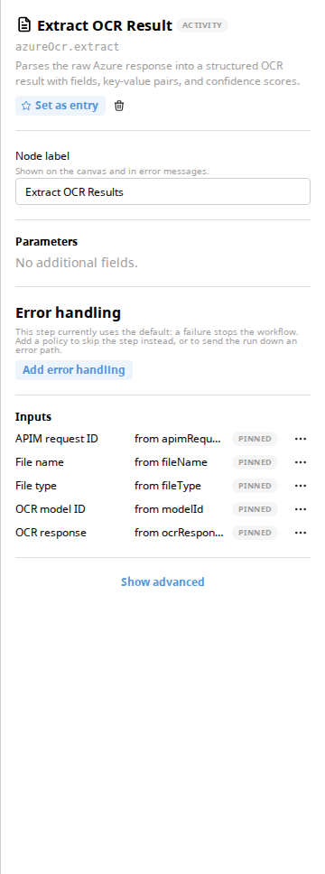 |  |

Two frames because the item is a comparison; one panel on its own answers
nothing. Extract is unchanged and is here as the control.

**See it yourself.** `http://localhost:3000/workflows/by-slug/standard-ocr/edit`,
click **Poll OCR Results**, read the right panel, then click **Extract OCR
Results** and read it again.

### D21 · Pinned inputs have no incoming edge — so who chose the value? — **Answered; the old copy was a lie** (stop 2)

> *"Inputs listed as Pinned don't have any input edges, so who is choosing this
> connection? The docs say someone chose it deliberately, but is that someone the
> user or a developer?"*

**Both — and the app cannot tell which, which is exactly why the old tooltip was
wrong.** It said **"Pinned by you"**, and on every seeded workflow you were
looking at that is false.

A **pin** is two pieces of state: the binding itself (`{ port, ctxKey }`, always
a reference, never a literal on the binding), and a lock list on the node's
metadata that tells **auto-wire** — the resolver that connects inputs
automatically — to keep its hands off. **That list holds port names and nothing
else.** No author, no timestamp, no provenance. So the app has no basis on which
to say "you".

And here is the case that made it a lie: a workflow authored elsewhere — a seed,
a template, the AI assistant — writes explicit bindings, and on load the app
*infers* the lock list from them. Your own screenshot
([`screenshots/before/D30-extract-ocr-fields.png`](screenshots/before/D30-extract-ocr-fields.png))
shows five inputs all badged **PINNED** on a workflow you had never edited, each
one telling you that you had done it.

The copy now describes the **act**, not the actor, and names the undo, which the
old two-word tooltip did not:

> *"Pinned — someone editing this workflow chose this source by hand, so
> automatic wiring leaves it alone. Change it or hand it back with the ⋯ menu."*

Corrected in three places so they cannot contradict each other: the settings
panel badge, the canvas wire tooltip, and the connect-summary popover.

**No screenshot: the change is a tooltip.** The strings above are verbatim, and
each was read back from the running app.

**See it yourself.** Open any seeded demo, click a step with pinned inputs, and
hover the **PINNED** badge in the right-hand panel; then hover the wire on the
canvas.

### D27 · No way to see what a kind such as `Document` contains — **Answered and fixed** (stop 14)

> *"How can a user know what the Document type contains?"*

Until now you could not — a kind was a bare word on a dot, a tooltip and a
dropdown option. **And the honest answer has a twist: `Document` contains
nothing, on purpose.** It is a schema-free ancestor, a wildcard for its whole
family, and the shape-honest subkinds carry the schemas. Exactly six kinds have a
machine-readable shape (`OcrResult`, `PreparedFile`, `DocumentSegment`,
`TypedSegment`, `ClassifiedPageSegment`, `LabeledSegment`), and their fields are
derived from the runtime types rather than hand-written, so they cannot drift.

Rendering "no fields" for `Document` would read as *we don't know*, when the
truth is *it deliberately accepts anything in this family, and here are the
members that are pinned down*. So the popover has three variants — fields,
wildcard, unregistered — and nothing is hardcoded per kind; every string comes
from the live registry. `Document` reads:

> **Document** · A kind of Artifact.
> Document has no fixed shape on purpose — it stands for a whole family, so a
> step that asks for one accepts any member of it.
> **Members with a known shape:** PreparedFile

**No screenshot — it is a popover that needs a click.** The readout above was
taken from the running app.

**See it yourself.** `http://localhost:3000/dynamic-nodes/new` → the signature
preview panel on the right → click the kind on the row reading
`document : Document`.

### D24 · Why `currentSegment`, and why specify it at all? — **Answered, and the field now fills itself in** (stop 7)

> *"Why currentSegment? Is this what the node looks for? That should be made
> clear to the user, and if it's always this, why do we specify it?"*

**No, it is not always this — but there is a real reason it looks that way, and
the field never mentioned it.** The field is a loop's *item ctx key*: **ctx** is
the bag of named values a run carries, and this names the variable each iteration
puts one item into. Its type is a bare string, there is no default, a
freshly-dropped node creates it **empty**, and one seeded workflow uses
`currentDoc`. So it is genuinely free.

What makes `currentSegment` look mandatory is a coupling somewhere else entirely:
the `segment.<field>` shorthand available in condition expressions is
**hard-wired** to read `ctx.currentSegment`. Name the key anything else and that
shorthand silently stops working — `segment.segmentType` resolves to `undefined`
rather than erroring. Every shipped template uses `currentSegment` for exactly
that reason, which is what made it read as ceremony.

Both halves are now in the field's help text:

> *"Names the variable each iteration puts one item into, so steps inside the
> loop can read it. Any name works. Pick `currentSegment` to also use the
> `segment.field` shorthand in conditions — that shorthand always reads
> `currentSegment`, so under another name you write the full variable out."*

**And your underlying point was taken.** A freshly-dropped **Run for each item**
started with the key empty, which is a guaranteed validation error on every new
loop. Alex approved the change: the field is now pre-filled with
`currentSegment` at creation time — creation only, so no saved workflow is
rewritten and the seeded one using `currentDoc` is untouched. The risk a default
introduces is two loops silently sharing one item variable, so that now raises a
**warning, not an error** — it tells you and lets you save:

> *Map node "Run for each item" reuses the item variable "currentSegment", which
> another loop on this canvas already writes. Steps that read "currentSegment"
> can bind to the wrong loop, and if one of these loops runs inside the other the
> inner item replaces the outer one. Give this loop its own item variable unless
> both loops really mean the same item.*

**See it yourself.** Open any workflow with a **Run for each item** step and read
the **Item ctx key** field's help text in the right-hand panel.

### D34 · The "(Part N)" in demo names doesn't match the walkthrough — **Answered; nothing renamed**

> *"What do the parts reference on the demo workflow names? They don't correspond
> with the parts of the walkthrough seemingly."*

**Correct — they are Parts of
[`MANUAL_TEST_PLAN.md`](../../docs-md/workflows/MANUAL_TEST_PLAN.md), not stops
of the gallery.** The demos were built for the test plan and the walkthrough
borrows them, so the numbers deliberately do not line up: the Typed I/O demo is
"(Part 7)" but is used at gallery stop **4**; Node settings is "(Part 3)" but is
stop **2**.

**Nothing was renamed, and that was a decision rather than laziness.** The title
feeds the stable slug the guide links to, and the run seeder finds workflows
**by name** — renaming would break both. Documented instead, in a new *Reading
the demo names* subsection, which also covers a second confusion you did not name
but would have hit: the walkthrough abbreviates the names, so where it says
*🎯 Demo — Typed I/O*, the workflow list shows
*🎯 Demo — Typed I/O — coloured handles & type pills (Part 7)*.

---

## Things that were hard to read

### D22 · The Ref picker doesn't read as "previous nodes and their outputs" — **Fixed** (stop 6)

> *"I think this has to be clearer. It wasn't immediately apparent that the Ref
> options were previous nodes and their outputs."*

**It is exactly that, and it always was.** The picker walks the upstream nodes,
keeps the ones that produce output, and emits one row per output port, sorted
nearest-first. What made it unreadable was not the rows — which already carried
node, port, kind and distance — but that nothing above them said what the list
*was*, and the mode switch offering it was labelled **"Ref"**: a name for the
mechanism, not for the choice.

So: `Ref` / `Literal` became **From a step** / **Typed value**, and a heading
went above the rows — *"Outputs of earlier steps · Each row is one output of a
step that runs before this one — step name, then the output it produces."* **The
rows themselves are untouched**, because you asked for it to be clearer, not for
the upstream-distance detail to be hidden.

| Before | After |
|---|---|
| 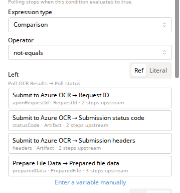 | 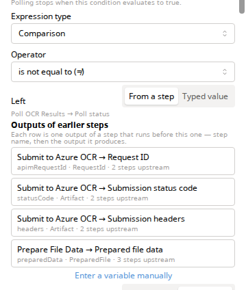 |

41px taller; that is the heading and its line.

**See it yourself.** `http://localhost:3000/workflows/by-slug/standard-ocr/edit`
→ click **Poll OCR Results** → scroll the right-hand panel to **Termination
condition**. That is the exact panel you photographed.

### D23 · `gte` and friends in the operator dropdown — **Fixed** (stop 6)

> *"The dropdown of operators currently contains things like gte, which I imagine
> would be confusing if users weren't familiar with that shorthand. Maybe use the
> symbols instead?"*

**You are right, and the app had already been disagreeing with itself about it.**
The canvas edge chips have drawn **≥** since the edge-label work; the dropdown
you pick from said `gte`. Same operator, two vocabularies, one screen apart. A
third existed in the legacy read-only viewer, which hand-rolled `=` and `!=` and
let everything else fall through raw — so a `gte` branch drew the chip
`pages gte 5`. Worth recording: the node catalog **already specified** plain
English labels. The catalog is the spec; the dropdown never implemented it.

Every operator now has a human label with the symbol after it — `is greater than
or equal to (≥)` — and all three surfaces read from one shared module, so they
cannot drift again. **The stored value is unchanged** (`gte` is still `gte` in
the config); the tests deliberately pin the stored value while reading the label
off the same map the UI uses.

| Before | After |
|---|---|
| 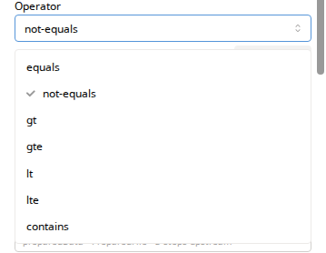 | 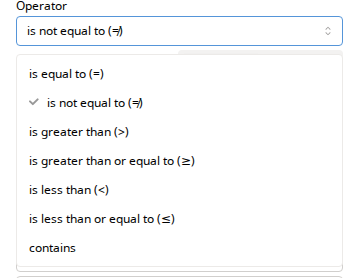 |

**See it yourself.** Same route as D22, then open the **Operator** select.

### D29 · Legend category names aren't intuitive — **Fixed**

> *"Some of the categories in this legend could be more intuitive. Like, what's a
> 'Judgement about a document'?"*

Two labels did not say what they are, and both are rewritten:

| Before | After |
|---|---|
| Judgements about a document | **Labels and check results** |
| Pointers — IDs and lookups | **IDs that point at something stored elsewhere** |

The first family holds classifications and validation results — a label the app
applied and a check it ran — and "labels and check results" is the vocabulary the
rest of the UI already uses for both. The second was not wrong, only compressed:
everything in it names something held elsewhere. The other three rows —
*Documents & files*, *Content taken out of a document*, *Untyped — takes
anything* — already say what they are and were left alone.

Two card-border role names were rewritten in the same pass, for the same reason:
*"Does work"* → **"Performs an action"** (the old one was true of all five roles,
so it separated nothing) and *"Fans out or back in"* → **"Repeats over a list, or
gathers results"** (fan-out/fan-in is the same class of jargon as `gte`).
**Colours are untouched** — the colour-distance measurement behind the
five-accent palette stands.

| Before | After |
|---|---|
| 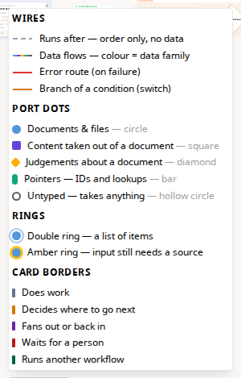 | 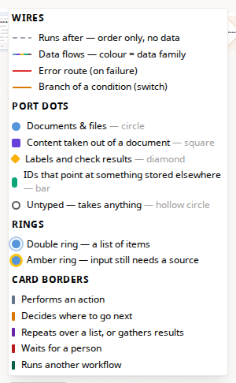 |

**Note on which row you meant:** the row you quoted is under **PORT DOTS**, not
CARD BORDERS. Both frames are the whole popover so the wording can be judged in
the company it is grouped with.

**See it yourself.** Open any workflow in the editor and click **Legend** at the
bottom of the canvas.

---

## The three suggestions — all built

### D31 · Compare to Head should show a real diff — **Built** (stop 11)

> *"The Compare to Head feature could be clearer if it showed an actual diff, not
> just both versions in full."*

Built, with **no new dependency added** — and that was a decision, not a
constraint. The frontend's tree has no diff library, and a *text* diff would be
the wrong tool anyway: config objects have no meaningful key order, so a line
diff reports a move as a change. A new structural config-diff walks both versions
to their leaves and compares leaf by leaf. Array elements are indexed
(`edges[1].to`) so a new edge is attributable; a subtree present on only one side
expands into its own leaves, so "this node only exists in head" lists the fields
it adds.

`metadata.configHash` is **excluded as derived** — it changes on every save and
turned "1 changed field" into "2, one of them a 64-character hash" — and the
modal states the exclusion rather than hiding it.

The modal opens on a new **Changes** tab: a summary line, one row per difference
with both values labelled, unchanged fields collapsed. **The old side-by-side
JSON is kept** as *Both versions in full*, because "show me everything" is a real
need.

| Before | After |
|---|---|
| 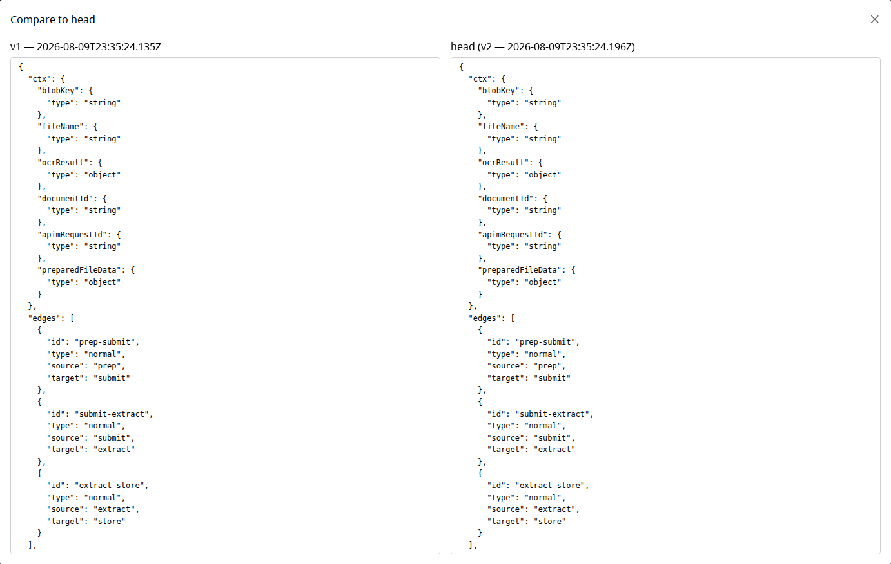 | 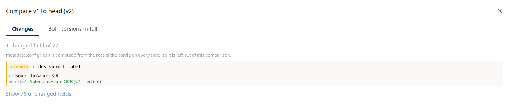 |

**The crop deliberately changed.** The before frame is 877px tall because it had
to hold two JSON dumps; the after is 285px because the diff is one row. Same
element, same zero padding — the modal is simply that much shorter now. Framing
the old side-by-side would have hidden the entire fix.

**See it yourself.**
`http://localhost:3000/workflows/by-slug/demo-versioning-history-revert-part-12/edit`
→ **More → Version history** → **Compare to head** on the *older* row. The head
row's own button stays disabled, correctly — comparing head to head has nothing
to show.

### D33 · The workflow list needs a search bar — **Built**

> *"We might need a search bar for the workflow list. Even with this number of
> workflows, it can be hard to find the one you want."*

Built, **client-side, and here is why**: the list endpoint has no page or limit
parameter, so the whole list is already in memory (35 workflows on this stack). A
request per keystroke would add latency and a loading flicker to a list that is
fully loaded. If it ever grows past a few hundred, the honest fix is server-side
paging for the whole page, not search alone — and a test asserts **no additional
fetch happens while filtering**, which is that claim made executable.

It uses the existing house search component (the same one the tables and groups
lists use), matches name, slug and description, and the table caption reads
`1 of 35 workflows match "versioning"`. The empty result names the term, points
at the Workflows/Libraries/All filter as the usual reason a workflow is missing,
and offers **Clear search** — with the box staying mounted so the term can be
edited rather than retyped.

| Before | After |
|---|---|
| 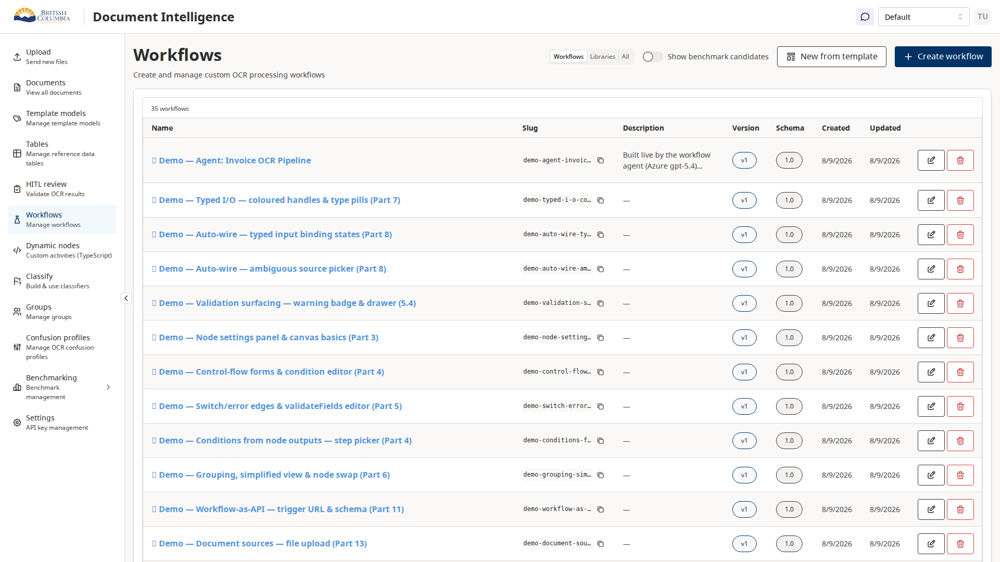 | 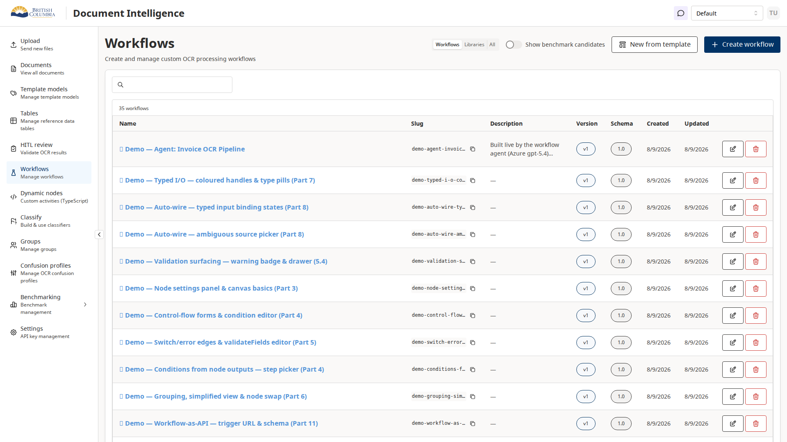 |

| The field in use *(no before counterpart — the control did not exist)* |
|---|
|  |

**The after file keeps the before file's name** (`…-no-search.png`) so the pair
matches by name; it is the same window *with* the field.

**See it yourself.** `http://localhost:3000/workflows` → type into the search
field above the table. Clearing it returns the caption to "35 workflows".

### D32 · Reuse the legend colours in the sidebar node list — **Built**

> *"Could we use these colours in the sidebar list of nodes?"*

The palette already had the idea — a 3px left border against the canvas's 6px —
and already used the activity accent for activity and source rows. **Two row
types were off-vocabulary, both with hardcoded hexes that exist in no registry:**
control-flow rows painted every one of six types the same violet while the canvas
paints those same nodes across four different accents, and the custom-node row
had a purple of its own while the canvas paints a custom node with the ordinary
activity accent. So "Branch by condition" and "Run for each item" looked
identical in the list and different on the canvas.

Both now read from the same module the canvas card borders read. **No hex was
copied**, and the tests assert against the registry rather than against colour
values — which is what stops the two surfaces drifting apart again.

| Palette row | Before | After | Canvas accent |
|---|---|---|---|
| Branch by condition | `#8b5cf6` | `rgb(217,119,6)` | routing ✓ |
| Run for each item | `#8b5cf6` | `rgb(107,33,168)` | fan ✓ |
| Sub-workflow | `#8b5cf6` | `rgb(6,95,70)` | childWorkflow ✓ |
| Wait for approval | `#8b5cf6` | `rgb(185,28,28)` | person ✓ |
| demo-uppercase (DYN) | `#9333ea` | `rgb(100,116,139)` | activity ✓ |

| Before | After |
|---|---|
| 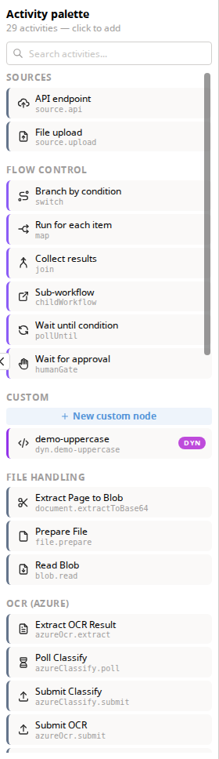 | 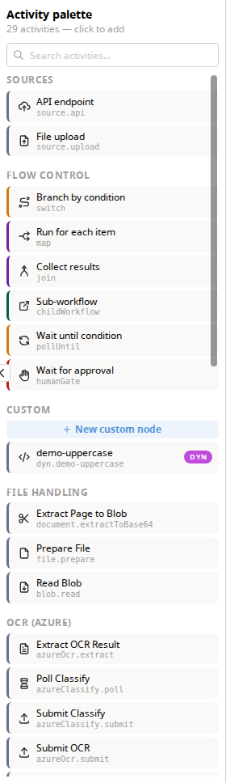 |

Identical crop (280×968), so the two lay side by side.

**See it yourself.** Open any workflow in the editor; the palette is the left
rail.

---

## The walkthrough text you were reading

Seven items, all in
[`docs-md/workflows/GALLERY.md`](../../docs-md/workflows/GALLERY.md), all done.
These are the ones that made a working app look broken, so they were cheap and
worth a lot. None has a screenshot — the change is text.

**D14 · *"There is no Try button, only Run."*** Half right, and the half matters.
The top bar carried **Try** and **Run this workflow** until 2026-08-08, when they
were merged into one button labelled **`Run…`** (with an ellipsis, not a bare
"Run"). "Try" did not disappear — it moved *inside* the drawer, as the **Try on
canvas** tab. The doc also claimed the button "refuses" when clicked; it does
not, because a disabled button fires no click. It is grey before you touch it and
the reason is in a hover tooltip, which the doc now quotes verbatim. The same
correction was swept into stop 15, and the stop-8 screenshot — which predates the
merge and shows both buttons — is annotated with a dated note.

**D15 · *"The first actual instruction here is just Do this."*** Not a
truncation: that line has read the same since the file was created. The real
defect is that the stop is titled *"Try it, and watch"* and its only instruction
was to *replay an old run* — and on a clean checkout the Standard OCR Workflow
has no runs to replay. It is now two instructions, one per half of the title,
pointing at the Try-in-place demo whose three seeded runs (one green, one from
cache, one genuinely failed) touch no Azure and need no credential.

**D16 · *"Is it meant to be stop, not step?"*** **Deliberately not renamed.**
"Stop" is the page's own word for a section of the tour — its opening line is *"a
guided tour in 16 stops"*, and it is used that way 14 times. But the same page
also defines **step** to mean a box inside a workflow and never says the two are
different, so reading "skip to stop 11" as a typo was reasonable. Renaming would
have made it worse: the page has sections literally titled *"Drop a step on the
canvas"*. The word is now defined where the vocabulary paragraph first uses it,
and a sweep confirmed no "stop N" in the file ever meant a workflow node.

**D17 · *"There aren't any instructions on what it wants from a user in the Run
sidebar… when it's just an unpopulated `{}`."*** The box is headed **Initial
ctx** — the bag of starting values a run begins with — and it is **prefilled**
from the inputs the workflow *declares*, not blank by design. `{}` therefore
means *this workflow declares no inputs*, which is true of Standard OCR Workflow:
no API-source step, no ctx variable ticked **Input**. Documented, along with what
the first step actually needs (`documentId` and `blobKey`, both naming a document
already in the database and blob storage) — and why nobody types this workflow's
input in practice, which is exactly what you did: you start it by uploading a
file. The doc now gives a contrasting example from the Workflow-as-API demo,
whose box arrives already written as `{"documentUrl": "", "priority": 0}` — that
is not illustrative, it is what the prefill produces for that workflow, key for
key.

**D18 · *"Instructions outdated. It is the Run button, followed by the Call from
outside tab."*** Confirmed, with the one refinement that the button reads
`Run…`. **A second stale claim in the same stop** was found while verifying: the
panel it sends you to was renamed from "Test run" to **Start a run**, because a
run started there is stamped as an API call server-side and nothing later cancels
it — which "test" read backwards.

**D19 · *"Run this workflow doesn't exist. It's just Run."*** Same correction.
**Two behaviours were added that the text had missed**, both visible in the
stop's own screenshot: this workflow shows no tabs at all (a file is its only way
in, so the drawer opens straight on **Upload a file**), and it is
select-then-**Run**, not drop-to-run — dropping only selects the file.

**D20 · *"Names its kind of what? Should this be names its type?"*** **The app
says "kind"**, as a literal field label in three editors, and "Type" is
separately taken in the product (the Run drawer's input-schema table has a
**Type** column of JSON-schema primitives). So swapping to "type" would have
collided with it. The word stays and the doc now defines it in the sentence that
first uses it. **A real error surfaced alongside the wording**: the doc claimed
segments are green. There is no green family — see D25 — and the bullet now lists
the five real ones.

---

## Still open

One thing is a **proposal, not a decision**, and it is waiting on Alex. It is
listed here so you know it exists and know it is not done. (The other proposal
that stood here — defaulting the loop's item key — was approved on 2026-08-15
and is described under D24 above.)

**2 · Delete the now-unused handle-style module (from D28).**
`computeHandleStyle` / `HandleStyle` in `canvas/handle-style.ts` were the
node-level dot's kind colouring, which D28's fix removed. Confirmed: **no
production caller remains.** But they are still covered by 23 tests and still
described by `TYPED_IO_DESIGN.md` §4, so deleting them is a decision about a
documented design surface rather than a cleanup. Flagged rather than taken.

---

## Residuals worth knowing about

Not open questions — things that are true, recorded, and not fixed here.

- **The deployed assistant is now wired** as of 2026-08-15: the four
  `AZURE_OPENAI_*` variables reach backend-services in compose, the kustomize
  base, the instance overlay, the deploy workflow and the rotation script. All
  four env refs are `optional: true`, so a missing key disables the assistant
  rather than putting pods into `CreateContainerConfigError`. Existing instances
  need only a redeploy — nothing breaks if one is left alone. (I1 / D4.)
- **The caret jump is fully closed as of 2026-08-15** — both causes, each with a
  passing browser test. The second fix changes how the editor holds its text
  (`defaultValue`, not `value`), so if anything about typing in a custom step
  feels different, that is where to look first. (D8.)
- **Submit OCR and Poll OCR read the model id by two independent routes** and
  nothing keeps them equal. Latent today — both seeded values are identical — and
  the new 404 message names the mismatch if anyone trips it. (D1.)
- **The Simplified-view round trip is not perfectly identity**: the Finalize
  group box comes back wider than it went. Separate, unconfirmed, untouched.
  (D13.)
- **The request logger recorded 500s as 201**, which is why the stale-Prisma
  failures went unnoticed for a morning. Filed as its own defect, not fixed here.
  (I1.)
